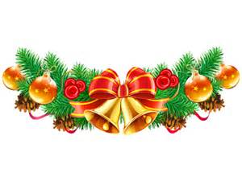

er [<u>Ellen Moller Jensen</u>](https://aulavirtual.uji.es/user/view.php?id=93930&course=48848) - dimecres, 14 desembre 2016, 18:56

 

**Avicena**

(Abu'Ali al-Husayn ibn'abd Allah ibn Sina; Bujara, actual Irán, 980-Hamadan, id., 1037)

Médico y filósofo persa. Sus trabajos abarcaron todos los campos del saber científico y artístico de su tiempo, e influyeron en el pensamiento escolástico de la Europa medieval, especialmente en los franciscanos.

Educado por su padre en Bujara (pasó toda su vida en las regiones del centro y el este de Irán), a los diez años ya había memorizado el Corán y numerosos poemas árabes. Estudió medicina durante su adolescencia, hasta recibir, con sólo dieciocho años, la protección del príncipe Nuh ibn Mansur, lo cual le permitó entrar en contacto con la biblioteca de la corte samánida.

Su vida sufrió un brusco cambio con la muerte de su padre y la caída de la casa samánida por obra del caudillo turco Mahmud de Ghazna. Necesitó echar mano de su gran capacidad de concentración y de su enorme fuerza intelectual para continuar su extensa labor con una meritoria consistencia y continuidad.

Durante el siguiente período de su vida ejerció la medicina en diversas ciudades de la región de Jorasan, hasta recalar en la corte de los príncipes Buyid, en Qazvin. En estos lugares no encontró el soporte social y económico necesario para desarrollar su trabajo, por lo que se trasladó a Hamadan, ciudad gobernada por otro príncipe Buyid, Shams ad-Dawlah, bajo cuya protección llegó a ocupar el cargo de visir, lo que le valió no pocas enemistades que le obligaron a abandonar la ciudad tras la muerte del príncipe.

Fue en esta época cuando escribió sus dos obras más conocidas. El*** Kitab ash-shifa'*** es una extensa obra que versa sobre lógica, ciencias naturales (incluso psicología), el quadrivium (geometría, astronomía, aritmética y música) y sobre metafísica, en la que se reflejan profundas influencias aristotélicas y neoplatónicas. ***El Al-Qanun fi at-tibb ***(canon de medicina), el libro de medicina más conocido de su tiempo, es una compilación sistematizada de los conocimientos sobre fisiología adquiridos por médicos de Grecia y Roma, a los que se añadieron los aportados por antiguos eruditos árabes y, en menor medida, por sus propias innovaciones. Por último se trasladó a la corte del príncipe 'Ala ad-Dawlah, bajo cuya tutela trabajó el resto de sus días

.Tuvo una gran influencia en pensadores posteriores de la talla de *Tomás de Aquino,* *Buenaventura de Fidanza* o *Duns Escoto*. También planteó mucho antes que *Descartes* un pensamiento similar al de este: el conocimiento indudable de la propia existencia.

La obra de Avicena es de importancia capital, pues supone la presentación del pensamiento aristotélico ante los pensadores occidentales de la Edad Media. Sus obras se tradujeron al latín en el siglo XII, reforzando la doctrina aristotélica en Occidente aunque fuertemente influida por el pensamiento platónico.

Las cruzadas del siglo XII al siglo XVI trajeron de nuevo a Europa el ***Canon de la medicina***, que influenció la práctica y la enseñanza de la medicina occidental.

Que es lo que impresiona de Avicena?:Sobre todo su precocidad como mas arriba se ha apuntado ,a los diez años conocia el coran de memoria y a los dieciseis era medico ,y en ese intervalo estudio filosofia y gerometria griegas , asi como el calculo de los hindúes,jurisprudéncia coránica ,lógica,metafísica, los Elementos de Euclides,e.t.c. Y sobre todo su fecundidad creadora,en la actualidad se le conocen mas de doscientos títulos completos aunque hay referencias de que escribío casi otros cien.

La Unesco en 2003 lo incluyó en ***el Registro de la Memoria del Mundo ***como patrimonio documental.Reconociendole autor del siguiente numero de obras:

89 de Filosofía

11de Lógica

53 de Filosofía y Religión

5 de Misticísmo

2 de Linguística

12 de Literatura

7 de Matemáticas

2 de Física

2 de Química

58 de Medicina

1 de Política

1 de Geografia

7 de Astronomía

Teniendo en cuenta que murió a los 57 años y ademas compaginó su vida literária con la practica de la medicina y la política .En mi opinión ademas de ser muy inteligente deberia contar con una memoria eidética.

Benvolguda amiga.

Et detsige, Bones Festes Nadalenques. També que a més del cava i torró cantes moltes nadales la nit de Maitines.

Feliç Any Nou.

Que se’n recorde de tu, la Desa de la Fortuna en el sorteig del Niño. i si no és així, segur que o faran els Reis d’Orient amb algun que altre regal.

Però el que si és segur, el meu afecte.

Paquita. Nadal 2016
