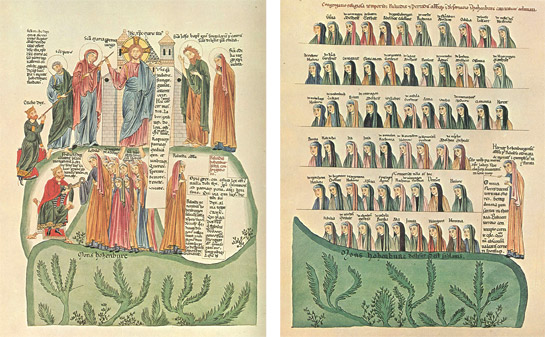

HERRADA DE LANDSBERG

HERRADA DE LANDSBERG nació en el castillo de Landsberg, cerca de la ciudad de Estrasburgo y falleció en 1195. Fue una monja alsaciana del siglo XII y abadesa de Hohenburg, en los montes Vosgos. Es conocida principalmente por ser la autora de la enciclopedia pictórica **HORTUS DELICIARUM** (El jardín de las delicias).

Durante el siglo XII parecieron en Europa un importante número de mujeres, que demostraron al mundo que podían componer, escribir y pensar como los filósofos e intelectuales más importantes de la historia como Hildegarda de Bingen, Beatriz de Día, Héloise….

La obra de Herrada es únicamente un libro pero supone una importantísima fuente de información. Su obra enciclopédica **El Jardín de las delicias**, hizo de esta humilde pero luchadora abadesa, una destacada erudita de su tiempo.

Además de ejercer como abadesa, Herrada fue una mujer enérgica que fundó una comunidad de canónigos, otra de monjas y un hospital.

La abadía de Hohenbourg tiene su origen en el siglo VII, cuando fue fundada por Odilia, patrona de Alsacia. Su nombre designa actualmente la montaña – Mont Saine Odile- en la que se ubica el monasterio homónimo. Allí, en el siglo XII se instaló una comunidad agustina dirigida por Relindis, a quien Federico I Barbarroja había confiado el mando de una reforma espiritual, con la que el emperador conseguía la custodia de un punto estratégico para el dominio de la región. Ella llevó a cabo una reedificación del monasterio y se la considera por ello la segunda fundadora de Hohenbourg. Tras su muerte en 1176, Herrada le sucedió en el cargo de abadesa y magistra. Pocos años antes habrían comenzado a elaborar **Hortus Deliciarum**, en 1160, que aún no era abadesa, y durante diez años, embarcó a las sesenta monjas de su convento en un proyecto intelectual, la creación de un manuscrito de 324 páginas, compendio de todo el saber existente y una historia del mundo, el manuscrito recorre las distintas ciencias conocidas ilustradas por más de 300 imágenes.

La obra manuscrita se conservaba en la Biblioteca de Estrasburgo, pero en 1870 se perdió en el incendio, durante la guerra franco-prusiana, En 1979 el Warburg Institute de Londres publicó la reconstrucción de la obra bajo la dirección de Rosalie Green. Esta edición consta de dos volúmenes de grandes dimensiones: uno de ellos presenta la reconstrucción del manuscrito y el otro agrupa artículos sobre distintos aspectos de la obra. Es por esta vía documental nos acercamos a la “piezas” que forman el Hortus Delicuarum: a los textos y las magníficas ilustraciones, así como a las aún poco conocidas composiciones musicales.

Herrada introduce esta obra con la metáfora del panal de miel que ella elabora como magistra, y del cual las religiosas de su comunidad obtienen alimento espiritual e intelectual. En la primera páginas podemos leer:

“Herrada, por la gracia de Dios abadesa de la iglesia de Hohenbourg, aunque indigna, desea la gracia y la gloria del Señor a las dulces vírgenes de Cristo que actúan fieles en su Iglesia, como en la viña del Señor Jesús. Os ofrezco este libro para vuestra santidad, que se titula *El jardín de las delicias,* florilegio de diversos escritos sagrados y filosóficos. He elaborado con ellos un conjunto siguiendo la inspiración divina como una abeja y en alabanza y honor a Cristo y a la Iglesia, y para vuestro gozo lo he reunido todo en un único panal de miel. Por lo tanto, es importante que os nutráis a menudo de este libro, aliviando el ánimo cansado con sus gotas de miel”.

Figura 1 Figura 2

Dos de las miniaturas más bellas del *Hortus deliciarum* ilustran esa genealogía femenina. La primera de ellas (Figura 1). Muestra tres episodios de la vida de Odilia vinculados a la fundación del monasterio. En la sección inferior de la imagen, en el lado derecho, Odilia aparece recogiendo la llave de la mano de su padre Adalrico, duque de Alsacia, quien –tras numerosas y graves dificultades, le hizo entrega del castillo que ella posteriormente convirtió en monasterio. En el lado izquierdo se muestra a Relindis en el papel de segunda fundadora, y ambas figuras se sitúan en plena naturaleza, al pie de una montaña de piedra en cuya cima aparece la abadía. Una inscripción confirma que se trata del monte de Hohenbourg, cuyos inconfundibles paisajes se sugieren claramente en la ilustración.

La segunda ilustración(Figura 2). Muestra a Herrada sosteniendo una estela en la que aparecen las primeras frases de la obra relativas a su autoría. Junto a Herrada, retratada de cuerpo entero como Odilia y Relindis, aparecen los retratos personalizados de 60 colaboradoras junto a los cuales están escritos sus nombres. Su legado es el *Hortus deliciarum*, cuya elaboración se extiende en el período inscrito entre 1176 y 1196 aproximadamente.  Esta enciclopedia representa “la síntesis y la culminación del magisterio intelectual” de Herrada -y probablemente también de Relindis- y es un ejemplo del alcance filosófico-teológico de las fuentes del monacato femenino medieval.

Los escritos allí reunidos son fuentes latinas de la Alta Edad Media, así como textos coetáneos y fragmentos antiguos trasmitidos por autores medievales. A diferencia de Hildegarda de Bingen (1098-1179), compositora y autora de un amplio corpus de interés filosófico en el que las fuentes de inspiración son únicamente implícitas, Herrada refiere explícitamente las obras que consulta y cita. Los autores y sus textos, la mayoría escritos en lengua latina, son las flores deliciosas que Herrada selecciona como alimento para nutrir el hambre de conocimiento de las religiosas de su comunidad. En este contexto didáctico adquieren pleno sentido tanto las glosas explicativas escritas en lengua vernácula como los textos de autoría no identificada, que probablemente son textos propios. En cambio, las miniaturas del *Hortus*, además de la función didáctica ampliamente reconocida a las imágenes durante la Edad Media.

.El Hortus deliciarum es también una de las primeras fuentes de polifonía procedentes de un convento. El manuscrito contenía al menos veinte textos de canciones, todas las cuales fueron anotadas originalmente. Dos canciones sobreviven con la música intacta: Primus parens hominun, una canción monofónica, y una obra en dos partes, Occasus dol oritur.

Opinión: Me parece una obra maravillosa, didáctica, que refiere explícitamente y consulta las fuentes latinas, fracmentos de otros autores, debidamente cotejadas, aunque a veces no demasiado académicas, las magníficas ilustraciones, hay que tener en cuenta que en la Edad Media los medios eran precarios.

La obra de Herrada, ejemplo de alcance filosófico-teológico, demuestra, una vez más, que una mujer puede alcanzar cimas intelectuales.

Rosmary Arquer

Benvolguts amics.

Us detsige, Bones Festes Nadalenques. També que a més del cava i torró canteu moltes nadales la nit de Maitines.

Feliç Any Nou.

Que se’n recorde de vosaltres, la Desa de la Fortuna en el sorteig del Niño. i si no és així, segur que o faran els Reis d’Orient amb algun que altre regal.

Però el que si és segur, el meu afecte.

Paquita. Nadal 2016
