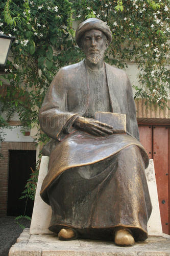

LA VIDA Y OBRA DE MAIMÓNIDES

Mi-Moshé ad Moshé lo qam ke-Moshé.\<\< De Moisés a Moisés no hubo otro Moisés\>\> quiere decir que desde el bíblico Moisés hasta Moisés ben Maimon o sea Maimónides, el codificador de las leyes religiosas o jurídicorreligiosas, no hubo en el Judaísmo ningún otro personaje de tan elevada talla intelectual.

La frase se remonta a las primeras décadas del siglo XIII, a poco de la muerte de Maimónides, y se atribuye a algunos de sus partidarios en las luchas en Provenza y en Cataluña donde se enfrentaron maimonistas y antimaimonistas luchas que afectaron al Judaísmo occidental.

También fuera del Judaísmo gozó Maimónides de merecido renombre. Así Los escolásticos de la Iglesia cristiana dominica como el alemán Alberto Magno o el italiano Tomas de Aquino ( maestro en Francia) calificaron a rabi Moisés de Egipto de *Aguila de la Sinagoga,* así como en el Islam el poeta literato de las jarchas Ibn Saná al- Mulk ( en Egipto) se refirió a él en varios versos.

Esto demuestra que Maimónides tenía resonancia internacional en una misma época siglo XIII en distintos ámbitos geográficos, lo que llamamos Europa y mundo mediterráneo. Lo que sería la historia cultural de la humanidad.

Entre las fechas Cordoba 1135-1204 Fustat son casi 70 años que enmarcaron la vida de Rambam Rambam denominación que los estudiosos judíos autor han dado a Rabí Moisés ben Maimón como autor rabínico. Nació y pasó su infancia en la Córdoba andalusí durante más de diez años. A causa de la invasión almohade se inicio la decadencia de Córdoba que entre otras cosas marco el fin intelectual del Judaísmo andalusí. Vivió un lustro en la ciudad marroquí de Fez. Residió un breve periodo en Acre de Palestina y en Alejandría en Egipto, y en 1165 se estableció para siempre en Fostat, el barrio antiguo de la actual El Cairo.

Tenía un profundo conocimiento de la cultura árabe. Escribió la mayoría de sus obras en árabe pero con una particularidad que comparten casi todos los judíos andalusíes: Maimónides escribía en árabe, pero nunca con caracteres árabes, sino que utilizaba el hebreo, es decir, se vale de un \<\<aljamiado\>\> hebraicoárabe o arábigohebreo. Lo mismo habían hecho, antes o hicieron después muchos correligionarios compatriotas suyos.

Las obras más importantes de Maimónides son varias, pero las tres principales son : *Guía de complejos , Luminaria y Segunda Ley,* las dos primeras escritas en árabe mientras que *la Segunda Ley* la redacto el mismo en hebreo.

También cultivo *la filosofía*, *el rabinismo, la medicina, y la astronomía.* Preguntado por los rabinos de Francia si la astrología era compatible con la fe judía, contesta con una carta diciendo que la astrología basada en la influencia de los astros no era ciencia en absoluto.

No es posible mencionar aquí todas las obras de Maimónides. Era bilingüe, utilizaba las dos lenguas hebreo y árabe, pero un solo sistema grafico hebreo, fue apreciado por cristianos, judíos y musulmanes, y recordado actualmente en la cristiana Córdoba en pleno corazón de la judería, en la plaza de Maimónides, su figura austera, pone de manifiesto el dicho que \<\< de Moisés a Moisés, no hubo otro Moisés.

Francisca Julián.
