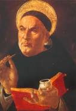

**SANTO TOMÁS DE AQUINO**

Tomás de Aquino nació en el año 1224 en el castillo de Roccasecca, del condado de Aquino, cerca de la actual Nápoles. Era el último hijo de una muy numerosa familia de la aristocracia. De pequeño lo llevaron a estudiar al monasterio benedictino de Montecasino ya que el abad era un tío suyo. Allí estudió gramática, latín, música, moral y religión.

Federico II, emperador del Sacro Imperio Romano Germánico decretó la expulsión de los monjes y el cierre de Montecasino y Tomás continuó sus estudios con los dominicos en Nápoles. Allí estudio Artes y Teología y contactó con los Hermanos Predicadores.

Cuando a los 20 años quiso entrar en la Órden de Predicadores, su familia no aprobó esta decisión y sus hermanos (que eran miembros del ejército imperial) apoyados por su madre, organizaron una maniobra por la que fue detenido y retenido durante un año. Allí oró, leyó la Biblia y aumentó sus ganas de aprender para luego enseñar. El General de la Órden de Dominicos intercedió por él y se le dió la libertad.

Se fue a París donde era discípulo y amigo de Alberto Magno. Por su gran complexión física y por su carácter callado y pensador sus amigos le llamaban “*El Buey Mudo*”. Conociéndole mejor, Alberto Magno dijo: “*este buey un día llenará el mundo con sus bramidos*”. En París logró el título de Maestro en Teología y pudo ejercer como profesor.

Regresó a Italia y estuvo al lado del Papa, que le tenía en gran estima por su saber, preparación, y por lo acertado de su pensamiento. Allí escribió varios himnos litúrgicos y eucarísticos al mismo tiempo que impartía clases y conferencias en Nápoles y Bolonia.

Cuando más tarde volvió a París encontró un ambiente tenso pues el saber que hasta ahora había estado en los conventos y monasterios ahora estaba en las universidades. Las teorias de san Agustín (defendidas por franciscanos) perdían fuerza y se sustituían por las de Aristóteles (defendidas por dominicos).

Profundizó en el estudio de Aristóteles en las traducciones que de sus obras hizo Guillermo de Moerbeke directamente del griego al latín y aceptó sus tesis haciéndolas compatibles con el catolicismo por primera vez en la historia. Al mismo tiempo resolvía la problemática que planteaba Averroes con su contradicción entre las verdades del entendimiento y las de la revelación.

Tomás de Aquino afirmó que debían de ser compatibles pues ambas venían de Dios, su pensamiento moderado estaba a medio camino entre san Agustín y Averroes. Aunaba fe y razón pero dando mayor importancia a la fe.

Falleció en el año 1274 viajando hacia la ciudad de Lyón donde iba a celebrarse un concilio que había convocado el papa Gregorio X.

Fue el Príncipe de la Escolástica (corriente teológica y filosófica que utilizó parte de la filosofía grecolatina para comprender la Revelación). También se le llama Doctor Angélico.

A pesar de vivir solo cerca de 50 años, escribió gran número de obras de diferentes temas religiosos y filosóficos y de variada extensión. Su obra más importante es la Suma Teológica, que según sus biógrafos servía de libro de consulta en los concilios además de la Biblia y los libros de santos.

La Summa Theologiae está escrita en latín, dividida en tres partes y estas a su vez en cuestiones:

1ª parte habla de Dios, su esencia, pruebas de su existencia, de la Santísima Trinidad

2ª parte de las virtudes, de ética, de moral

3ª parte habla de Cristo como salvador de la Humanidad, de los Novísimos... Esta tercera parte Sto. Tomás la dejó inconclusa y fue acabada por sus discípulos y amigos.

También es muy importante la Suma contra los gentiles, que escribió a instancias de Raimundo de Peñafort con el fin de hacer comprender que la religión verdadera era el catolicismo, refutando las creencias de otras religiones.

Fue canonizado en 1323 y en 1567 el papa Pio V le proclamó Doctor de la Iglesia y Patrón de las Universidades y Centros de Estudios.

León XIII y Pio XII en sus encíclicas afirman que la filosofía de santo Tomás de Aquino (tomista) es la guía más segura para la doctrina católica.

Antonia Tomás

Diciembre 2016
