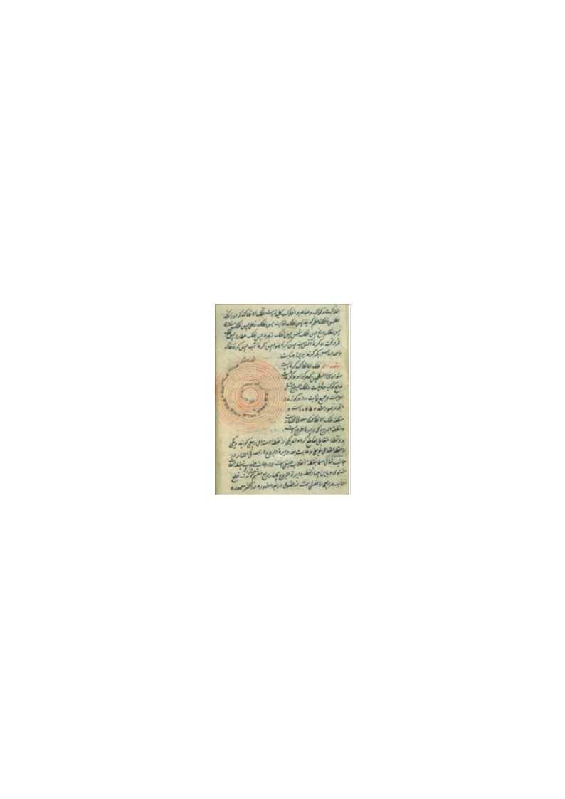
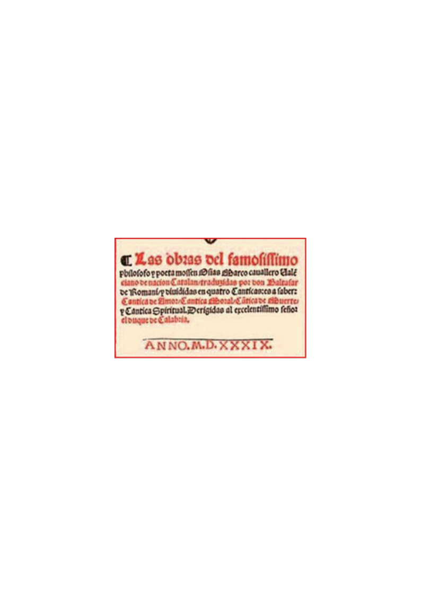
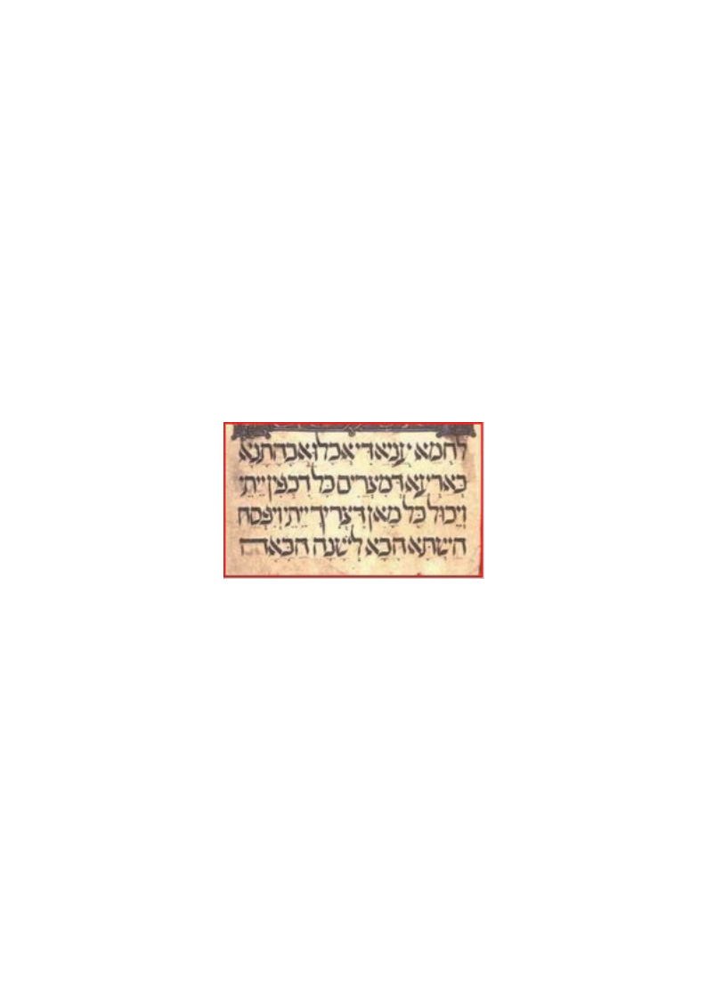

**EJERCICIO 1**. Contesta verdadero o falso:

1.  Falso

2.  Verdadero

3.  Verdadero

4.  Falso

5.  verdadero

**EJERCICIO 2**. Observa una noticia gráfica y contesta:

¿En qué zonas geográficas o Comunidades hay mayor concentración de genes judíos Sefardíes?

Aragón, Mallorca, Valencia y Sur de Portugal

¿Dónde hay mayor rastro de influencia norteafricana?

Extremadura, Menorca, Galicia, Noroeste de Castilla León

¿Qué lugar de la península tiene menos influencia de las dos?

Navarra, Cataluña y País Vasco

**EJERCICIO 3**. Vamos a identificar conceptos utilizados para designar grupos sociales.

Lee los documentos anteriores y completa el vocabulario:

1\. C

2\. E

3\. A

4\. B

5\. G

> 6\. D
>
> 7\. H
>
> 8\. F

**EJERCICIO 4**.

Conquista Musulmana, Waliato, Reinos Taifas, Califato Córdoba, Dominio Almorávide, Almohade, Nazarí Granada, Terceros Taifas, etc.

**EJERCICIO 5**. Di si son verdaderas o falsas las siguientes afirmaciones:

1.  verdadero

2.  falso

3.  falso

4.  falso

5.  verdadero

6.  falso

7.  verdadero

8.  verdadero

**EJERCICIO 6.**

<u>Musulmán:</u> Mezquita, Mahoma, Mudéjar, Árabe, Alfaquí

<u>Judío:</u> Sefarat, Sinagoga, Ladino, Converso, Diáspora

<u>Cristiano</u>: Iglesia, Papado, Obispo, Romance, Mozárabe

**EJERCICIO 7**. Contesta a estas preguntas:

¿Qué dos cosas quería provocar el papa Urbano II?

Unión de Iglesias y conquista de Lugares Santos

¿Qué órdenes militares son propiamente del reino de Castilla?

Calatrava, Santiago y Alcántara

¿En qué reino cristiano se fundó la orden militar de Montesa?

Aragón

¿Qué tres centros de peregrinación cristiana había en el Mediterráneo?

Jerusalén, Santiago y Roma

¿A quién beneficiaba la expansión territorial y militar en el Mediterráneo con las cruzadas?

A la Corona de Aragón

**EJERCICIO 8**. Lee el documento 7 y completa la siguiente frase:

Los musulmanes invocaban el nombre de \_ALÁ\_ y su profeta \_\_MAHOMA\_\_. Desde

el \_\_MINARETE\_\_ el \_MUECÍN\_ llamaba a la oración para convocar a los \_MUSULMANES\_\_

a la \_MEZQUITA\_. Los judíos lo hacían en la \_\_SINAGOGA\_\_.

**EJERCICIO 9.**

En España: Santiago, Toledo, Sevilla, Córdoba y Granada

En Francia: París y Clermont

En Italia: Génova, Venecia y Roma

En Egipto: Alejandría

En Turquía: Constantinopla

En Israel: Jerusalén

**EJERCICIO 10.**

ARABE ROMANCE HEBREO LATIN

**EJERCICIO 11.**

Mozárabe-Comes-Iglesia

Judío-Torá-Sinagoga

Musulmán-Alfaquí-Mezquita

**EJERCICIO 12**.

En la ciudad cristiana amurallada de Valencia, hay dos barrios internos diferenciados con otras murallas que son: JUDERIA Y MORERIA

Si la ciudad fuera musulmana, por ejemplo Sevilla; ¿qué dos barrios quedarían diferenciados? JUDERÍA Y MOZÁRABE

**EJERCICIO 13.**

¿Cuál era el objetivo de la Inquisición?

Acabar con los falsos conversos

¿Dónde se trató de recuperar la tradición cultural musulmana, con el apoyo de los judíos?

Toledo

¿Qué órdenes mendicantes surgieron para convertir a los musulmanes y judíos?

Dominicos y Franciscanos

**EJERCICIO 14**: Completa las frases siguientes:

La desconfianza de la \_CURIA ROMANA\_\_ a la recuperación de la tradición

cultural \_MUSULMANA\_, con el apoyo de los \_JUDÍOS\_\_ en la llamada Escuela

de \_\_TRADUCTORES DE TOLEDO\_, dio paso a la fundación del colegio de \_BOLONIA\_,

haciendo caso de los dictados de la Universidad de \_PARÍS\_ y la creación de las

\_ORDENES MENDICANTES\_, hechos que acaban imponiendo un \_IDEAL UNITRIO\_

de la cristiandad.

**EJERCICIO 15.** Une las columnas:

Moriscos-1609-Felipe III

Judíos-1492-Reyes Católicos

**EJERCICIO 16.**

Sopa de letras. Encuentra las tres culturas y cuatro ciudades nombradas en los documentos:

|     |     |     |     |     |     |     |     | T   |     |     | M   |
|-----|-----|-----|-----|-----|-----|-----|-----|-----|-----|-----|-----|
| C   | R   | I   | S   | T   | I   | A   | N   | O   |     |     | U   |
|     |     |     |     |     |     | L   |     | L   |     |     | S   |
|     |     |     |     |     |     | L   |     | E   |     |     | U   |
| J   | U   | D   | I   | O   |     | I   |     | D   |     |     | L   |
|     |     |     |     |     |     | V   |     | O   |     |     | M   |
|     |     |     |     |     |     | E   |     |     |     |     | A   |
|     |     | A   |     |     |     | S   |     |     |     |     | N   |
|     |     | M   |     |     |     |     |     |     |     |     |     |
|     | C   | O   | R   | D   | O   | B   | A   |     |     |     |     |
|     |     | R   |     |     |     |     |     |     |     |     |     |
|     |     |     |     |     |     |     |     |     |     |     |     |

**EJERCICIO 17.**

Tras la expulsión de los judíos en 1492, unos 120.000 judíos se refugiaron en el sur de Portugal

**EJERCICIO 18.**

Los **musulmanes** invaden en el año **711** la **península ibérica**. Mantienen su **dominación política** hasta el avance de los **reinos cristianos** en los **siglos XIII-XIV** quedando en sus tierras los llamados **mudéjares.** En **1492** son expulsados del **Reino Nazarí de Granada**, siendo obligados a convertirse (**moriscos**) hasta su expulsión definitiva en **1609.**
