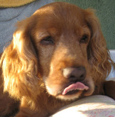
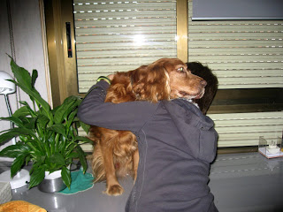
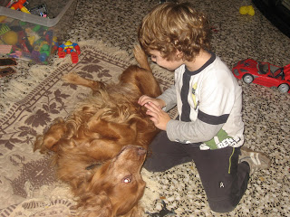

[EL CARRERÓ DE LA PLACETA](http://paquitajulian.blogspot.com/2012/08/el-carrero-de-la-placeta_3.html) 

|  |
|:--:|
| Les meues coses. Listo |

Ja estem a l’agost  i el millor, la meua ama Paquita i jo em arribat a Cinctorres, que ganes tenia!!.

 Tots  els anys el mateix,  estem a  Benicassim fins que el xiquet menut complís anys el dia dos d’agost. La meua ama vol estar ací , no de bades casi va nàixer a l'apartament, diu  que a les dos de la vesprada la mare del xiquet encara estava a la piscina a remulla (ja se sap la calor que fa al mes d’agost) i  dos hores més tart, no més  arribar a la maternitat,  Manel  va nàixer arma’n soroll com sempre.

L’adéu de Manel quan ens anàvem ha segut  molt emocionat, m’ha donar besets per orelles, morro i tot arreu, fins que se’n va adonar sa mare...i va dir... aixó no es fa !!  com si fóra    la primera vegada!!

Però desprès haig tingut  que aguantar-me... fins que vaig començar a ganyolar un poc, i clar, la meua ama va vindre corren a veure que passava, ( doncs volia ficar-me  dins de la seua samarreta,) primer me les va ensenyar totes i quan va aplegar a la que té  el dibuix  d’Spiderman, va decidir que eixa era la més bonica, i em deia: T’ha grada ?  Em  baix escapa  de miracle!!

|  |
|:--:|
| Joan ,quant em vol! |

L’ estiuejar està molt be però quan hi ha xiquets al volta’n, i dos mesos seguits  és esgotador.

 Dels quatre nets de la meua ama els  majors no em fan patir gens, Joan em demostra els seu afecte d’un altra manera m’acarona,  m’abraça i juga amb mi sense atorrollar-me. Però quan s’acosten el menut, tinc que anar en quatre ulls. L’any pesat,  la setmana de festes a Cinctorres, els dos  menuts i  més xiquets del carreró de la Placeta, no se d’eon van traure unes baines de bou,  jugaven  a bous tot els dies, a  mi em  tenien més que fart,  no podia eixir vaig del sofà, al moment quan en veien preferien torejar-me a mi. Entre tots em marejàvem. Ehhh Toro!!!. Quina afició! vorem aquest  any que tocarà.

|  |
|:--:|
| Manel. |

Aleshores estaré tranquil fins els dies de les festes en que vindrà la família  uns dies amb nosaltres, però s’ha de reconèixer, que quan  Manel em rasca la panxa m’agrada molt.
