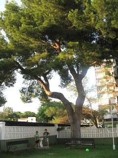
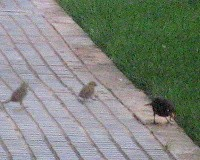
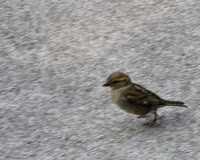

El gran pi-

[<u>  

</u>](http://3.bp.blogspot.com/-A5ybrnWT46A/UfFuKTlXYiI/AAAAAAAABTw/cM6rEC5tB70/s1600/pi+apartament+001.JPG)Aquest estiu, tant com s’acosta  la reunió de veïns de l’apartament surt el tema del  gran pi del jardí.

La nostra vivenda, està a la cinquena altura, i les rames, casi es poden tocar per la barana del balco. Pareix, que a molts veïns es fa nosa l’arbre, i és un tema de debat.

Diu la  meua ama Paquita que  de tallar-lo  rotundament no, doncs  té el mateix temps que la finca, 35 anys i fa ombra i ja forma part del espai del jardí.

La meua ama, quan els seus fills Juan i Manolo eren menuts els va fer una foto al costat del pi recent plantat,( un plantó que va portar un veí) Els xiquets recolzats a la forteta que està al costat ( pot ser per aixó l’arbre s’ha fet tant gran, doncs està  regat per l’aigua que cau del xiulet quan els xiquets juguen a mullar-se), així que a fet la mateixa foto als nets menuts, fills de Manolo, també recolzats a la font, El pi, és  veu enorme al seu costat.

Com que els gossos no podem entrar al jardí on juguen els xiquets, jo,  o mirava tot somat  el balco, lladrant molt enfadat, doncs a mi també m’agrada sortir a les fotos i amés, aquesta vegada soc perjudicat,  docs els pardalets que  han fet  els nius entre les seues  rames, gorrions i una parella de merles, son molts descarant, sempre estan passejant pel terrat con  si foren els amos i  damunt de la taula¡¡ la meua ama, els fica granets d’arròs del que em  guarden ami de la paella i  molletes de pa,a vegades, també picotejen el meu menjar  que tinc a la galeria de la cuina. Si per mi fora ...el arbre tallat,  a més, no m’ha pogut arrimar mai a  marcar-lo  fent  un pis al seu tronc,  i tinc 12 anys¡¡ doncs, per a  que serveis?.
