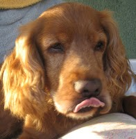
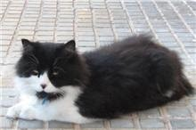

|  |
|:--:|
| Les meues coses.  Listo. |

Com tots els anys, quan arriba San Joan, ens preparem per anar de vacances. I una de les coses que sempre fa la meua ama Paquita, és portar-me al veterinari. Em canvien el collaret per protegir-me de no se quantes coses i em tallen el pel. Aquesta vegada s’han pesat i cassi m’ha quedat calb, en tres i no res m’han desaparegut totes les ondes i el que jo lligava amb la meua melena... Però axó si, estic molt fresquet.

Al primer pis del nostre apartament, viu tot l’any una gosseta que sols parla en angles, ella i la seua ama, es diu Babsy i em conta totes les novetats del veïnat.

Està molt espantada doncs a la planta vaja, viu una família nova i m’ha dit que tenen un gat que paries un monstre.

-No serà tant!! Li ha dit jo, un gat es un gat. I recorda que nosaltres som els millor amics de les persones i ens estimen molt-

Huí de matí em fet el passeigs pel voltant de la Torre Sant Visent, on anem tots els dies, al arribar al jardí del nostre apartament, la meua ama sempre em lleva la corretja i em deixa que em rebolques per l'herba i ha vist al gat que tenim com a veí. Clar que la Babsy esta espantada com que es més gran que ella!! en mirava i m’ha fet un bufit!.Quina poca vergonya!! Com si sols ell tinguera dret a estar al jardí i jo fora el foraster!. Ha corregut trass ell i amb fet una bona cursa i l'ha donat un bon esglai, cassi el tenia agarrat quan s’amaga per una gatera que té al costat de la porta de sa casa. Fins i tot estaré vigilant que no s’acosta a la Babsy

Per la vesprada, la gosseta i la seua ama estan les dos assegudes a uns bancs que hi ha al jardí per la part de la façana, sols escolten no parlen mai.Allí estan també unes quantes veïnes desenfeinades que miren tot el que entra i surt del edifici i també xafardegen de tot el que ocorris pel voltant.Quan la meua ama i jo ens anem a passejar i passem per allí en diuen, que sempre tenim presa, i es veritat, ens agrada més anar a caminar, així es, que la meua ama no mai sap res de res, sempre esta en Bàbia referent a les notes socials del carrer.

Però Babsy me ho conta a mi, tot. Les persones es creuen que nosaltres no veiem res i ens enterrem de tot el que es diu i es fa al nostre voltant.
