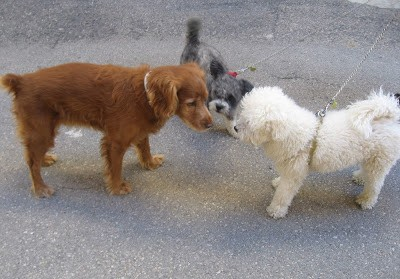

No ès el que era.

La casa de Juanet de la Fura, que està davant de la nostra, fins que no arriba casi meitat d’agost no es veu a ningú, està tancada, aleshores ve l’abuelo  amb algun fill,  desprès, tot son visites que jo no conec, fins quan venen els nets i besnéts a visitar-lo i s’escolta soroll de xiquets i grans.

 No es veu gent  al carrer com abans, quan fent rogle amb una taula, els veïns,  totes les vesprades   jugaven a les cartes, i jo,estava  assegut als costat de Merce amb la corretja dins de la pota de la cadira, així no m’anava darrere  de la meua  ama Paquita, i les seues amigues.

 Aquest any, no ha vist a Xarli el gosset de la Rosa, diu, que està al paradís dels animalets,el que aleoresé,també li diuen Xarli i  no té res que veure amb el meu amic de sempre, aquest, es un cadell  dos vegades més gran,  amb una orella més vaja  que l’altra y sols li agrada  jugar,   li faltava aixó   a Yako l’altre gos de  la família!!! abans, quan anava de passeig  amb el primer Xarli pareixia un sinyoret, tot el pel blanc com un corderet i es comportava,  aleshores està  fent les mateixes tonteries que el nou Xarli , si no fos, per que la meu ama Paquita em diu cuidadet  de fer patir  als veïns !!!els donaria un bon ensurt,  no fan mes que estossinar-me, jo vull està  a la meua porta mirant a les gossetes   que passen  per la Placeta del Cap de Vila.

A més, passa  un altra cosa; al galliner de les eres, on havia cinc  gallines ponedores i un gall roigs  molt escandalós, que jo anava a veure’ls  tots els dies i els lladrava,  sols hi ha dos polletes avorrides que no diuen ni mu quan vaig  a veure que fan!!!.

 Espero, que aixó que vaig a dir no sigui, una  moda nova y l’agrado  a la meua ama: La Rosa,també té passejant per tota casa, una  coloma amb la cua oberta estarrufà  com un paó.

 Es clar que el carreró de La Placeta, no és el que era.
