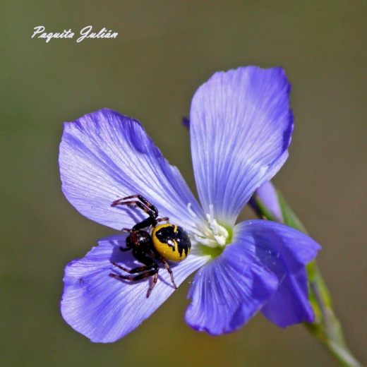
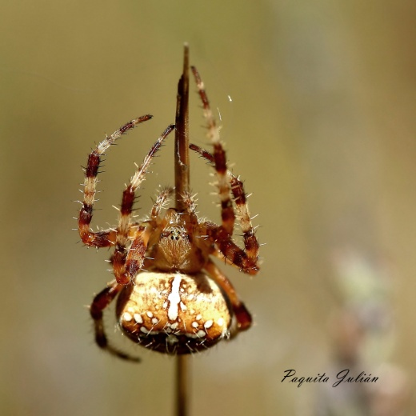
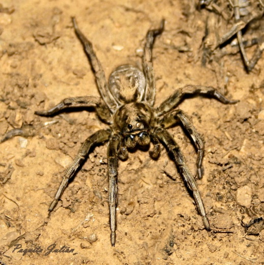
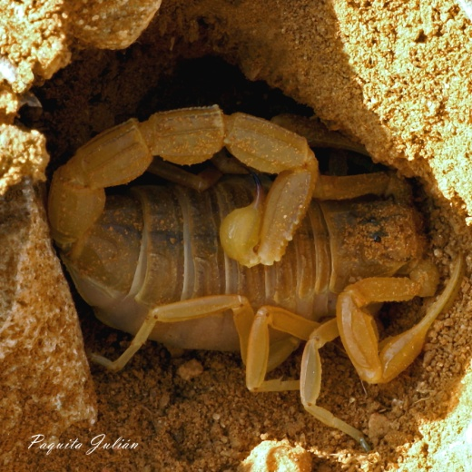
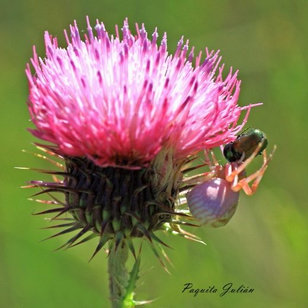

ARÁCNIDOS

Las arañas son artrópodos terrestres, depredadores, comen varias especies de artrópodos, por lo general, más pequeños que ellas mismas, grillos, moscas, abejas, chapulines ( saltamontes) polillas y mariposas. Capturan su presa al acecho, por medio de cepos o tela de araña, incluso por el salto. La producción de seda forma parte de la vida normal de las arañas. Poseen hileras en los segmentos ventrales 10 y 11, hileras que son patas especializadas y varios tipos de glándulas que segregan distintos hilos de seda. La glándula mayor es la que fabrica la seda llamada de seguridad para tejer todo el entramado. La tela de araña es un prodigio de ingeniería. Fabrican hilos de la misma calidad pero distinto tamaño en función de su peso, forman hilos en forma de paracaídas que les sirve de transporte aéreo para desplazarse y también para encerrar a sus presas. Algunas arañas tienen ocho ojos, aunque la mayoría no puede ver muy bien con ellos. Las arañas tejedoras son casi ciegas, Se guían sobre todo, por el tacto y el olfato.

La araña de listas amarillas y negras, *Argiope* fabrica telas geométricas para la captura de sus presas.

Pueden producir veneno como la tarántula *(Lycosa*) aunque no es peligrosa para el hombre.

Las tarántulas más peligrosas son la araña viuda negra, (l*atrodectus*) de picadura mortal para el hombre. El término “viuda” viene de la costumbre que estas hembras tienen de devorar a sus compañeros machos, tras el apareamiento. Las arañas también tienen cortejos, el macho emite señales hacia la hembra.

Los enemigos de las araña son algunos insectos como ciertas avispa. Los de la familia ( *pompilidae* ) solo cazan arañas y las avispas alfareras (*Sphecidae*) insectos y arañas, que encierran en su nido vivas para servir de alimento a sus larvas.

En las zonas rurales se utilizan emplastos de telarañas para curar heridas en el ganado y animales domésticos.

Escorpión. Los escorpiones pertenecen a la clase de los arácnidos, y están estrechamente emparentados con las arañas, ácaros y garrapatas. Los escorpiones tienen ocho patas y un par de pinzas similar a las de un cangrejo. Llevan el veneno en una glándula en la parte posterior de la cola. Dándole cierta apariencia amenazante y feroz.

ARÁCNIDOS

Synema globosum Argiope bruennichi

Araneus academatus Lycosa tarantula

Misumena vatia Escorpión alacrán
