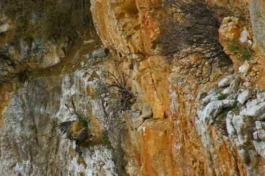
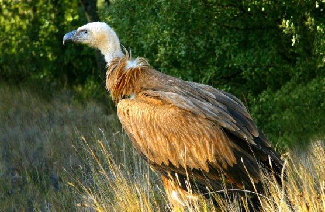
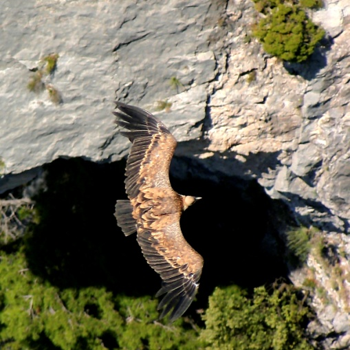
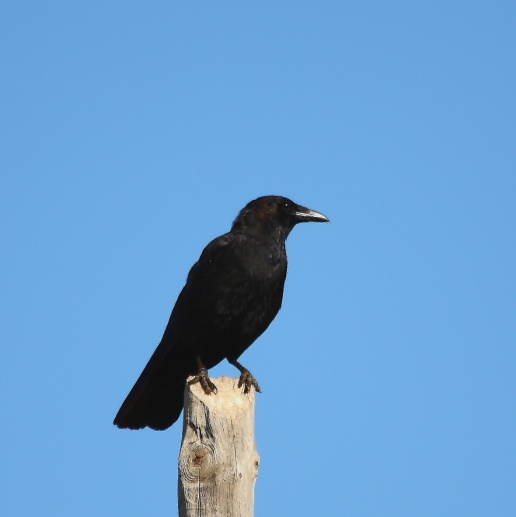
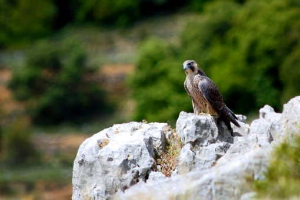
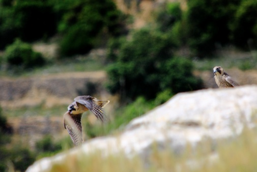

#   Rapaces diurnas y córvido

Las rapaces diurnas son aves depredadoras falconiformes están situadas en los lugares más altos de las cadenas montañosas, comen carroña y por lo tanta realizan un papel regulador de los ecosistemas en que viven. Son cazadoras y han desarrollado características como una visión excelente para ver a sus presas mucho más perfecta que la de los hombres. Para capturar y desgarrar a sus presas están dotadas de garras y picos muy afilados.

Presentan variedad morfológicas externas por el tipo de vida y alimentación diversa.

En los cortados calcáreos de la Roca Parda. En la Rambla Celumbres son comunes las rapaces necrófagas que se alimentan de carroña como el buitre leonado Gups fulvus que vive en colonias, es una de las mayores rapaces que pueden encontrarse en la península a ibérica

Para conseguir estas fotos mi hermano Tadeo y yo Paquita, estuvimos una mañana agazapados y cubiertos con una malla de camuflaje en lo más alto del acantilado rocoso hasta conseguir captar su majestuoso vuelo.

El buitre leonado pasa mucho tiempo planeando sin esfuerzo y sin batir las alas que están en ángulo recto con su cuerpo remontándose buscando las corrientes de aire caliente

También acoge a las dos aves rapaces cazadoras por excelencia el Falco peregrinus y el águila perdiguera Hieraetus fasciatus.

Los halcones tienen alas esterilizadas y cuerpos esbeltos, pueden lanzarse con rapidez en picado sobre sus presas. En estos picados los halcones peregrinos consiguen alcanzar velocidades de más de 300 Km por hora. Depositan los huevos en una pequeña oquedad o repisa cubierta. Suelen cambiar de nido cada varios años. Algunas parejas utilizan nidos vacios de otras aves para depositar sus huevos, entre los meses de marzo y abril.

Los córvidos han evolucionado dentro de las paseriformes es uno de los animales más inteligentes y de gran adaptabilidad, algunas especies como el Corvux coracs son capaces de aprender y repetir palabras, es territorial, ocupa su nido año tras año, lo cual lo hace vulnerable a la presencia urbana, buscando hacer sus nidos prioritariamente en cortados, viven de 10 a 15 años su régimen es omnívoro y oportunista , juntándose muchos ejemplares en basureros, busca ganados muertos, residuos alimentarios, cereales, bayas frutas y pequeños animales.

Garza (urraca), el papafigo, picot.

P

Buitre

