ARBOLES BAYAS Y FRUTOS.

Los arboles son los seres vivos que alcanzan la edad más avanzada. Pueden ser arboles arbustos y planta trepadora.

. Salvo alguna excepción las especies arbóreas se sirven del viento para transportar el polen de unas flores a otras.

Pino Albar. Pinus silvestris. Coníferas. Son arboles resinosos, perennifolios. De ramificación verticilada con ramas sin hojas. Las flores masculinas se disponen en inflorescencias en la base de los brotes, mientras que las femeninas forman piñas que maduran al segundo o tercer año.

Pino laricio o rodeno. *Pinus pinaster*. Se distinge pos las hojas recias y punzantes que pueden llegar hasta los 20-25 cm.. Sus grandes piñas ovoidoconicas presentan unas escamas muy prominentes. La capacidad de la especie es crecer en suelos pobres y de sequias prolongas están relacionadas con la producción de manera y la conservación y protección del suelo. Es una especie de crecimiento rápido

Piña. Fruto del pino y otras coníferas que tiene forma ovalada o de cono, termina en punta y está formada por muchas piezas duras y colocadas en forma de escamas, debajo que cada una de ellas hay uno o dos piñones

Arce. *Acer platanoides*.El arce vive disperso en bosques caducifolios de hayas o robles. Tienen las ramas y las hojas opuestas. Árbol de madera muy dura salpicadas de manchas, hojas sencillas, lobuladas y angulosas y fruto ligero rodeado de alas. Estos árboles son una importante fuente de polen y néctar a principio de primavera para las abejas y larvas de varias especies de lepidópteros.

Avellano. Corilus avellaana. Es una arbusto en que las flores nacen antes que las hojas. En el mismo árbol las flores masculinas y femeninas, aunque separadas. Su hoja es caduca, alterna, simple, no lobulada y dentada.

Su fruto forma parte de los cuatro medicantes, junto con los higos, las almendras, y uvas pasas. Se llaman así por que las cuatro órdenes; franciscanos, agustinos, dominicos y carmelitas, solo aceptan en ofrenda estos frutos.

Acebo. Grèvol. *Llex aquifolium.* La flor del acebo da solo polen en unos casos y frutos en otros. Ambos tipos de flor se encuentran en plantas diferentes. Sus bayas constituyen el alimento preferido de numerosas especies de pájaros. Se crían en las umbrieras y barrancos tanto de bosque como pinares.

*Quercus faguinea roble*. Sus hojas caducas son pequeñas y coriáceas, cubiertas de densos pelos estrellados por la parte inferior, y al margen con pequeños dientes regulares y agudos. Se caracterizan por sus flores amentos masculinos largos y péndulos y sus flores femeninas solitarias. Su fruto la bellota.

Quejigo.

*Encina. Quercus ilex* Es un árbol corpulento, de crecimiento lento. Sus hojas son perennes, espinosas, también pueden ser dentadas o de margen liso. Las flores son de dos tipos masculinas y femeninas. Los dos tipos de flores están en el mismo árbol. Las flores masculinas producen el polen, las femeninas con su polinización se transforman en la bellota. La madera de la encina es dura y nudosa, difícil de trabajar, pero muy adecuada para mangos de herramientas. Antiguamente se utilizaba para obtener carbón.

La carrasca. *Quercus ilex, rotundiffolia.* Tiene las hojas ovadas más anchas que la encina y las bellotas generalmente dulces.

Bellota. *Quercus ilex subsp ballota.* La bellota es el fruto de la encina carrasca y del roble. Está protegida por una caperuza o cúpula leñosa. Machacando su fruto se obtiene harina con la que algunos pueblos se alimentaban. La bellota del roble blanco son comestibles la del negro son amargas, es alimento de los animales que viven en estado salvaje.

*Solanum* Dulcamara. Planta, trepadora, leñosa por la parte inferior i herbácea por la superior, tallo flexionado que se extiende sobre los arbustos cercanos. Sus flores tienen forma de estrella violeta con corazón amarillo, las bayas verdes, al madurar son rojas de forma ovoide, son venenosas.

Endrino. Aranyone*. Prunus spinosa.* Es un arbusto muy ramificado, sus ramas terminaban una fuerte espina. Da numerosos frutos, las endrinas esféricas y de color entre azul y negro, son comestibles se utilizan en la elaboración de licores como el pacharán*.*

Enebro .Guinebre. *Juniperus communis*. Conifera. Son arboles o arbustos de crecimiento muy lento. Sus hojas son lineales agudas y punzantes. Existen enebros machos y enebros hembras. Las flores femeninas maduran formando unas falsas bayas o gálbulas negros-azulados, empleados a menudo en farmacia y para aromatizar la ginebra. La madera de los enebros recia y de larga duración es muy apreciada por los ebanistas.

Gayuba. *Arctostaphyllos uva-ursi* Colonica Arbusto perenne, planta rastrera de la familia de las ericáceas, se cría en las laderas y collados pedregosos de las montañas se desarrolla en terrenos habitualmente calcáreos o silíceos, protege el suelo desnudo de la erosión, no le afecta el viento.

Guilloma. Corronyer. *Amelanchier ovalis Medicus*. Arbusto, de la familia de las rosáceas, su hábitat terrenos rocosos o pedregosos La floración se produce antes de salir las hojas tiene flores masculinas y femeninas separadas y distintas, son de color verde amarillento los amentos masculinos tras cumplir su polinización caen al suelo, los femeninos se conservan y forman los frutos.

Majuelo*.* Espino albar. *Crataegus monogyna.* Es un arbusto espinoso de la familia, rosáceas. Se localiza en las laderas y collados pedregosos, también en los ribazos de campos de labor. Las flores son blancas y se agrupas en ramilletes. Los frutos tienen el tamaño de un guisante de color rojo y sabor ligeramente dulzón.

Muérdago. Vesc*. Viscum álbum*. Es una planta que parasita entre las ramas de los pinos, clava su raíz primaria en la corteza y profundiza en ella hasta atravesarla y llegar al leño, se caracteriza por sus tallos articulados y coloración siempre verde, su fruto es una baya pequeña y traslucida. La sustancia pegajosa que tiene la baya, ha estado utilizándose tradicionalmente, para elaborar una pega con la cual se pueden coger pájaros en trampas. Hoy en día esta práctica está considerada ilegal.

Rosal silvestre. Gavernera. *Rosa canina.* Son matas o arbustos con la rama provista de aguijones y hojas compuestas. Las flores blancas o rosadas son grandes y aromáticas persisten en invierno. Crece en los márgenes del bosque y en los claros. Especie protegida.

Sabina*. Juniperus phoonicea.* Coniferas de hoja escamosa, viven espontáneamente. Se trata de un arbusto de copa cónica densa de color verde oscuro se cría en terrenos calizos y en las fisuras de las rocas. Sus frutos o gálbulas cuando maduran son de color rojo oscuro .Su madera es inatacable para la carcoma, fue muy utilizada para la construcción de vigas en ebanistería. Es especie protegida.

Serbal. Serbes. Azarollas. *Sorbus acuparia.* El serbal tiene hojas dentadas, de elegante contorno, vive sobre todo en los robledales de la montaña media. Sus frutos son las serbas redondeadas, harinosas y muy ásperas pero comestibles si se dejan sobremadurar.

Zarzamora. Mora . Romiguera. *Rubus Ulmifora. Arbusto sarmentoso, familia de las rosáceas.* Las zarzas se caracterizan por su fruto colectivo, las moras, formados por numerosas frutitos carnosos, encerrados de forma conversa. Hacen de sus poblaciones zarzales, formaciones impenetrables. Es un género con muchas especies, difíciles de distinguir entre sí.

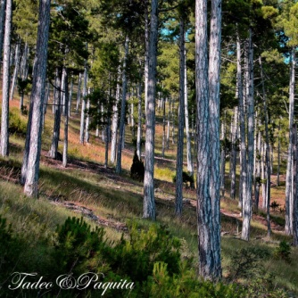

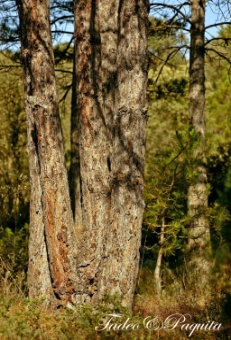

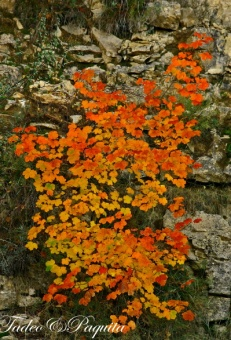

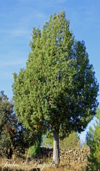

Pino albar Pino laricio Arce Sabina

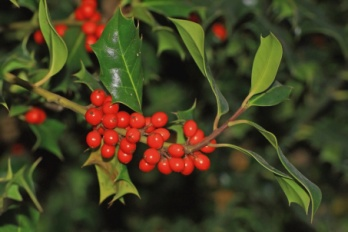

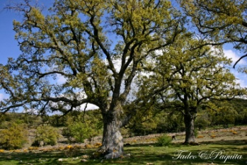

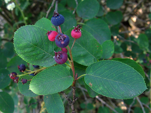

Acebo. Roble Guillomo

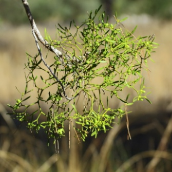

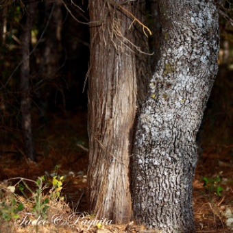

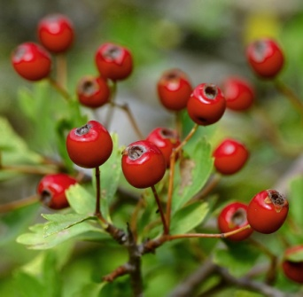

Muérdago Enebro carrasca Majuelo

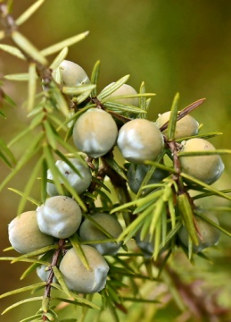

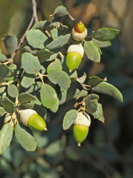

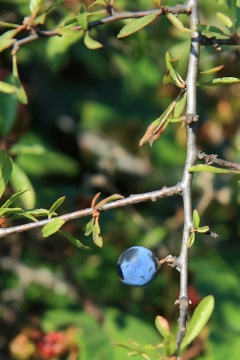

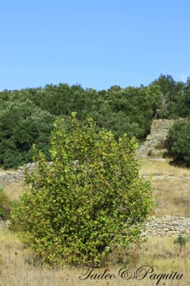

Enebro Carrasca Endrino Avellano

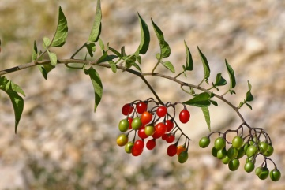

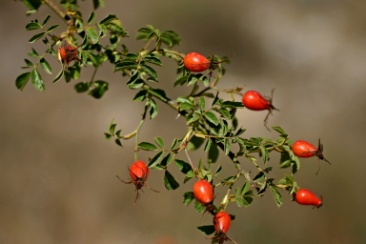

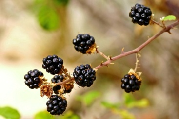

Dulcarama Rosal silvestre Zarzamora
