FLORES.

Las plantas superiores tienen en las flores la función encaminada para asegurar la continuidad de las especies. Las flores con sus órganos reproductores especializados no son permanentes si no transitorios. La fecundación sensual da origen a las semillas, contenidas en el fruto que proceden de la transformación del ovario de la flor.

PARTES BASICAS DE UNA PLANTA

Capullo. Flor de la cual todavía no se han separado los pétalos

Flor. Estructura reproductiva característica de las plantas que se reproducen por medio de semillas.

Fruto. Parte de la planta procedente del desarrollo del ovario de la flor tras la fecundación, rodeada por piel o cáscara, que protege las semillas y ayuda a su dispersión.

Hojas. Órgano vegetativo y generalmente aplanado de las plantas vasculares, especializado para realizar la fotosíntesis

Raíz. Órgano generalmente subterráneo, carente de hojas, fija la planta al suelo y absorbe el agua y minerales

Semilla. Simiente o pepita, contiene el embrión de la planta.

Tallo. Eje de la parte aérea de las plantas, órgano que sostiene a las hojas, flores y frutos. Incluye el sistema vascular que transporta el alimento y el agua.

Venas. Sistema bascular de las hojas.

PARTES BÁSICAS DE UNA FLOR.

Antena. Parte terminal del estambre de una flor.

Filamento. Parte basal estéril de un estambre.

Ovario. Estructura que contiene los óvulos a fecundar.

Óvulos. Célula reproductiva femenina de una planta.

Pétalo. Cada una de las hojas que componen la corola.

Pistilo. Órgano sexual femenino más interno de una flor.

Polen. Parte masculino de una flor.

Sépalo .Pieza floral que forma el cáliz de una flor.

Estigma. Parte del pistilo que recibe el polen durante la polinización.

Estilo. Prolongación del ovario de la cual aparece el estigma. El estilo no contiene óvulos..

Estambre. Cada uno de los órganos florales masculinos portadores de sacos polínicos.

Orquídeas. Silvestres

Las orquídeas son plantas que requieren ambientes determinaos. Constituyen un ejemplo de evolución del reino vegetal. Su estructura está adaptada a la polinización por medio de insectos. Ciertas Orquídeas ( Ophrys) son flores trampa, pues son muy parecidas en olor, tacto y color a las abejas y la polinización se realiza cuando una abeja macho intenta copular con las flores. Las semillas de las orquídeas son tan pequeñas que parecen polvo y solo pueden germinar si están asociadas a los hongos especiales que les proveen de alimentos, a su vez el hongo continuara siendo huésped de la planta cuando esta se desarrolla, habitando en sus raíces.

En los prados de las montañas se encuentran muchas especies de orquídeas de pequeño tamaño, pero su belleza no pasa inadvertida al buen conocedor de las plantas.

En los bancales de l’ Arrivasada cercanos a la Rambla Celumbres entre otras muchas otras especies de plantas con flores, he encontrada ocho variedad distintos de orquídeas. Algunas pueden ser menos hermosas que sus cogeneres tropicales pero es posible que sean más delicadas y sutiles.

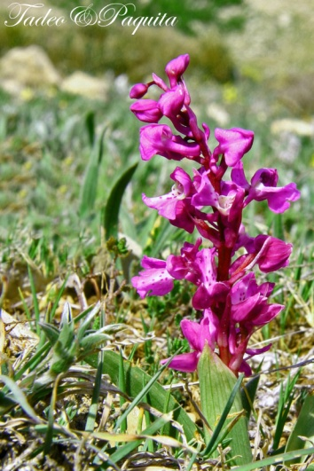

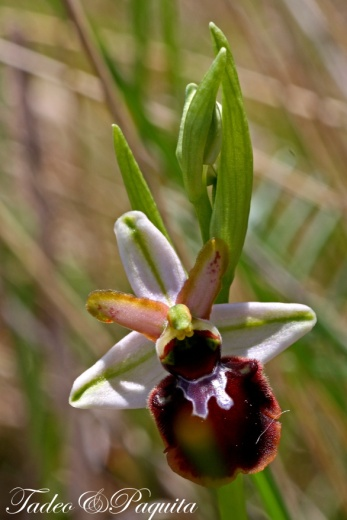

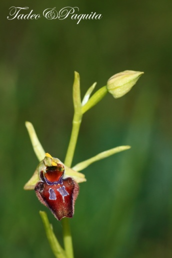

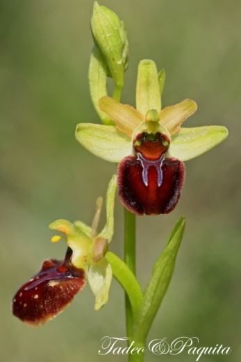

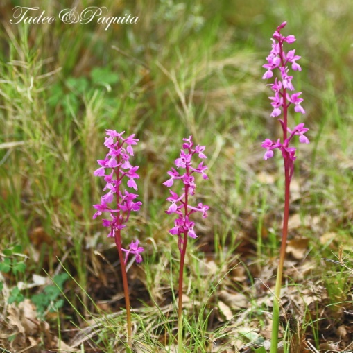

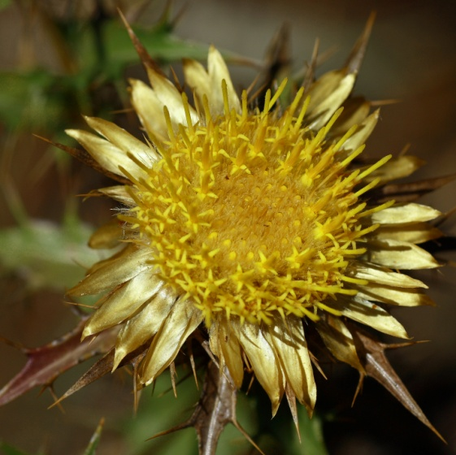

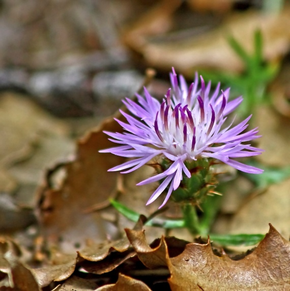

Cardo centaura áspera Cardo carlina hispánica

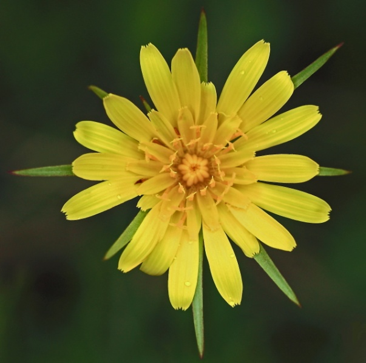

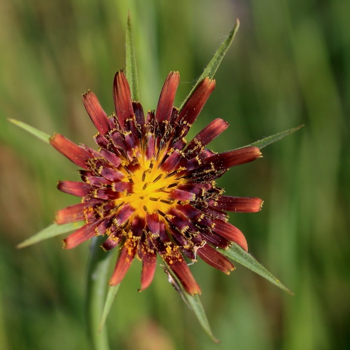

Tragopodon crocifolius. Tragopodon trapensis

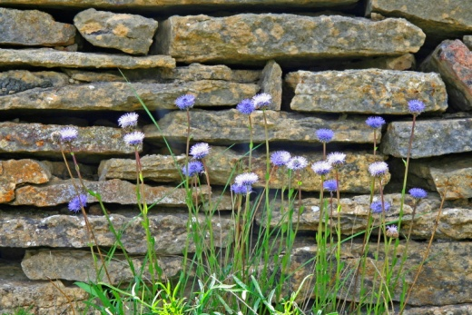

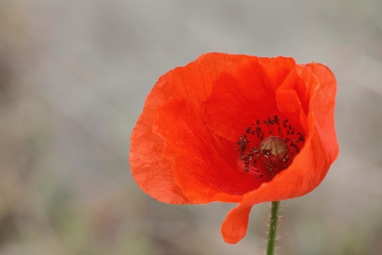

Globularia Bulgaris Papaver-roheas

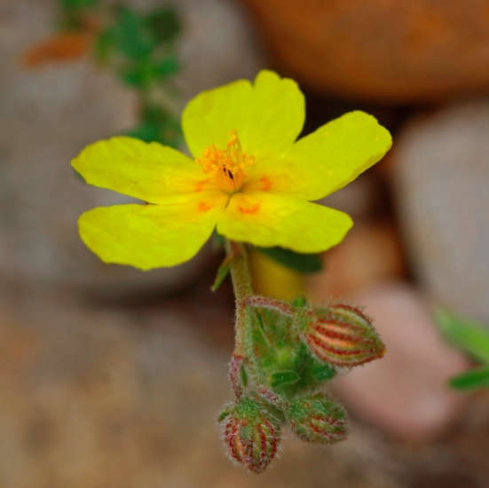

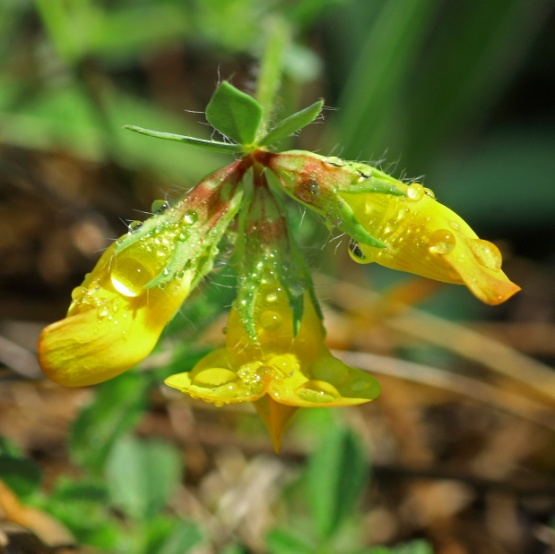

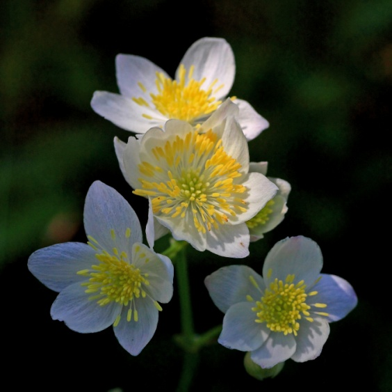

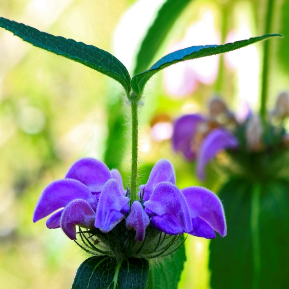

Lotus corniculatus Helianthum

Thalictrum tuberusus Phlomis purpúrea

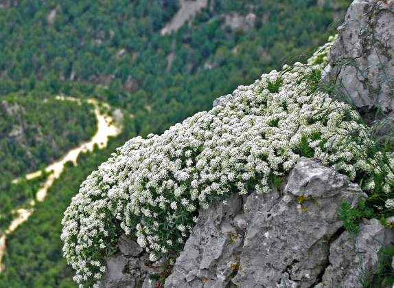

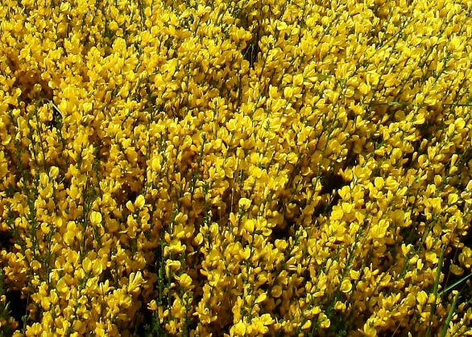

Silene Andryalifolia Ulex parviflorus

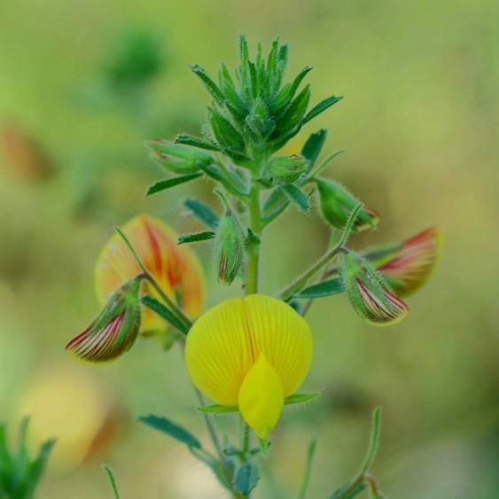

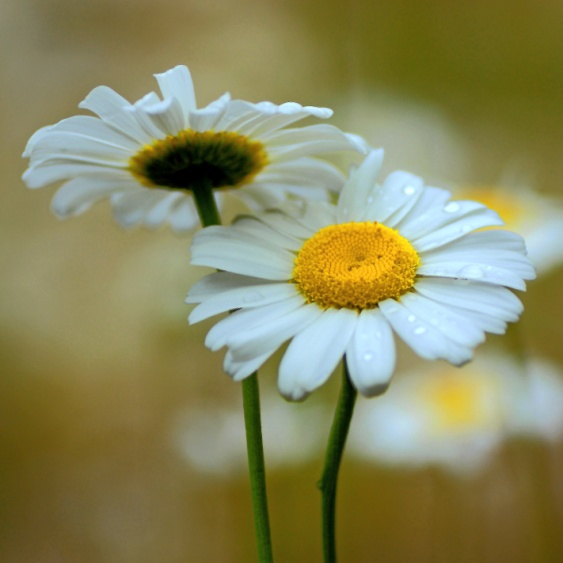

Ononis natrix Belllis sylvestris

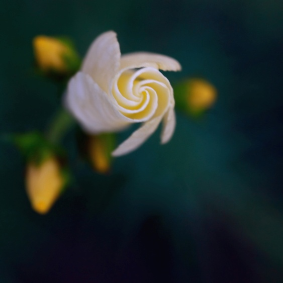

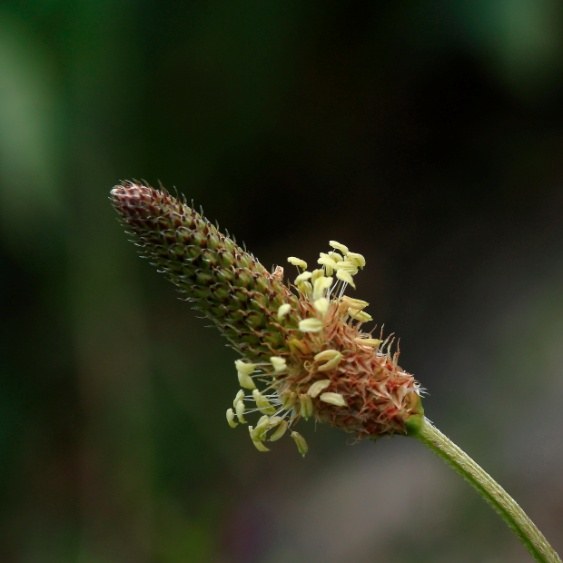

Linus suffruticosum Plantago lagopus.

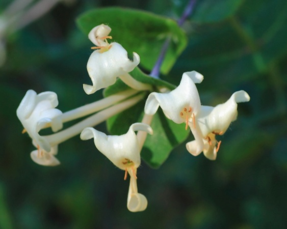

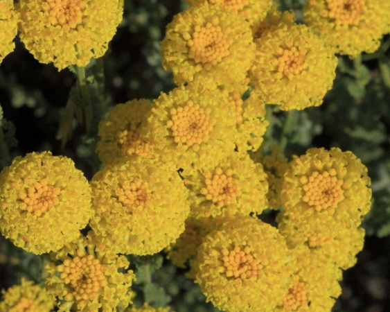

Madreselva Santonila- manzanilla amarga
