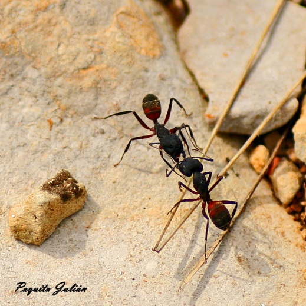
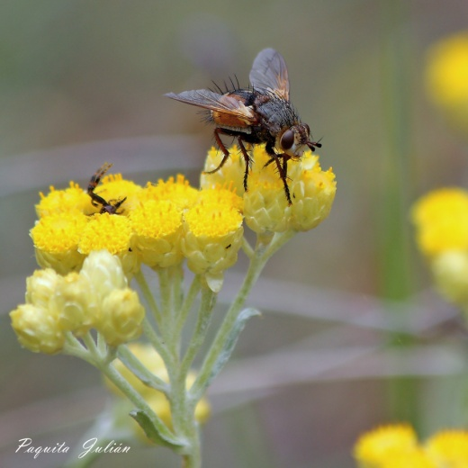
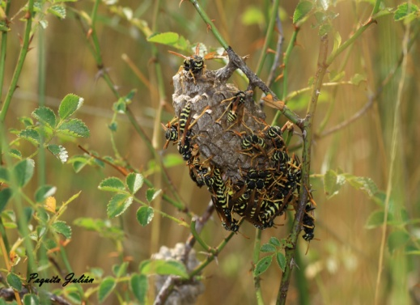
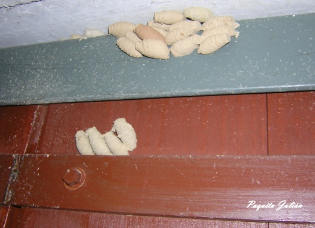
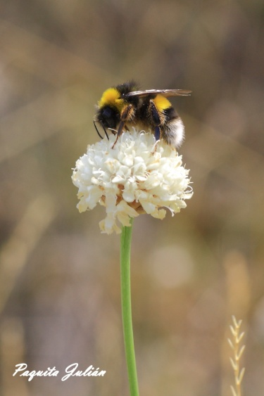
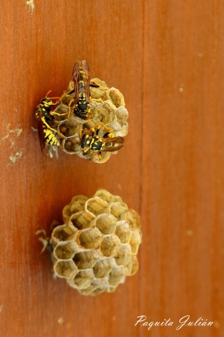
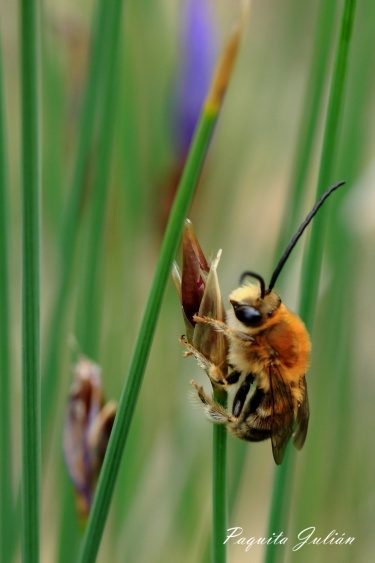

#  INSECTOS SOCIALES

Las abejas, avispas y hormigas llamadas himenópteros son insectos sociables, son un admirable ejemplo de organización. La mayoría de las especies de este orden son muy útiles para el hombre, ya sea como polinizadores o controladores biológicos de plagas.

En estos grupos o colonias cada individuo tiene un cometido determinado. Las reinas ponen huevos, las obreras procuran los alimentos, atienden a la reina y cuidan de las larvas, Algunos individuos son vigilantes y protegen las colonias.

Las abejas no solo producen miel, su mayor utilidad reside en su función polinizadora. Se calcula que aproximadamente el 85% de los vegetales que se emplean en la alimentación humana tanto hortalizas, árboles frutales, y demás plantas son polinizadas por insectos en su mayoría abejas.

La abeja de la miel, Apis melífera, forma sociedades numerosas y duraderas. La sociedad está formada por la reina y sus hijas, que realizan todo el trabajo, hacen la colmena con cera, en cuyas celdas la reina va depositando los huevos. La fecundación de la reina tiene lugar una sola vez y conserva la fertilidad toda su vida. La reina llega a poner hasta 2.000 huevos diarios a lo largo de su vida que dura de tres a cinco años.las obreras son las que decidirán si en una celda el huevo originara un macho o zángano, o bien una obrera o hembra. Cuando la colonia de abejas se encuentra superpoblada una reina y algunas obreras forman un enjambre. Mientras las abejas exploradoras buscan un lugar para establecer la nueva colonia el enjambre descansa.

Al grupo de las abejas pertenecen los abejorros Bombus, también alimentan a sus larvas con polen y miel, pero es una sociedad que no duda utilizar la agresión física por parte de la reina dominante.

Las sociedades de himenópteros avispa están formadas por la madre y su descendencia todas hijas. Los machos aparecen cuando la sociedad está madura y solo tienen la función de fecundar a las hembras, tras lo cual ellos mueren. Son alimentados por las obreras.

Las sociedades de las avispas son temporales, deshaciéndose en otoño, antes machos y hembras asexuadas realizan el vuelo nupcial para la fecundación. Los machos mueren y las reinas pasan el invierno en letargo, hasta la primavera que se inicia un nuevo nido.

Las avispas alfareras, son una subfamilia de las avispas comunes, es solitaria y depredadora, se alimentan atacando a las arañas que tejen telarañas y orugas. Se llama así por que construye su nido con barro en forma de vasija o tubos de órgano que adhieren a tallos o muros. Se producen dos o tres generaciones al año.

Las hormigas son especies sociables. Su sociedad también está formada por la reina madre (aquí pueden haber varias reinas) y sus hijas forman nidos muy numerosos. Son animales terrestres, hacen sus nidos en el suelo y también en los troncos de los arboles. A diferencia de los otros himenópteros, las obreras carecen de alas.

INSECTOS SOCIABLES

Mosca común Camponatus cruentatus

Polister alfarera Polister nimpa

Bombus terrestres Avispa común Apis mellifica abeja
