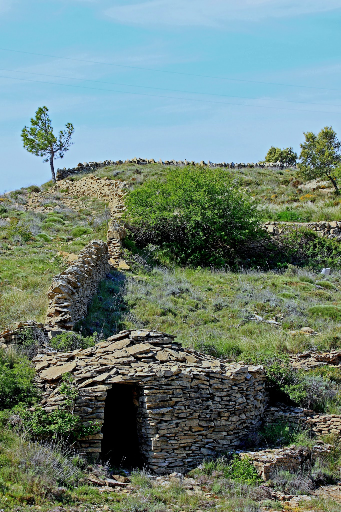

# Prueba 

Estoy aprendiendo

Creo que las ideas son importantes, no podemos hacer nada sin antes pensarlo. Luego están los hechos. Aunque a veces hacemos lo que no habíamos pensado sino lo que en el momento de realizar la idea nos dejamos guiar por el instinto o lo lógico, no sé en qué medida cada cosa

,

Luego los pensamientos y las ideas que en un momento dado fueron fugaces cuando se han realizado y resultan satisfactorias ,antes, en el pensamiento, ya han sido analizadas sin darnos cuenta ,y ha quedado en la memoria la mejor opción.

En el caso de la imagen anterior el pastor o labrador que construyó la pared divisoria y después la barraca, fue primero una idea, y después un hecho.

Lo más lógico es que la barraca se construyera después aprovechando la pared ya hecha como contrafuerte, luego no se que es más importante el hecho de pensarlo o la acción de hacerlo pues no todas las personas tienen las dos habilidades, el pensamiento y el hecho.

10 feb 2022 Paquita.
