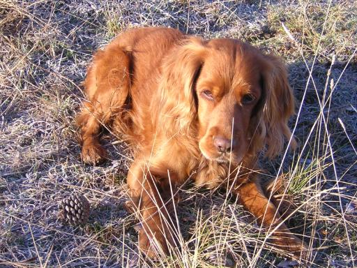

TERTULIA

 

Em diuen Listo, aquest és el nom que m’ha ficat la meua ama Paquita, sóc el seu gos

Quan anem a passejar em trobe a les meues amigues, la Gala i la Tula.

La Tula és petita, però molt espavilada i la Gala com que porta el cognom de un escritor famos es dona una mica de importància

Huí la Tula ems ha dit: Escolteu; crec que prompte seran feste, eixes, que tiren tants coets.

Gala: Com ho saps? A mi els coets em fan por!

Tula: El meu amo, ha portat a casa una cinta verde, com la que tots els anys em fica al collaret

Gala: Quina vergonya! No tens prou amb el llaç que portes al pirri?

Tula: Mira qui parla…la manta a cuàdros que et fica la teua ama .no t'a favoris gens ni mica, a més, té fa gorda

Gala: Ja o sé, peró a la meua ama li fa il·lusió i com estem a soles i em vol tant…

Listo: Ja està bé! Sempre feu el mateix

Gala: Clar, com que tu eres xic i no et fiquen res.

Tula: A tu, Listo no et fa falta, eres molt tempat!

Listo: Jo faig faena .Cuide la casa i a més com la meua ama  moltes vegades no sentí el  timbre de la porta, ganyole molt fort i aixi ella sap que han trucat, i també, quan truca  el telèfon a les hores ganyole diferent, com un llop i així, ella pot parlar amb qui la crida, i em fa carícies i em diu ,guapo.

Tula: Doncs jo no faig res, tots els de casa em cuiden al braç i surt molt al carrer amb el meu amo.

Gala: Nosaltres estem molt tranquil-les, no ens agrada el soroll.

Listo: Que avorrit! A ma casa sempre hi ha gent, el xiquet que més m’agrada és el menut, m’ha donat la meua ama un joguet  de fusta d’ell que vaig rosegar, molt bonic ,Primer es va enfadar, però a les hores és meu,  amés quan li donen de berenar, el xiquet ,em dona d’amagat les seues galetes que són boníssimes

Tula: Ens anem a casa, segur que demà ja portaré la cinteta verda que m’agrada molt.

.

Gala: Dons la meua ama i jo, crec, que com tots els anys ens anirem a la plaja hasta que passen les festes

Listo: Que bé!A mi segur em donaran llonganisses seques i xoricets també, com sempre.

     Paquita.       4 març 2008   

.

 

,

