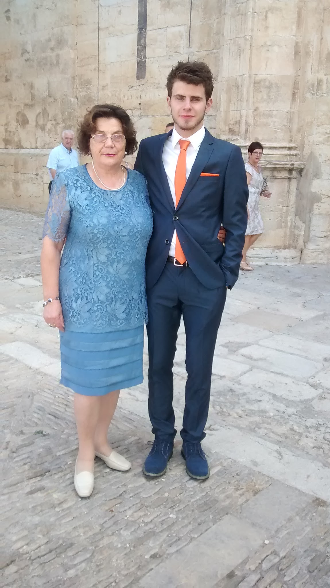

## Prueba 2

Sigo aprendiendo

Es domingo.Día en que se celebra la fiesta religiosa en honor de la Patrona del pueblo. Mi nieto mayor es uno de los quintos de este año, y, como manda la tradición, ellas y ellos asisten a la ceremonia religiosa .

Mi sorpresa, ha sido encontrarlo en la puerta de la iglesia muy elegante con su traje nuevo color gris azulón con corbata y complemento color naranja, (a los jóvenes todo les favorece)Sin saberlo, íbamos bastante conjuntados, pues el tono de mi vestido también tiene el mismo color aunque más claro y reciclado, pues es un traje formal de fiesta que he usado muchas veces. Ha sido una sorpresa dar testimonio con esta imagen que guardo con mucho cariño. Paquita 11 feb 2022
