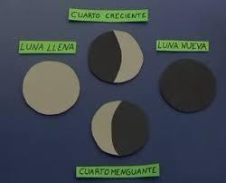

FASES DE LA LUNA

EN LUNA NUEVA O yo : sinónimo de crecer y prosperar

Árbol de hoja perenne: Cortar leña para brasa, para sembrar en luna nueva y bajo el signo 1€³de Tauro mejor cosecha. Nunca en Escorpio.

Árboles hoja perenne. Ciprés, pino, naranjo, alcornoque, carrasca…

LUNA VIEJA O MENGUANTE:

Árbol de hoja caduca podar y cortar los árboles, su madera es adecuada para muebles, instrumentos musicales, estatuas, aperos de labranza.

la madera cortada en luna vieja o menguante no tiene carcoma.

Ejemplos hoja caduca. Almendro, cerezo, nogal, ciruelo,…

Limpiar fuentes y balsas así no se pierde el agua labrar en luna vieja aguanta más tiempo la sazón. y también la siembra de patatas

ANIMALES DE CARGA.

De una yegua y un burro nace un matxo o una mula,

(somerins) híbridos

De una burra y un caballo nace también mula o mulo

(enatos) hibridos.

ANIMALES REPRODUCTORES

Yegua y caballo una yeguada para mantener la raza.

Burro y burra mantener la raza.

MASIA GRANDE : Tres parejas de animales de carga y una yegua o burr@ para servicio del mas y reproducción.

MASIA MEDIANA dos parejas de animales de carga. una yegua o burr@ para el servicio del mas y reproducción.

MASIA PEQUEÑA .Una pareja de animales de carga.

Maset pequeño y casa del pueblo un animal de carga.

Para saber la extensión de un más antiguamente se reconocía por la cantidad de animales de carga que tenía. Cada pareja de animales de carga se calculaba sobre 50 jornales. Un jornal es la extensión de campo que una pareja de animales labraba en un día, que traducido a metros cuadrados son 3.333 m cuadrados jornal.

Predicciones tiempo.

Agosto ( Cabanyoles) los primeros 15 dias si hay humedad mala cosecha.

Diciembre del 12 al 25(terjiaries) si llueve entre esos días buen año.

Enero 25. Conversión de Sal Pablo si llueve buena primavera.

Marzo 25 si no llueve sequía

Abril 3 cambio de masia época donde hay menos trabajo en el campo aún no ha llegado la cosecha.

Cañada, vía pecuaria o assagador que cruza varias provincias ,siendo su ancho 75,22 metros.

Cordel, vía pecuaria que afluye a las cañadas y pone en comunicación dos provincias limítrofes, cuya anchura es 37,61 m.

Vereda, vía pecuaria que pone en comunicación varias comarcas de una misma provincia , cuya anchura es de 20,89 m.

Colada, vía pecuaria que pone en comunicación las diversas fincas de un término municipal, cuya anch unura será la que resulte de los antecedentes en cada caso.

.
