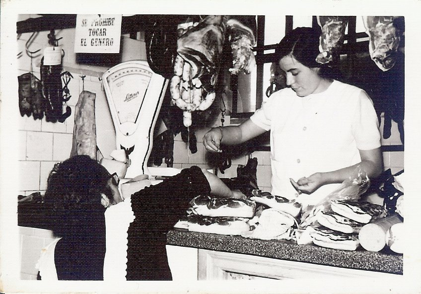
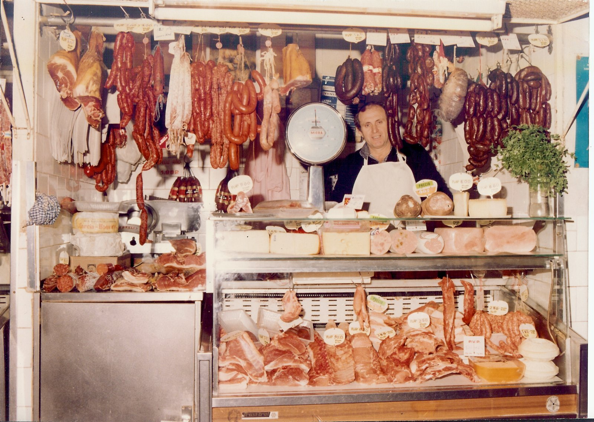
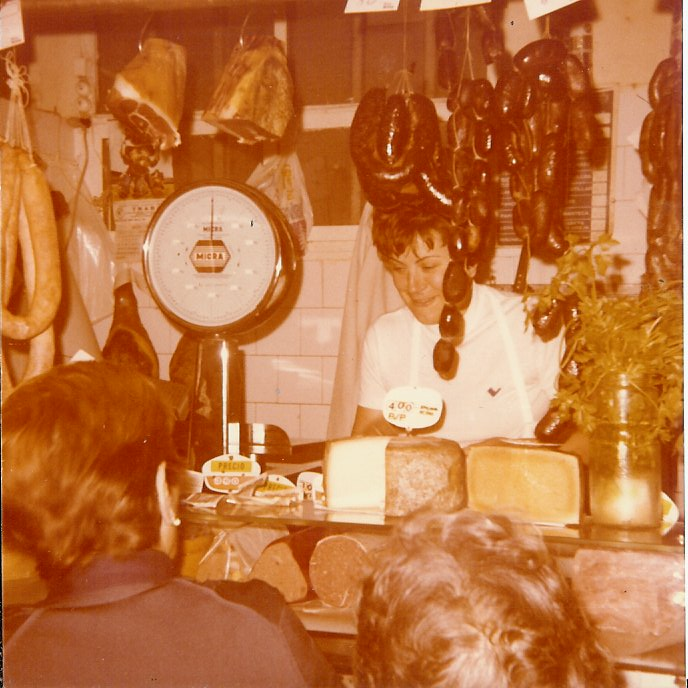
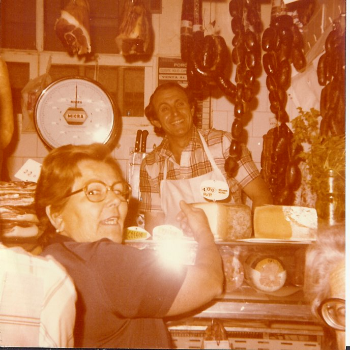
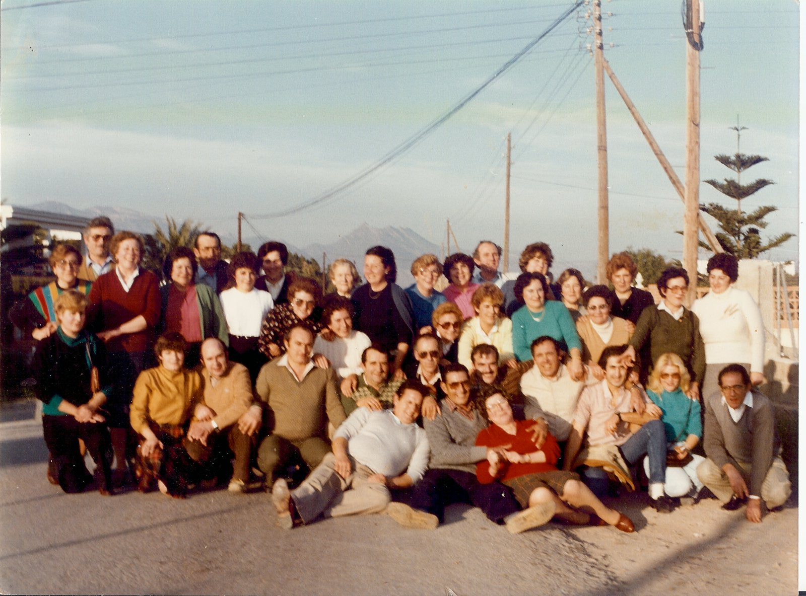
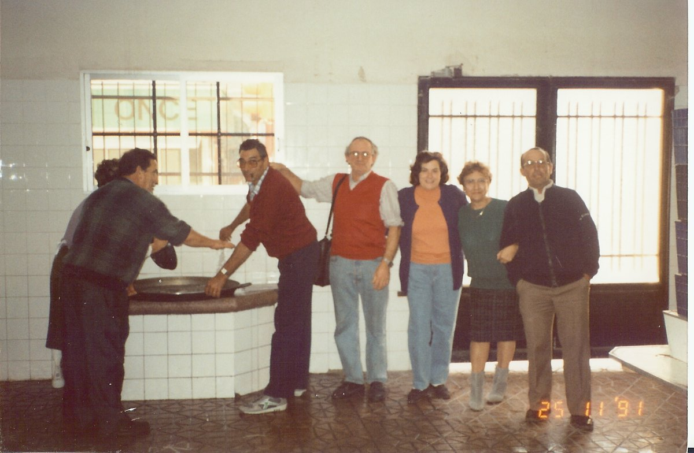
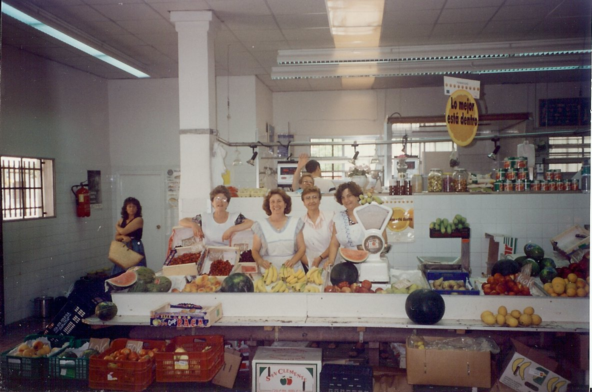
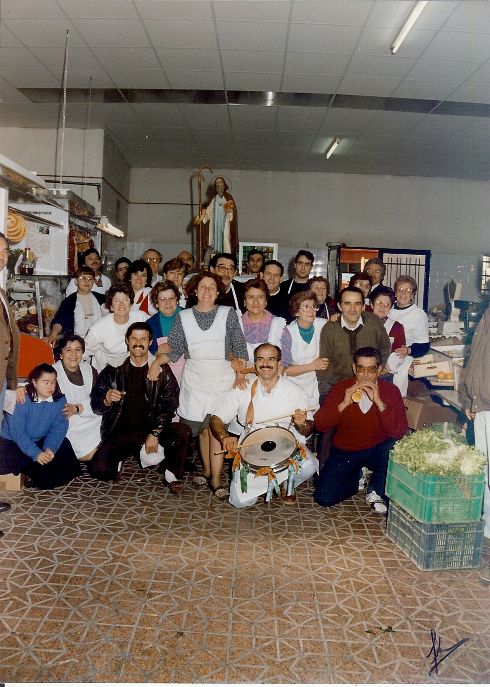
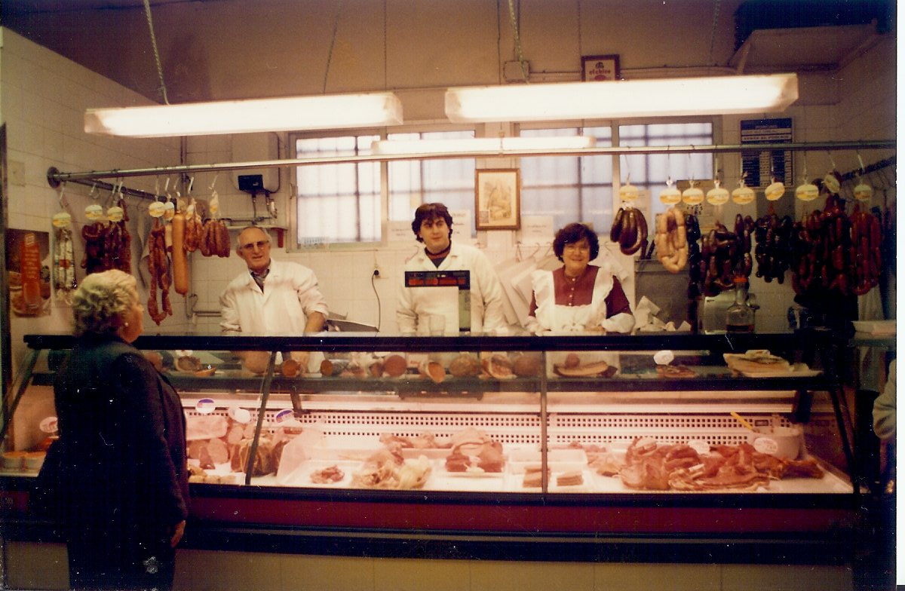

# El mercat de Sant Antoni

Quan entrem al mercat de Sant Antoni, veiem un espai modern amb instal·lacions actuals i gran varietat de productes de qualitat.

Hi ha tres grans parades de carn i els seus derivats, tres paredes molt vistoses de fruita i verdura, una de tot tipus de peix fresc i congelat, un olivero amb molt de sortit dels seus productes i una panaderia que també és pastisseria i cafeteria. I a més de tot això el calor humà que li dona la gent que allí treballa, ELS SEUS VENEDORS.

Erundina (la més antiga del mercat, va ser una de les carnisseres des del començament l’any 1959) Javier, Inma, Pablo, Vicent, Vicent i Pepe, Carlos, Consuelo, Carmen,Vitonia, La Simona- Fina Tere.

Tots ells són treballadors autònoms.

Així és aleshores, el mercat quan es fica en marxa i comença el dia laboral

Té poc a veure, amb el mercat de Sant Antoni dels any 60. Aquest començava a les 7 del matí, l’hora, en que un guàrdia municipal obria les dos portes. Moltes vegades, els venedors ja estaven allí esperant. Les diferents parades eren de pedra artificial, no hi havia mostrador frigorífics, aleshores els productes havien de ser molt frescs abans d’arribar als clients.

ELS CARNICERS deixaven les parts dels corders que portaven en grans cistelles i sen’anaven al escorxador, i quan podien encara calent, portaven a vendre, parts del animal,com el fetge, lleus, lleteroles, etc. que allí es sacrificàvem pal consum.

CANSALADERS, amb tots els productes del porc i els embotits derivats com ara. La tarbena, marineta, blanquets, botifarra negra amb quadrets de cansalada tallada a mà, a més de les botifarres d’arròs, de seva i botifarronets de seva amb pinyons, llonganisses i xoriços

També arribaven els repartidors dels diferents productes com els pollastrers, formatgers, i varietat de productes del consum diari.

ELS OLIVEROS. Amb grans perols plens de llegums cuits, dels que encara sortia el vapor de la cocció, abadejo salat i remullat, tollina a granel (es portava el pà i et preparaven un entrepà amb tollina i olives que era una delícia) sardines de bota, capellans, sorra, moixama, anxoves amb sal, tot tipus d’olives; sevillanes, partides, de Borriol, del cuquello, d’Aragó, etc.

LES PESCATERES. Amb les caixes de peix, que es pescava al Grau, espècies, que avui és molt difícil de veure pels mercats, doncs moltes vegades, ni els pescadors les agarren degut al vaix valor comercial que tenen, com: Sorell, sucla, boga, cavalla,sardina,anxova, mollets,galeres, musclos, mare del lluç,

palades, ànguila, pagell, gallineta,marbra,.mussola,cabut, morralla etc. Sempre recordo, quan de bon matí, animaven a la gent amb els seus crits pregonant la mercaderia (xiquetes ...qui menja sorell no és fa vell) esta dita, és la que més recordo entre un munt de les que deien.

PARADES DE VERDURA. Llauradors dels voltants, que portaven a vendre el que es collia de temporada. També hi havia productes del mercat d’Abastos.

LES FRUITES DELS GRANS MAGATZEMS. Les peces un poc tocades eren molt més econòmiques i en donaven gran quantitat a vaix preu.

MENUDES TENDES D’ULTRAMARINS. On hi havia de tot, en molt poc d’espai.

PARADES D’OUS exclusivament.

TRIPERIA o menuncies.

D’ALLS.

I al carrer, a la plaça Maestrazgo, un manoll de productes, que aleshores ens pareixen impossibles.

Els noms de la gent que venia en les diferents parades, ens resulten estranys, però al barri dels Mestrets i del Rabal, era normal conèixer al veïns amb el mal nom o mote i ningú s’enfadava, doncs els noms familiars eren dels seus avantpassats..

La meua amiga i antiga companya del mercat de Sant Antoni Maria Cinta Gozalbo (l’olivera,) m’ha donat informació molt valuosa. Sense la seua memòria i ganes de donar testimoni d’aquell temps, moltes coses que ací es diu, no haguera segut possible.

Els següents mots estan agrupats per els diferents oficis de cadascú.

El meu pensar és, que no hi ha cap ofici més important que un altre. En tots és necessita, ganes de treballar, saber escoltar als client i molta paciència doncs hi ha vegades que a tots fa goig el mateix i al dia següent no ho vol ningú.

Potser oblidaré algun nom. Des d’ací, demano disculpes

## Els noms de la gent del mercat

### Carniceries

- Erundina.
- Sinyo Vicent i Carmencita.
- Sinyo Pepe
- Maruja,
- Desprès:
- Elvira.
- Pepita i Pepe.
- Mª Carmen i Paciano.
- Isabel.

### Cansaladers

- Maria. La botifarrera.
- Nieves.
- Fina.
- Irene.
- Juan i Paquita.
- Desprès:
- Teresa i Pili.
- Carnices Castellonenses:Isabel.
- Manolo Castellano.
- Teo.

### Oliveros

- Juan Benajes.
- José Fajardo.
- Anitin la olivera.
- Desprès:
- Mª Cinta.
- Carlos.

### Peix

Venien del Grau, el venien pel carrer en un carret de mà i quan la venda era al mercat, a les parades.

- Paquita.
- Carmen la Menuda
- Carmen la Gran.
- Rosita. De la Ronda.

### Verdures de casa

- Sinyo Carme.
- Maneleta la Bodega.
- Maria la Marca- Consuelo.
- Anita.
- La Xilina.
- Centeta La Metro.
- Maria La Flauta.
- Rosa La Morena
- Sinyo Pepa.
- Teresa Mascarosa.
- Madalena.

### Verdures de mercat

- Asunción i Erminia.
- Conxa La Xina.
- Carme La Rogeta.
- Cinta.
- Carme La Rasposa.
- Teresa La Palanques
- Carme.
- Vicentica.
- Pepa La Farola.
- Maria La Conilla.
- Desprès: Corina i Tere.

### Magatzems de fruites

- Vida de Felip:venedora Mª Cinta, desprès: Ana i Conxin.
- El Platano de oro: venedores Fina i Maruja.
- Felip: venedores Pepa i Rosa.

### Tenders

- Javier Rambla
- Carme La Barraquera
- Maria.

### Menuncies

- Teresa La dels Caps.

### Alls

- Sinyo Josefa.

### I al carrer: plaça Maestrazgo

- LluÇia: venia caragols.
- La Calaix: llorer, timonet, saborija.
- Miguel el Roig: margallons.
- Ismael d’Adjaneta: conills, pollastres, coloms, animals vius.

### Carrejadors

- Pepe que portava un carro de mà.
- Amadeo: Anava amb un carro que arrossegava un burro.
- Ell damunt dret, una mà al ramal i cantava Gregorià (A les 6 del matí passava per davant de ma casa al carrer Vázquez Mella i ens despertava a tots). El mercat d’Abastos estava al carrer Parc l’Oest.
- Encarregat de la limpiesa: Pepe Llorenç.
- Cobrador: Pepe Vidalo.
- Arquitecte:Vicente Traver.
- Regidor de Mercat: Antonio Quintana.

## La construcció del mercat

En aquest document següent, consta tot el procés per construir el mercat de Sant Antoni.

El projecte es edificar un mercat municipal amb els següenst serveis:

Expediente del Ayuntamiento de Castellón C-317 C-12.

20 paradas de piedra artificial.

46 puestos de venta.

Capitulo 1º.

Movimientos de tierra. 6.591.88

Poceria. 6.994.

Hormigones y extructura. 135.751,49.

Albañilería. 103749,95.

Soldados alicatados y piedra artificial. 107.138,53

Carpintería. 78.882,63.

Pintura y vidriería. 76.363,70.

Ejecución material. 515.476,18

Diciembre 1957

Se hace público para general conocimiento y que se publica B.O.P nº1 de 28 de 1958.

B.O.P nº23 de 22 febrero.

B.O.E.nº54 de 4 mayo.

1ª Subasta. 29 de Marzo.

2ª Subasta.B.O.P.nº41de 8 marzo.

3ª Subasta B.O.E. nº 89 de14 marzo.

Subasta 26 marzo 1958.

Sesión Ordinaria 30 Mayo 1958.

El Exmo Ayuntamiento en Pleno aprueba el contrato suscrito por la alcaldía el pasado 10 de mayo 1958 a Don Santiago Viqueira Fullos en nombre de Compañía Levantina y Obras Públicas. La construcción de un Mercado para la venta de carnes, frutas, verduras y pescado en la Plaza Maestrazgo, por la cantidad de seiscientas cuatro milveinticuatro con setenta ocho cms..

31 mayo 1958

En l’anunci de l’Ajuntament del periòdic Mediterráneo en data de divendres 9 d’octubre 1959 es pot llegir:

“Se saca a pública subasta la adjudicación de cuatro casetas del Mercado de San Antonio dedicadas exclusivamente a la venta de Pescado.”

En el mateix periòdic en data sábado 31 d’octubre:

“A partir de esta fecha sale a subasta una caseta para carne conjelada en el Mercado de San Antonio.”

La darrera informació que porta, sobre la construccio del Mercart da Sant Antoni, el periodic Mediterráneo és del dissabte 2 de gener de 1960. L’article diu:

“La labor del ayuntamiento en 1959.

Expuesto por el Alcalde, camarada José Ferrer Fons, en la sesión de anteayer.

Hemos visto la reciente inaguración del Mercado de San Antonio,que no obstante tener un caracter provisional, ha permitido que desaparezca aquel molesto y desagradable mercado-xoco próximo a la Ronda. Si bien el nuevo Mercado no es un alarde arquitectónico cumple perfectamente su función d obra provisiona. Además, en el plazo de 15 años quedará amortizado y por lo menos habremos pasado este lapso de tiempo con una construcción que no desmerece de la corriente urbanística y de mejora que se viene operando en nuestro Castellón.”

*Paquita la de Padilla 1967. Clienta: Teresa La Mascarosa*

*Octubre 2010. Paquita*
