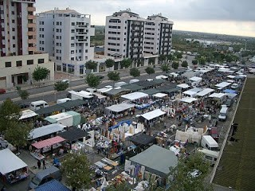

# El mercat del dilluns

Quina persona que viu a Castelló no coneix el mercat del dilluns.? Ací tot es compra i es ven. Tota mena de verdures i fruita de temporada, llavors i planters, tot tipus de roba de vestir amb la etiqueta tallada, també roba de segona mà,(és un espectacle veure com la gent regira buscant no se sap que del munto)calcer, cosmètica, atifelles de cuina, és com un gran magatzem ple de sorpreses, pareix que té vida pròpia fins i tot es pot esmorzar i prendre algun refresc. Les persones que hi van sovint, coneixen tots el secrets i maneres de fer les seues compres, o bé, més prompte, o més tard, tenen les seues parades quasi obligatòries, els cabien les peces que no els van bé, i també els guarden els models que busquen. Els venedors és clar, son uns artistes en el seu treball.

Encara que m’agrada molt veureu, vaig poques vegades, sols fax donar voltes, sempre estic al mateix lloc, cada vegada ho veia tot diferent, mai encontre el que bull, també, compro sempre massa, tot em fa goig i me’n vaig a casa carregada com si no hi hagueren més tendes per a vendre, fins i tot no ho puc evitar, els mercats ambulants tenen alguna cosa que atrau la gent.

Pensant açò vaig recordar els diferents llocs on jo havia anat a comprar anys darrere I em vaig fixar que el mercat del dilluns ha estat sempre.

Tornant darrere en el temps la data mes antiga és l’any 1800, es feia a la Plaça del Rei antiga (Plaça Nova).

L’any 1916 es trasllada al Passeig Ribalta, degut a les protestes dels veïns de dita plaça.

En els anys següents els venedors van i venen d’un lloc a l’altre.

Un altre canvi, en 1940 està vint anys en l’Horts dels Corders.

Torna al Passeig, cada vegada van més venedors, com que diuen que entre tot hom es fa malbé l’espai i la seua vegetació, amb pena dels venedor i clients se’n van de l’ombra del arbres centenaris, al formigo del carrer Padre Jofre. Al mateix lloc on els anys 50 estava el mercat d’Abastos Ací també va durar poc.

Desprès el mercat cobre vida cada dilluns al polígon de Rafalafena o Avinguda del Mar.

I ara, l’ any 2007 un altra vegada es canvia de lloc el mercat del Dilluns, a un espai cobert, modern, diuen que aixó es millor, que els temps canvien i que s’ha de mirar cap al futur.

Molts dels venedors no estan d’acord. Veuen minvats els seus interessos i perduts els drets adquirits després de tants anys. Aquest fet ha creat un conflicte entre els agrupats en l\`organitzacio “ASDEVACAS”i l’empresa adjudicatària del nou espai “REFEYME s.l ”i l’administració

Fa mes de dos-cents anys, que la gent de Castelló, complim amb el ritu d’acudir al mercat del Dilluns, a banda d’eon estigui, comprem moltes vegades coses que no necessitem, passegem, xerrem amb coneguts i amics, tenim fred en hivern, i també calor a l’estiu, ens cansem, però de tant en tant, necessitem fer-li una visita, com a un vell amic.
