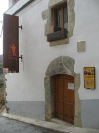
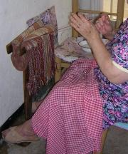
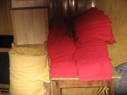

# El museu de la faixa

A raderies d’agost, dins de la setmana de festes de 2007, es va inaugurar a Cinctorres, el museu de la faixa.

*Museu de la faixa*

El museu està situat al carrer de l’hospital que dona a la Plaça Vella o del ajuntament, en l’edifici que en època medieval era hospital de pobres. Damunt de la portada de pedra, està gravada la data 1547. És una construcció amb arcades de pedra del gòtic civil, con alguna casa que es conserva d’aquella època. També es d’aquesta manera l’antic escorxador del poble que abans va ser el graner. Actualment és l’oficina de turisme i un dels llocs, on es fan, actes culturals.

Fen Cordons

Cinctorres, sempre ha sigut el poble dels faixeros. Aquest, és el nom que els deien al homes del poble que anaven venen les faixes per tota la península i nord d’Àfrica. Les faixes es teixien a les fàbriques i a casi totes les cases del poble, En la entrada hi havia l’obrador, amb el teler, el torn i el que feia falta. La dona de la casa compartia el seu temps, amb les eines de la llar i el teixir.

Caminant pels carrers, s’escotava la música, tric trac tris trac, un so compassat que feien els telers per tot el poble. També era corrent escoltar els cants de les dones teixidores, por ser, per fer la feina més agradable.

Aquesta lletra de cançó es una de les més populars.

Tota la nit canto i filo i encara no haig esmorzat.

Per això porto pinteta, i el monyo ben enroscat.

El museu està decantat a donar-li a les dones del poble teixidores la memòria i importància que es mereixen.

Es impensable deslligar a les dones del procés de fabricació de la faixa, doncs el mateix que als obradors familiars, també a les fàbriques eren les dones teixidores així com del acabament, inclòs fer els cordons que pengen com adorn.

En els obradors de les casses a més de teixir es tenia que fer també els canons i a vegades també els cordons.

## Procés i peses

**El teler,** és una ferramenta de treball, feta amb barres de fusta, que són, les que subjecten les preses. La teixidora està asseguda i fa tot el procés de teixir, amb els moviment compassats de peus i mans.

El torn,**és l’aparell necessari per ha fer els**canons**. Amb el fil del**fus**, rodant el** torn**, s’omplia el**canó,**aquest, mesura un pam i va dins de la**llançadora.

**El roll** és la matèria prima, el fil del **roll** és de les fabriques de filats. D’un **roll** es fan sis o set dotzenes de faixes d’espiga o cordó, sempre es comptem per dotzenes. Les mesures més corrents eren: 5x0´24, 6x0´28, 7x0´32, 8x0´36, 9xo´40, 10x0´44.

**Al plegador,** està enrotllat el**roll** amb el fil

**Les pintes,** en son quatre, penjades al sostre del **teler.** Per elles creua els fils del**roll** un a un, formant l’ordit del teixit.

**La llançadora** i el fil del **canó** que porta dins, amb el moviment de part a part impulsat per la mà dreta, forma la trama del teixit.

La pua,**està subjecta als costats del teler, amb la mà esquerra és fa atapeït el teixit, quan a creuat, d’un costats a l’altre el fil de la**llançadora.

La catalina,**és la barra de fusta rodona on s’enrola el teixit després d’apletat amb la**pua.

**Les calques,** també son quatre barres de fusta, i van unides amb cordes a les **pintes**.

Els moviments compassats dels peus i mans son l’art de **teixir** Es comença xafant amb el peu dret la **1ª calça**, seguit el peu esquerre amb la **4ª calça,** altra vegada el peu dret a la **2ª calça** i seguit el peu esquerre a la**3º calça,** al mateix temps la mà dreta fa passar la **llançadora,** i la mà esquerra baixa la**pua** en cada moviment dels peus, i tornar a començar un altra vegada. És com un ball, és també, l’art de Teixir.

*Paquita.*

