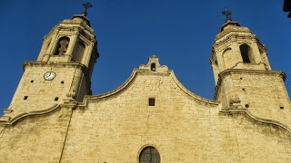

# Església de Sant Pere

Quan encara falta un bon tros per arribar a Cinctorres es veu l’església del poble. Les seues torres bessones i la cúpula de teules esmaltades de color blau, quan reflecteix el sol, pareix com un far, en mig de una mar de teulades.

L’església de Sant Pere de Cinctorres es va començar a construir el 1 d’agost de 1763 i l’acabaren 19 anys més tard, en 1782. Es va fer juntament i con la de Sant Jaume de Vilarreal, doncs el seu mestre d’obres bare ser Joan Joseph Nadal. Les dos són un bon exemple d’arquitectura Neoclásica, en aquestos moments de moda, degut a la recent creació de La Academia de San Carlos de Valencia.

L’exterior del temple es massís treballat amb pedra de maçoneria i pedres de cantera en els angles. La coberta és de doble aigua i amb teula àrab, destaca la cúpula de tambor treballada amb rajoles a vuit aigües, coberta amb teules de color blau i blanc

La façana es de pedra i l’envolta una moltura vertical que ho fa també per les torres campanar bessones. Mesura 60 m. per 25 d'ample.

El campanar de l'esquerra no te campanes com el de la dreta, en aquest, la campana tiple, és la mes menuda, amb el nom de Cristófora de 1855, amb un diàmetre de 40,5 cm. i un pes de 38 Kg. La nota fonamental és \<si\>, i la seua veu,\< tiple.\>

La popularment coneguda per la de es caritats, el seu nom és Maria Joaquina, de 1855, amb un diàmetre de 60 cm. i un pes de 125 Kg. La nota fonamental és\< re\>,i la seua veu \<soprano\>.

La mitjana coneguda con la del portal, data de 1717 amb un diàmetre de 95 cm. i un pes de 495 Kg. La nota fonamental és

\< la\>, i la seua veu \< mezzosoprano\>.

La Grossa, coneguda com Maria Gracia data de 1804 amb un diàmetre de 118 cm. i un pes de 995Kg. La dita popular diu:(Maria Gràcia me diuen, cent arroves pesso, el que no se o vulga creure que me sospeso)la nota fonamental és \<do\> sostingut, i la seua veu,\< baix\>.

Al mig de la façana, en una espadanya està la campana dels albats (dels angelets)amb un diàmetre de 32 cm. i un pes de 19 kg. La seua veu és de \<tiple\> i la data de 1799.

L’interior és de planta rectangular amb tres naus, totes de la mateixa altura, però la del centre es més ampla.

Té capelles laterals més baixes i poc fondes. En el presbiteri a cada costat una capella, la de Sant Vito i la de la Comunió i darrere de l'altar la sagristia molt espaiosa i elegant.

L’altura del temple és harmoniosa i uniforme, amb dos fileres de quatre grans pilars. Prima abans de tot l’arquitectura en general més que els adorns.

Han desaparegut peces del patrimoni artístic. Cremats el altar major els de l’Eucaristia i de Sant Vito, tots de fusta daurada i policromada del barroc en transició. Les trones de fusta treballada i la resta dels altars laterals. Així com l’orgue

El paviment ceràmic de la capella de Sant Vito foren 983 les peces col·locades es van fabricar en Las Reales Fábricas de Valencia, o sabem per una nota firmada en desembre de 1815. Hui tindrien un valor incalculable.

Es conserva les figures dels quatre evangelistes en els cantons del creuer en el tambor central, amb forma de mitja taronja. I el escut heràldic de la família Sanjoans en un lateral.

També dos pintures murals en la paret del presbiteri que eludeixen a la vida de Sant Pere atribuïts a Joaquin Oliet Cruellar (1775-18499). I un llenç d’autor desconegut de 1630.

De Francesc Cruellar (1801-1886) son els dos grans medallons que hi ha damunt de les capelles al costat de l’alta. Així com algunes peces d’orfebreria.

També trobem al costat de la capella de Sant Vito Al Peiró de Cap de Vila, segons l'inventari de 1929, conegut actualment com a peiró de la plaça Nova, es l'únic conservat dels tres peirons que s'erigien a Cinctorres. Degut a les baixes temperatures i fortes gelades de 1997, van fer que la pedra es clivellara i es desmembraran els braços de la creu, desprès de la restauració per par del Patrimoni Artístic de la Consellera es va col·locar dins de l’església on es pot apreciar tots el temes litúrgics e històrics que compon tota la creu. La descripció es d'una creu llatina gallonada i flordelisada.

Quan veig la grandiositat de l’església penso en el comerç de la llana i els seus derivats que devien donar esperances en el s.XVII de que el poble aniria creixent i fent-se mes important.

*Paquita*
