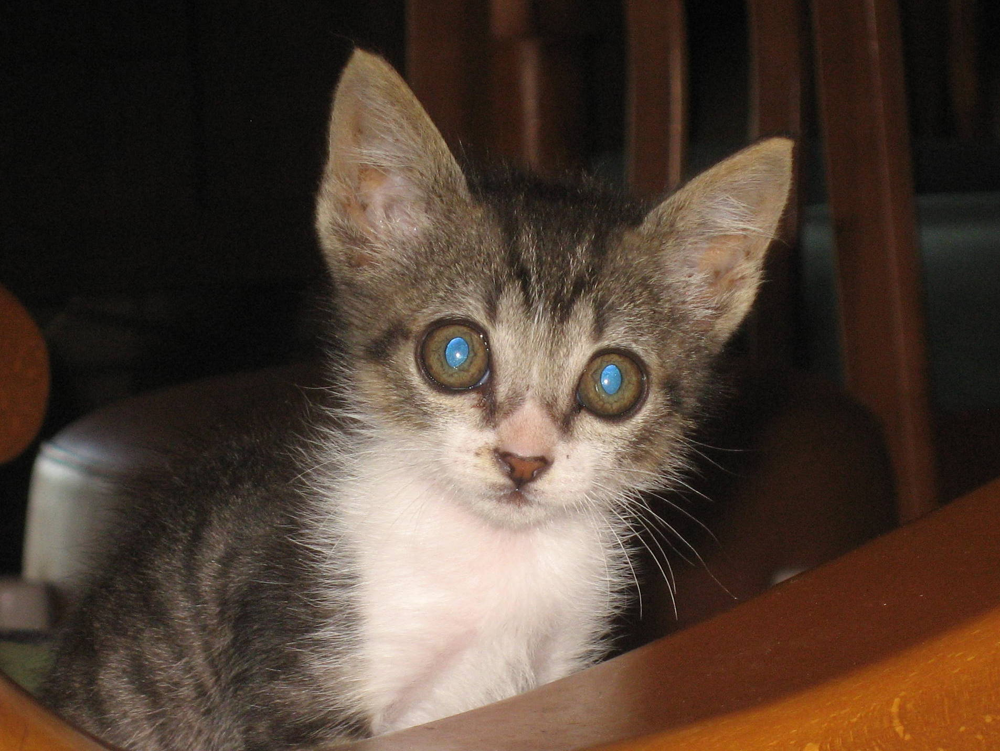

# Déu dirà

*«Quan més menuda es la nou, més soroll mou»*. Aquesta dita, la diu moltes vegades la meua ama. Però no mai sabia el que volia dir, i ara ho entenc quan hem anat, a passar un cap de setmana a Morella, fa pocs dies.

La casa de la cosina està prop de la muralla, entrant per les portes de Sant Miquel, per la part de darrere junt a la torre redona, ho sé, perquè m’agrada donar la volta a la casa rodant la muralla.

Pel matí ens anem a l’Alameda per un camí que hi ha separat del passeig, a la part de dalt, allí em llança pinyes seques, i ho passo molt bé corrent amunt i avall, fins a la vesprada que tornem a anar.

La casa, té un balcó molt gran per on es veu cap amunt, el castell, l’església i quasi tot el poble. A la part de baix de la renglera d’escales, els antics rentadors, les muntanyes i la gent que puja a peu o en cotxes al poble. Quan em quedo a soles m’agrada estar al balcó, i lladrar al gats que veig pels patis de les cases, doncs quan està la meua ama estic callat, no li agrada el soroll.

Però aquest viatge tot ha sigut al revés, a l’entrar a la casa, ja vaig notar un olor diferent, com mai, i a escoltar a la meua ama dir amb alegria... un gatet!! vaja que si! damunt, de la millor butaca, des d’on es veu el carrer i prenent el solet allí estava mirant de manera molt descarà, un gat menut, d’un color indefinit...

A la meua ama li agraden els animalets, l’acarona i el té al bracet i al gat li agrada, i es sent ronronejar.

Encara recordo a Sara, un pardal anomenat ninfa que ja estava a casa quan jo vaig arribar, tenia la cresta de color taronja i un bec corb d’aspecte amenaçador. Tots els dies sortia de la gàbia i donava una volta, li agradava ficar-se damunt del rellotge de paret que està al menjador des d’on ho vigilava tot. Quan la meua ama Paquita descansava al sofà, d’un vol es ficava damunt del seu muscle com si sols fora d’ella, jugant amb la cadena que portava al coll i li donava besets, i amagava el cap a la seua butxaca i quan es cansava, ella sola tornava a la gabia. Al principi em mirava amb curiositat i després no em feia cas, (qualsevol li deia res amb aquell bec corb)a mi em donava el mateix, però un gat!!!

Aquest, és menut, arguellat sols té ulls i orelles i a més a més tampoc té cap nom!, i l’ama m’ha dit: «*el gatet està a casa seua, el foraster eres tu, així que vorem que fas»*.

El que menys m’agrada és que roda pel meu costat, i quan jo fart d’ell, me’n vaig a un altre lloc, es fica a miolar amb totes les ganes, i al moment se sent: Listo!!! Que li has fet!!!

No sé com acabarem quan a l’estiu vindrem un dies de visita. Potser que córrega un miracle i el gat no estiga. Com diu la meua ama, Déu dirà.

*Listo*
