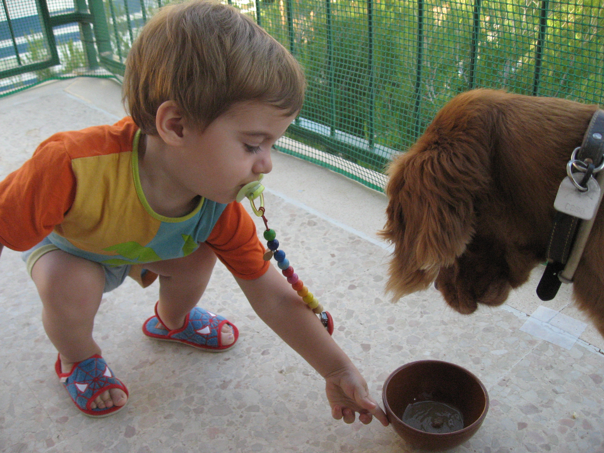
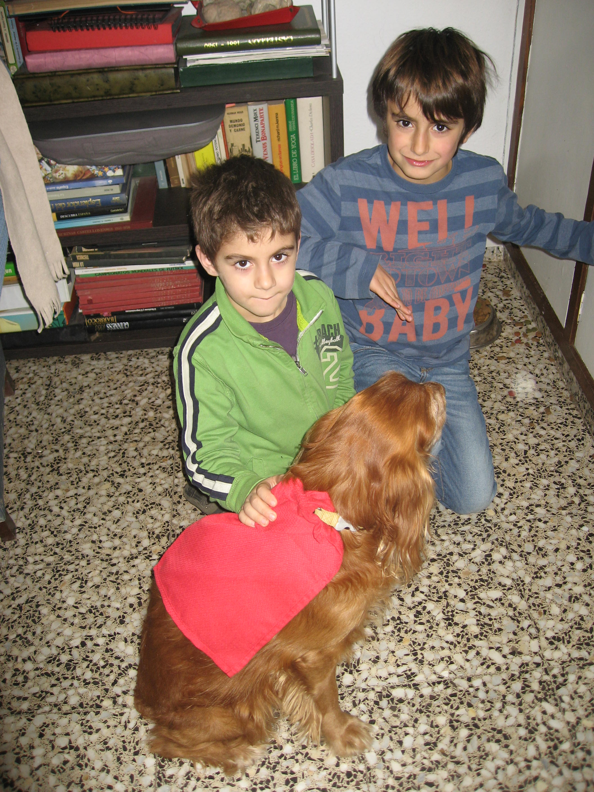
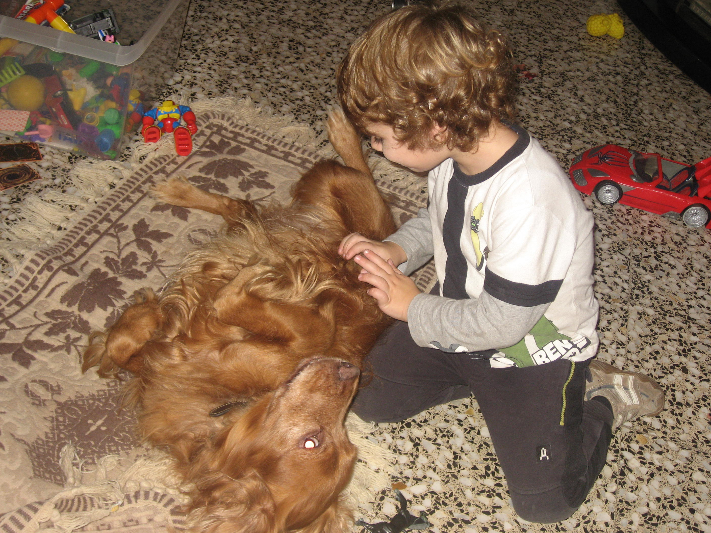

# El carreró de la Placeta

Ja estem a l’agost i el millor, la meua ama Paquita i jo hem arribat a Cinctorres, que ganes tenia!!

Tots els anys el mateix, estem a Benicassim fins que el xiquet menut compleix anys el dia dos d’agost. La meua ama vol estar ací, no de bades quasi va nàixer a l'apartament. Diu que a les dos de la vesprada la mare del xiquet encara estava a la piscina a remulla (ja se sap la calor que fa al mes d’agost) i dos hores més tard, només arribar a la maternitat, Manel va nàixer armant soroll com sempre.

L’adéu de Manel quan ens anàvem ha sigut molt emocionat, m’ha donat besets per orelles, morro i tot arreu, fins que se’n va adonar sa mare...i va dir... aixó no es fa!!, com si fóra la primera vegada!!

Però després he tingut que aguantar-me... fins que vaig començar a ganyolar un poc, i clar, la meua ama va vindre corrent a veure que passava,

Ell i el Ferran (doncs volien ficar-me dins de la seua samarreta). Primer me les va ensenyar totes i quan va aplegar a la que té el dibuix de Spiderman, va decidir que eixa era la més bonica, i em deia: T'agrada? Em vaig escapar de miracle!!

L’estiuejar està molt bé però quan hi ha xiquets al voltant i dos mesos seguits és esgotador.

Dels quatre néts de la meua ama, els majors no em fan patir gens. Joan em demostra els seu afecte d’un altra manera: m’acarona, m’abraça i juga amb mi sense atorrollar-me. Però quan s’acosta el menut, tinc que anar amb quatre ulls. L’any passat, la setmana de festes a Cinctorres, els dos menuts i més xiquets del carreró de la Placeta, no sé d’on van traure unes banyes de bou. Jugaven a bous tot els dies, a mi em tenien més que fart, no podia eixir de baix del sofà, al moment quan em veien preferien torejar-me a mi. Entre tots em marejàvem. Ehhh toro!!! Quina afició! vorem aquest any que tocarà

Aleshores estaré tranquil fins els dies de les festes en que vindrà la família uns dies amb nosaltres, però s’ha de reconèixer, que quan Manel em rasca la panxa m’agrada molt.

*Listo*
