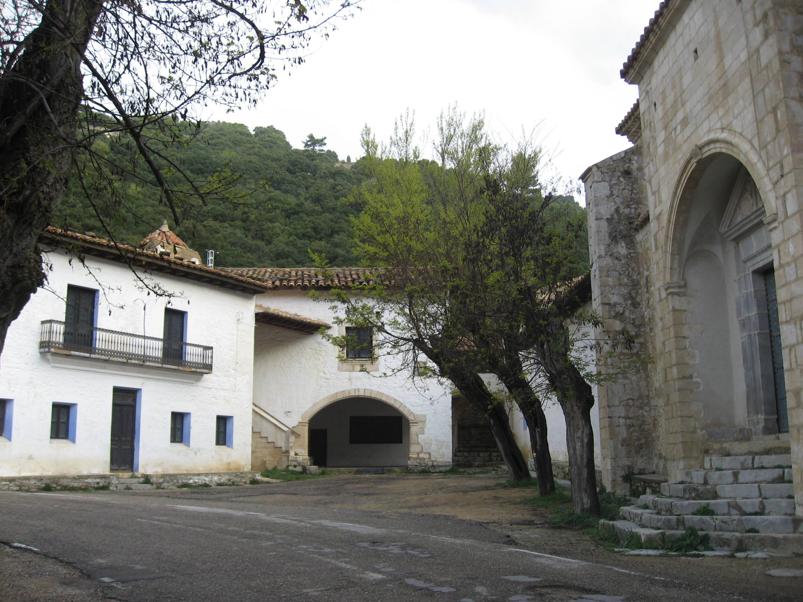
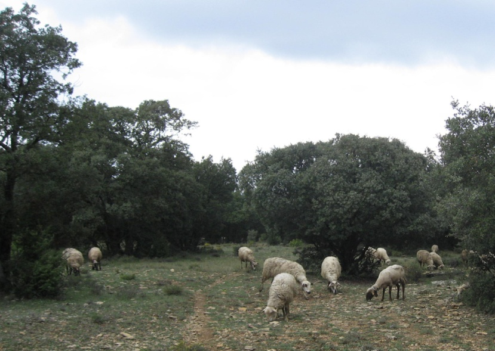
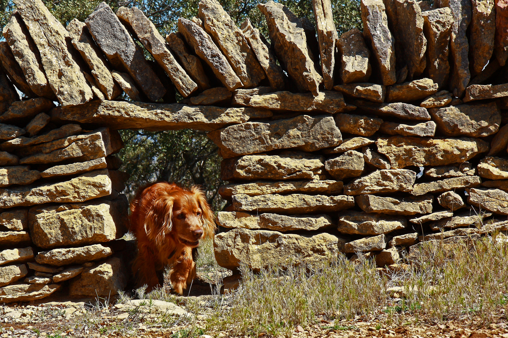

# El corderet

Sols em faltava veure això!! A les set del mati del diumenge, ens vàrem anar al poble. La meua ama volia fer fotos a l’ermita de la Mare de Déu de la Font i també al mas. Diu que és la millor època de l’any, doncs el camp està renaixent i ens vam lluir! Pel Coll d’Ares i un bon tros més, estava ple de boira, a vegades pareixia que anàvem dins dels núvols.

Fotos sí en va fer, de tant en tant, rebíem una arruixada i varem acabar tots mullats, pareixíem sopes, i plens de fang. Cada vegada que jo sortia del cotxe, l’ama em netejava les potetes, diu que l’embrutava, vaig corrent pels bancals, saltant parets i també em vaig remullar a la bassa del mas, doncs sempre l’havia vista seca i aquesta vegada hi havia aigua. Tot anava bé fins quan ja marxàvem al poble a dinar, i vàrem trobar la rabera pel bosc, pasturant sense parar l’herba fresqueta dels bancals. El pastor i els gos de guarda anava darrere, a mi no em van deixar que m’arrimarà, (amb lo divertit que seria lladrar ben fort i fer córrer al ramat) doncs els animals s’esglaiaven i a més armaven molt de soroll, amb les esquelles que porten penjades al coll.

Aleshores, el xiquet menut va dir que una ovella s’havia perdut i que estava a soles darrere. Ens vàrem aturar i jo altra vegada castigat (sense menejar-me). En un tres i no res teníem un corderet recent nascut allí mateix, davant de nosaltres, la mare el va llepar tot, i amb el morro l’espentejava, el va fer alçar-se poc a poc, arrimant-se’l a ella i es va ficar a mamar. La meua ama feia fotos sense parar, el problema va ser quan la pluja va tornar amb ganes, i vérem al pastor que estava amb la rabera, molt allunat, quasi no es veia.

La meua ama, deia que el corderet es moriria amb la pluja, i que hi havia d’avisar-li. Els altres deien que era una exagerada i que els animals per instint, saben què han de fer. Després d’una bona discussió, ja tens al germà, remugant amb el paraigües, a dir-li al pastor, (que cada vegada estava més allunat,) el que havia ocorregut, i ell sense immutar-se va contestar que ja ho sabia. Total, a la meua ama, li van dir tots enfadats, que cadascú sap de la seua faena i que aixó era una lliçó, està clar que no et pots ficar en camisa d’onze vares

Veurem si un altra vegada ho recordarem.

*Listo*
