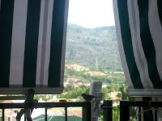

# El gran pi

Aquest estiu, tant com s’acosta la reunió de veïns de l’apartament surt el tema del gran pi del jardí.

La nostra vivenda, està a la cinquena altura, i les rames, quasi es poden tocar per la barana del balcó. Pareix, que a molts veïns es fa nosa l’arbre, i és un tema de debat.

Diu la meua ama que de tallar-lo rotundament no, doncs té el mateix temps que la finca, 35 anys, fa ombra i ja és part de l’espai del jardí.

La meua ama, quan els seus fills Juan i Manolo eren menuts els va fer una foto al costat del pi recent plantat, (un plantó que va portar un veí) Els xiquets recolzats a la fonteta que està al costat (potser per aixó l’arbre s’ha fet tant gran, doncs està regat per l’aigua que cau del xiulet quan els xiquets juguen a mullar-se), així que ha fet la mateixa foto als néts menuts, fills de Manolo, també recolzats a la font. El pi, es veu enorme al seu costat.

Com que els gossos no podem entrar al jardí on juguen els xiquets, jo, ho mirava tot assomat del balcó, lladrant molt enfadat, doncs a mi també m’agrada sortir a les fotos i a més, aquesta vegada soc perjudicat, doncs els pardalets que han fet els nius entre les seues rames, teuladins i una parella de merles, són molts descarats, sempre estan passejant pel nostre terrat com si foren els amos i damunt de la teulada ¡¡ la meua ama, els fica granets d’arròs del que em guarden a mi de la paella i molletes de pa, a vegades, també picotegen el meu menjar que tinc a la galeria de la cuina. Si per mi fora …l’arbre tallat, a més, no m’he pogut arrimar mai a marcar-lo fent un pis al seu tronc, i tinc 12 anys!! doncs, per a que serveis?

*Listo*
