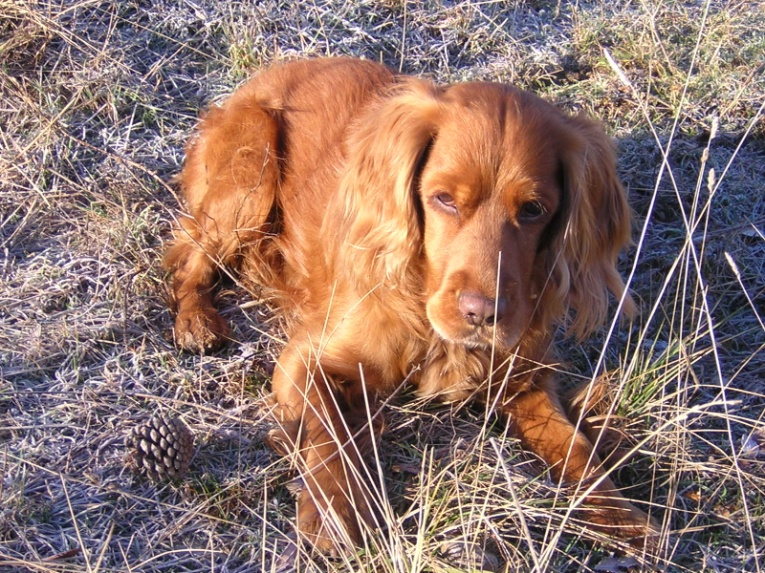
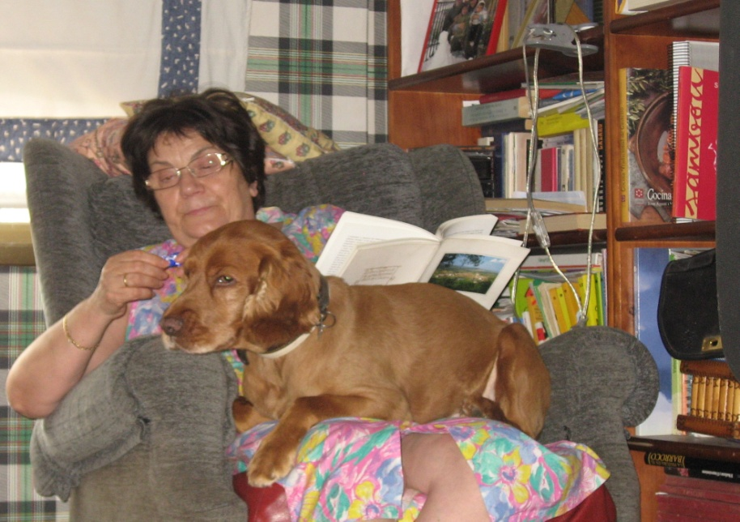

# Em diuen Listo

La meua ama Paquita diu, que quan em va portar a sa casa un dels seus fills, la vaig mirar de manera com si sabés el que ella volia dir i va pensar, -Que llest és - i així es va quedar el meu nom, soc LISTO. Tenia pocs dies, i segons ella, era el cadell de gos més bonic que havia vist mai. Ja soc adult. Tots els de casa em volen, jo a ells també.

Compartim casa nou anys, sofà i butaca, passegem junts tres vegades al dia, al poble, a la ciutat a la platja i a tots el llocs on anem.

Tenim les mateixes manies. A tots dos ens molesta el sol, ens agrada escoltar música que no faci massa soroll i veure el que passa al nostre voltant. Però a vegades no la entenc de tot. Si a mi m’agrada quan m’acaricia el cap, per què no puc (fer jo) el mateix i tinc que esperar quan fa una becadeta a la butaca, per a llepar-li les seues orelles?

Jo sé quan està contenta, i quan està malalta no em moc del seu costat, i de tan en tan li llepo les mans per a que sàpiga, que no està a soles.

Quan escriu, em pregunta què em pareix, si m’agrada moc les orelles i si no m’agrada n’estic quiet i ella ho entén. Per això penso, que podia escriure també, tot el que ella no veu, i jo sí.

Ara tecleja a l’ordinador però abans o feia asseguda a la butaca, i escrivia en llapis. Jo em gitava al seu braç, la seua llibreta recolzada al meu llom i estava quiet, a més a més deia el que escrivia parlant, tot un llibre sencer!! (el sé de memòria) i clar, m’ha apegat l’afició d’escriure, crec, que també tinc alguna cosa que dir. Penso dir-li tot el que m’agrada i el que no, i escriure ací.

*Listo, 2010*
