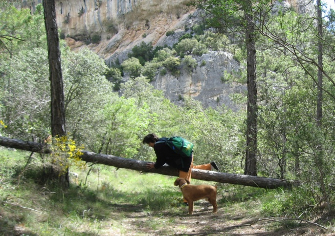
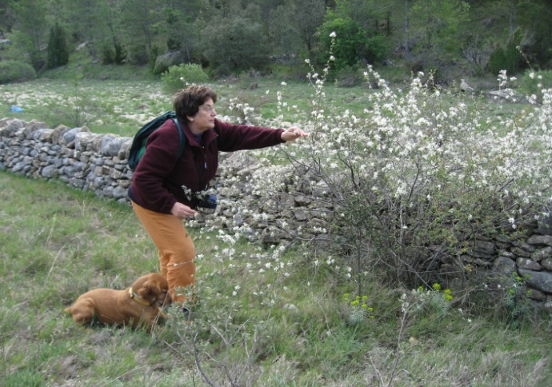
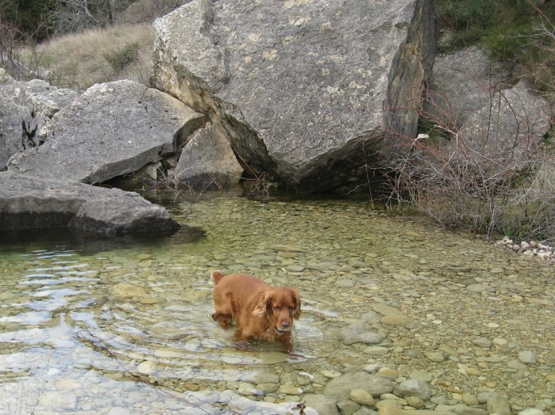
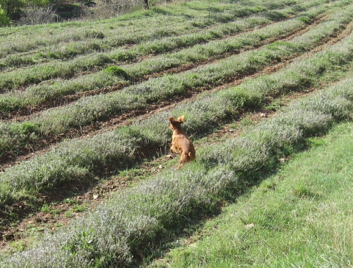

# Gràcies Listo

Gràcies Listo, per ajudar-me en aquest blog. Ens coneixíem tant, que els dos sabíem amb ironia el que pensàvem i volíem dir, això s'ha acabat. Huí és el moment de donar-te les gràcies.

Amb el anys, els nostres passejos cada vegada eren més curts.

Quan aquest estiu vàrem anar al poble com tots els anys, el primer passeig va ser a la font dels Bassis on prenies el bany dins de l’ abeurador, vas fer com sempre, mullar-te i desprès rebolcar-te per l’herba, però al dia següent, abans de baixar la costera del camí et vas parar i em vas mirar amb interrogació, a mi em va sorprendre y et vaig deixar fer, tu vas donar la volta i vàrem tornar a casa. Així va ser durant dos mesos, l’últim dia vàrem tornar fins la font i ja no volies entrar dins l’aigua.

Sempre vas saber quan ens anàvem. D’un salt pujaves al cotxe i t’acomodaves fins arribar al nostre destí, el mateix vas fer esta vegada, menejaves la cua molt content.

No sé si sabies que era l’últim viatge que fèiem junts, però quan vàrem arribar al poble a l’obrir la porta et vaig dir: Listo, hem arribat!!, tu em vas mirar en uns ulls... que no eren els teus, et vaig agafar al braç con a un xiquet i recolzat al coixí que t’agradava tant, et vas dormir, potser somiant saltant parets i fent bots pels bancals, gojant amb els meus néts, fent corregudes amb la pilota que et tiraven cada vegada més fort, i sempre les trobaves.

Pareix que volies descansar on has segut feliç, entre els pins i les carrasques, a l’ombra de la Roca Parda i al costat de la Rambla Selumbres. Et faran companyia els pardals, els esquirols, i segur que també les papallones que tu voltaves, i de tant en tant cauran damunt del teu llit les pinyes seques, i les glans madures, també escoltaràs als porcs senglar, cabres salvatges i tots els animalets que allí viuen. Al seu temps, t’envoltarà una catifa de fulles d’or, blanca neu, flors silvestres i plantes aromàtiques. Hem desfet un tros de paret per a ficar damunt del teu llit, les lloses que et guardaran sempre, les mateixes que fa un munt d’anys els meus avantpassats van carrejar pedra a pedra per a construir la paret que separa la rambla dels bancals.

Gràcies Listo. També per el que m’has cuidat, per la manera que em miraves, amb adoració, per fer-me sentir que jo era el màxim per a tu, per estimar-me tant. Listo...quanta falta em fas.

*Paquita Novembre 2014.*

