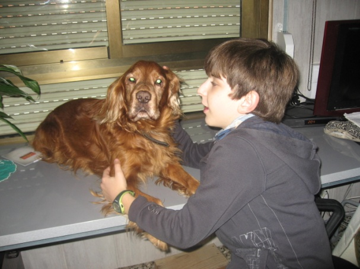

# La medicació

Quan pels matins ens anem a fer el passeig com tots els dies a la plaçà del nostre carrer, acabem gelats de fred. L’últim dia feia tant de vent, que es van trencar diverses branques dels arbres, gairebé ens cauen damunt. A la muea ama solament se li veuen els ulls de tapada que va amb un barret que s’ha comprat i la bufanda. Donem dos voltetes a la plaça, i cap a casa.

També tenim mala sort!! Per una averia greu a l’ascensor de casa nostra, hem estat uns quans dies pujant els quatre pisos a peu, tot el dia cap amunt i cap avall. Per poc no ho contem. Els dos estem baldats.

Ja tinc 12 anys, em fan mal les potes de darrere, i Paquita, m’ha portat al veterinari, li ha dit que tinc artrosis ella ja o sap, doncs m’ha ocorregut més vegades i vaig caminant coixí coixant, com que per a tot té solució, sempre em fa el mateix, uns dies de medicació quan en veu d’aquesta manera, diu, que calculant el meu pes em toca prendrem la meitat de una de les seues pastilles (ella se’n pren dos al dia ) creu que si son bones per a ella, també ho son per a mi, (de fet a mi em fan més efecte que a ella).La mitja pastilla que em dona no m’agrada gens ni mica i no la vull tragar, jo sé que la barreja amb un tros de formatge, com ho trec de la boca, cada vegada el tros de formatge que em dona és més gran y està boníssim. I clar, com que estic malet, em deixa una butaca per a mi, ficat al llit amb ella s’està molt bé,i a més estic al seu costat, i com que(*el que se da no se quita*) la butaca ja es meua i l’habitació també. Quan s’enfada amb mi em diu: vés-te’n al teu quarto!! Doncs estic poc bé!! !! I més, a les hores que els xiquets, com s'han fet grans, estan al col·legi.

Espero que la medicació dure un temps. Hi ha dies que si no té formatge, la pastilla la posa dins d’un tros de llonganissa, que també m’agrada molt.

Qui no es conforma, perque no vol.

*Listo.*
