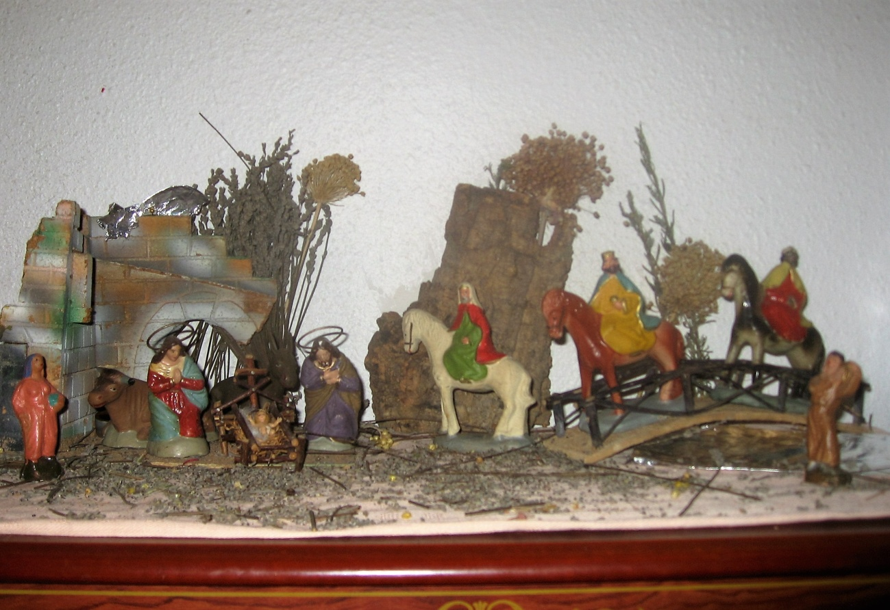
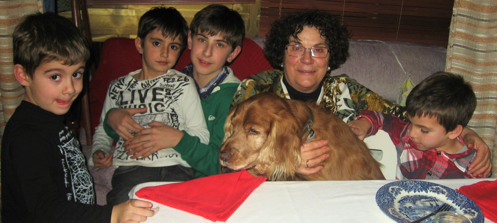
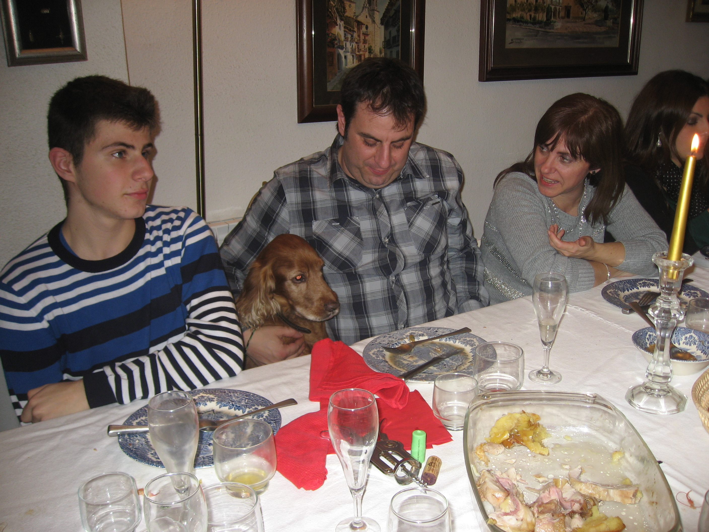
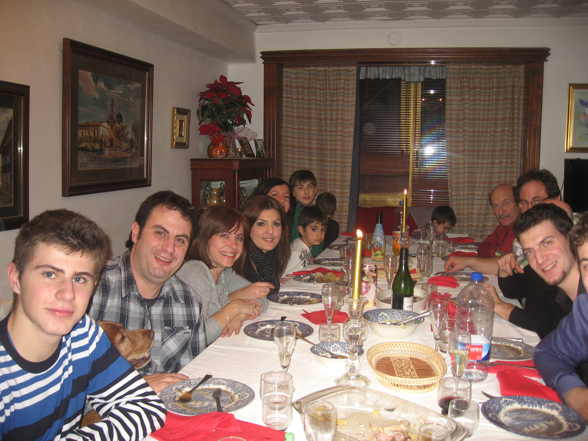

# Nit de Maitines

Quan escolto dir *«sopar de Maitines»* ja sé el que vol dir. He après el significat d’aquesta paraula. La meua ama estarà uns dies abans, preparant les pilotes de Nadal i altres coses.

Ella trau d’una caixa de cartó figuretes del Naixement de fang cuit de quan era xiqueta que s’estima molt, i les col·loca damunt d’un prestatge del moble del menjador. Ha escarmentat, doncs quan el Betlem estava tot muntat damunt d’una tauleta i arribaven els néts, era un joguet per a ells. El mateix ficaven l’estel damunt del pou, als Reis d’Orient dins del portal amb la mula i el bou, que a la Mare de Déu amb Jesuset al costat del riu de paper d’estany amb la bugadera, i Sant Josep per allí perdut. La rabera de corderets amb el pastor, on volien, així com els porcellets amb sa mare tots escampats: gallines, pollets, ànecs i tota mena d’animalets cada vegada d’una manera diferent, i tota mena de casetes i muntanyes de suro plenes de farina o sucre, el que venia bé.

Cada dia quan els néts se’n anaven a la seua casa tornava a recompondre el Naixement.

La primera festa de Nadal que recordo, va ser molt moguda. La meua ama va estar tota una vesprada trencant ametlles i cremant sucre per a fer torró com al poble. Va omplir la safata del forn plena de torró de *guirlache*, la va deixar damunt de la taula de la cuina i se’n va anar al llit. Feia una oloreta que no es podia aguantar, donant bots moltes vegades, vaig fer caure la safata i tot el torró cruixent per terra a trossos. Que cosa més bona!!! vaig estar rosegant tota la nit i me’l vaig menjar tot. Que malet estava de matí!!! Quan la meua ama em va veure, es va esglaiar, va cridar a un fill i corregudes al veterinari de Vila-real que estava de guàrdia, aquest, a més de cobrar un grapat de diners, va dir que no sé com no me’n vaig anar a l’altre barri. Degut a aquesta feta, sempre he menjat un compost especial que la meua ama diu que costa un ull de la cara (aixó no entenc que vol dir).

Com a càstig, prohibit donar-li res dolç a Listo.

La meua ama quan s’enfada es fica seria de debò, jo sé que és millor fer-li cas. Quan era cadell, estava al seu bracet i em sortien les dentetes, m’agradava mossegar-li els dits i les mans, ella deia que li feia mal… fins una vegada que em va agarrar una poteta, i em va pegar ella a mi, un mos de veritat a les molletes que tinc baix dels dits, uhhh que mal!!! em va fer ganyolar, quan ho penso encara m’esgarrifo, que mal em va fer!!! I hem va dir, t’agrada’t? Vaig aprendre la lliçó, i a les seues mans només llepadetes i amb el seu permís. També diu, que té totes les portes del pis plenes de marques dels meus arraps, i el moble del vestíbul un costat tot rosegat, (si no podia mossegar les seues mans algun lloc ho tenia que fer) va tapar el desperfecte amb cera i no sé quantes coses més, però ja se li va passar l’empipament.

Ja tenim la taula muntada amb plats, coberts i tots els aparells per a la Nit de Maitines, així es diu a Cinctorres la Nit de Nochebuena, el sofà a un racó, al voltant de la taula ple de cadires, les de casa i unes plegables que porta un germà, som 17 persones i jo, que també soc de casa. El millor de tot el que em donen d’amagat els menuts, sempre estic al seu costat i provo tot el que ells mengen. Baix de la taula tot són peus i de totes les mesures. No cap ningú més, la meua ama els diu al xics grans, que res de portar les núvies a sopar.

Aleshores fins l’any que ve. Ahhh, el torró de *guirlache* mai més l’he tastat, amb una vegada vaig tindre prou.

*Listo*
