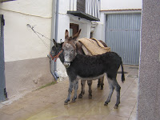
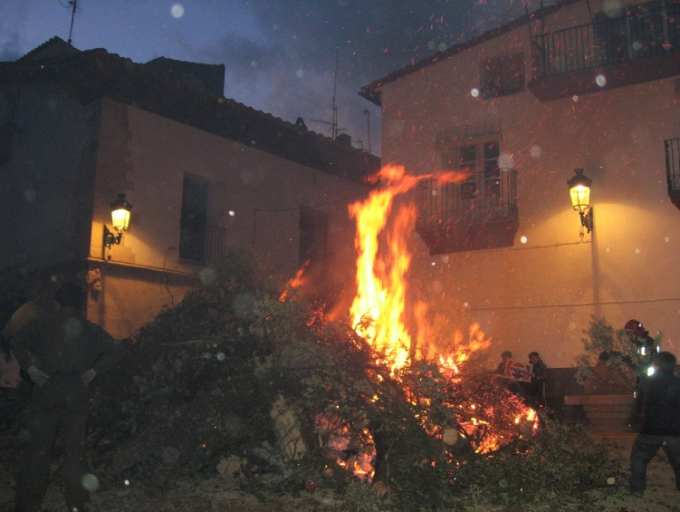
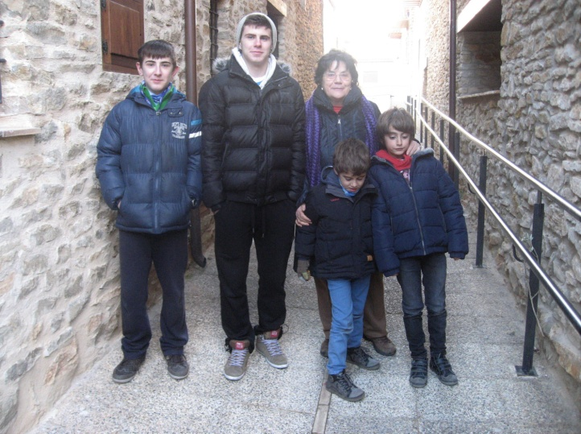

# Sant Antoni del porquet

Diuen, que Sant Antoni del porquet és l’advocat dels animals, pot ser per això, que sempre l’acompanya un gorrinet.

Serà per aquest motiu, que tots els anys, el dia de la seua festa ens anem al poble. Moltes vegades fa fred, com que es rigorós hivern... Però la meua ama y jo estem tot el matí pel carrers veient com els homes del poble construeixen la barraca i els animals de càrrega, porten les carrasques arrossegant-los per ha fer la foguera a la Plaça Vella, com és el costum.

Esta vegada, he tingut companyia al carreró, doncs a l’argolla de la casa del costat, on abans es nugava del ramal als animals, ases, burros, mulos, que hi havia a totes les cases del poble, ha estat tota la vesprada, una burreta amb la seua cria, de tant en bramava de bo, fins que li han portat un cabàs d’ordi, jo estava mirant darrere del vidre de la porta, fins que ha sigut de nit i ens em anat a la festa.

El que menys m’agrada d'aquesta festa, és anar tots el anys a rebre la benedicció del capellá. Els carrers del poble estan plens de gent que porta algun animalet, es veuen corderets, conills, gallines, pollets. Pardalets dins de les gàbies, un ratolí també dins d’una gàbia, cavalls engalanats de festa i altres preparats amb aparells, com els que portaven els traginers.

Quan es fan les deu de la nit, la plaça davant de l’església està plena de gent i molts, molts companys meus, molts gossos de totes les maneres, i quantes gossetes!!! M’agradaria saber on estan a l’estiu quan vaig pel poble, a les hores no se’n veu cap, no pots arrimar-te a elles, els seus amos, em miren de reüll, doncs si soc quasi del poble!!! El pitjor de tot es que sempre surto mullat, doncs el senyo retor, te molta afició a mullar-nos a tots amb l’aigua beneïda que porta en una caldereta i amb el l’hisop aplega a tots; i clar, com que sempre estem a primera fila... ja n’estic cansat.

Després caminar per mig poble, com una processó, els cavalls van davant, es té que anar amb conte que no et solten una guitza sols es veuen peus i potes, com et descuides un poc et xafen, fins arribar als porxos de l’ajuntament, on el majoral, dóna a cada persona que porta un animalet una coqueta de panoli, farcida de confitura de carabassa que el capellà ha beneït, i un gotet de aiguardent a qui en vol.

Aixó no esta bé!!! Si es la nostra festa; per que no ens dóna la coqueta a nosaltres?

Aquest any l’ama m’ha donat a tastar, un trosset del pastis, que bo!!!

Tornem a estar a casa... a Castelló, anirem al poble a les vacances de Pasqua uns dies, i desprès a l’estiu.

En un any, tornarà a ser Sant Antoni i la nostra festa, la dels animalets. I un altra vegada el mateix, gelat de fred, sense pastis i mullat. Listo

