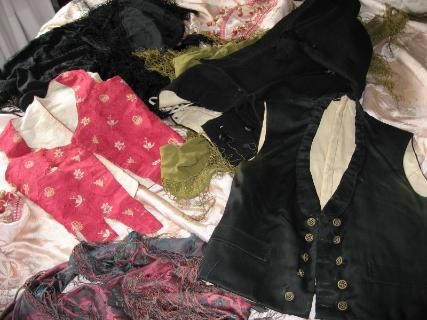

# Els meus tresors

De tant en tant faig una ullada als meus “tresors”.Són peces de roba antigues, heretades de la meua família. Les guarde, en una maleta de cuir que coneix les fronteres de mitja Europa, acompanyant en els seus viatges, al jove que anys després serà el meu marit.

Dins de dita maleta hi ha un saquet de roba ple de fulles de llorer, que cada any canvie i així s’evita que la roba s’arnés.

Guarde, el vestit de nuvi del besavi Antoni del mas, de l’any 1879, són uns saragüells negres tipus aragonès de pany de llana i el jupetí de seda, també negre, el folre és de llenç blanc, tot cosit a ma, amb dos fileres de cinc botons d’ argent.

De la família materna (de Franxo) guarde un justillo de xiqueta teixit de seda espolinada de color fresa amb petits motius florals i pardalets, de color cru amb folre blanc de llenç. Aquest justillo el vaig deixar en préstec a l’agrupació folklòrica El Millars i va estar exposat amb més vestits i complements a la Sala Bancaja Hucha l’any 2003, ells em van autentificar la data s.XVIII d’antiguitat.

Un petit mantó de seda brocada també de xiqueta de color blau i fresa.

I dos més, grans, un color “oli “com dia ma mare, i un negre brodat.

I també, un cobrellit de seda brocada.

El vestit del besavi l’han lluït els meus fills al Pregó de la Magdalena.

El justillo i mantonet eren les peses obligades per a començar el ball de plaça a Sant Pere quan jo era menuda, en les festes del poble, no recorde com era la falda.

I els dos mantons grans els portava quan era més major.

Però el cobrellit no l’ha lluït mai. Pel meu carrer no passa cap processó i no puc ficar-lo al balcó.

Per això pot ser m’agraden les festes de Castelló. És un goig veure als membres de les gaiates i gent de la festa amb els vestits típics que porten. Els diferents colors de les faldes i els brodats de manteletes davantals i gipons.

Més que res m’agrada veure la desfilada de les gaiates.L’últim any davant de mi, hi havia una jove vestida de castellonera que té molta gràcia donant la volteta i que portava un vestit preciós! amb una falda brocada de color fúcsia única! amb els tons i caiguda de roba que sols dona l’antigor, molt semblant, al teixit i color del meu cobrellit, i de sobte m’adono, que l’aguardat tant anys per això i no és necessari lluir-lo al balcó, que el seu destí, més aviat és, ser, la falda del vestit de castellonera d’una néta meua. Que tindrà molta gràcia donant la volteta, i que la lluirà, en les processons de la Magdalena.

*Paquita*

