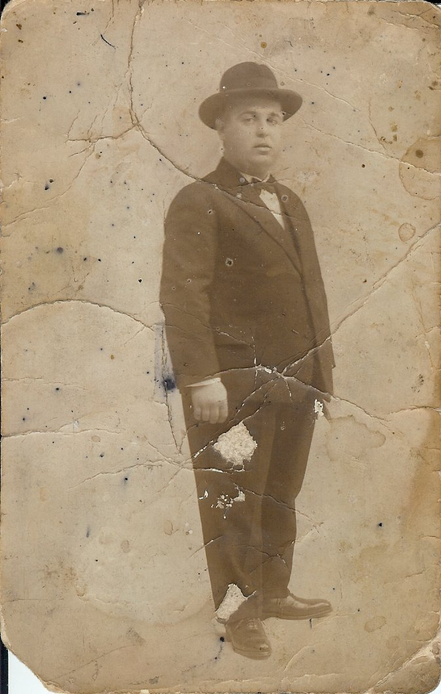
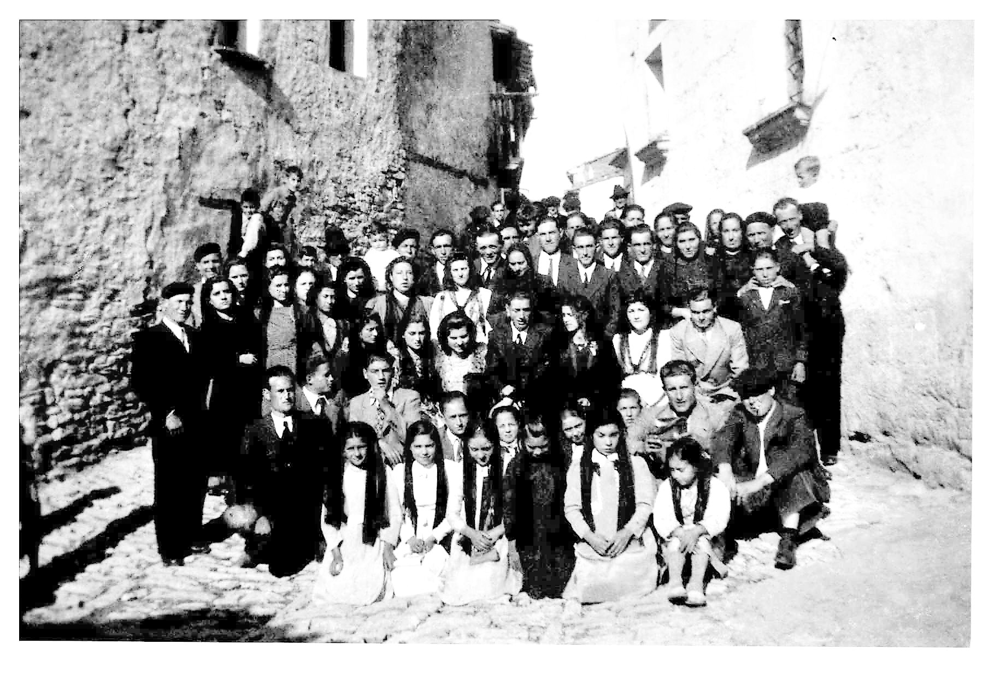
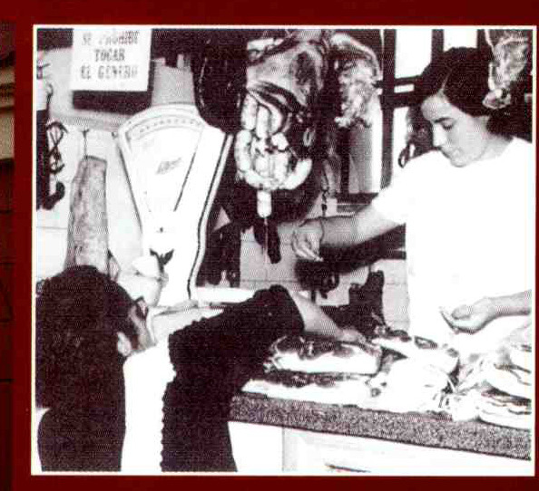

# Fotos antiguas

## Faixeros

En muchas familias de Cinctorres tienen fotografías parecidas a esta.

Su época sobre 1913. Son dos hermanos Martin y Antonio Martí Querol, el menor tiene 15 años es tío mío, recorrían con el mulo parte de Aragón y la Rioja, repostando el género fajas y alforjas en posadas de su recorrido que antes habían mandado por correo.

La faja que llevan, se ve muy voluminosa pues era el lugar donde se guardaba, la petaca, servía de caja fuerte, de abrigo y de todo lo que necesitaba.

*Paquita*

## Primera comunión

La fotografía lleva una dedicatoria de las hermanas Pilar y María Celma a mi abuelo materno Francisco Querol Antolí en su Primera Comunión, fecha 191…

Son sus sobrinas, hijas de una de sus hermanas que vivían en la Fresneda provincia de Teruel.

*Paquita*

## Manolo el Bàixo

La fecha de esta foto es 1922. Este joven era conocido como *Manolo el Bàixo*, apodo heredado de su madre *cansaladera Agedeta la Bàixa* en la calle Zaragoza. Que después regento él en distintos lugares de Castellón.

Su nombre es Manuel Padilla Calatayud, bisabuelo de mis nietos.

*Paquita*

## Danza dels llauradors

En el *Sexenni* del año 1922, mi padre Tadeo Julián Querol, participo en las fiestas dels Sexenni como miembro activo de la cofradía de labradores, tenía 8 años.

Es el primer danzante de la parte izquierda de la foto, según decían sus hermanas, mis tías, el lugar más difícil, pues era el que empezaba y dirigía los distintos pasos de la danza de caracol acompañados por la música de *dolzaina i tabal*.

*Paquita*

## Boda

No conozco a los invitados ni novios de esta boda, salvo a mis padres los dos vestidos de negro juntos en la parte izquierda de la foto, mi madre llevaba luto de su padre. Su fecha aproximada año 1940. Está hecha enfrente de la Casa Santjoans en Cinctorres. Todas las mujeres y niñas llevan puesta la mantilla, señal de que había terminado la ceremonia religiosa

Se aprecia muy bien el empedrado que había en todas las calles.

*Paquita*

## Cansaladería

La foto es del año 1966. En ella aparezco yo recién casada ayudando en el oficio de la familia de mi esposo, en activo durante tres generaciones.

El lugar es en el *Mercat de Sant Anton, i* y la clienta es una vendedora de verduras de cosecha propia llamada *Maria la Mascarosa.*

*Paquita*
