# Llibre de memòries

## PRÒLEG

Somiant amb els ulls de xiqueta el camí és gran, no es veu quan s’acaba. Els peus calçats amb les sabatetes dels diumenges o de mudar pareix que caminen damunt d’una catifa. La terra està molla, esponjosa, tot fa goig, les flors de les voreres, la melodia dels diferents pardals i les papallones volant com si juguen a amagar. Vaig brincant com en un joc, el sambori i casi ballant, és tot tan bonic!!! Poc a poc el camí va canviant, ja no sóc tant xiqueta. Hi ha alguna pedra, cada vegada més i més gran i el camí es fa estret amb còdols, roques i tot més complicat i no saps per on caminar tot el bo s’ha acabat. no es veu el final i vas seguint pensant, què fer? i continues avant. El camí, no saps com, poc a poc torne a ser més suau. Per els ribassos es veu l’herbasana amb el seu aroma i arbres que fan ombra amb fruits de diferents colors, els camps plens de cultius i cereals madurs que fan onades serjant. Este camí tan bo pareix que no mai ha d’acabar i done fruits, la familia es fa gran i en un moment s’acaba i és la soledat. Es fa tot fosc, amb núvols negres i una tempesta amb trons, llamps i la por et cau damunt, i no pots escapar, sols aguantar i seguir el camí cada vegada més dur i desesperant

Pareix que els núvols han canviat, son més blancs com de cotompel, el cel és blau i torne a sortir el sol per l’est però el camí va cap amunt i la terra esta dura quarterada i tens que seguir poc a poc més esplai i amb soledat

Este camí és com la meua vida, tot m’ha ocorregut massa prompte i a deshora. Vaig tindre una infantesa feliç però no vaig ser mai adolescent. Quan les meues amigues pensen amb festa i nuvis, jo tenia la responsabilitat de criar als meus germans. Quan em vaig casar als 20 anys, ja érem família nombrosa, era la felicitat, tots junts fills i germans, tot anava bé i tot es va acabar, viuda… massa jove, estudiant universitària amb més de 60 anys, escritora aficionada, el millor de tot es que sempre m’he sentit volguda. La vida m’ha ensenyat que hi ha moments per a tot: angoixes, dolor, pena, felicitat, alegria i també serenitat.

Sóc la més longeva de la família, ni els meus pares ni agüelos, ni el meu Joan, van arribar aquesta edat. Quan primer el pare i després la mare se’n van anar amb poc mesos de diferència els meus germans i jo ens vàrem quedar a soles, Jose Manuel tenia 3, Tadeo 10, i jo 17 anys, ells no recorden, o molt poc dels nostres pares i la vida familiar. Ha sigut dur recordar i donar testimoni d’aquests fets, a vegades, no podia seguir escrivint i ho deixava un temps, i tornava a cavil·lar… soc la memòria de la família, si no ho conto jo, qui ho farà?

## EPÍLEG

Quan vaig començar a escriure tenia 61 anys ara en tinc 81 m’és molt difícil seguir escrivint tinc problemes visuals i tampoc tinc més que contar.

Quan va neiser el meu germà Jose Manuel el pare molt content em va ficar als braços al xiquet embolicat i em va dir “mira al teu germanet, tindras que [**ajudar.li**](http://ajudar.li) a criarlo a la mare, ja sap que te poca salut,” i anys després quan la mare estava agonitzant li vaig dir “mare, sempre cuidare dels meus germans” i així ha segut, els vull com als meus fills, varen créixer tots junts fins que es van fent adults i es van casar. El meu germà menut amb 62 anys el dia 7 d’abril de 2023 també ha marxat, ara descanse com la mare i el pare al donar-li sepultura recordant les seues paraules li vaig dir: “pare, no ho ha sabut fer millor, ara esteu els tres junts”, i rumio, si tots estos fets no els compte jo, qui ho farà.

*Paquita 20 maig 2026.*

## RECORDS

Diu la meua cosina, que tinc molta memòria, sempre tenim la mateixa polèmica quan surt la conversa de quan era menuda, i dic- jo; recordo com estava amb més xiquetes menudes com jo a terra recolzada a la porta d’una pallissa a les eres, davant de casa Jaime i ella (la meua cosina deia) -la xiqueta ha perdut un pendiente- Em diu que no pot ser, que era massa menuda, l’estiu passat vaig anar a buscar la dita pallissa i si, estava, i em vaig tornar a veure en aquell lloc.

I he pensat, per que no escriure els records de la meua infantesa adolescència i la vida que he viscut, i que a vegades em pareix mentira?

Aleshores he complit 61 anys, pot ser el moment adequat de fer memòria.

## Cinctorres

La primera vegada que llegim el nom “Quinque turres” va ser a 1194, en la carta pobla de Camaron, un poble que es creu que estava situat entre Aiguaviva, La Ginebrosa i el Mas de les Mates, tres pobles situats en la actual província de Terol fen de límit en la de Castello.

El municipi de Cinctorres és part de la comarca del Ports al nord -oest de la Comunitat Valenciana. Les temperatures son fredes a l’hivern (mitjana de gener entre 3 i 4 graus) i suaus a l’estiu (29ºde mitjana al juliol i agost). a finals del segle XVIII el naturaliste Cavanilles ja es referia a “lo destemplado del clima i a les repercusiones negativas sobre la agricultura ”Cavanilles, 1895,I, 23),autors posteriors fan referencia a “la crueldad del clima “ (Mazon 1845)” i a les “terribles tormentas que arrebatan en un momento el pan de muchas familias”,i es que en un moment desfan les collites de les famílies, (Mundina 1873).

Sent alcalde de Cinctorres Pio Garcia l’any 1911 va portar la llum al poble, era necessària per a l\`indústria tèxtil i molí de gra que tenia a la plaça del cap de Vila i al seu domicili en el carrer de la Plaça n.17 L’hostal de Roc, casa Capellanets i Curanveles també van ser les primeres cases que en van tindre llum, les altres sols tenen una línea conmutada de manera que o bé estava encesa a la entrada o a la cuina. Hi havia faroles als cantons de alguns carrers que alumbren quan es feia de nit i de matí quan clareja s’apaguen, aixo es deia donar la llum i poc a poc a totes les industries que estan relacionades amb el comerç de la llana.

En l’antic escorxador, -actualment l’oficina de turisme-

també va ser un dels garners del poble on es guarda de manera comunal el gra i es comparteixen els recursos en temps de mala collita i temps d’escasets, l’edifici es estil gòtic civil, en la façana encara està l’obertura per on s’abuidaba el gra que s’almacena dins del edifici…

Els cinctorrans son bons comerciants i també bons tratans d’animals de càrrega com la familia Rovira i altres, la manera de saber l’edat dels animals ere mirar la dentadura, d’aquesta manera si tenen les peces de llet o poc gastades es la manera més segura de saber la veritat, aixo es feie des amb dues parts.

També anaven … periòdicament tot tipus de roba on son coneguts.

El cognom Querol es nombros en tot el poble, bé per part de pare com per la mare com es el meu cas.

Els subastadors,

Estos comerciants tenen un talent especial per a fer quels possibles clients escolten el que diuen, venen els productes mantes i roba del allar generalment al preu de baja en la placa dels pobles de la comarca a viva veu. Es un espectacle vore com comencen demanat un preu forman un lot de varies articles i acaben venet a menys preu, del que han demanat al comenzar i tots contents el que compra i el que fa la venta, a Cinctorres hi havia varios venedors amb bona clientela pel pobles i fires del voltant

La tenda d’ultramarins a Cintorres, que recordo quan era menuda, és casa Avelino, la de la plaça de l’església, allí es venia de tot, desde llavors del camp com ferramentes de conreu, en el pis damunt de la tenda on es pujava per una escala interior per la part de la vivenda hi havia tota clase de productes, es un basar. Quan jo acompanya a la mare o ties a comprar els regals de les bodes de les meves cosines o amics no sabia on mirar. Del sostre penjaven alguna lampara o llums de vidre, vaixelles amb dibuixos daurats i altres mes ordinaris blancs, olles de porcelana que encara en tinc alguna i tots els atifells de cuina …com m’ha dit el seu net Juan Liberto la primera tenda per l’any 1932 estava al carrer San Roc i era la del seu aguelo de nom Avelino després Liberto fill, i Juan Liberto el net.

Casa Costeta. Casa el Zurdo… Avelinet

### Percaderies

Adela.

Guillermo

Cros.

El peix el portaven desde el port de Vinaròs cobert de gel i es guardava fins la venda a les bodegues de casa dels venedors.

### Carniceries

Segundo

Hostale

Gracia de Costa

Les carniceries…

### Botiges de roba

Casa Curro

Agustina de Nacio

Manuela de Pere

Aurelia del Tin

Germans Querol

Germans Escuder

Don Manolico

Canastos

Maribel de Manero o dels bassi

Maria gracia de la Santa on viu Jaume

Antonieta de Epifanio venia llet.

### Forns de Pa

Peturra o de la Santa

Vicent Deusdat del Forn.

En totes les cases es feia el seu pa, cada casa anava al que tenia el costum, per proximitat amistat o arrels familiar.----------

El confite de Cinctorres de nom Jose ere conegut per tots el pobles del voltant, elabora torró d, armela, massapa, guirlache, confits d’ametlla i de pinyons molt bons i tot tipus de pastes que venia a la seva casa al carrer San Roc i a totes les fires, Cantabella, la Balma i a les rogatives del terme a San Cristòfol i per les denes de Morella, Els lLIvis Sant Antoni de la Vespa i mes. Muntava un mostrador amb cavallets i una fusta on es posa tots els dolços acompanyat de algun del seus fills o filles. També elaboraba a sa casa els siris i haches per a les processons amb la sera del brescam de la mel de les abelles de manera manual. La metxa dels siri i haches es de fil de cotó en trenat, la sera la compraba en blocs a un tender de Morella que vivia al costat de l’ajuntament.

Pregunta al, ajunatament

## LA MARE

De la placeta del cap de Vila, surt el carrer de les Escoles, en el nº18 està la casa del meus agüelos materns, en ella vivia també Encarna que va néixer el dia 23 de decembre de 1919 era la filla menuda de tots els germans amb sa mare Josefa Boix Querol que estava viuda de Francisco Querol Antoli.

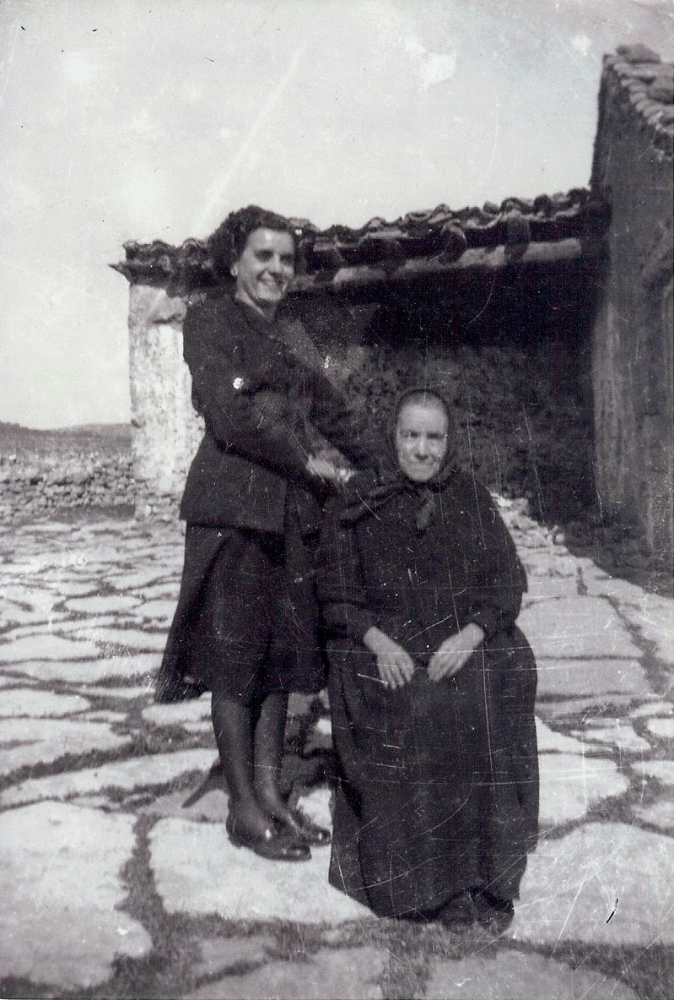

Quan van pensar en casarse Encarna i Tadeo del mas de Julian es van ficar a viure junts en l’agüela Josefa que era major i no podia estar sola. Com es el costum del poble, després de fer les amonestacions matrimonials acte que te com finalitat informar a la comunitat parroquial del pròxim casament de estos novios, i d’esta manera donen l’oportunitat a si alguna persona te algun impediment per a este matrimoni que ho puga dir en la parroquia de Sant Pere, esta lectura es fa tres diumenges seguits durant la misa i també en un escrit amb totes les dades dels novis en el cancel de la porta de la parroquia. Una vegada complit este tràmit ja de manera oficial calia anar de casa en casa on vivien els parents i amics que volen convidar a la boda, a donar un grapat de confits comprats a casa del confiter, i d’esta manera confirmar la seua assistència, a esta costum és diu (anar a donar confits) i també era la invitació per a ensenyar els regals i la casa del futur matrimoni, els mobles i aixovar.

Els meus pares es van casar el dia 24 d’agost del any 1943. Fer una boda com Déu mana en aquells anys era casi un miracle, doncs havia escasses de tot, el sucre per a fer les pastes al forn el compraven de l’estraperlo a preu d’or, la farina, els ous i animalets per a fer l’estofat de carn, tots van vindre del mas de Julian on vivía el novio, en els masos havia més menjar que al poble

El costum de les bodes fins ara no han canviat molt. El dia del casament, el novio i la seua acompanyar van agafats del braç i amb tots els seus convidats darrere a buscar la novia a sa casa. Allí al carrer estan esperant els familiars i amics de la novia i tots junts, primer la novia amb el seu acompanyat despres el novi amb la seua i detras, tots els mes arrimats de la família i els demés com en una profeso cap a l’església. Per tots els carrer per un passen els veïns i tot hom comenten, si van mudats, si son molta gent, és una bona sòria per a tots,(esta costum encara perdure) La novia, ma mare, segons les fotos portava un vestit de jorget negre en un ramell de flor blanca de roba al costat esquerre del muscle, i el novio un traje també negre camisa blanca, corbata negra i el més curiós un sombrero de mitja copa (era un masover un poc acomodat i presumit)

La germana major de la núvia Xisca era una dona molt sensata, no debades va estar de criada desde xicoteta a una casa important de Barcelona que vivien en el Passeig de Gràcia i estiuejaven en Pedralbes, quan va anar desde el poble tenia 13 anys, era la matjor de 6 germans estava acostumada a tot i que com que era molt espavilada la senyora de la casa i un altra criada major que era l’encarregada de tot li va anan ensenyar a comportarse a cuinar i a portar una casa, fins que va tornar al poble a casarse en Martí el seu novio i viure alli, i clar, sabia fer de tot. Ella va ser la cuinera i organitzadora de la boda dels meus pares. Un parent de la mare que es deia Antoniet, (ma mare va fer de passejadora seua, i es volen molt) em va dir, un estiu al poble que, encara recordava la boda dels meus pares quan menja cigrons en salsa d’ametlla, els del convit de la boda van ser els millors que va menjar mai, (era temps de fam).

### Al poble les dones no anaven al camp

Ma mare de fadrina treballava a la fàbrica de Boldo on es feien roba de treball i de faixes, i havien varies, en la posguerra vam anar obrint les poc a poc totes. Les xiques quan compleixen 14 anys i no anaven a escola, o a costura (com també es deia) començaven a treballar fent feines fàcils, primer com aprenents on en cada màquina hi havia una dona ensenyant, i poc a poc segons les seves habilitats es quedaven fent un treball o un altre.--------Les fàbriques… El primer treball que aprenien es fer canons al (torn), després a les rodetadores. Els rodetadors son bobines molt grosses que porten d’Alcoi este fil anava a les màquines (devanadores) i després les madeixes anaven a (l’ordido) l’ordi era el treball més complicat dons es nuga fil a fil del roll al teler este fill formen l’ordit del teixit i el fil dels canons dins de la llançadora que és més fi forme la trama … la fàbrica de Crispin feia majoritàriament faixes i roba de treball com sarga. En la de Industrias Laspa o de Boldo com (també es coneix) es teixia roba més variada con gabardina, viscosa, fina per a visillos i cortines. La fàbrica de Querol, es feia tot tipus de roba de treball i faixes, alforges, taleques de lona es, la de Artola el mateix, i el Tint, que ames de fer faixes repartia els rolls per les cases que tenen telers manuals a l’entrada de la casa, la dona de la casa compartia el teixir amb les eines de l´hallar.

Al Tin també pintava les faixes de diferent color que sequen als balcons molt gran i reforçats que estan a la façana de l’edifici diferent als balcons de la resta del poble.

L’art de teixir

Actualment sols queda una fabrica de faixes al poble, està a la carretera de Portell la de Clemente Querol en una nau nova, els telers son mecanics y quan el propietari que queda de quatre generacion es jubila sera el fi de la indústria de les faixes de Cinctorres el poble dels faixeros. De les antigues fàbriques sols queden l’edifici on està ubicat el restaurant el Faixero i poc més. les darreres fàbriques es van tancar els any setanta.

El museu de la faixa del poble està situat al carrer del Hospital el costat de la plaça Vella i del ajuntament a l’edifici que en època medieval era hospital de pobres. Damunt de la portada de pedra està gravada la data 1547.Es una construccio amb arcades de pedra del gòtic civil com alguna casa i edificis del poble que se conserva de aquella época. El museu de la faixa està decantat a donar-li a les dones del poble teixidores la memòria i importància que es mereixen.

Es impensable deslligar a les dones del procés de fabricació de la faixa, doncs el mateix que als obradors familiars, també a les fàbriques eren les dones les teixidores els homes eren els mecànics que mantenen en funcionament totes les màquines.

Les faixes es teixien a les fàbriques i a casi totes les cases del poble, En la entrada de la vivenda hi havia l’obrador, amb el teler, i el torn per ha fer canons. La dona de la casa compartia el seu temps, amb les eines de la llar i el teixir. en les cases que hi havia un teler tambe es feien els cordons a les faixes. La cordonera es l’aparell de fusta amb vase quadrada i dos fustes verticals unides cada una a un altra fusta horizontal que se obri i alli es fiquen dins una o dos dotzenes de faixes en els fils que pengen sense trenzar. Agarran sis o vuit fils amb les palmes de les mans i molta habilitat se torsen els fils en un nuc al final i ja estan el cordons de cada faixa fet. Caminant pels carrers, s’escotava la música, tric trac tris trac, un so compassat que feien els telers per tot el poble. També era corrent escoltar els cants de les dones teixidores, por ser, per fer la feina més agradable.

Aquesta lletra de cançó es una de les més populars.

Tota la nit canto i filo i encara no haig esmorzat.

Per això porto pinteta, i el monyo ben enroscat.

### Procés i peses

El teler, és una ferramenta de treball, feta amb barres de fusta, que són, les que subjecten les preses. La teixidora està asseguda i fa tot el procés de teixir, amb els moviment compassats de peus i mans.

El torn, és l’aparell necessari per ha fer els canons. Amb el fil del fus, rodant el torn, s’omplia el canó, aquest, mesura un pam i va dins de la llançadora.

El roll és la matèria prima, el fil del roll és de les fabriques de filats. D’un roll es fan sis o set dotzenes de faixes d’espiga o cordó, sempre es comptem per dotzenes. Les mesures més corrents eren: 5x0´24, 6x0´28, 7x0´32, 8x0´36, 9xo´40, 10x0´44 les mes grans.

Al plegador, està enrotllat el roll amb el fil

Les pintes, en son quatre, penjades al sostre del teler. Per elles creua els fils del roll un a un, formant l’ordit del teixit.

La llançadora i el fil del canó que porta dins, amb el moviment de part a part impulsat per la mà dreta, forma la trama del teixit.

La pua, està subjecta als costats del teler, amb la mà esquerra és fa atapeït el teixit, quan a creuat, d’un costats a l’altre el fil de la llançadora.

La catalina, és la barra de fusta rodona on s’enrola el teixit després d’apletat amb la pua.

Les calques, també son quatre barres de fusta, i van unides amb cordes a les pintes.

Els moviments compassats dels peus i mans son l’art de teixir Es comença xafant amb el peu dret la 1ª calça, seguit el peu esquerre amb la 4ª calça, altra vegada el peu dret a la 2ª calça i seguit el peu esquerre a la 3º calça, al mateix temps la mà dreta fa passar la llançadora, i la mà esquerra baixa la pua en cada moviment dels peus, i tornar a començar un altra vegada. És com un ball, és també, l’art de Teixir. …El fil que portaven d’Alcoi la fàbrica del Tint el distrivuia per el cases amb un roll de fil molt gran que s’acopla al teler. La filla Merce li ajudava fent canons, amb el torn, una feina molt fàcil de fer i que es necesaria, dons el fil del fus s’enrosquen als canons, estos s’acoplen dins de la llançadora i amb els moviments acompassats de peus i mans de la teixidora es forma la trama i l’ordit del teixit, era com un vall i la música el trac trac del teler.

**Els faixero**s

Els faixeros eren homes acostumats a anar pel mont i fer camí, calçats amb espardenyes minyoneres, boina, camisa, faixa i jopeti, portaven un feix de faixer nugades per una corretja pasada pel muscle penjant per l’esquena i pel pit cridant faixerooo, faijes ¡¡¡ marxaven a fer la seua ruta quant havien acabat de replegar la collita a primer d’agost i tornaven a casa per Nadal. Començaren les antigues rutes per tota Espanya desde Catalunya, tot el nord, Navarra i el Pais Vasc, Castella, Estremadura, Andalucia fins el nord d’Àfrica alguns anaven en bicicleta o en una caballería, la quantitat de producte que necessitaven per a tota la temporada l’enviaven per correu a algun hostal de poble de la seua ruta, allí tenen el magatsen i els faixeros repostaven allí quan es feia falta janero, la faixa era necessària per a la gent del cap que fan esforç per a protegir la zona lumbar, també com abric, a mes d’amagatall, entre les seues voltes i plecs portaven tot el de valor que tenen, les faixes son d’estam o de llana teixides amb espiga o cordó i de diferents mesures. Els color generalment blanques o negres. Les blanques més grans amb ratlles roges era les de l’Exèrcit Espanyol a Marroc, i també de color roig, blau i verd. Els Regulars de Ceuta les porten rotges i els de Melilla blaves.

## EL PARE Y EL MAS

Mon pare es va criar al mas de Julian, va naixer en 1915 era el quinqué de sis germans i l’únic que no va ser masover, de menut volia ser de ofici ferrer o manya, va estar d’aprenent a una ferreria de Morella que estava al costat del portal de Forcall, (jo encara la recordo eixa casa com a ferreia) amb una porta dons en el mateix carrer tenia la taverna (La casa de la Parra) la tia Maria germana del meu avi Josep del mas de Julian aquella casa tenia hasta fa uns anys una parra que cobria tota la façana en la paret del costat una font que encara està formant una plaça. Del local de la taverna al interior i al costat de la paret del carrer hi ha una escala de fusta tapada per on es pujava al pis de dalt on tenia la vivenda els tios i fills, este lloc era la parada de tots els meus familiars per part de la mare que vivien a Cinctorres quan tenen que anar a Morella per qüestions de metges dentista u algun asunt. Morella es el cap de partit i molts asuntos oficials estan alli, com el notari i tot el relacionat amb els serveis de la comarca dels Ports. Els parents cinctorrans es portaven el menjar de casa i acudeixen a la taverna de la tia Maria on no se servie menjar, sols vi i aiguardent i algun licor mes. Una de les històries familiars que no se contaba mai (jo ho vaig saber fa poc) es que devall de la escala de fusta durant la posguerra de 1936 la tia Maria tenia amagat alli …un dels seus fills, el major que per motius polític i ser del bando d’esquerres, el buscaba la guardia civil i va estar alli amagat, quan la familia del mas anava a Morella per faenes del mas o a comprar sempre feia una visita a la germana del seu pare la tia Maria i un dia molt misteriosa li va dir(Tadeo, vaig de l’escala esta amagat el teu cosí i cada vegada es més perillós, la guardia civil l’estan buscant te que marxar d’ací o el trobarà, tu com que vius al más tens una manera d’ajudar) i això va fer: Tadeo es va presentar al cuartel de la guardia civil de Morella demanant un salvaconducte de tres mesos, va dir que volia anar a Catalunya a vore com estava la faena de ferrer per si podia anar allí a treballar. Este document estava al nom de Tadeo Julian Querol, ell el va donar al seu cosi i li va dir “si te pillen ho pagarem els dos i la nostra familia, ves en molt de compte” Tadeo va tornar al mas i va estar els tres mesos sense anar a Morella i un poc amagat, la família del mas no va saber res fins molts anys després. El nostre pare no ens va dir mai res. El seu cosi Manuel va fugir a Franca, va viure molts anys a Suïssa i alli va criar a la familia, jo tinc contacte amb el seu fill Manel que viu mig any a Xile per motius de treball on es va casar i mig any a España a Catalunya, té les dos nacionalitats, quan va saber tota la història un any que ens varem vore a Morella va quedar molt sorprès, i va entendre moltes coses que son pare contaba de tant en tant, ell no va tornar mai a Morella i va morir a Suïssa molt major.

Jo anava de jove a Morella en festes i a les bodes de les meues cosines sempre dormia i estava a casa de la filla de la tia de nom Josefina i compartia habitació en Juanita la filla de la meua edat, sempre varem tindre un contacte i afecte molt gran, quan em van contar tota la història fa pocs anys de la familia de la tia Maria no queda ningú i vaig entendre el perquè ens volia a nosaltres la familia de Tadeo, a mes del afecte era agraïment…

Els joves dels masos si volen seguir sent masovers quan es casen, o bé es queden a viure al mas familiar en els pares o busquen un altre mas de lloguer, altres fills que no volen ser masovers aprenen algun ofici, si després es casaba amb una xica del poble lo normal era que viuria al poble, això va fer mon pare. L’ofici de manay era un bon treball dons en totes les cases hi havia animals de càrrega i en els masos també segons com era el mas de gran i ell estava acostumat als animals, en casa tenies dos mules i un matxo.

### LA DONA I EL MAS

Un dels records molt importants per a mi eren els dies que estaba al mas de la familia vivien on els tios i cosins El mas de Julian és un dels veintiún masos de la dena dels LLivis que esta envolta por la dena de la Vespa per la del Coll i del Moll per la dena de Muixacre i per el terme de Castellfort.

Un mas es un mon sencer, els masovers i masoveres eren i son autosuficients en tots els aspectes, saben fer de tot. El mas de Julian es de la familia Julian desde el s. XV anteriormente era un corral del mas de Català, arquitectónicamente en la part afegida la pedra és diferent, en la fasada les pedres de carreus son molt semblantsa als masos catalans.L’orientació de la façana està cap al sud i l’oest perquè així rebia tot el sol i menys aire, la part de darrere esta orientada nord est i sols té alguna xicoteta finestra per on està la sala que fan servir com a despensa.

També orientada el nord-est del edifici del mas hi ha finestres menudes sense tapar que donen ventilació als corrals del animal de càrrega i ramat, al estar construït al final de la serra Calduch sempre fa vent per esta motiu les parets que envolten al mas son altes, pareixen muralles de esta manera resguarden del fred quan trauen la rabera, o al anar a la pallissa per palla. Tot el mas es un edifici, la vivenda i la part dels corrals tenen entrades diferents al carrer però entre ells els unia un passadís. Quan es tancaven les portes per dins, de fora no es podia entrar. Tots els animals i persones queden dins. Tota la estructura es com si fos una fortaleza, menys el graner que esta adossat a un costat prop de la era i de la pallissa. En l’epoca del maquis no obrien a ningú. Tot era por. els maquis anaven en grup, igual que la guardia Civil. Estos feien alguna visita de dia preguntant si hi havia alguna novetat i els donaven de menjar els millor alimens que tenien. En aquells anys els masover estaven entre l’espasa i la paret, tot eren amenaces per les dos parts.

*La solució que es fa ficar ve ser evacuar els masos i d’esta manera controlar millor la situació. Durant el dia cada familia treballava les seues terres i per la nit acudien tots al mas que tenen assignat on se reuneixen famílies de tres o quatre masos fins que tot es va calmar…*

Totes les estances de la planta baixa, inclòs els corrals, estan empedrades en lloses grans encaixades una al costat de l’altra, lluents per el pas del segles que tanta gent han xafar. Tots els quartos i sales se’n blanquinaven en cals tots els anys. A més de netejar, es desinfectant. Per este motiu tot l’interior de la vivenda del masos es de color blanc.

El cobertis o porxo es a la entrada de l’edifici del mas al costat de la porta té un gran banc de pedra i damunt la part central d’un tronc que devia ser molt gros es el punt de descans antes de entrar a casa i si plou o neva no entre dins el fred ni la calor. També recordo que sempre ha estat allà al racó part de una prensa de vi amb peces de fusta molt grosses, el cup o dipòsit està enterrat dins del mas com si fora un pou tot de pedra i té una canal picada a terra per on el most del vi arriva fins la bodega i per ell es poden omplir els carratells directament sense tindre que fer cap trasbas, és una solució pràctica i efectiva. Tot el relacionat en la producció de vi per al consum de la casa i la verema del raïm se ha de fer rapid quan el raïm esta madur per por a les tronades que pot fer perdre tota la collita.

De la entrada del más, a ma dreta esta el passadís que va a la bodega i als corrals, i a mà esquerra hi ha una mitja arcada de pedra que comuniquen amb la cuina, i d’esta al pastador on està el forn, la pastera i una paret amb ganxos on es guarden les pales de fusta i els taulells que es fan servir per ha ficar la massa al forn. Este es moru, fet de pedres de saulo, que al calentarse no es trenquen i aguanten molt be la temperatura. L’obertura es menuda, just per a ficar la llenya de carrasca que fa bona brasa i davant de l’obertura una xemeneia o fumeral per on surt el fum al carrer. El dia que la tia Juliana tenia que pastar el dia anterior, es carrega el forn a un costat la llenya menuda i després la grossa. Dins el forn té forma còncava i quan el sostre está blanc vol dir que la temperatura es l’adequada, s’agrane per dins i a un costat queden les brasses i a la resta de forn la massa, habitualment fogasses i excepcionalment dolços.

Per l’entrada dona accés als esglaons del pis de dalt. Estos son blocs de pedra d’una peça, alguna més ampla que altra, que acaben a una sala gran d’on sortien els dormitoris i diverses instàncies separats per barandats construïts amb taulons de fusta i canyissos, units al sol i al sostre per argamasa feta meitat de sorra de riu i calç, que de tant en tant s’emblanquina. Una d’estes es la despensa o secador, que estava orientada al nord, on hi ha una xicoteta finestra que no te porta per a que hi hagi ventilació. Alli estan penjants dels cabirons els pernils i la cuixa del bou secantse. Per unes canyes també penjant estan els xoriços, botifarres seques, ossos, pates, cansalada blanca i virada de la matanza, tot salat. També estan penjats amb cordes canyissos com a estats i damunt els formatges que es sequen, que una vegada curats es destinaven a vendres al poble o per a l’ús familiar. Els plats de mostillo, raïm, codonys, rosaris de bolets secs, tomates, serves i tot el que es pot conservar. Tot en alt, d’esta manera cap animal arrive.

Quan jo era menuda a l’estiu estaba en els tios i cosins uns dies en la matança i la sega sempre me despertaba el soroll de les esquelles de la rabera que sortie del corral per anar a pastar per diferents camps, entonces me asomaba a la finestra a veure com per la muntanya de Muixacre o Monsacre de 1274 m de altura poc a poc surt el sol, primer es un resplandor, despues cambiaba de color daurat i per fi el sol lluminós que casi no el podràs mirar, ere el millor moment del dia, no mai o ha vist un espectacle tan magnífic…

Classes de mas

Els masos estan classificats tenint en compte la quantitat de animals de càrrega que tenen per a llaurar, antigament es calcula una parella d’animals de càrrega sobre 50 gornals, un jornal es l’extensió que una parella d’animals llanura al dia o 3333 metres quadrats o jornal de terra.

Un mas gran necessita tres parelles d’animals de carrega i una yegua o burro/a per a servei del mas i reproducció. De una yegua i un burro neix un matxo o una mula que nomenen **somenirs**, i de una burra i un cavall neix també una mula o mulo. El seu nom es**enato**.

Mas mitja: dos parelles d’animals de càrrega i una yegua i burra per al servei dels mas i reproducció

Mas menut: una parella d’animals de càrrega.

Maset i casa de poble: un animal de càrrega.

Tindre al más un caball o una yegua era una manera de mantenir la raça del animals de càrrega que, com els seu nom diu, eren molt necessaris per a l’agricultura y manteniment dels más. Una burra o burro feia falta per a moltes feines domèstics, com portar l’aigua de la font amb canters o per a carregar llenya del bosc quan es tenia que encendre el forn i el foc de l’allar on es cuinava. El foc sempre estava encès.

Els masovers tenen un sentit de conservació innat de tot el que han vist fer sempre, com restaurar els aparells de llaurança tornat o arreglant les solsides o despreniments de les parets de pedra en sec que, con una muralla delimiten camps i camins restaurar les teulades, llimpiar vases i fons… sobre tot per a les persones majors que creuen en elles sense discussió.

Les fases de lluna son importans la lluna **nova**o**creixent** es sinònim de créixer i prosperar. Sembrar en el signe de Tauro farà millor collita. No mai s’ha de sembrar en Escorpio.

Durant la lluna **vella**o**menguant**, s’han de tallar els arbres de fulla perenne, que son bons per a fer brasa. Per exemple el ciprés, pi, taronger, roure, carrasca. la seua fusta també és bona per ha fer mobles, instruments musicals, estàtues, aparell de llaurança. L’arbre tallat durant aquestes fases de la lluna no fan carcoma…

Aquest temps es l’adequat per a llimpiar fons i bases, perquè no es perd aigua. Llaurar en lluna **vella** aguante més temps la saó, per tant, també és un bon moment per a sembrar les patates.

Les ciències populars meteorològiques son un tema molt importants als primers dies de gener i agost. Mirant el cel, i segons la forma dels núvols, saben si plourà, si fara vent, o fred. Durant les Cabanyoles, els primer 15 dies d’agost, si hi ha humitat hi haurà mala collita. Durant les Terciàries, del 12 a 25 de desembre, si plou será bon any. En gener, el dia 25, si plou serà bona primavera. El día 25 de març si no plou vendrá sequía.

El traslado de un mas a l’altre per a lloguer sempre ha sigut el dia 3 d’abril de manera que el masover entrant pot iniciar desde un principi les eines del mas. La collita que se te que replegar l’any del canvi és propietat del masover anterior pero la palla del cereal es queda per al nou propietari.

Cada època del any té el seu sentit festiu i de tradició, com les rogatives a diferents ermites per a complir el vot dels avantpassats desde temps immemorial, estes es fan majoritàriament en abril i maig, es la epoca de l’any on hi ha menys feina al camp, hi han diferents rogatives escampades per tot el terme de diferents advocacions on tornen tots el masovers de la dena aunque actualment no visquen allí, és una manera de socializar entre tots reuninse parens i veïns que sempre es motiu de goig i satisfacció. L’hivern és el temps de poca feina i també de festa ela homens revisent aparells i xicotetes faenes que sols poden fer en esta época que el camp descanse.

La dena dels Llivis te asignar el alcaldillo com a representant dels masos de la dena en l’ajuntament de Morella. Te l’obligació de guardar l’aixovar de l’església i la seu llimpiesa. Quan es fa la festa de Sant Pere del LLivis l’ultim dissabte d’abri l després de la misa el alcaldillo i els masovers representan cada mas se reuniran per ha tratar els assunts de la dena en l’edifici de l’antiga escola, que va tancar en 1954. L’alcaldillo amb el bastó de mando es l’autoritat i l’encarregat de mitjançar en els problemes relacionats amb l’agricultura, la ramaderia i la convivència Els assistents a la missa estan convidats a pastes i moscatell a la plaça hi ha festa, soroll, xerrades amb familiars amics i veïns, al voltant de les parades de xuxeries i dolços com els que porta el confiter de Cinctorres.

Les vies de comunicacio entre els masos tambe son diferents.

Canyada: Vía pecuaria o assagador que creua varies províncies, la seua amplada es de 72,22 metres.

Cordell: Vía pecuaria que afluye de la canyada i comunique dos provincies limitrofes de amplaria 37,61 m

Vereda: Vía pecuaria que comunique varies comarques de la mateixa província de 20,89 m.

Colada: Vía pecuaria que comuniquen les diferents finques d’un terme municipal l’amplada. Es la que resulte dels antecedentes en casa cas

L’economia familiar te dos parts: la menor, o serveis de la casa, i la major.

La primera es la mare la que que administre la casa i el recursos econòmics dels ous, conills, gallines, palomes que no feien falta per al consum familiar, del producte de esta venda als comerciants que anaven cada dos setmanes o menos pel mas se abastia de oli, bacallà arròs, sucre etc al mas de Julian venia un comerciant de Cati i els diner dels ous eren per a comprar l’aixobar de les meus cosines i tambe la roba de vestir a Morella.

La segon economia, la major, es el producte integre de la venda del cereals sobrans de la collita després que es separa la quantitat per al consum propi i la dels animals que es recriava a casa com per a la sembra corresponen i pagos de contribució territorial, veterinari, cuota de metge medicaments i gastos imprevist que sempre hi han.

### EL PA

Part de la collita que es separaba per a consum propi es destina per a l’elaboració del pa. Per a fer el pa, dolços, tot tipus de receptes culinàries i altres usos, en principi es necessitava la farina, que és el producte del blat. Aquest es portava al molí de Cinctorres per a la seva transformació de gra en farina i es conservava en taleques, però la farina encara no estava prou preparada per a fer la massa. Fins que es necessitava no es refinava i es lleva el segó, així es conservava millor i no s´atapeïa.

En el cas del pa, s’havia de tamisar i s’utilitzava la pastera, o “artesa” que és com un calaix de forma específica que hi havia en totes les vivendes, i en ella s’elaborava tot el procés de preparar la massa que després de diverses operacions es convertia en el pa.

En aquest process s’utilitzen el cavallet i el sedàs. El cavallet és una peça de fusta amb forma d’hac però amb dos travessers on es recolzava el sedàs. Aquest últim és un utensili que s’omplia de farina i es movia rítmicament fins que la farina neta queia dins de la pastera i el segó quedava en el sedàs. El segó després s’usava com pinso.

Aquesta proces es feia la vespra de pastar igual que la preparació del llevat, o sigui, la mare del pa que s’ha guardat de l’última massa. Aquest xicotet tros de massa fermentada calia ablanir-lo amb aigua calenta i tornar-lo a treballar amb la farina, després es guardava tapat fins a l’endemà.

Per a preparar la massa es necessitava aigua calenta amb la sal corresponent i farina.

En la pastera estava la farina i en el centre el llevat. A poc a poc s’afegia l’aigua i s’anava treballant la massa amb molt d’esforç, donant-li voltes de dalt cap avall i colpejant-la amb força. Tot açò havia de fer-se durant una hora com a mínim.

Quan la massa estava lligada s’amuntona en una part i s’ha d’abrigar primer amb una peça de llana i després amb un llenç. Per damunt del llenç es posava una capa de segó que, a part de fer calor, a l’estona es clavillava i és el senyal que la massa està a punt per a donar la forma als pans.

Quan estaven fetes les unitats es guardaven separades pels plecs del llenç de llana i es deixen fermentar un poc més.

A l’estona si al tocar-los es marcava el rovell dels dits ja estaven a punt.

Perquè estiguessin ben cuits, a la peça rodona anomenada fogassa se li dona quatre talls i així queda en el centre un quadrat, i si era allargada un o dos talls transversals.

Per a posar-los dins del forn, que estava molt calent, es posava el pa damunt d’una peça de fusta allargada amb mànec anomenada pala o taulell. D’aquesta forma es poden anar canviant les peces de lloc o traure-les sense cremar-se.

Quan els pans ja estan cuits es guardaven dins de la pastera alineats de forma vertical i tapats.

Si hi havia prop alguna festa o celebració s’aprofita el dia de la fornà per a fer pastes i coques.

### LA MATANÇA

És quan es fan la matança dels gorrinos i del bou una festa que reunis a parents i veïns, hi ha molta feina les dones preparent tot el que es necessita, llibrells, calderos de coure per a fer les botifarres, les especies que compren al poble, son dies de ple hivern, és l’única manera de conservar la carn fent el mondongo, botifarra bolos per aprofitar tota la massa que es quede pels llibrells ficat farina i amasar donar la forma de bolo, per això el seu nom, que es coura en la caldera al final. E nbotits com llonganises, xorisos guenyes, i salar els pernils, cansalada cecina i preparar la carn de frito llom i costella que primer te que estar salada uns dies i despre fregida amb l’oli que es compra a l’Aragó i guardada dins de les guerres que fang, este menjar te que durar fins la sega i arreplegar la collita. A primers de gener es fan els famosos, bureos al mas que hi han xiques acudits en jovens elles i ells de diferents masos i de tot el terme els músics aficionats de l, acordió, guitarra i bandúrria son molt apreciats i els busquen per a tots els bureos. Un germà del meu pare el major el tio Francisco tocava el violí i anava convidat a tots els bureos, en un d’ells va conèixer a la novia, la tia Pilar, el mas on vivia estava a l’altra part del terme i després es vien cada dos setmanes per la plaça de Morella festejan.

## Repas

El meu pare Tadeo de tan en tan, anava desde Cinctorres on viviem al mas de Julian i ajuda. als germans i al seu pare ja major l’avi Josep, a la germana viuda de guerra Juliana i els seus fills menuts Brigida i Eugenio. Com el germà menut Fidel estava fent la mili, l’únic home amb edat de treballar al mas era ell Eugenio el nevot ere un xiquet, les dones feien tot el que podien, guardaven la rabera o bestià, per este motiu Tadeo ve retrasar el seu casament a Cinctorres fins que va torna a casa el germà menut Fidel i es fa càrrec del mas i de la família. Tots els germans del pare ja casats que vivien per diferents masos de la denes de Morella van acudir a la seva boda, que diuen que va ser molt bona, abundant, que es el que volia la gent. …

## Infancia

Jo vaig néixer el 31 de gener de l’any 1945; en plena postguerra i era la xiqueta menuda de totes les cases, El meu nom es Francisca.

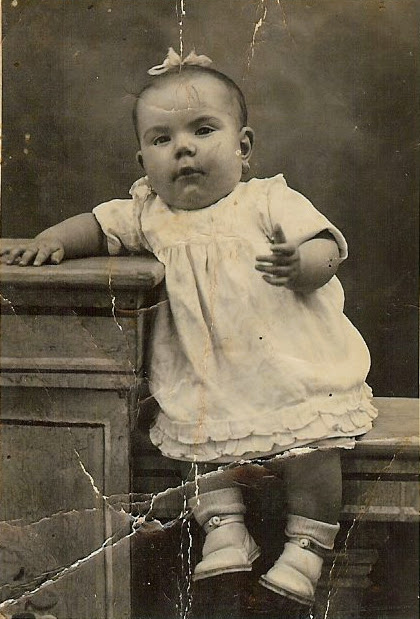

Al carreró de la Placeta, vivia la tia Xisca, la germana major de la mare, com que era la menuda de la família, la tia feia el paper d’agüela meua.

Moltes vegades hem comentaven que a la fàbrica on treballa la mare anaven molt de mati per motiu de la llum que era necessària per a moure els teler i maquines la tenien mes de nit que de dia havia temporades que entraven a les 3 de la matinada i feien torns, treballaven unes hores i si marxava l’electricitat a esperar que tornara, el temps que estaven els telers parat tenen que recuperarles.

el pare tenia la faena també prompte en la ferreria jo que era mol menuda envolta en una manta acaba dormint en la casa dels tios, també recordo que encaran quatre cadires i un matalàs de llana que tenia la tia ere el meu llit a un costat de la (saleta). Totes les cases de poble tenen la mateixa construcció una sala que té un balcó al carrer i a cada costat de la sala una o dos alcobes sense porta amb una cortina que es tancava per a dormir conservan el calor i la intimitat i de dia tot obert i així es ventilaba- En la part vaixa prop de alguna finestra estava instal·lat el teler, la canorera, el torn i la devanadora, l’escala tota d’un tram al costat i en la part fonda el corral i el pesebre ple de palla o menjar del matxo, la soll del gorrino i a un costat el comú o sanitari d’aquella època, després el tram d’escales amb porta que donava a la cuina l’allar sempre encès que a més de donar calor a l’inver tambe era un es cuinava, a be penjant les olles per les asses en els ganxos que están sujetes a la paret mes fonda del foc o be també en els ganxos de ferro de tres pates on damunt es fica les paelles i perols, que amb el caliu de les brases o la fama de la llenya menuda es mes rapida. En totes les cases es coie el caldero del gorrino, alli cavia tot, un amanera de aprofitar el temps era ficar dins a coure un grapat de pataques de retrio menudes senceres i sense pelar que después al plan xafades i un poc oli era part del sopar de la familia de nom pataques g**orrineres**, alguna col dels bancals de secà les peladures de les patates, i el que es podria aprofitar, una vegada estava tot cuit, en la vacia l la picadora de fusta a colps es mesclava tot el menjar amb un grapat de sego, els gorrinos que ja esperaven per l’hora i l’olor que despedia es feien un concert de grunyits que se entere tot el veïnat.

La cosina Mercedes la seu filla, sempre em diu:-Quan tu vas néixer, jo tenia 11 anys i vaig deixar d’anar a l’escola “que no m’agrada gens ni mica” perquè, tenía que cuidar-te, era la teua passejadora. Ens anàvem totes les xiquetes que cuidaven algun xiquet o germanet al calvari, on hi havia molta herba, us deixàvem a terra i nosaltres ens ficarem a jugar. No se sap la l´herba i terra que vareu menjar els xiquets d’aquella època, ja estaven immunitzats de tot.

¡¡Passejadora als 11 anys!!

Com en algun poble de la comarca les dones cinctorranes sempre han tingut protagonisme, treballen i porten el sou a casa a mes de administrar la llar, a la casa que hi havia un pou o cisterna era una sor sempre tenen aigua pero la potable ere a les afores del poble als Basis o als llavadors de la font d’ en Pratr o als Horts esta font i llavadors estava lluny per la carretera de Morella, rentar la roba havia de ser el diumenge de matí o quan poden.

“Font, aigua, llavadors.”

Un prolífic espai de comunicació oral. Notícies, anècdotes, maledicències, tot cap.

Envolten el poble la font del Bassi i llavadors, al costat la font més antiga del poble, na Fustera.

Els llavadors del la font d’en Prat, guaita, als que passen cap la font del Maset i font de la Verge de Gràcia.

La font dels Horts i llavadors, i la font de San Marc, que gaudeix del poble des de dalt

I al barranc de la Vila, l’aigua de la Fontanassa alimenta els seu llavador, on les dones agenollades renten la roba dels malalts i difunts. Mentres descansen fent un mosset. La roba estesa a les parets dels bancals s’eixuga, així no pesa tant, i amb el cartró de mimbre o tina de cinc plena de roba neta, recolzat amb la capçana al costat, la font del Basiet, LLucarda i Sol de Vila, les veu passar. Una parada per ha trencar l’alè i capa a casa, per les Solanetes, o per les costeretes del gemec, “ai” si els seus esglaons parlaren.

Paquita. 27-4-2026

La majoria de dones treballaven en les fàbriques del poble i quan era l’hora d’alimentar als fills, acudien totes les passejadores y portaven els xiquets a les mares a que els donen de mamar

les dones no anaven al camp, sempre han tingut molta habilitat per ha fer treballs manuals, els mateix teixien toquilles de llana fent rogle pels carrers quan feia bon temps que feien cordons i totes les feines relacionades amb el comerç de les fàbriques. Com a casi totes les cases del poble, la tia Xisca tenia un teler manual a un costat de l’entrada, i estaba teixint tot el que podia, viure dels productes del camp és difícil i el teixir era una ajuda, el mateix que els animals domèstics, el gorrino, les gallines i els conills, l’única carn que es menjaven.

El fil per teixir venie d’Alcoi la fàbrica del Tint el distrivuia per el cases amb un roll de fil molt gran que s’acopla al teler. La filla Merce li ajudava fent canons, amb el torn, una feina molt fàcil de fer i que es necesaria, dons el fil del fus s’enrosquen als canons, estos s’acoplen dins de la llançadora i amb els moviments acompassats de peus i mans de la teixidora es forma la trama i l’ordit del teixit, era com un vall, i la música el trac trac del teler.

–Mare, la xiqueta s’ha despertat i plora-.deia Merce

Amb el soroll del teler la tia no ho escoltava i seguit deia:

-Ves a veureu –

Moltes vegades no hi era veritat, Merce pujava a la saleta o habitació amb un balcó que donava al carrer, a un costat i’havia dos alcobes amb llits jo dormia en una d’ella, Merce em pegava uns quants pessics, fins que em feia plorar, m’agafava i recolzada al seu costat ens anàvem a passejar al calvari ho bé a les eres on la esperaven les altres passejadores.

Es impensable deslligar a les dones del procés de fabricació de la faixa, doncs el mateix que als obradors familiars, també a les fàbriques eren les dones teixidores així com del acabament, inclòs fer els cordons que pengen com adorn.

En els obradors de les casses a més de teixir es tenia que fer també els canons i a vegades també els cordons.

Procés i peses.

**El teler**, és una ferramenta de treball, feta amb barres de fusta, que són, les que subjecten les preses. La teixidora està asseguda i fa tot el procés de teixir, amb els moviment compassats de peus i mans.**El torn **,és l’aparell necessari per ha fer els**canons**. Amb el fil del**fus**, rodant el**torn**, s’omplia el**canó**, aquest, mesura un pam i va dins de la**llançadora**.**El roll**és la matèria prima, el fil del**roll**és de les fabriques de filats. D’un**roll**es fan sis o set dotzenes de faixes d’espiga o cordó, sempre es comptem per dotzenes. Les mesures més corrents eren: 5x0´24, 6x0´28, 7x0´32, 8x0´36, 9xo´40, 10x0´44.**Al plegador**, està enrotllat el**roll**amb el fil**Les pintes**, en son quatre, penjades al sostre del**teler**. Per elles creua els fils del**roll**un a un, formant l’ordit del teixit.**La llançadora**i el fil del**canó**que porta dins, amb el moviment de part a part impulsat per la mà dreta, forma la trama del teixit.**La pua**, està subjecta als costats del teler, amb la mà esquerra és fa atapeït el teixit, quan a creuat, d’un costats a l’altre el fil de la**llançadora**.**La catalina **,és la barra de fusta rodona on s’enrola el teixit després d’apletat amb la**pua**.**Les calques**, també son quatre barres de fusta, i van unides amb cordes a les**pintes**.

Els moviments compassats dels peus i mans son l’art de **teixir**Es comença xafant amb el peu dret la**1ª calça**, seguit el peu esquerre amb la**4ª calça**, altra vegada el peu dret a la**2ª calça**i seguit el peu esquerre a la**3º calça**, al mateix temps la mà dreta fa passar la**llançadora**, i la mà esquerra baixa la**pua** en cada moviment dels peus, i tornar a començar un altra vegada. És com un ball, és també, l’art de Teixir.

El carreró era el millor carrer del poble per a jugar, hi han 6 cases tots eren com família dons no té eixida i al bon temps es fa la vida al carrer (aleshores també.)

Recorde que vaig estar molt malalta quan vaig tindre el xarampió. La tia tot ho curava amb cataplasmes i infusions, que tenia un sabor molt amarg, però a mi m’anava bé. Degut aquesta malaltia sempre vaig tindre problemes als oïts.

I anava creixent, amb l’acompanyament de la música dels telers i dels cants de les dones teixidores que escoltaves per tots els carrers del poble.

Tota la nit canto i filo

i encara no haig almorsat

Per això porto pienteta

i el monyo ben enroscat

I dels jocs, que abans eren ben senzills, com anar a pescar culleretes al abeurador de la font, i buscar pels terrers «orelletes de moro» no sé el motiu d’aquest nom, això de moro, era molt misteriós (aleshores en diem fòssils) o fer ramells de flors silvestres que quan arribaren a casa, estaven músties.i tot el que a la nostra imaginació se li ocorria, jugava més agust amb els xics del carreró i de la Placeta per alli sols hi havia xics, jo era un mes els jocs d’amagar, al boli, a la taba que no recordo com la pintabem cada costat d’un color, al gua, amb les amiges al sambori, i a saltar la corda,

A l’estiu quan els pares i veïns estan prenent la fresca al carrer, nosaltres amb una granera cadascú, anàvem a caçar Rates Penades, per la foscor, jo corria com tots, però no vaig veure cap mai.

Quan tenia edat d’anar l’escola de pàrvuls hi érem xiquets i xiquetes, la mestra es deia Dª Carmen, el seu marit Dº Juaquin, era el mestre del xics, la seua filla es de la meua edat i sempre varem anar juntes a l’escola. Però a qui més recordo era a la mestra de la classe de les mitjanes, sols de xiques, es deia Dª Antònia, era una jove de Barcelona que vivia al poble amb els seus pares, anava pentinada amb ones i tenia els cabells negres i el que jo més mirava eren les seues mans blanques i molt fines, sempre feia olor de colònia. Tots el curs s’estudia amb un sol llibre, però coneixem tot tipus d’animals, d’arbres i plantes. El dia de Santa Catalina que era la patrona de les xiques per la vesprada el berenar que portaven de casa el feiem al calvari, allí havia moltes moreres molt dolces que menjaven sempre Els xics feien el mateix el dia de Sant Nicolau

Sabia per veureu fer, de la verema, on ajudava tota la família, grans i menuts tots eren necessaris per a collir el raïm d’on sortia el vi de trepitjar el raïm amb els peus, dels atuells necessaris com les portadores de fusta, els banastor de mimbre. De la matanza del gorrino, i totes les eines que portava, limpiar els budells necessaris per fer l’enbutit, les botifarres amb la mezcla de l’arròs bullit, ceba també bullida i picada amb mantega i la sang del animal amb les espècies corresponents, canella, clau d’olor pebre sal i poc més, de les restes de la mexcla que quedaven als llibrell de fang s’afegeix farina i amb una forma de bolo es bullia després de les botifarres, i quan estava un poc sec es frexia amb rodanxes, una manera d’aprofitament com es feia i encara es fa a totes les cases i mes en aquella època de supervivencia. i dels sopar aquesta nit del mondongo, on es cuinava i menjava fesol cuits en sal i una vegada al plat un xorret d’oli i vinagre per això es diu (de dejuni) i la prova del embotit, i clar desprès la festa i les bromes.

També del matxo del corral, aquest animal el dia que no era necessari al camps, de bon matí l’enbiaven a la Dula o parvulari dels animals de càrrega domèstics, El dulè era un funcionari de l’ajuntament encarregat de este menester, el duler de bon matí anava pels carrers fent soroll en un esquellot gran avisant que en uns moment sortia la dula desde la Placeta del cap de Vila i poc a poc els mulos o ases a soles o acompanyats pels amos acudeixen a la Placeta i desde alli com en una profeso caminaven cap al pinar o monte comú del poble on estaven pasturant i caminant tot el dia fins quan es feia cassi de nit i tornaven al poble, els animals anaven a sa casa soles o els propietaris els esperaven a la plaça aso es feia tots els dies menys els diumenges, quan arribava la dula els xiquets i xiquetes del poble que estavem jugant pel carrer era el moment de tornar a casa.

Els animalets domèstics conills i gallines, eren per al consum familiar d’aquesta manera sempre hi havia carns fresca en cas de fer falta a més dels ous.

El dia d’anar al forn en a fer el pa que durava tota la setmana em pareixia una festa, abans s’ha de preparar la farina producte del blat. aquest es portaba a moldre al moli del poble per ha la seua transformació de gra a farina i es conserva a casa en taleques.

La farina que se guardaba a les cases no estava prou preparada. Per ha fer la massa del pa primer s’havia que tamisar en el sedàs i treure el sego. esta faena es feia dins de la pastera on també es guardava després el pa cuit per al consum de la familia. El dia abans d’anar al forn s’havia de cendre la farina i treure el sego o la part vasta de la farina que se guarda en cabassos apart, dins de la pastera quede la farina neta, sols es cern la quantitat que es necessita per a fer el pa eixe dia la la resta de la farina seguis guarda dins en la taleca del forn on anava tot el poble, (es portava la massa del pa dins d’una canasta tapada en un llenç blanc a coure al forn. I havien al poble tres forns, de la Santa, de Peturra i el de Vicent aquest eren parents de la mare i sempre anava al mateix. Quan se dóna la forma del pa es feia una marca propia per que et donen una vegada cuit el teu, el pagament era segons les unitats estipulades en pa per al forner este sèncarregaba de tindre el forn a punt portaba la llena del pinar la quantitat que es donava era segons el total de la pasterada). El dia de la fornáda, el postre era un bollo d’ametlles i uns trossos tallats molt fins de codonys amb sucre.

També de la batuda a les eres amb el trill, on els xiquets rodabem i rodabem damunt d’ell i de tantes coses que la meua curiositat no acaba d’aprendre mai. Crec que aquesta etapa va ser molt enriquidora per a mi, doncs vaig tindre la sort de ser la meua, una família molt comboiant, que m’ho deixen fer tot i contesta sempre a les meues preguntes.

Tadeet

Quan va néixer el meu germanet Tadeet el dia 19 d’octubre de 1950 vivíem a la casa del mas de Julian esta casa era dels tios del mas, ells sols venien algun diumenge a fer festa, i si es fica-bem malats o per algun motiu havien de pernoctar, aquesta casa està davant de la casa Sanjoans

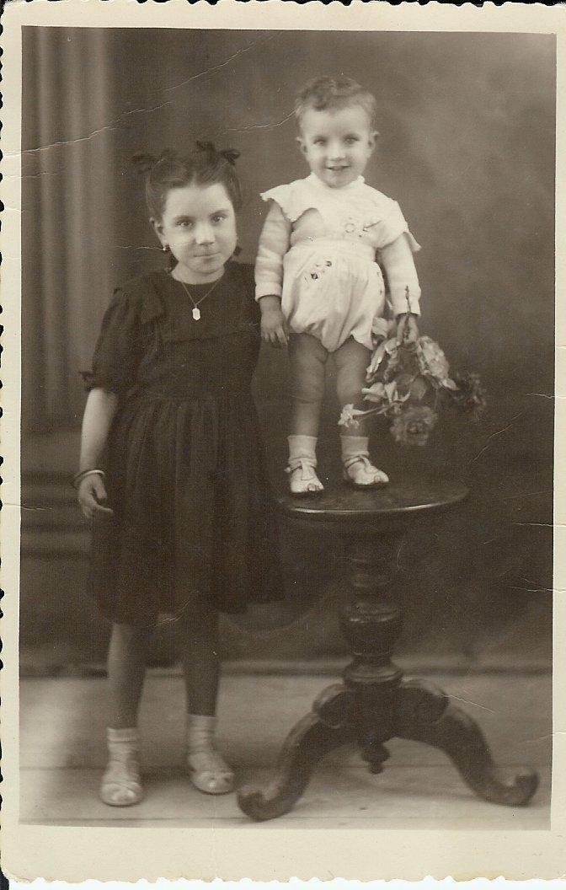

El meu germanet era roset i amb el ulls blaus com el nostre pare, pareixia un ninot de bonic com era, però feia patir a tots doncs no volia mamar. Jo vaig portar a les meues amigues Reina i Filo (les tres varem néixer el mateix dia) a que veren el xiquet, elles no tenen germans, Reina em va dir que ella tenía un, nina tan gran con Tweet el nom del xiquet i Filo va dir a ma mare si volia canviar-lo per una conilla molt gran que tenien al corral.

Al poc temps els pares varen comprar una casa més gran, prop de la ferreria. Al costat vivien la família de Rafel, amb una filla, Pilar de la mateixa edat que jo però pareix més major, tenia més picardies, no sé d’on treia tebeos i contes que llegíem a les eres que estaven prop de les nostres cases.

Sempre estàvem juntes. Aquest any vaig prendre la primera Comunió, i tot varen ser preparatius. La roba del vestit la va portar el nuvi de Merce que estava fent el servei militar a l’Africà, Ximo, a les fotos que li enviava es veia molt gran doncs era als desfiles, gastador (els que van endavant),

El meu vestit, va ser dels més bonics, era de gasa i una greca de floretes amb el fil lluent. Quan el cosí la modista (amiga de ma mare,) va ser la expectació de tota la família, jo estava cansada de tanta prova, no era gens presumida a les fotos sempre faig cara de enfadada però aquest dia tenia que ser perfecte.

Vaig anar uns quants dies amb el cabell enrotllat en uns aparells per que el dia de la festa, lluirà uns magnífics tirabuixons.

El costum era: el primer que s’apunta era qui més lluïa a l’església i a les processons, anava davant, i havia mare que estava fent torn tota la nit a la porta de l’església, jo estava per la meitat cap atras la tia que era una dona molt practica deia: «tot son tonteries, el mateix té un lloc que un altre»,tenia raó, però no m’haguera agradat gens ser la radera.

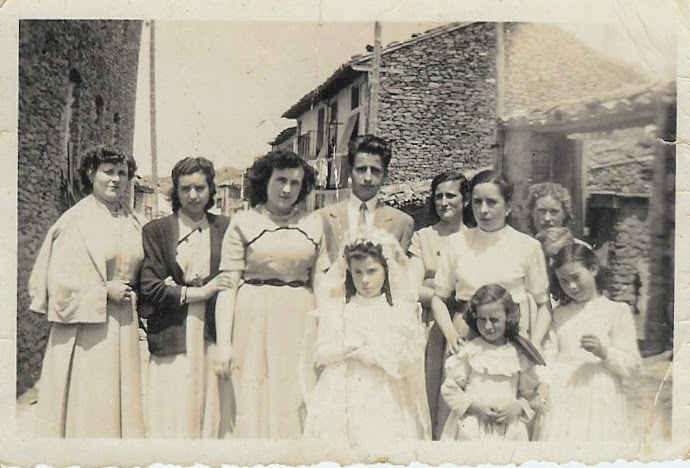

Després de la missa, calia anar pel poble i visitar a totes les cases que ho van dir a ma mare, acompanyada de totes les cosines i de la padrina, que era la filla de la segon germana de la ma mare la cosina Lourdes que també era la meua padrina de bateig. A les cases on anàvem sortia la dona, admirava el vestit em deia que havia de ser bona xiqueta i et donava uns diners com regal que la acompanyant encarregada apuntava amb una llibreta, i d’esta manera en anys següents, si calia, en cas contrari fer també al menys el mateix regal.

El dinar va ser a casa, com no cabem tots al menjador vàrem preparar la falsa blanquinada amb calç i portant fustes de casa el fuster que vivia al costat de la ferreria per a fer les taules La tia Xisca ho sabia fer tot i, ben fet, el que deia normalment tenia raó, era la cuinera oficial de la família, la vespra de la festa va estar tot el dia cuinant. Els postres a més de les coquetes i magdalenes fetes al forn, el farsit de les coquetes es la confitura que es feia a casa uns dies abans amb carbassa llarga seca que despues de rallada i ben escurrida es coia amb el mateix pes de sucre i al foc fins que es caramelizada i tambe de postre va ser la colla, de la llet de les ovelles del mas de la familia, tot un luxe en aquells temps. I el més importat, mon pare va obrir dos de les botelles de vi que quedaven, de les cinc que guardava i que va embotellar quan jo vaig néixer, i que poc a poc amb els anys es varen trencar, sempre va dir que les veurem quan la xiqueta, fera la 1ºComunió.

Ja era prou gran, i acompanyava al pare quan pujava al mas, doncs m’agradava molt estar amb la tia Juliana el tio Fidel els dos germans del meu pare i els meus cosins

Quan anàvem al más familiar sempre entràvem a la Maquina, un edifici al costat del riu Calders antigament era una fàbrica molt gran de filats l quan el diluvio de l’Estrella (te este nom perquè va ploure quaranta dies) l’any 1883 en l’aldea de l’Estrella prop de Mosquerola, el riu Montlleó va desbordar i se van produir greus corriments de terra, mitja muntanya va fer desaparèixer la mitad del poble i cassi 30 persones entre morts i desapareguts una catàstrofe molt gran, poc a poc la Estrella es va despoblar les inundacions també van arribar primer a la rambla Celumbres i despres al riu Calders que neix al terme de Morella prop del mas de Catala l’aigua per on pasaba o arrasava tot i quan va arribar a l’antinc pont gotic del riu, els arbre, pedres i tota mena basura que portava va segar i derruir el pont (ara sols queder ruines) i tambe s’en va portar tota la industria que estava al costat del riu on l’aigua era necessaria per ha la fàbricar dels filats, de la Fàbrica es va perdre tot bancals parets ho va arrasar tot. El casalissi que era les oficines és l’únic que va quedar, despres l l´edifissi se conèix com el mas de la Maquina.

Durant molts anys allí a este mas vivia la germana del pare, Rosario i família. La tía sempre estava alegre, les meves quatre cosines, quan arribem, tot era festa. Deixen de fer la feina i ens contarem tot el que havia ocorri’t desde l’última vegada que havíem estat. Totes eren roses com sa mare i el meu pare, la més menuda Rosi, pareix una nineta. Alguna vegada també entràvem al mas de Torre Marsà, allí per faena. Aquest mas està abans d’arribar al nostre, a l’altre costat dels riu Calders, allí el pare ferrava els animals de càrrega, jo mirava tot el que es feia. En un dels viatges, esperava que el pare acabare la seua feina, i em vaig adonar que del sostre de l’entrada, entre dos cabirons i en la barra de fusta d’on es pengen els porcells i el bou, quan la matança, hi havia un cabàs a mitja altura de terra i de tant en tant la dona del mas li donava una empenta, fins que vaig veure que dins hi havia un nadó dormint, i la mare el gronxava així. Ella podia fer faena i el xiquet estava guardat de tots el perills.

Quan arribem al mas de Julian els gossos avisaven, la tia Juliana ja ens estava esperant amb un got d’aigua fresca amb sucre.

En tots els masos hi han pous d’aigua potable al mas de Julian hi han un pou potable al bancal del costat del mas que es diu el de la Perera un altre que esta al costat del camí pujant de Cinctorres el pou dels Roures, també es veu sempre un saüc, este arbre està molt prop de l’edifici doncs es diu que espanta les serps. La seua flor, ampla i color entre groc i blanc, es guarde penjada al sostre i, quan està seca, amb infusió, serveix per a calmar la tos. També s’utilitza quan les dones estan de part, ficant la flor damunt de les brases dins d’un recipient adequat, que hi ha en tots els masos, on les parturientes es senten damunt. El vaos dilaten i ajuden al part.

Al temps de la caça el pare anava a soles al mas i desprès quan tornava al poble, ho feia caçant, antes hi havia poca gent que tinguera escopeta, i molta caça. La mare tenia uns gerros de fang, amb l’adob de la carn. En un hi havia conill, en l’altre perdius i un altre amb llebre. Aquesta darrera no ens agradava gens.

I a la falsa de casa del poble el pare tenia en una caixa o arco de fusta on va fer uns forats per a que poguera respirar l’animalet que hi havia dins, era una fura que s’enduia a caçar. Com que no estava permès, quan anava al camp, la ficava dins d’un aparell de llanda que ell es va fer a la ferreria subjectat amb una corretja a la cintura i així no es veia. A mi sempre m’han agradat els animals, i estava al meu càrrec donar-li de menjar llet amb sopes de pa. Jugava amb l’animalet, tenia el pèl molt suau, fins i un dia em va pegar un mos a l’orella i el pare em va dir que ja hi havia prou, no em deixava tocar-la mai més.

Aquests anys els recordo com érem: una família feliç sense cap problema, gaudíem de les festes amb els amics, entre tots hi érem un munt de xiquets. Quan feia calor anàvem al pont vell del riu Calders on pasàvem el dia i preníem el bany a un toll, o bé a la nostra finca prop del mas de en Costa, baix dels pins.

Els meus rocorts del pon Vell en un sencill poema meu diu:

*Pon Vell. lloc de berenars i de vanys, on les aigues del Calders han acollit generacions de cinctorrans menuts i grans que, a l’ombra dels teus oms, varem xapotejar als teus tolls.*

*Les teus runes, cada vegada, mes minvats, testimonien les tronades i riuades que venen de llunt, anys i anys, i es cobren el dret de pas, arrossegant tot allò que troben cap a l’oblit, arbres, bancals, collites, cudols i records.*

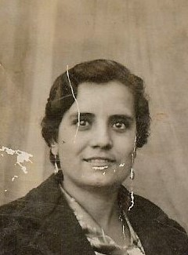

Altres vegades anàvem al mas de Cardona, on vivien el tio Ramonet i la tia Filo amb les meues cosines. Els tios eren els padrins de bateig del meu germanet Tadeet. I també, al tornar la visita obligada a la Màquina doncs passàvem per endavant del mas.

La mare

La mare era una dona de poble, espigada, morena molt hermosa amb una elegància natural com la tia Quica i també el seus germà ns Valenti i Antonio, els demés germans no eren així. Tenia uns immensos ulls negres, quan estava contenta li sortien com estrelletes d’ells, els cabells negres amb ones quan el pentinava cap a darrere.

Ningún fill ni nets, hem heretat el seu estil, ni els seus ulls amb les estrelletes que jo sempre veia.

Li agradava llegir, “això sí ho hem heretat els tres fills”. Va ser la menuda de set germans, i l’única que va anar a un col·legi de pago, a les monges del poble (tinc un retrato antic de tot el grup d’alumnes i la mare era menuda i primeta, sols se li veien ulls i les trenes) els seus pares sempre varen viure amb ella, fins que van faltar. A mi em va ficar Francisca amb memòria de son pare Francisco (l’agüelo Franxo).

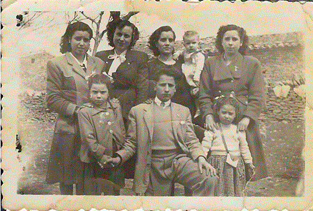

Anys darrere, el pare que la volia molt, quan ja estava malalta em deia ensenyant-me un bitllet de cent pessetes, on es veia la pintura d’una dona morena(La fuensanta)que va pintar Julio Romero de Torres. “Així era ta mare quan era jove, la dona més guapa del poble”.

El pare era un masover presumi. Anava al poble a festejar a ma mare damunt d’un cavall, al trot, i amb un mocador de seda blanc al coll.

Jo el recordo amb pocs cabells, amb la boina ficada coquetamente de costadet. Tenia els ulls blaus com la meitat dels germans i el seu pare l’agüelo Josep, i molta habilitat per fer tot tipus de feines, molt creatiu. Era un home familiar i molt sociable amb tots.

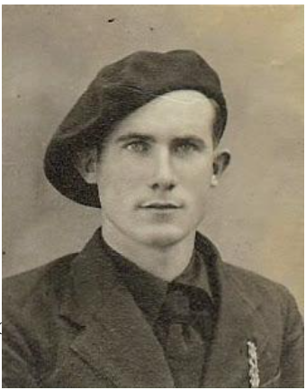

La ferreria on treballava el pare estava prop de casa nostra, sols hi havia que creuar l’era i la carretera, tenia el nom del seu soci casa Granero allí es reunien a vegades, els veïns que tenen ganes de xerrar, quan es feia tard a la vesprada i poca faena com ara el metge l’apotecari i fins i tot el senyor retor.

El treball de manya ames d’habilitat necessita força muscular per a moldejar a cop de martell al ferro i donar-li la forma adecuada, está ferramenta es diferent de altres martells com poden ser el de fuster, el de manya es peculiar, te forma de maza amb un mànec rodó i fort, el cap de ferro per una part es una bola allargada i l’altra es cuadrada, segons com es vol moldejar els cops son d’una part o d’ altra per això la peça de ferro té que esta al roig viu per el foc de la fraga i subjecta per unes estenalles amb la mà esquerra fa rodar el ferro en l’enclusa fins donar-li la forma que calia i en la dreta utiliza el martell. El pare el mateix arreglava una ferramenta agrícola trencada que feia una reixa per alguna finestra, com un balcó amb els adorns que la seua imaginació volia fer i em deia “no t’acostes que et cremarà alguna espurna”. jo el recordo amb un davantal de cuir llarg i amb la cara sempre mascarada per el carbó i el foc de la fragua.

També m’agrada tot el procés de ferrar els animals que consisteix en ajusta les ferradures a la pota de cada animal. En una paret penjades en ganxos ho havia tot tipus de ferradures adequades, normalment son planes pero si son per als animals que treballen en fang com les erugues tenen una menuda alçada per detras si es un ase, i també el mulo son de forma ovalada per tindre les potes mes estretes i la part delantera i trasera tambe son diferents, els cavalls i eugues tenen els cascos mes amples per tant son mes rodones, els proces es lavorios, hi ha que limpiar la pota llevant la ferradura vella o trencada limpian la pesunya de les parts mortes i calçar la nova, els claus tenen el cap de forma triangular i de punta estos es claven desde el vuit de la pesunya cap a fora i se llamen si sobre. De tant en tant el ferrer done xicotets palmades al animal i el tranquilitzava.

Actualment encara es veuen les argolles que hi han en la paret de l’antiga ferreria.

Una vegada que jo estava per allí, varen portar un cotxe per a que arreglen, algun desperfecte (fa poc de temps he sabut que era un vehicle amb el motor Chevrolet i fet de diferents peces segons m’ha dit el que era el seu propietari Manuel, home del poble que vivia fora pero estiuejaven allí). Era un vehicle de ferro, les portes de fusta molt fina i lluenta, amb seients de forma quadrat, vare ser l’admiració de tots els que estaven allí, i vaig escoltar que es deia una Rubia. Aquest va ser el primer cotxe de veritat que vaig veure, a més del camió de Costeta en el que a vegades anem o venim de Morella, damunt de la caixa entre la mercaderia.

Casa la Parra.

Sempre que anàvem a Morella, la visita obligatoria era a la casa la Parra. Este nom ere el de la taverna de la tia Maria, que estava al costat de la porta de Forcall. Ella era l’única germana de l’abuelo del màs, Josep. Recordo que la tia una dona menuda i molt viva sempre estava allí. Al meu pare el volia molt.

Per a ella la nostra arribada era una alegria auténtica. Anys després vaig saber el motiu quan li vaig comentar al tio Agustí que notava que sempre som ben rebuts i el tio va dir “tenia els seus motius, ton pare va salvar la vida al seu fill esposant la d’ell”

I em va contar:La tia Maria vivia a la casa que va heretar dels seus pares a Morella, tenia una filla i tres fills. Quan la postguerra, tots el fills van ser detinguts per motius polítics. El fill menut, Manolo, era amic del meu pare Tenien la mateixa edad. Com sempre quan anava a Morella, anava a vore a la tia Maria, en una d’aquelles vegades molt seriosa li va dir que era important que parlaren. El motiu: el seu fill Manolo s’havia escapat del camp de concentració on estava i estava amagat a la taverna vaig de l’escala de fusta que hi ha al entrar a vista de tots, entre el primer i terce esglaó tapat i reforçat amb fusta com avia estat sempre, un espais menut d’on sols sortia quan estaven a soles, la Guardia Civil havia estat per allí buscan.lo i més tard o prompte el trobarien i serie el final. Li va demanar ajuda, alli no estava segur i si anava al mas tampoc, i serie un problema per a tota la família.

Tadeo feia poc que va tornar al mas, va passar tota la guerra per Andalucia al front i després, al acabar, per ser del bando republicà el van obligar a fer la mili. Li va tocar a Àfrica, a l’Arache. Entre tot va estar fora de casa més de quatre anys. El pare volia ajudar al seu cosi, no va dir res al seu pare el meu aguelo i es va presentar al cuartel de la Guardia Civil de Morella demanant un salvoconducto dient que volia anar avore com estave a Catalunya la faena de manyà. Als pobles tothom es coneix i la gent del mas de Calduc eren seriosos, li van donar el document que va demanar vàlid per a 3 mesos.

Este document al seu nom, Tadeo Julian Querol li va donar al seu cosí Manolo dientli “si t’agarren a tu, ho pagarem els dos i les nostres famílies”. Es van abraçar i es va anar dient que açò no se parlaria mai. Tadeo va marxar al más i va passar tres mesos sense veure a ningú de fora de casa. Se suposava que estava a Catalunya, ni les tres germanes que van tornar al mas dos vidues amb tres fills orfes ni la que era fadrina ni a sa mare es va dir mai res. Amb l’ajuda de les germanes van treballar les terres i aguantar el més difícil de la posguerra fins que va tornar el germà menut Fidel que feia el servei militar a Cadis i quan hi havia un home a casa se va casar amb la mare.

En el anys, la tia María va dir que el seu fill va arribar a França i que estava bé. No es va sabre res més fins molts anys després, quan tot havia passat.

Jo ho vaig saber a l’any 2006 quan estava escrivint el llibre dels masos de Morella. De la meua familia ja no quedave ningú d’aquella època.l’unic el tio Agusti. Va ser un secret que van guardar tots.

Andorra

Al temps vaig notar que els meus pares a vegades parlaven molt seriosament, jo escoltava el que el pare deia, la mare ja no treballava a la fàbrica com quasi totes les dones del poble, tenia problemes respiratoris de tant anys d’inhalar la borra dels filats.

-Si ens hem d’anar té que ser prompte, ja tinc 38 anys i cada vegada hi ha menys animals de càrrega i poc a poc vindran els cotxes i aquesta faena s’acabarà.

Al poc temps mon pare se’n va anar a treballar com manyà a la conca minera d’Alloza al Baix Aragó i nosaltres ens varem quedar al poble fins que puguem reunir-nos.

Quan feia 3 mesos que estem a casa soles, varem rebre una carta en la que el pare ens deia molt content que ja teníem vivenda i que aleshores venia a buscar-nos. Tot eren preparatius enpaquetant coses, roba i tot el de casa I amb un camió, clar, el que hi havia al poble, el mateix que valia per a tot, fins anar de festa i tos el menesters necessaris(el de Costeta) un home molt amic de casa, ple del nostres mobles i tota la família damunt ens varem anar al nostre nou destí. La família del poble estava trista i nosaltres també, sempre estaven tots junts i sabem que ens trobar a faltar. Pareix que ens anaven a la fi del mon.

31 gener 2007

## 2ª part

Abans d’aplegar al nostre nou domicili vàrem seguir un bon tros per la vorera del riu Bergantes allí encaixada entre les roques a ma esquerra estava La Balma, i més avant ja estaven a L’Aragó el primer poble Aiguaviva, Mas de les Mates on el riu que al nostre poble es Calders quan surt del Forcall te el nom de Bergantes, s’unís al Guadalopiño, afluent del Guadalope i més tard a l’Ebre, (açò ens deia el pare molt content d’estar tots junts) i desprès als pocs Km ja vàrem notar una olor diferent com un poc picant. Nosaltres estàvem habituats a un altre tipus d’olor, de camp i d’animals, que abans estaven als corrals de les cases.

La primera impressió va ser de veure un poble en una planícia, recolzat al vessant d’una muntanya i damunt d’aquesta una ermita, Sant Macario (del patró del poble.)I al costat d’aquest poble Andorra un grup d’edificis i carrers nous. Cap ell ens varen anar i quan el pare ens va ensenyar molt orgullós el nostre carrer, vàrem veure, que hi havia més gent com nosaltres instal·lant-se de nou.

Aquest lloc es deia el Poblado, i era on vivien tots els empleats de la Empresa Nacional Calvo Sotelo.on se treballava l’extracció de carbó mineral en varies mines de lignit, dins de la conca minera de Utrillas-Escatron. Aquest carbó l’enviem per la via ferrea de Ojos Negros als Altos Hornos del Mediterraneo, Sagunt.

Tots els carrers del Poblado eren amples, llargs i tenien nom de pobles de la conca minera de Utrillas, els nostre es deia carrer de Gargallo, amb una cera ampla al mig i arbres recient plantats, les cases als dos costats, per la part de darrere estaven els patis de l’altre carrer, les cases en grups de sis, (el mateix que aleshores els adossats moderns) Nosaltres teníem un cantoner, amb el nº39 i el pati era més gran, la vivenda era una planta baixa amb tres dormitoris, menjador- cuina, bany amb dutxa i tota l’aigua calenta que volgués, sols hi havia que obrir el l’eijeta, això era un luxe, quan la mare estava acostumada a portar l’aigua amb cànters de la font, allunat del poble per a el consum familiar, i anar a rentar la roba a els llavadors. Prompte vam fan fer un galliner al pati i també una conillera, plantar una parra a cada costat de la porta, un jardí voltant tota la construcció i un passadís d’obra per no entrar terra a la vivenda, a més d’un arbre que ja estava plantat, que feia un fruït riquíssim que no vàrem saber mai com es deia((aleshores ho sé, nectarina) i un hermós hort d’hortalisses que regàrem quan feia falta, un luxe per nosaltres, doncs al nostre poble a mes del clima dur hi havia poca aigua per a tot. També hi havia feta una carbonera, cada mes venia un camió pels carrers i portava uns quants sacs de carbó per el consum de totes les cases de manera gratuïta. Prompte em vaig fixar que quan marxaven els carboners ens agafaven la fruita de l’arbre i sempre estaven pel jardí vigilant que no fóra així.

Com sempre, jo era l’encarregada de cuidar del animalets de casa conills i gallines, a la mare no li agradaven tant com ami. Teníem un gall roig al galliner molt hermós que va vindre del poble, sol em deixa entrar a mi a donar-los menjar i treure els ous del ponedor. Una de les vegades que el meu germanet Tadeo va entrar al galliner no se per que, va sortir corrents per tota casa perseguit pel amo del galliner, el gall roig, quan el va alcançar d’un sal va pegar-li unes quantes picades amb el pic al cul, el xiquet es va ficar a plorar, i el gall, satisfet i esplai se’n va entornar al galliner, Ningú va voler entrar mai més, sempre esperaven que fora jo.

Al nostre carrer arbres i plantes prompte varen desaparèixer. Els xiquets jugaven per tot els llocs, tot era un camp de joc, sols respectar en les plantes que hi havia al costat de les portes on cada veïna les cuidava a veure quines eren més boniques, nosaltres sempre teníem clavells i unes margarides que es coneixen per (despidenovios.)

També teníem un gos de color canyella de nom Listo, que va vindre del poble amb nosaltres, sempre anava amb el pare al treball, era bon caçador, moltes vegades estava el gos per el pati i de moment desapareix, fins que vaig veure que un veí que també era caçador s’arrimava al nostre pati i cridava al nostre gos Listo…i l’animal saltava la tapia i se’n anava amb ell, desprès quan tornava feia el mateix. Quan li vaig dir al pare, ell amb un somriure em deia(*no t’apures que no mol furtarà, Listo sempre serà nostre)*. Un dia el pare va vindre de la mina sense el gos, de moment no es vàrem adonar, però al fi ens va dir que havia tingut un accident en la mina, no ens va voler dir com va ser.

Aquesta vida no tenia res que veure a la d’antes. Es parlava amb castellà hi havia gent de tot arreu, la majoria andalusos i una família de La Todolella, els únics que parlaven en valencià com nosaltres, vàrem aprendre enseguida, a parlar com tots, pel carrer amb castellà, però dintre de casa sempre la nostra llengua, amb valencià. Al carrer hi havia un munt de xiquets, doncs tots eren famílies jovents. La mare deia que no havia vist mai dones tan malfeineres doncs sempre estaven xafardejant, se li feia estrany no treballar i portar sou a casa com ho havia fet sempre, feia labors de calça, sempre portaven jerseis, molt bonics.

Al poble nou vivien una família del nostre poble Gregorio i Manuela, i un fill que varen adoptar que es deia Paco. Tenien un establiment de tintoreria, La Ràpida es deia, eren molt amics dels pares.

En el Poblado a més dels col·legi de les monges també hi havia de pares Salesians on anaven els xics, una església i un economat, i al poble antic Andorra, tendes com a tots els pobles.

Jo anava al col·legi de les monges de La Caritat que a més tenien cura de l’ hospital, i el meu germà Tadeo com que anava a pàrvuls també.

M’agradava el col·legi, Les monges portaven un tocat blanc com si foren ales emmidonades i l’hàbit negre, també era diferent l’ensenyament, a més de música, tot tipus de labors i comportament per a ser senyoretes. Tenien un quadre d’honor on ficaven les fotos de les alumnes més aplicades. Jo hi estava, també el meu germanet a la classe de pàrvuls. Una vegada en bare dir la mongeta -*se merece estar en el cuadro de honor, es muy buen niño y tan bonito que parece el niño Jesus*- I era veritat, els ulls blaus, rosset, i els caragols li caient per el front.

Tadeet ja anava al col·legi al Salesians, els diumenges després de missa es quedava un ratet allí, a jugar amb més xiquets. L’agradava molt un jocs que es deia Mecano, compost per peces de ferro i tornillos, es podia fer moltes estructures, des de cotxes a torres grans(o se perquè quan els meus germans estàvem amb mi, a Castelló anys després un any els Reis d’Orient van portar aquest regal, i sempre feien molts joguets amb ell).

Quan Tadeo va complir 7 anys va néixer el nostre germanet menut Jose Manuel

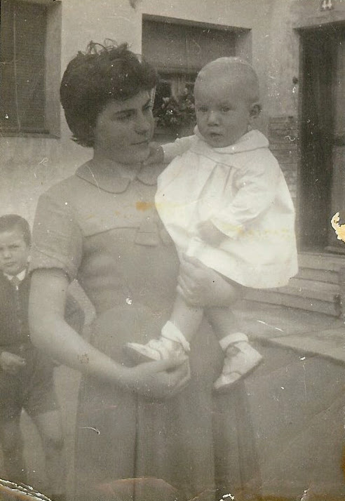

Joseret, portava el nom de les dos agüeles, la del poble Josefa i la del mas Neleta va néixer el dia 10 de desembre de 1958… també era rosset i amb ulls blaus com jo volia, la mare el portava vestit amb bolquers i faldons, molt bonics, no em deixava mai que jo li ficarà. Recordo que un dia que el pare i jo ens varem quedar a soles em va dir: “esta es la nostra, el despullarem i el vestiràs tu“ *.* Sí el vàrem despullar, però no ens vam aclarir a ficar-li els bolquers o bé els apretem massa o massa poc i li caient, quan va tornar la mare el va vestir ella, i ens va dir als dos: “’apareix mentira no teniu coneixement per culpa vostra el xiquet tota la vesprada despullat”, i tenia raó el varem embolicar amb roba com vam poder. Jo m’ha quedat amb les ganes de saber com es feia, els meus fill no vestien així. Jo tenia 14 any edat suficient pa ser la padrina del seu bateig i el padrí va ser Paco el fill de Manuela i Gregorio. La tia Quica va estar uns dies cuidant a la seua germana i es va esperar al bastegi del xiquet.

La mare va començar a tindre problemes de salut i de tan en tan atacs d’asma, es passava les nits recolzada amb un munt de coixins sense poder respirar. Jo sols demanava que no tingué mai aquesta enfermetat. Quan el pare treballava el torn de nit, jo em feia càrrec del xiquet, tenia el bres al costat del meu llit, quan per la matinada li tocava menjar, m’alçava i preparava el biberó del xiquet en un fogó, elèctric que teníem per a aquest cas li donava el biberó i el que fera falta, doncs la mare no el va poder amamantar com a nosaltres, es va criar amb la llet condensada Nutricia i una papilla de llet amb Maizena, estava grosset i hermós

El nostres estudis anaren bé un any vàrem fer un obra de teatre Maria Estuardo, em van donar aquest paper a la representació, i vaig estrenar un munt de trajes d’època de vellut amb color roig i blanc que cosiem a la classe de labors I varen vindre els meus pares a veure la representació

Jo a classe anava sempre, menys als viatges i excursions doncs la mare no podia cuinar pel trufo que feia el carbó de la cuina. M’agrada cuinar, i la compra també va passar a ser cossa meua. Teníem una bugadera que venia a casa totes les setmanes, i les demés faenes de la casa les feia jo.

Prompte vàrem comprar una màquina de cosir Alfa que li feia il·lusió a la mare, ens va costar 800 pts, en els anys 50-60 aquests diners eren una xicoteta fortuna, promte ja sabia a cosir amb ella, i també una bicicleta de xica marca Orbea. El pare va acoblar un seient plegable davant del manillar que el mateix podia portar coses que al meu germà menut, quan el xiquet veia que em preparava la bicicleta per a marxar plorava doncs li agradava molt vindre amb mi.

També ens feia falta una radio on escoltàvem a més de les notícies, els, discs dedicats de radio Saragossa, i els serials radiofònics, un dels que recordo: (*Simplemente Maria*) i un programa molt famós de consultes sentimentals i de tot tipus que es deia de Elena Francis. La radio tenia la marca Clarión I de tant en tant sintonitzem d’amagat la emisora radio Pirenaica.

Un dia el pare va vindre molt content amb una moto de segona mà pareguda a la Lambretta italiana, es deia Iso i em va ensenyar a portar-la per una carretera que no tenia trànsit que anava a les mines

La mina on treballava es deia La Iluminada, amb torns setmanals de matí, vesprada o nit, anaren amb camions que surten del edificis de les oficines, a les diferents mines com La Fortuna, la Maria i El Pozo. Quan tornaven a casa els miners estaven tots mascarats quasi desconeguts però contents doncs era un treball molt perillós i moltes vegades hi havia accidents. El pare era mecànic estava al taller però quan hi havia alguna averia on feia falta, fins i tot al llocs més perillosos.

*He buscat moltes vegades el llibre de consulta (Diccionario)que teníem a casa, i no encontraba, fins un dia, en que vaig veure que el tenia el meu germà a sa casa i em va alegrar, doncs sé que ell també l’estima.* Aquest llibre, és, un diccionari on fèiem totes les consultes quan no sabíem sobre algún tema. Una vegada que jo mirava el dibuix d’un alambic i estava pensativa intentant imaginar-me el seu funcionament, el pare em va dir:- En farem un al pati. i veureu com funciona, buscarem pel camp espígol i tindrem essència feta per nosaltres -. I així va ser, durant uns dies segarem amb una faç tot l’espígol que trobarem i amb garbes damunt de la meua bicicleta el portarem a casa.

La mare ho mirava tot amb paciència, doncs ja estava acostumada als (invents) dels nostre pare, El meu germanet Tedeet participava amb tot, tenia tanta curiositat com jo. A un costat del jardí va començar a fer l’alambic, no tenia res a veure amb el dibuix però nosaltres estem segurs que funcionaria. Un bidó gran de llanda tancat hermèticament es va convertir amb una caldera, d’on sortien un entramat de tubs de plom amb forma de serpentina que estaven dins d’una bassa plena d’aigua, quan la caldera estava plena d’espígol, encenem el foc, el vapor que sortia es condensava pels tubs dins de la bassa, plena d’aigua freda i poc a poc, gota a gota, sortia la millor essència d’espígol que hagués somiat mai. Vàrem omplir una botella buida de Licor 43. (encara en guardem un poc)Aquesta va ser la primera lliçó pràctica de química important que recordem. Desprès en vindran més com enquadernar els fascicles de novel·les que ma mare comprava per correu i que m’ha fet apreciar els llibres antics, doncs sé, el que costa cosir full a full tot el llibre i cuidar- los i ensenyar als meus, el valor que tenen els treballs manuals de tota mena. I més coses.

L’any que va prendre la 1ªComunió el meu germà Tadeo, el dia 26 d’abril de 1959 també varem fer la festa corresponent, el convit el van fer a casa, varen vindre els parents del poble i com sempre. L’ empresa Calvo Sotelo regalava el vestit als xiquets dels seus treballadors. La missa era al poble on es feien totes les cerimònies oficials, recordo que no sé per quin motiu, els vestits no arribaven i la mare li va comprar un de mariner com era el costum, volia que el xiquet estigues ben mudat, a les poques dies varem rebre el regal de la empresa de treball del pare, també era un vestit de mariner, així que va tindre dos vestit de comunió casi iguals.

Amb els temps pareix que sempre havíem viscut allí, al estiu algun any anava al poble en autobús desde el Baix Aragó al poble i al mas, era l’època de la collita segar el gra i després la batuda entonces vaig aprendre a fer formatge de la llet de les ovelles, la tia Juliana munyia a les ovelles que encara tenien llet i que els corderets no els feia falta, ja anaven a pasturar amb la rabera sempre al costat de sa mare, quan de tant en tant es perden entre els demés animals valaen i la mare es contestaba i enseguida estaven al seu costat. Quan ja estava feta la collita del cereals, blat, ordi, centeno per a tot l’any pals animals i la farina per a casa. comencen les festes d’Agost, hasta la tardor ja no hi ha tanta faena fins que se torne a sembrar i recollir la vinya i demes, en aquells temps es van casar les meues cosines dels masos que entre totes eren un monto a Morella, jo vaig anar a totes les bodes o bé en mon pare que una vegada va ser el padrí de una neboda, o també amb ma mare i el meus germans menuts. Tenim el testimoni de totes les fotos de les bodes amb els convidats davant de la porta dels Apòstols de Morella. Jo sempre em quedava a dormir a casa la Parra, on vivia una cosina del pare que tenia una filla de la meua edat Juanita. (Quan ens vàrem veure als 60 anys no ens vàrem reconèixer.)

Quan les meues amigues del poble parlen aleshores de quan teníem 14 u 15 anys i diuen -que bé quan anàvem a passejar per la carretera i a ballar a casa Jaime jo no dic res, però recordo que m’agradava més anar-me’n al mas de Julian on vivien els tios germans del pare i els meus cosines i cosins.

Els meus pares pensaven viure al Poblado fins la jubilació. Al poble teníem la casa de sempre. El pare sempre deia.-Amb els trossets de terra que tenim més la finca del mas de Conill per entretenir-me, quan serem majors estarem bé -.

Però les coses no sempre surten com volem. La mare cada vegada estava pitjor de salut, sempre malalta i a més de patir, no podia fer res, i poc a poc les estrelletes dels seus ulls que jo sempre mirava se’n anaven apagant.

Un estiu estava al mas de julian pasan amb la familia uns dies, i feia d’agostera, este nom rep la dona que porta el almorzar al camp als segadors amb una cistella, com tots estaven al camp la tia guardaba la rabera i jo preparaba i portava el menjar i l’aigua freca als homes, al ple de la calor venien a dinar al mas i quan descansen un poc tornaben a la faena fins que hi habia claror Quan ja estava la sega i la batuda feta tot de manera manual varen vindre els tios i la meua cosina de Castelló a visitar a la família i els jovens ens vàrem anar amb ells a conèixer la ciutat. Vivien a una casa en la quadra La Salera, i ens van ensenyar tot, el Port, al Grau, les villes de Benicassim, i va ser la primera vegada que vaig veure la mar.

El canvi de terreno ere total i em vaig donar compte que no podíem seguir vivint on estaven les mines, allí fins i tot a mi també em molestava l’olor de sofre que es respirava en l’ ambient, no podia ser bo per ningú, i vaig dir-li al pare.-Perquè no ens anem a viure a Castelló com els tios? He vist que hi ha un Sanatori de malalts dels bronquis això vol dir que el clima és bo, segur que la mare estaria millor.

Al temps, la mare els meus germans i jo ens varem anar a Castelló, a provar si el clima era millor pa la mare, els tios Fina i Agustí, havien canviat de casa, aleshores vivien dins de la ciutat en un grup de cases que es coneixen com Els Colorins amb un pis prou gran que donava tot al carrer, molt alegre. Per la part de davant passava la Panderola un trenet de via estreta que anava des del Grau fins Onda i els pobles del voltant. Era de lo més divertit, sempre xiulava i anava poc a poc. En aquest mateix trenet s’anava a la platja.

Quan estàvem quatre mesos la mare es trobava molt millor i ens va dir que no volia tornar al Poblado, on no podia respirar i sofria molt.i varem decidir que si el pare trobara faena ens traslladarem allí, El tio Agusti coneixia a molta gent i va trobar faena de manyà, el seu ofici.

En vaig anar fins Andorra a soles, per ajudar-li amb el trasllat dels mobles i tot el que teníem.

Em vaig acomiadar de les amistats i amigues, tenia 16 anys doncs ja en rondaren els xics La mare sempre em deia *– no em portes a casa cap noví consevol, hi ha gent que son molt renyidors-* i tenia tota la raó, doncs els veïns, sempre estaven renyin amb algú pels xiquets(que al moment ja tornàvem a jugar junts) o per la més xicoteta tonteria, jo sempre li deia, sols em casaré en un xic amb els ull blaus, i encara no en conec ningú que m’agrado.

A les meus amigues també els deia el mateix. Em rondava un xic del poble molt aseat amb bona posició econòmica que tenia un negoci de distribució d’embotits, li dèiem El Xoricero però com que no tenia els ulls blaus no m’agradava gens ni mica i no li feia gens de cas.

Amb el temps a Castelló em vaig casar amb un Xoricero que sí aquest tenia els ulls blaus, i el meu primer fill va ser com son pare, com jo sempre, hi havia somiat.

8 maig 2008

## 3ª part

Som castellonecs!! El dia 2 de gener de 1961 vàrem arribar a Castelló desde Andorra en un camió (esta vegada no era el de Costeta) portàvem els nostres mobles i el que teníem, la mare i els meus germans estaven a casa dels tios. Tot ho varem guardar al magatzem de la vivenda dels tios Agusti i Fina al grup Els Colorins, el seu pis era el 4º i tots nosaltres vivíem junts amb ells, fins que trobàrem una vivenda. Però el primer era el treball a un taller on es feia falta un ferrer de poble i enseguida comença a treballar.

Els tios ens deien que a Castelló no era com Andorra, on les dones i jovents no feien res, ací tot hom treballava o estudiava. Vam decidir de moment seria millor que jo buscarà faena doncs a casa feia falta ajuda. Vaig anar a una tenda de maletes de nom Bolsos Fraga que estava davant del Mercat Central i em van fer una entrevista, també vaig anar a la fàbrica de Dàvalos de filats, em van, dir que els següent dilluns comença a treballar i que prepararà el documents necessaris. Aquella mateix nit em varen vindre a buscar a casa dels tios «que era la direcció que vaig donar» una dona de la tenda dient-me que em volien donar feina. Com que ja havia donat la paraula a la fàbrica de filats, vaig dir que no podia anar, la dona que va parlar en nosaltres em va dir que els agradava el meu caràcter que aprendria molt prompte a vendre a la tenda i que estaria molt bé. El pare em va dir que jo era qui tenia que decidir Però vaig pensar que no estava bé fallar als que primer em van dir que sí.

En este treball vaig desarrollar molta habilitat de moviments de dits i mas, tenia al meu càrrec una màquina de filar, fent els mateixos fus que habia vist al teler de les dones que treballaven al obrador al poble con el de la tia Quica, més modern tot ere mecànic, màquines molt grans, el treball era mentre habia fil al roll la maquina no es parava i si se trenca algun fil, el fus quedave mig vuit, i es notava molt al hora de replagarlos. La meua companya de l’altre costat de maquina era molt alegre i divertida, sabia tots el xismes de les revistes i de tot que em contava, pero pa la faena un poc lenta, jo tenia que estar pendent de la meua feina i de la seua, si el treball estava mal fet no se sabia qui ere la responsable, anys després eixa habilitat em vindria molt be.

Els pares busquen vivienda, volien una caseta individual, estan acostumbrats a viure aixina. En van veure una al final del carrer de Segorb, eren dos fileres de cases adossades amb pati, actualment encara estan allí, i un altra al final de la carretera de Valencia també el mateix, dos fileres de cases on vivia un amic del poble, la construcció era de poca qualitat, aleshores estan entre blocs de pisos, no fa molt de temps les vaig veure.

Em van demanar opinió i recordo que les dos vegades els vaig dir el mateix, (si tinc que treballar a torns, hem de viure dins de la ciutat doncs treballava a les 5 del mati y 45 minuts i per el torn de vesprada sortia a les deu de la nit, i tinc que anar a soles, vostès patiran) abans les dones no anaven a soles pel carrer. Quan va passar el temps vaig adonar-me que els meus pares sempre van tindre en compte les meues idees, cosa que abans no era usual.

No sé com podem viure tanta gent junta a casa els tios, sense cap problema de res, crec que el compartir, ens fan més humans.

A vegades he pensat que tinc intuïció, m’ha donat compte moltes vegades, i crec, que tot el que amb el teu esforç i treballat, si ho vols, més tard o menys ho aconseguiràs, estic convençuda que és així.

Un diumenge que anaven al cine Oeste per la vesprada en les meus germans al passar per un carrer vaig veure una dona asseguda a una finestra, i vaig pensar, un pis com aquest ens aniria bé a nosaltres. Als pocs dies els pares em van dir: anem i veurem si t’agrada un pis que està en venta, varem anar tots i la meua sorpresa va ser molt gran, compràvem la vivenda que a mi m’agradava, i que vaig mirar quan anem un diumenge al cine, al carrer Vazquell Mella nº 46.

Teníem com a veïns a una família de La Puebla de Arenoso. La Sª Dolores a la planta baixa i al primer pis el seu fill Antonio i baix de nosaltres estava buit, al temps el van comprar la Sª Maria i el seu marit Manolo, més tard:(els agüelos dels meus fills)

La Sª Dolores era una dona singular, en aquella casa cabien tots els coneguts del pobles quan venien al metge o per faena, tenia quatre fills i un munt de nets, com que tots la cridaven agüela nosaltres fèiem el mateix, els meus fills i germans es van trobar l’agüela que no havien tingut mai, i com calia, a totes les nostres celebracions ella sempre estava convidada.

El meu germanet Tadeet el vàrem matricular primer al col·legi prop de casa dels tíos que es deia La Normal, no recordo quan de temps va anar, i desprès quan Joseret va tindre l’edat al col·legi del nostre carrer de nom Ejercito, (té aquest nom perquè tot aquest bloc de cases. estaven vivint els oficials del quartell de Sant Frances que estava al costat) (*actualment és la nostra parròquia de nom Sant Francisco. En un dels meus treball de la UJI està tot detallat, vaig fer un treball de investigació sobre la historia del quartell i abans convent, ermita i més coses de 1400 fins ara.*

Estàvem agust a la nostra casa, els veïns eren com parents, les portes del pis sempre estaven obertes, ens coneixem tots, a l’estiu prenen la fresca a la nostra porta i a xerrar com als pobles. Tot anava bé. Mon pare, quan estava content cantava sempre la mateixa cançó que deia: (*El dia que naci yo que planeta reinaria por donde quiera que voy que mala estrella me guia*) a mi no m’agradava gens aquesta cançó era trista era com una mala premonició.

Quan vàrem vindre a Castelló la mare i jo estaven tranquil·les després de estar tants anys sofrint, la faena a la mina era perillosa, i havíem vist molts accidents greus i famílies conegudes desfetes, però la vida és una lluita sempre, i no sabem quant se acaba.

El dia 9 de febrer de 1963 a les escales de casa vaig trobar al pare que s’anava al taller amb la meua bicicleta, a vegades anava amb la moto, jo venia de la fàbrica, eren prop de les tres de la vesprada, va ser l’última persona que va parlar amb ell.

Un hora més tard un guarda va vindre a casa a dir-nos que hi havia hagut un accident i que l’acompanyarem al hospital que està prop de casa. La mare i jo amb una mirada vam tindre prou, sabíem el que volia dir. De res va servir fugir del perill de la mina, ens quedàvem a soles, era el nostre destí.

La mare sempre va viure a l’ombra de mon pare, no els vaig veure ni escoltar discutir mai, al estar sempre malalta el necessitava molt, una paraula seua la tranquil·litzava, era un voler que es palpava. Com que tots eren menors d’edat necessitàvem un tutor, la mare va decidir que el tio Agustí era la persona de més coneixement de la família i que ell faria el que fora menester per nosaltres (com així va ser). I sempre ens deia, que no li pagarem mai, la preocupació, i tot els jornals de faena que va perdre per nosaltres.

Per moments la mare es diluïa es va fer transparent, no era ni l’ombra, els seus ulls negres, lluents que parlaven s’anaven apagant. El metge Velo va dir que s’havia d’operar urgent, sempre estava al llit, jo treballava a la fàbrica i arribava a casa amb por, no sabia que trobaria. Isabel la dona del pis del costat sempre estava fent-li companyia quan jo no estava, Joseret que tenia 3 anys estava al poble fins que se recuperara la mare, amb la meua cosina Merce la tia Quica i el tio Marti, el seu marit Ximo estava a Alemania treballant a temporades, i el meu germanet Tadeet al Hogar Sierra Espadán intern. De la nostra feliç família, no quedava res.

Als 13 mesos de ser viuda, van operar a la mare. No es va recuperar del postoperatori, i a les poques hores se’n va anar amb el pare, sols repetia una vegada i un altra *«tinc tres fills, tinc tres fills menuts»* allí mateix al seu costat, no se si em va entendre pero aprentali la ma, vaig dir.li que sempre cuidaria dels meus germanets.

7 abril 2009

Dia 4 de decembre de 2023 recordant.

Els dies se fan llargs. tres vegades al dia senem a patsegar Listo i jo, no se qui passetga a qui si ho fax jo, ho hem passetga ell a mi. Segons els meus fills tinc que parlar amb la gent com ha fet sempre i viure, tornar a començar la meua vida, no se quantes vegades ho ha fet, pero antes tenía companyia, ara és la soledat dia i nit que no l’ompli res, aunque a vegades tens gent al teu costat, tu te sents dins d’un núvol aïllat.

En una de les seus visites El meu fill Juan m’ha portat un impres de la UJI, és una solicitud d’ingrés al programa de Majors que feia un any que ha comensat. Ha escrit totes les dates que demane i als poc dies reb una telefonada de la coordinadora diente que estaba aceptada i que hem podía matricular, tant com anavem parlar de moment hem diu “tu eres Paquita la carnicera del mercat? jo soc Pili” li dic “ si la teua veu la conec Pili la filla de Pilar del taller del canto?”

Aixina va ser el primer contacte amb la Uji

L’acte de Obertura del curs va ser el dia 16 döctubre de 2001 a les 18’30 en la Sala d’actes Alfons el Magnànim de la Facultat de Ciències Jurídiques i Econòmiques, a càrrec del director acadèmic Salvador Cabedo Manuel amb la lliçó inaugural d’un professor invitat i amb la programació de les activitats del curs 2001-2002 de la coordinadora de la Universitat per a Majors Pilar Escuder Mollón amb la presencia de Francisco Toledo Lobo rector de la Universitat Jaume I. Tot molt cerimoniós, allí estàvem tots els estudiants nous i els de l’any anterior, ere un altre món per a mi, molt diferent de la meua vida anterior, jo mirava tot amb atenció i curiositat com ens donen la primera lliçó magistral de la meua vida com a estudiant. Tampoc havia escoltat mai en viu el Gaudeamus igitur que em va emocionar pensant que algun dia també el cantare jo.

El primer dia de clase em vaig donar compte que la majoria d’alumnes o eren amics o es coneixien, aquell no era el meu ambien, pero no va importar massa, tot era nou per a mi era un altra manera de veure la vida que volia aceptar, i acostumbrada com estaba de conviure en la gent del mercat, no seria molt diferent, sols calia ser jo mateix.

I comencem el curs per a conseguir el Titol de Universitari Senior promoción 2001-2004 el 18 d’octubre de 2001.

En total erem 79 alumnes homes i dones molt diferent d’estatus social i cultural, alguna parella i altres a soles com jo.

Els professors que ens donen clase eren de diferens departaments alguns poden ser fills nostres per l’edat-i les assignatures molt variades.

Les assignatures i professorat que teniem assignats del primer curs estava tot detallan en els documents que varen donar nos, també el seu correu per si el necessitavem fer alguna consulta. Tor eren facilitats, jo estava asombrada, allo anava en serio, res de tonteries.

El meu fill Juan apareix un dia per casa amb un ordinador que tenia retirat, ere un teclat, una pantalla gran ampla i una torre que vàrem ficar a terra, i em diu “ de moment no et fa falta pero les Noves Tecnologies han vingut pa quedarse, tens que familiarizarte amb elles poc a poc” (encara guarde els disquets com a record d’aquells dies que no sabia com asimilar.) I Em va dir “la pantalla es l’escriptori com una taula que tens davant, els documents els pots guardar en carpetes, i sempre copiar el que escrius o se pot borran en la barra de tareas voras el que estàs fent, seguís el que diu el llibre pas a pas i ho faras be, no hem crides fins no estigui tot trencat”, el llibre es deia programación Windows 95, no se quantes cose em va explicar, quan va marxar tenía la ment en blanc no sabía què fer ni com començar. Vaig estas dies fent proves com en un joget, les lletres més menudes i grans, cambian colors, i no se com va ser que la pantalla es va fer de color violeta que ferie la vista, així dies i dies,(qualsevol deia res al meu fill per esta tonteria,) fins que vaig veure el motiu, i de moment tot estava més clar, i ere una satisfacción pensar que amb constància i treball podria anar aprenent totes les coses noves que amb el temps tindria que trobar.

Anar a classe ere com viure una aventura inesperada com els xiques quan comencem el curs, com feien anys darrere els meus fills i germans. El primer ere saber on estava tot tan gran, molta activitat per tots els puestos sempre gent em moviment, edificis diferents uns dels altres, escales amples, ascensor que cabia molta gent, passadissos també llargs i amples, classes plenes tot un mon de jovens que donava goig i que al principi ens miraven amb curiositat després crec que ni es veien, ja se van acostumbrar Les primeres classes van ser a La Escola com deien, varem estar a un munto d’aules, sabiem quines eren les nostres per els numeros i lletres de cada una ficades al costat de la porta d’entrada, quan ja sabia lletres i números, tornaben a cambiar a alguna altra clase que estiguera buida, nosaltres érem els raders, vaig aprendre tots el horaris d’autobús i fer torn a la cafeteria com tothom i a conèixer als companys i ha fer la xerradeta que era el millor. Tenia prop a un notari i la seu esposa i un camionero que sempre es ficaba junt a la pared, fins un dia que el vaig agafar del braç i li vaig dir que allí tots érem iguals i desde entonces sempre estavem a les primeres files molt atens, ere un home de poble, discret amb moltes ganes d’atendre tant com jo. Molts altres companys ells i elles havien sigut docents se notaba amb la soltura que feien els apunts, alguns funcionaris i també persones jubilades que ha casa s’avorrien i que venient a passar el temps i fer coses noves, molt prompte vàrem ajuntar-nos qui teniem les mateixes aspiracions i l’amistat va vindre sense saber com, hi havien homes i dones com jo, i altres que saben molt més de tot, a mi m’agradava observar i pensar quina sèrie la seua faena anterior, ere divertit, i habie en company molt serio i atent que no sabia on catalogar, l’any següent que varem fer un treball en grup va dir que era militar. Companyes que cada dia portaven un vestit diferent, ben pentinades i mudades com si allò fore una festa, jo era del munto tenia poc de temps. Parlant de les ocupacions anteriors que cadascú teniem quan jo deia que era una cansaladera, que la meua faena era vendre al mercat 35 anys i que m’agradaba molt i ames fer al nostre obrador els enbutits i el despice, i que va ser la millor etapa de la meua vida, no saben quina cara ficar, i això de parlar en valencià també ho veien raro al principi.

Un dia vaig escoltar a dos companyes que estan assentades al banc detras del meu deien que jo parla el valencia perquè no sabia el castellà, la cara que van ficar quan riem els vaig dir que tenia la sort de saber les dos llengües bé, i que en aquest asunt no em poden alcançar a portar polseres i collaretsgua (quan ho recorde encara tinc la risa, després hem sigut sempre amigues).

Tots els membres del programa teníen una paciencia amb nosaltre com en els xiquets, i prompte estarem integrats en aquell món de sapiencia que sols calia escoltar.

## 4ª part - I la vida seguis

Jo vivia en els tios junt en les meues cosines, en un pis que es diu els Colorins que els va construir la Caixa de Ahorro de Castello, ere un quart pis sense ascensor, per entonces no tenia importancia pujar les escales, els pis era cantoner i molt solejar i molta llum els tres dormitoris un ere dels tios i als altres dos dormien les xiques i un cuarto menut del xaplan era on tenien els tiós la roba que compraven a Barcelona a quadres menús que es deia de Vixi de tots el colors, en la bora viva estava els color de la bandera de España als tios no crec que els fera molta gracia pero deien que era la roba millor. El tio Agusti feia ell els patrons aprofitava tots el troços o bé per als tirant o per a la cinta que anava al coll així com les butxaques rematades amb la mateixa roba als vies… Quan la tia Josefina encomenava ha estar malalta em fa fer un davantal per a mi com a regal els quadres de la roba de color groc alguna vegada mel fique pero el torno a guardar les meues cosines em van dir que li va costar molt de cosir. Els tios també compraven al mateis almacén alguna pesa de roba de tipo gabardina de color gris per e fer les gorres amb visera, encara recordo que quan estava acabada de cosir el tio Agusti se la ficava al cap i deia esta talla M o G o S el que volia i es cosia la talla del l numero que deia. Alguna vegada venia un representan de la fàbrica de Barcelona i rebia els encàrrec per el tren, de aquesta manera anaven als mercats setmanals del pobles del voltant de Castello, eren les persones mes treballadores que un es pot imaginar d’aquesta manera pagan com autònoms varen fer patrimoni i les tres filles van estudiar, ara son profesores, el tio Agustí era el nostre tutor i jo era una filla més, no mai vaig sentir-me excloïa, al contrari, dormia amb una habitació de dos llits amb una cosina, seguia treballant a la fàbrica i els tios em van dir que em guardarà els diners que guanyava pa fer-me l’aixovar.

Entre les meues cosines i jo érem quatre xiques elles totes estudiabem, a mi també m’hagués agradat estudiar pero sabía que la meua vida ere different, la tia Fina era com el seu germà Tadeol mon pare, molt hàbil per ha tot, e era una dona molt treballadora i tolerant.

Tadeet estaba en l’Hogar i estudiat a Maestria i ens veiem tots els dies de faena, va estudiar delineant.

Joseret vivia a Cinctorres, molt cuidat per la tia Xisca i la seua filla Merce, Ximo estaba treballant a temporades en Alemania, el meu germanet anava a l’escola, però era poc estudios. Va créixer com tots el xiquets del poble, jugant pels carrers i fent maleses, ell diu que sempre va estar bé, anava a veure a la germana de ma mare la tia Gavina, que vivia al Sant Lluis, i conta, que si l‘agradava el que tenía de dinar es quedava a menjar allí, i que no va tindre mai cap carencia d’afecte.

Com era el costum, Merce va fer-li, un roquet nou amb una randa molt bonica i era cotero, o escolanet, ajudava al retor a la missa i a les processons, a vegades ens conta les anècdotes pròpies del xiquets coteros, com fer de tant en tant quan el retor no els veïna algun traget del vi de missa,(en un llibre de Cinctorres publicat pel Ajuntament tomo II en la pagina 153 ja una fotografia d’una professo al placet de l’església on es veu al meu germanet portant el canelobre més gran que ell al costat del que porta la creu, sols he reconegut a més del capellà, a l’amo del moli i al frare Malla que sempre cantava gregorià.

L’any que Joseret va prendre la 1º Comunió, al poble Merce va vindre a comprar-li a Castelló el vestit (encara el tinc guardat).És un trage amb la jaqueta de vellut blanc molt cerimoniós, m’adono que era molt xicotet. Merce i Xoxim no tenien fills i sempre varem fer com a pares aunque sabien que jo volia que estiguen tots juns amb mi, Per ha fer-li aprendre la doctrina com es deia *el catecismo* varen suar tots. Les oracions les va aprendre de memòria, però el demés, era molt difícil doncs sempre estava molt enjogassat.

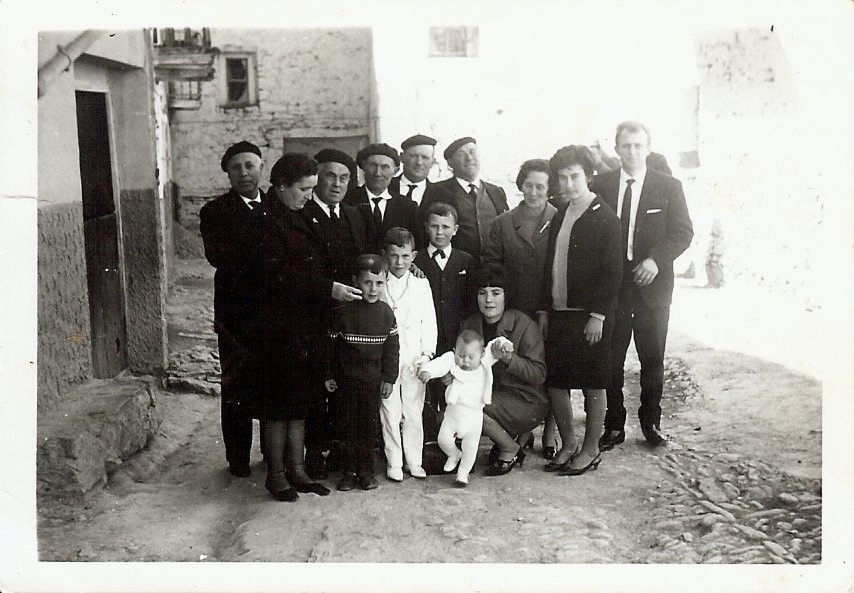

A la festa, i convit al poble varen vindre tots els tios dels masos i els de Castelló, en la foto familiar que varen fer davant de l’església i un altra davant de casa La tia Francisqueta i del tio Marti es veuen tots molt mudats, els tios porten la clasica boina igual en estiu que a l’hivern i el tratge negre de sempre amb la seua corbata també negra esta bestimenta servie pa tot enterros i festes familiars.

Desembre 2009

## 5ª part

jo sempre vaig saber que em casaria amb un xic que tindria el ulls blaus i que m’estimaria molt, el que no sabia era que el seu nom seria Joan i que serem veins, així ens vam conèixer.

Joan desde jove va marxar a treballar pel mon, va recórrer mitga Europa sols venie de vacances a visitar a la familia, la germana menuda Maruja ere la seu debilitat, així es van conèixer, nosaltres erem amigues. Els seus pares que tenien ganes de que estigui prop de casa el van aconsellar de ficar en marxa una cansaladeria. com la que tenien ells abans. Varen obrir una parada al Mercat sa mare Maria estava despatxant, era una dona alta amb bona presència amb el cabell blanc replegat amb estil, pareixia de casa bona. L’agüelo Manolo tenia molt bona mà pals embotits, no debades ho havia fet de menut.

A la mare de l’agüelo Manolo li deien Agueda, ella era la cansaladera, li venia de família. Àgueda es va casar amb un andalús de Rute (Córdoba,) aquest va vindre a Castelló, amb l’ofici de consumero, que li va donar la Reina Mª Cristina com a premi, després de vindre de la guerra de Cuba derrotats l’any 1898. Als pocs soldats que van tornar en vida, l’estat els donava ocupació, per aquest motiu, Pedro estava treballant i vivint a Castelló.

*No sé com es va perdre la cartilla militar de Pedro Cañadas jo la vaig tindre a les mans amb altres papers, la vaig llegir, i és veritat el que deia l’abuelo Manolo quan contaba que son pare va estar tres vegades a Cuba, una per ell, i dos vegades més en lloc d’altres soldats.*

Abans era possible quan la família d’un soldat podia pagar-ho comprava a un altre soldat, que anava en el seu lloc a canvi de diners. La besàvia del mas de Jullian, Felipa va comprar un soldat al fill majors Antoni per que era l’a millorat, el que heretaba el mas familiar com era el costum, el segon fill que també va anar a la guerra de Cuba va morir allí i el tercer fill el meu agüelo Josep va protestar dient que no volia anar a la guerra on va morir el seu germà Ramon, que en un fill hi havia prou, la seua mare va vendre tot el que es podia inclòs una gorrina de cria per ajuntar els 100 duros (500 pestes) una fortuna per aquella època per este motiu l’aguelo del mas quan va fer testament va dir que tots els fills eren igual i que el costum del hereu s’havia acabat, tos tenien una part de l’herència i si els seus fills tenien coneixement ja faran per que el mas no se partira a trossos. Quan els meus tios varen partir l’herencia mon pare Tadeo es va quedar en el que queda del maset de Benardo a Cinctorres i la casa de Morella i el mas ho tenen dos tios que el van comprar als altres germans i com va dir l’aguelo Josep si es te coneixement tot va millor.

L’agüela Maria mare de Joan de jove va vindre de Vilafamés on es va criar i treballava de cuinera a una fonda de la carretera de Morella quan va conèixer a Manolo Padilla el cansalader, ell vivia amb sa mare i tenien una cansaladeria al carrer Saragossa. Quan es van casar, Manolo, Águeda sa mare vivia amb ells fins que va morir. Desprès degut a problemes d’herència amb els altres germans deia que van perdre casi tot el negoci amb judicis i advocats se’n va anar tots els béns i diners. Maria no mai parlava de la seua família, per ella vam saber que a Vilafames la coneixen per Mª Gracia i que la vam criar uns tios que eren germans de sa mare quan esta va morira en Almassora i son pare es va tornar a casar. Nosaltres vam visitar als tios a Villafames, ja eren molt majors i quan una cosina que quedava venien a Castelló sempre venia a vorem-nos al mercat.

Una vegada que va vindre del poble Merce amb Joseret el meu germanet al metge dels oïts, el va visitar a l’hospital el metge Agut i l’aguela Maria ens va dir que aquest metge era mig germà seu, per par de pare, i que no tenien cap contacte com a germans, i no es va voler dir res més.

*Fins molts anys desprès no varem saber l’historia que l’agüela Maria que no mai ens va dir.*

La mare de Joan es va ficar malalta, el metge va dir als fills que no es podia operar que el mal estava molt avançat.

Al poc de temps de viure jo amb els tios, Juan em va demanar que si volia casar-me amb ell. Com que era menor d’edat havia de donar el permís el tio Agusti com a tutor, va tindre que anar al jutge i a la parròquia de Sant Francesc a firmar els documents necessaris.

Ens ficarem a viure al pis dels meus pares, ens vàrem comprar no més els mobles del dormitori, la resta eren els dels meus pares i ens vam casar el dia 12 d’agost l’any 1965.

La mare de Juan sempre deia que es moriría el día de la nostra boda, quan es va casar ella, son pare es va morir el mateix dia.(es va enganyar per hores) Com que sa mare estava malalta, vam pensar que no faríem festa i el viatge de nuvis seria més avant. Però el tió Agosti el nostre tutor desl meus germans i meu va dir que ell pagaria el dinar a la meua família que vingueren acompanyar-me al casament.

Ell es va encarregar de buscar el lloc on dinar, va ser a un merendero que hi havia a la platja del Serrallo (al lloc que aleshores està la refineria), molt prop de l’alqueria d’un amic del nostre pare i on anavem tota la famila en la panderola a pasar algun diumenge amb ells i a pendre el bany

La mare de Joan estava molt maleta, i un dia abans de la nostra boda de sobte es va morir a les 11 de la nit, jo estava allí i vaig ser qui va ajudar a Joan a amortallar-la, la varem tindre a casa tota la nit com es feia, i la vespra de casar-nos li van fer el soterrar

La tia Fina germana de la mare que vivia en Amposta va vindre ajudar-me a fer-me el comboi i es va trobar en el soterrar. Quan a les 10 del matí vaig anar a replegar-la al cotxe- correu, i li vaig dir el que passava no ho podia creure de cap manera.

No recordo quan van vindre els parents de Morella. El tio Fidel germà del pare que vivia al mas de Julian era fadri, va ser el padrí de noces dels meus pares, el padrí del meu bateig, i també el vaig fer padrí del meu casament Com que era al mes d’agost a l’església feia molta calor, el tio no estava acostumat anar mudat però, com padrí portava un vestit obscur que tenia guardat per a totes les bodes i cerimònies que deuria anar, jo recordo que estava suant, moltíssim y em feia patir de veure’l la padrina de va ser Maruja la germana de Joan.

Quan el capellà de la parròquia va veure el que passava ens va dir si volíem retrasar el casament i li vam dir que no, que estava a la família, i dia dalt o baix no soluciona res. El que vam fer va ser casar mos a les 8 del matí, doncs a mig dia li van donar terra a l’agüela Maria al cementeri, allí vaig repartís el meu ram de novia entre els meus pares i ella…

La meua família del poble i de Morella que van vindre convidats al nostre casament, com és normal estava afectada pel que va passar, i després de acompanyar-nos al cementiri, com a ells no els tocava res, a l’hora de dinar se’n van anar al banquet de boda, que estava encomanat sense nuvis. Molts anys després la tia del mas em va dir que al acabar de dinar, con que feia molta calor i no hi havia gent de fora de la festa, tots van prendre el bany, algun dels tios, no havien vist mai la mar, elles en viso i els homes amb calçotets tots a remulla i van xalar molt, però no volien comentar-ho, doncs creien que era una falta de respecte a Joan i família.

Passat un temps jo tenia molta curiositat de saber el lloc del banquet, i quan pensava dir-li a Joan que anàrem a veure el lloc, sempre callava doncs pensava que no calia recordar-li res, fins una vegada li ho vaig dir, en tan bona sort, que ja estava instal·lada la refineria i no quedava res de res. Així que no se on es va celebrar el banquet de la meua boda. A vegades cavil·lo que si no fora tan trist, pareix una broma.

*Quan pels anys 1980 – 1990 als estius estàvem tota la família a l’apartament Joan parlava amb un veí major d’Almasora, i li va dir que el seu agüelo per part de mare, era del aquests poble, que es deia Agut i que quan va enviudar, les dos filles que tenia se’n van anar a viure a Vilafames, amb els parents que allí tenien.*

*El Sº Enrique (aquest era el seu nom) li va que* ell era molt amic dels seu agüelo que el coneixia molt que eren veins i que aquest tenia una fàbrica de licors amb bona situació econòmica i ens va contar la historia: Del primer matrimoni amb una xica de Vilafames va tindre dos filles i vivien en Almasora, va enviudar i amb el temps es va casar en la dona que abans tenien con a criada de casa. D’aquesta dona van néixer dos xics i com que les filles i la dona no es portaven bé les xiquetes se’n van anar a viure amb els aguelos i despres amb els tios del poble.

Al fer-se majors Maria Gracia no van tindre mai contacte amb el seu pare i germans de Almassora, doncs els fills van estudiar, eren metges, elles no van tindre cap educació especial l’agüela Maria no volia parlar d’aquest tema, la mostra es que els seus fills Manolo Joan I Maruja, mai va saber res de la família d’Almassora on ella va nàixer.

També ens va contar que en aquells temps eren gent acomodada i que descendien del poble de Culla, on el metge Agust era un terratinent i la mostra era, que si anàvem a Culla encara veuríem una placa al carrer major amb el seu nom. Nosaltres quan els nostres fills eren menuts i anàvem al poble un dia vârem entrar a Culla, i allí estava a un canto del carrer principal la placa del carrer amb el seu nom.

La meua sorpresa va ser lleguint un llibre que tinc a casa Historia del Maestrazgo de Jose Barcelo Matutano editant en 1982 en la pagina 86 parlant de Culla diu: *De muchacho, pasé algunas temporadas veraniegas en Culla, en casa del medico Agust, que alguien llamaria cacique, pero yo llamaria patriarca…etc.* També conte, que la finca on està la monumental Carrasca de Culla entre altres coses era de la seua propietat*…*

L’autor diu que es un llibre de records i percepcions.

9 maig 2011

*L’any 2014 quan en diferents pobles varen fer La Luz de las Imágenes, ja major amb 69 anys vaig anar entre altres llocs a Culla a visitar les exposicions, preguntar al guia qui era aquest metge Agost, em va dir que va ser l’alcalde que va ampliar el poble fora de les muralles mirant el futur, ell va ser el primer que va construir sa casa fora de les muralles les cases noves son diferents a les que hi ha dins del poble emmurallat antic totes de pedra molt pintoresc i bonic però tot son escales, costeres i carrers estrets.*

## 6ª part

Tenia 21 anys quan va nàixer el meu primer fill, el dia 28 de juny de 1966. Sempre vaig saber que seria un xiquet i que el seu nom seria Juan com son pare i tindrà els ulls blaus.

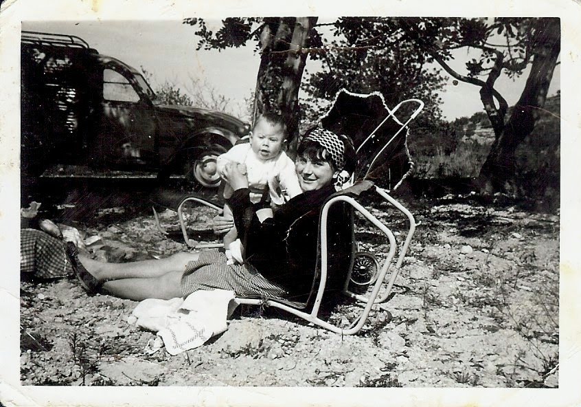

Teníem un Seguro Sanitari particular, i a mi em va atendre la comare a casa (tinc guardat al primer caixó de la mesita del dormitori al meu costat, el cordó umbilical dins d’un franco esterilitzat que vaig comprar en la farmàcia per si el xiquet venia de moment, el guardo com un tresor fa els anys que té el meu fill major Juan) com que el xiquet era gran i jo mare primeriça van buscar una clínica, sols vam trobar habitació a una que era del metge otorrino Antoli Candela al carrer d’Enmig a l’entresol, abans havia sortit de comptes i tots els dies anava al mercat, doncs no volia quedar-me soles a casa. L’agüelo que vivia amb nosaltres, ajudava de matí a embotir i després fins l’hora de dinar no estava. Aquell dia era dilluns i estaven treballant al mercat del dilluns, la nostra parada estava al costat del transformador de la llum aleshores passarà el Tram. Joan en un descuit va tirar el misto d encendre el cigarret i es va prendre foc el paper que hi havia dins de una cistella, vaig tindre un bon esglai, i degut aixó per la vesprada em va moure el part. Joan va anar a buscar a la tia Josefina que va assistir al part amb la comare i el pare del xiquet, El xiquet va nàixer a les 6 del mati del dia següent i va pesar més de 4 kg.

Joan va vindre a la clínica amb un ram de flors el més gran i bonic que havia vist mai, no feia més que mirar al fill, estava més de conten. Quan l’agüelo va preguntar-li quin nom li ficaríem, el fill li va dir Juan!!,l’agüelo volia que portarà el seu nom, Juan li va preguntar- vostè al seu primer fill, quin nom li va ficar? Ell va contestar, el meu!! I el pare nou va dir amb orgull - jo també, el meu!!, l’altre xiquet que tinguem, li direm Manolo com vostè*. Jo vaix cavil·lar, esta clar, tindre un altre fill i serà Manolo.*

Al poc de temps de prendre la 1ª Comunio Joseret, el tio Agusti que sempre va mirar per nosaltres, pensant el que fora millor, va dir-nos que el xiquet havia d’estar a Castelló, amb els germans. Va anar al Escolàpies a matricular-lo i li van dir que tenia les notes massa baixes i li costaria ficar-se al nivell dels demés, va ser una manera elegant de dir que no. Aleshores anava a una acadèmia reglada particular, que es dia Akademos al carrer Cavallers, jo estava al mercat i el xiquet venia per allí, a migdia i a dinar anava a casa el tios que vivien al mateix carrer i les cosines li controlaven les lliçons i deures, d’aquesta manera va estudiar.

Quan Tadeet va tindre uns 17 anys i va acabar d’estudiar a Maestria va tornar a casa amb nosaltres, Ell no mai es va queixar d’estar a Hogar del Auxilio Social però desprès de majors quan hem parlat d’aquest tema, deia, que el pitjor va ser el desarrelament familiar, que no coneixes a ningú, el canvi es tan brusc que no sap que fer i es viu de manera molt diferent per bé que estigues, doncs allà hi ha disciplina cassi militar, i cadascú mira per ell. Al comença l’estiu anaven dos setmanes a la platja i desprès a la finca que hi ha al Desert de les Palmes anomenada El Bartolo jo recordo haver anat allí a visitar-lo.

A Joan tot el que jo volia li pareixia bé, i quan vaig dir-li que necessitava als meus germans amb mi, va dir que sí sense cap problema, i va ser un descans estar els tres junts, jo creia que era el meu deure seguir sent una família. I de sobte érem sis homes a casa i jo, doncs el agüelo sempre va estar amb nosaltres, no volia anar mai a casa de la seua filla Maruja ni de visita.

Alguna vegada penso que no sé com ens vam aclarir sense discussions, doncs érem 7 persones de 4 mares diferents, distinta edat i educació.

Juanito va fer els quatre anys a juny i a setembre començà anar a escola, al col·legi l’Ejercito, com els meus germans, el primer dia de classe vaig anar a parlar amb la directora que li deien Dª Marcelina a preguntar sobre el menjador escolar doncs aquell any era el primer que en faran. Com que n’eren pocs xiquets la mestra em va dir que es queda ja aquell dia. Jo no estava preparada per a deixar el xiquet allí el primer dia de classe, però vaig callar i me’n vaig anar al mercat plorant de pena.

La cuinera era una dona que anys després vaig conèixer i em va dir que era el xiquet més menuts de tots i el cuidava molt, el dia que tenien natilles per a postres sempre li’n donava dos li agradaven molt.a la casella on guardaven el tovalló tenía el número 1 ell va ser un dels pocs alumnes que varen comensar el primer dia de clase al menjador i tanbe l’últim any d’escola on es va tancar.

Tots els matins quan deixava el xiquet a l’escola marxava al mercat a despatxar els productes que nosaltres elaborarem. A Joan l’agradava la seua faena i a mi també. Era molt aseat per al seu treball, casi maniàtic, “les coses s’han de fer bé”. Li agradava fer proves en les espècies i jo era la que ho provava, tinc bon olfato i gust. Quan pujava de l’obrador amb dos mostres d’embotit, el que jo pensava que era millor, era el que es ficaba a la venta. Un dia vaig veure que mesclava les espècies de la tàrbena i marina en moscatell, i per ha el xoriços ficava brandy per això era tot tan bo i es venien tant bé!!! Molts dels embotits que feiem de manera artesanal ja no es veuen, com les botifarres del budell els blanquets i més coses.

A vegades cavil·lo que no se com podíem viure tots junts amb la casa tan menuda. En l’habitació del fondo teníem Juan i jo i els fill menut al nostre dormitori. En una que donava al carrer estava el llit de l’agüelo Manolo un seient i el seu armari de casar-se, l’altra del costat era saleta i dormitori dels meus germans i de Juanito. Varem comprar un sofa que es separava i eren dos llits, en un dormia Joseret en l’altre Juanito, i Tadeo en un llit plegable que també era llibreria, quan estaven els llits fets no es podia tancar la porta. De matí, tadeo guardava tota la roba a l’armari on també estava la roba de tots ells, si alguna vegada ho feia jo no cabia tot, i em deia “ les mantes en quatre plecs i els coixins de costat,les sabates totes rectes, i dos peces de roba a cada penjador” vaig acabar per no tocar res, de tot això i de la neteja del seu quarto sempre es va encarregar el meu germa doncs desde menut era molt endreçat.

La televisió la vàrem ficar al racó del quarto del agüelo, ell sempre estava assegut en un seient molt bonic del seus moble de casat, i els demés la veiem des del menjador l’únic que li pareixia be que estiguis amb ell era el meu germà Joseret (era el seu enllaç del carrer, li comprava el que volia) a ell el deixava que estigues assegut al seu llit, als demés no, ni al seus net.

Jo li canviava per uns locals que es deien La Tauleta on venen xuxeries tebos i un poc de tot les novel.les del Oeste que llegia, voltava mig Castelló ere exigen si alguna estaba repetida.

En la nostra casa sempre hi havia soroll, l’agüelo Manolo, tenia un amic en Vila-real de nom Mezquita i totes les setmanes venia a veure’l, compraven un dècim de loteria junts, tadeo portava als seus amics a escoltar música, teníem un tocadiscos amb disc de Los Pequeniques, los Bravos i molts més.

Joseret començava a festejar en Julia, anava amb una moto que sols podia anar ell, recordo que sempre estem pagant denúncies de tràfic doncs sempre pujaven a la moto els dos, no escarmenta.

El nostre fill Juanito sempre va ser un xiquet tranquil, pareix que tenia més anys, i el meu germà menut menys, eren els dos roset com si foren germans.

El mateix any que va nàixer el nostre fill Manolo, ens vàrem canviar de pis, al xamfrà del nostre carrer, i també de cotxe, un Seat 124 familiar per a que capierm tots, i varem portar a la xatarra el nostre Citroen furgoneta que sempre va ser molt honrat, mai ens va donar cap problema. Com que els nostres amics no tenien cotxe a la Magdalena i a la platja a la Renega anàvem tots en ell, una vegada a la romeria contarem entre grans i menuts 11 persones. Joan al mercat deia en broma, aquest any ha sigut molt productiu: *casa nova, cotxe nou i xiquet*.

Sempre recordaré l’últim diumenge, d’octubre, de 1972, pel mati varen sortejar a Tadeo com ha soldat, Joseret estava malalt amb paperes, Joan de matí s’en va anar a caçar a Ares, per la vesprada quan va tornar, li vaig dir “ a ton pare el veig raro, no se perquè” pareix que son pare t’esperarà. El va cridar… Joan!!,i quan el fill va acudir, es va morir als seus braços, ha segut la mort més dolça de tota la família.

El dia 16 de setembre de 1973 un diumenge a les 5 del matí va nàixer el nostres segon fill, aquest xiquet com sempre vaig saber, portaria el nom de l’agüelo patern Manolo.

A les tres del mati van començar els dolors de part, quan va nàixer el fill major Juanito es va retrasar, al meu conte tenia casi 10 faltes, com creia que podia passar el mateix, no tenia pressa ni temps de preparar el bresol i tot el necessari, tot van ser corregudes, si ens descuidem un poc, tenim el xiquet a casa.

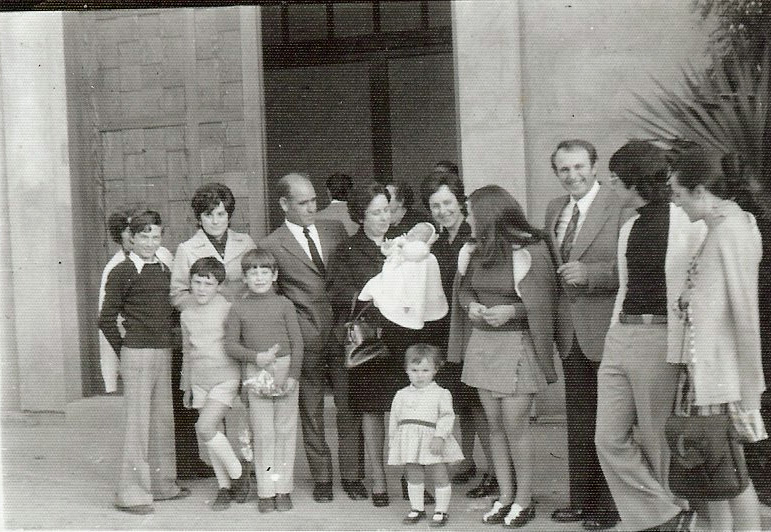

tadeo estava fent la mili, al quartell de Castelló. Abans de marxar a la clínica li van dir que ens anàvem. A les 8 del matí varen vindre els tres, Joseret Juanito i ell vestit de soldat, (anava al quartell), a veure al xiquet, que era més menut que el germà quan va nàixer i molt bonic i molt enfadat, aquest tenia els ull grans i marrons, l mes paregut a mi, la mongeta de la clínica al veure’l allí als tres rosos, i amb els ulls blaus igual que Joan va dir que “*son todos hermanos? se perecen*”, i en aquell moment ens vam adonar que tots teníem 7 anys de diferencia de mi la major a tadeo, Joseret, Juanito i el xiquet que acabava de nàixer.

Als dos mesos de nàixer Manolo vaig estar 3 setmanes al hospital, em van traure una pedra del renyós i no vaig tindre llet per amamantar-lo com al germà. Al xiquet el cuidava la tia Josefina i el tio Agusti. El meu germa major m’ajudava molt a casa, al xiquet igual li donava el bany com el biberó i a l’hora de dormir es tranquil·litzava si li tocarem el cabet, recordo que a vegades quan venia Joseret d’escola o del carrer li deia «*ara te toca a tu, en compte no li fases mal»*fins que es dormia. Varen ser els padrins de bateig la meua cosina del poble Mercedes i Juan Antonio, un altre cosi, per a ells sempre ha sigut el seu fillol preferit.

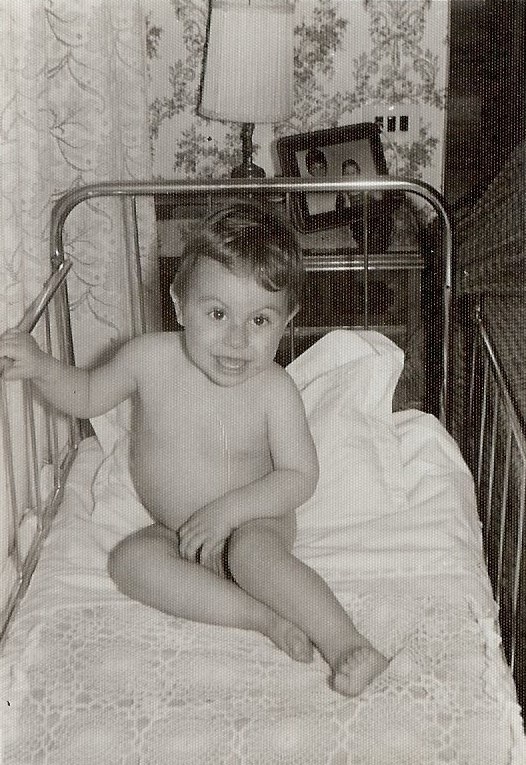

Ja en el pis nou Joseret em va dir molt educat: “ ara que tenim una terrassa podia portar una tórtora que em guarda el meu amic”.Com que m’agraden els animalets la tórtora va vindre a casa amb una gàbia, el seu nom era Sara, es pesava el dia fen gru…gru al temps un dia ens va fugir de la gàbia, que vàrem guardar al traster del terrat.

Passants els anys, el nostre fill gran Juan va fer la mili a Valencia, molts dissabtes venia a casa a passar el cap de setmana, un d’ells el vaig veure entrar per la porta del mercat de Sant Antoni amb un pardal damunt del muscle que no s’anava, tenia una cresta de color taronja i era molt bonic, el fill ens va dir que el va trobar al pati del quartell amb un ala trencada, el propietari d’una pajareria que va anar a preguntar-li, va dir que era una ninfa, un pardal tropical molt maniàtic i que es moriria. Quan arribarem a casa el vaig curar com creia que es feia, nugant-li les ales amb dos fustes fines, em va fa picar per les mans, el seu pic es corb i anava amb les mans plenes de sang la ninfa, estava sempre pel menjador caminant, no podia volar i un dia de moment ens va fer miran-mos un concert, un cant llarg i bonic, i vaig pensar que de morin-se res, estava a sa casa, la gàbia que li vàrem comprar, era quadrada i gran la varem deixar a terra amb la porta oberta, la va recórrer tota, li va agradar, i es va ficar ella sola dins, i clar també li van ficar de nom Sara.

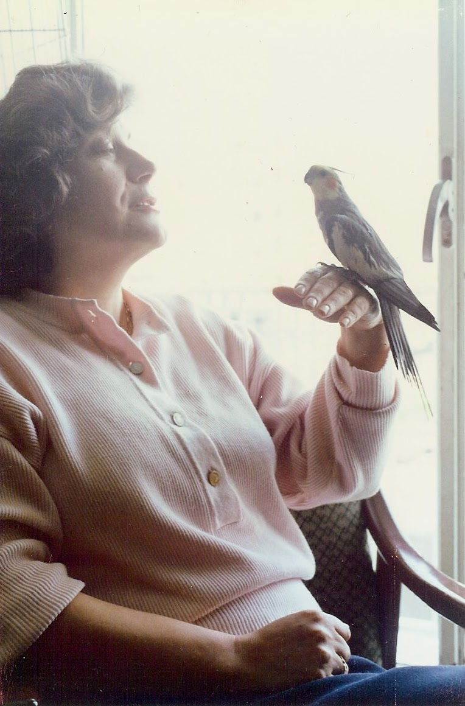

Tenia el costum de estar damunt del rellotge del menjador que tenim a la paret, quan es cansava tornava a la gàbia i amb el pic tancava la porta, de tant en ens feia un concert, li agradava la música però una cosa molt estranya ocorria quan sonava la de Wagner La Cabalgada de Las Valkirias, es tornava boix, sempre que ho provava feia el mateix, no te explicació però era així. Manolo va aprendre a caminar anant agarrant-la primera a gates i desprès caminant. A mi Sara, em volia molt, pujava al meu muscle i jogava amb la cadena que portava al coll, a vegades es ficava el cap amagat a la butxaca del meu davantal, a Joan pare li tenia mania, si podia li picava, era com si li tingues cels. Amb el temps es vam adonar que era un mascle, però com reconeix el nom de Sara, així es va quedar.

Els meus germans eren manyosos com el pare, Joseret era un xiquet molt enjogassat, sempre estava fent invents pel terrat, jo moltes vegades pujava amb Juanito y jugava amb ells. Joan pare, una vegada ens va dir (no entreu a l’altra part dels terrat que ja un vesper, demà el llevaré doncs es perillós) El meu germà menut no sé quina andròmina portava i va entrar, de sobte va sortir corrent i plorant amb un grup de vespes darrere, que li van picar de bo, una de les seues orelles de sobte es fan gran i gran, Tadeet i jo no podíem reaccionar mirant-lo, i ell plorant molt enfadat, al fi, ens varen anar al pis, no recordo que li baix ficar per ha calmar-lo. De tant en tant quan surt la conversa a nosaltres ens dona goix doncs encara està enfadat, diu que no li fèiem cas.

Jo no tenia temps ni de pensar, amb tats homes a casa la faena no s’acabava mai, aunque tenia ajuda de fora erem molta gent, pero, tots els dies trobaba un ratet pa lleguir, ere el meu descans. Quan vàrem comprar la rentadora automàtica va ser molt millor Tadeet era l’encarregat d’estendre la roba limpia al terrat que sempre estava ple, ell tenia una gràcia especial, no s’arrugava gens, jo sempre anava apresa fent coses, però va ser una bona època estàvem tots junts, Joan feia… de pare, i tots els xics es volen com a germans, el mateix que ara.

Quan Joseret va fer la mili a les Canàries en La Marina, tots el mesos l’enviava un paquet de menjar, del embotit sec que fèiem nosaltres i que venien al mercat, Un dia parlant en va dir que tots els amics esperàvem quan arriba el paquet, entre tots, en un moment es feien un bon berenar, mols companys no rebien cap paquet, Jo creia que li feia falta per a ells i amics soldats era una festa.

Al seu temps, els meus germans es van casar i formar la seua família. Per ha mi sempre han sigut fills. jo crec que ells a mi també m’estimen com a mare.

Al meu germà gran, sempre va agradar-li la faena de cansalader com que teníem prou faena ens ajudava, desprès a sigut l’únic que ha seguit l’ofici de cansalader.

*25 febrer 2013*

## 7ª part

El nostre fill gran es casa. Vàrem fer una bona boda, volíem que la dels nostres fill si podíem, no seria com la nostra

Jo vaig ser la padrina i el pare de Lari el padrí. Un dia, abans d’anar-me\`n a treballar al mercat, a la primera tenda que vaig entrar a fer una ullada als vestits, en vaig veure un que m’agrada, no era el clàssic vestit de padrina, però era el que volia i no ho vaig pensar gens, i vaig pensar,”faena feta,” me’l vaig comprar sense provar-me’l la talla que tenien no era la meua i la van demanar. El dia de la prova, m’acompanyava Fina, i Juan ens va dir: jo també vull anar a veure’l, no mai havia vingut amb mi a comprar-me roba però aquesta vegada volia que fos bonic, li va agradar però deia que per a ser padrina tenia que ser més mudat, que desprès del nuvis ja era jo. Hi havia una pamela en un estant i va dir: axió és el que falta, no mai creia que aniria amb una pamela com les angleses però si, estava comoda i a gust del pare del nuvi, (encara la tinc guardada com a record) La dependenta de la tenda em va dir que no mai havia venut un vestit de padrina tan ràpid i sense provar-lo, que totes les mares li donen molta faena.

El banquet va ser al hotel Mindoro el millor que hi havia a Castelló, nosaltres portávem 160 convidats entre parents i amics. I sí, va ser una bona boda.

Tindre el 1º net és una experiència, única jo pensava i Juan també, que la nostra família era un fet, teníem un net!!! Que diferent a quan naix el teu fill, aleshores la responsabilitat és del pares, nosaltres son els agüelos havíem obert camí a la vida. Si mirar als teus fills quan neixen es bonic, mirar als nets es entranyable i es pensa «alguna cosa meua per la genètica està ací, que siguem coses bones».

David era rubiet i amb els ulls blaus com Juan pare I Joan l’agüelo. Quan tenia uns mesos alguna vesprada anàvem a passejar amb el carro la meua amiga Fina amb la neta i jo amb el nostre xiquet, pel barri. La neta de Fina Laura, es morena com ella i David rubiet, feien un bon contrast, a nosaltres ens pareixem els millor i més bonics del mon.

*Manolo el nostre fill menut, va acabar d’estudiar a Maestria com* tots el xics de la família, i després de fer l’any de pràctiques va trobar faena de electricista de manteniment. Nosaltres teníem l’esperança que ell seguiria el negoci quan nosaltres ens jubilaríem, de moment Joan es va jubilar però a mi encara em faltava 10 anys.

A la casa del fill gran prompte vindria un altre xiquet al dos ens feia molta il·lusió.

Manolo, tenia novia, havien comprat un pis de segona mà i estaven arreglant.

Tot estava bé, pareix que tenim bona ratxa.

Els meus problemes de salut seguim com sempre, de tan en tan fortes migranyes. Del melanoma m’havien donat d’alta després de 10 anys, i estar sorda era part de la meua vida, ames d’altres problemes.

Per a mi, el pitjor era estar sempre pendent de Juan, feia 5 anys que va estar molt malalt, ningú s’esperava que es podia recuperar desprès de la crisi de (*muerte súbita*) ni el metge ni ningú. Jo sempre vaig pensar que la Mare de Deu de Gracia ens va ajudar quan davant de la porta de l’ermita va caure com mort, jo li vaig demanar que em feia massa falta que era prompte per a deixar-me sola.

Recordo com un mal somni el viatge amb l’ambulància cap a Vinaròs, el metge fent-li respiració assistida, Juan Antonio manejant-li els peus sense parar i jo amb la palma de la mà dins de la boca per a que no es mossegues la llengua, vaig tindre molt de temps els dits adolorits del mossos que en pegava amb les contraccions de dolor que tenia

Quan al temps vàrem anar a donar-li les gràcies al metge de la Mata ens va dir *: “Juan cuánto le quieren no han dejado que se muera, yo creía que no se recuperaria*. “

Com tots els anys per a San Joan, data en que tancaven els col·legi anàvem a passar l’estiu a la platja a Benicassim. En veritat sols estem tot un dia sencer el diumenge. la resta de dies a les sis del matí ens anàvem cap a Castelló Joan es preparava el género i a les 7 se’n anava al mercat. Els fills i jo ens tornem a gitar al pis així va ser sempre un munt d’anys i a les 4 de la vesprada tornàvem al apartament, No se com ens aclarirem sempre amunt i avall, a Joan, prendre el bany era el seu desig, estava a gust flotant a la piscina, jo sempre estava pendent d’ell cavil·lava, un dia es dormirà i se’n anirà cap al fondo.

Sempre tenía present la primera vegada que es va ficar malalt, com que es va recuperar jo creia que si estava al seu costat podria ajudar-lo com abans va passar, i estava pendent de tot el que feia, a vegades com per la meua deficiència auditiva no escoltava res, ficava la mà damunt seu procurant que no es donaria compte i l’escoltava respirar. Van ser uns anys durs, vivint sempre amb por i angoixa, que no van valer per a res, per que també se’n va anar als 5 anys de la primera vegada que es va ficar malat, era el dia 9 de juliol del any 2000 es va morir com l’agradava desprès d’estar tot el matí a la platja i desprès a la piscina prenent el sol. No se com va ser, però al mirarlo desde el balcó d’un 5º pis tombat com si s’hagués dormit, vaig saber que s’havia anat, m\`havia quedat a soles, jo tenia 55 i Juan feia un mes havia complit els 65 anys.

Vaig pensar en la mare, i vaig reviure la seua pena un altra vegada. No pots comprendre, com aquesta persona que vols tant no tornaràs mai més a veure-la, ni a escoltar la seua veu, és un desamparo total. No entens com el Sol torna a sortir dia a dia, i la gent es riu, i té goig, i tu tens eixa negror dins del cor, com una pedra aprietan que no et deixa respirar, i quan esgotada t’adorms al despertar és una desesperació continuo. No es pot explicar la pèrdua d’un ser que estimes i que et fa tanta falta.

Manolo en va portar un gosset, menut volia que el portara a passejar que no estigera tant a casa i aquesta era una manera de fer-ho tres vegades al dia, era una obligació, treure’l al carrer, també es diu Listo m’hajuda-t molt amb companyia i afecte, i també s’ha anat.

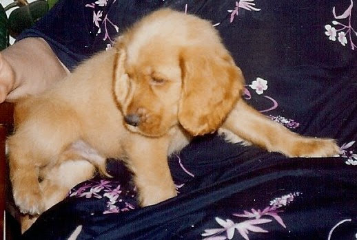

Amb el temps els records s’adormen, de tat en tant tornen i et fan plorar, no importa els anys que faça, una de les moltes coses que més he trobat a faltar, son la complicitat d’eixa mirada, el saber que t’escolta fins i tot no interessar-li el que dius, els silencis en companyia… les coses senzilles i quotidianes que sols sabem la falta que fan, quan no les tens, el compartir il·lusions i angoixes.el saber que t’estima i tu li correspons, a vegades, sense cap motiu aparent l’angoixa torna, quan veus als teus fills amb la família que han format, parlant amb les nores i els nets i juguen amb ells,es el que vols, i m’omple el cor veure’ls. Recordo a son pare que feia el mateix, i torno d’anys darrere i penso… per que?

Tinc 69 anys, en la meua vida tot m’ha ocorregut, massa prompte i a deshora, vaig tindre una infantesa feliç però no vaig ser mai adolescent, quan les meues amigues pensàvem amb festa i nuvis, jo tenia la responsabilitat del meus germans, quan em vaig casar als 20 anys, ja érem família nombrosa, viuda…massa jove, estudiant universitària amb mes de 60 anys, escritora aficionada, el millor de tot sempre m’he sentit volguda. La vida m’ha ensenyat que hi han moments per ha tot: angoixes, dolor, pena, felicitat, alegria i també serenitat.

Sóc la més longeva de la família, ni els meus pares ni agüelos ni el meu Juan, van arribar aquesta edat. Quan els meus germans i jo ens vàrem quedar a soles Joseret tenia 3, Tadeo 10, i jo 17 anys, ells no recorden, o molt poc dels nostres pares i la vida familiar, a sigut dur recordar i donar testimoni d’aquests fets, a vegades, no podia seguir escrivint i ho deixava un temps, i tornava a cavil·lar… soc la memòria de la família, si no ho conto jo, qui ho farà?

*24 juny 2014. Francisca Julian Querol*

Dia 4 de decembre de 2023 recordant.

Els dies se fan llargs. tres vegades al dia anem a passejar Listo i jo, no sé qui passeja a qui si ho fax jo, ho hem passeja ell a mi. Segons els meus fills tinc que parlar amb la gent com ha fet sempre i viure, tornar a començar la meua vida, no se quantes vegades ho ha fet, pero antes tenía companyia, ara és la soledat dia i nit que no l’ompli res, aunque a vegades tens gent al teu costat, tu te sents dins d’un núvol aïllat.

En una de les seus visites, el meu fill Juan m’ha portat un imprès de la UJI. És una sol·licitud d’ingrés al programa de majors que feia un o dos anys que ha començat. Ha escrit totes les dates que demane i als poc dies reb una telefonada de la coordinadora dient que estaba aceptada i que em podria matricular. Tant com anavem parlant, de moment hem diu; “tu eres Paquita la carnicera del mercat? Jo soc Pili”. Li dic “sí, la teua veu la conec, Pili la filla de Pilar del taller del cantó?”.

Aixina va ser el primer contacte amb l’UJI

L’acte d’Obertura del curs va ser el dia 16 d’octubre de 2001, a les 18:30 en la Sala d’actes Alfons el Magnànim de la Facultat de Ciències Jurídiques i Econòmiques, a càrrec del director acadèmic Salvador Cabedo Manuel, amb la lliçó inaugural d’un professor invitat i amb la programació de les activitats del curs 2001-2002 de la coordinadora de la Universitat per a Majors Pilar Escuder Mollón amb la presència de Francisco Toledo Lobo rector de la Universitat Jaume I. Tot molt cerimoniós, allí estàvem tots els estudiants nous i els de l’any anterior, era un altre món per a mi, molt diferent a la meua vida anterior. jo mirava tot amb atenció i curiositat com ens donen la primera lliçó magistral de la meua vida com a estudiant. Tampoc havia escoltat mai en viu el Gaudeamus igitur que em va emocionar pensant que algun dia també el cantaria jo.

El primer dia de classe em vaig donar compte de que la majoria d’alumnes, o eren amics o es coneixien. Aquell no era el meu ambient, pero no va importar massa, tot era nou per a mi. Era un altra manera de veure la vida que volia aceptar, i acostumbrada com estaba de conviure en la gent del mercat, no seria molt diferent, sols calia ser jo mateix.

I comencem el curs per aconseguir el Títol de Universitari Senior promoción 2001-2004 el 18 d’octubre de 2001.

En total érem 79 alumnes homes i dones de molt diferent estatus social i cultural, alguna parella i altres a soles com jo.

Els professors que ens donarien classe eren de diferents departaments. Alguns podien ser fills nostres per l’edat, i les assignatures molt variades.

Les assignatures i professorat que teniem assignats el primer curs estava tot detallat en els documents que varen donar-nos, també el seu correu per si necessitàvem fer alguna consulta. Tor eren facilitats, jo estava asombrada, allò anava en serio res de tonteries.

El meu fill Juan apareix un dia per casa amb un ordinador que tenia retirat, era un teclat, una pantalla gran ampla i una torre que vàrem ficar a terra, i em diu “de moment no te fa falta pero les Noves Tecnologies han vingut pa quedarse, tens que familiarizarte amb elles poc a poc” (encara guarde els disquets com a record d’aquells dies que no sabia com asimilar.) Em va dir “la pantalla es l’escriptori com una taula que tens davant, els documents els pots guardar en carpetes, i sempre copiar el que escrius o se pot borrar. En la barra de tasques voràs el que estàs fent, seguís el que diu el llibre pas a pas i ho faras be, no hem crides fins no estigui tot trencat”. El llibre es deia programación Windows 95, no se quantes cose em va explicar. Quan va marxar tenia la ment en blanc no sabia què fer ni com comenzar. Vaig estar dies fent proves com en un joget. Les lletres més menudes o grans canviant colors, i no se com la pantalla es va fer de color violeta que ferie la vista. Així dies i dies (qualsevol deia res al meu fill per esta tonteria) fins que vaig veure el motiu, i de moment tot estava més clar, i era una satisfacción pensar que amb constància i treball podria anar aprenent totes les coses noves que amb el temps tindria que trobar.

Anar a classe era com viure una aventura inesperada com els xiquets quan comencem el curs, com feien anys darrere els meus fills i germans. El primer era saber on estava tot. Tant gran! Molta activitat per tots els puestos, sempre gent em moviment, edificis diferents uns dels altres, escales amples, ascensor que cabia molta gent, passadissos també llargs i amples, classes plenes, tot un mon de jovens que donava goig i que al principi ens miraven amb curiositat després crec que ni ens veien, ja se van acostumbrar. Les primeres classes van ser a La Escola com deien, varem estar a un muntó d’aules, sabiem quines eren les nostres per els números i lletres de cada una ficades al costat de la porta d’entrada. Quan ja sabia lletres i números, tornaven a cambiar a alguna altra classe que estiguera buida, nosaltres érem els darrers. Vaig aprendre tots el horaris d’autobús i fer torn a la cafeteria com tothom i a conèixer als companys i ha fer la xerradeta que era el millor. Tenia prop a un notari, la seua esposa i un camionero que sempre es ficaba junt a la pared, fins un dia que el vaig agafar del braç i li vaig dir que allí tots érem iguals i desde entonces sempre estavem a les primeres files molt atents, era un home de un poble, discret amb moltes ganes d’atendre tant com jo. Molts altres companys, ells i elles, havien sigut docents. Se notaba amb la soltura que feien els apunts, alguns funcionaris i també persones jubilades que a casa s’avorrien i que venien a passar el temps i fer coses noves. Molt prompte vàrem ajuntar-nos qui teniem les mateixes aspiracions i l’amistat va vindre sense saber com, hi havia homes i dones com jo, i altres que sabien molt més de tot. A mi m’agradava observar i pensar quina seria la seua faena anterior, era divertit, hi havia un company molt serio i atent que no sabia on catalogar. L’any següent que varem fer un treball en grup va dir que era militar. Companyes que cada dia portaven un vestit diferent, ben pentinades i mudades com si allò fora una festa. Jo era del muntó, tenia poc de temps. Parlant de les ocupacions anteriors que cadascú teniem, quan jo deia que era una cansaladera, que la meua faena era vendre al mercat durant 35 anys, a més de fer al nostre obrador els enbutits i el despiece, que m’agradaba molt i que va ser la millor etapa de la meua vida, no sabíen quina cara ficar, i això de parlar en valencià també ho veien raro al principi.

Tots els membres del programa teníem una paciència amb nosaltres com en els xiquets, i prompte estavem integrats en aquell món de sapiencia que sols calia escoltar.

## 1º CURSO 2001/2002

Els temes de tot el curs els teniem ja preparats, aixina com els professors, jo no em coneixia cap, el primer de tot era acostumbrarse al nou vocabulari asimilar el que volia dir.

La primera classe va ser sobre Tècniques d’estudi i investigació: introducció - **José Manuel Gil Beltrán**

Vaig entendre que tenia que començar a pensar con estudiar amb els meus metodes (que no sabia quins eren,) adaptar els estudis a les meues obligacions diaries, portar la casa, respetar el temps d’oci i familiar poder seguir les meues faenes com anar a replegar el dos nets al col.letgi dinar els tres juns el que antes havia cuinat, despres tornar-los a portar al col.letgui i tot segit agafar el bus per anar a la UJI. Buscar un horari per aprofitar el temps i un espai adecuat on podia tindre els aparells necezaris, bona il.luminacio i el mes important per a mi silenci i comoditat, i fer ús del que havia après de les Noves Tecnologies (quanta raó tenia el meu fill Juan al dir-me que em farien falta més prompte que tard saber d’estes aplicacions) disciplina i ganes d’aprendre en tenia prou.

Les explicacions del profesor en la primera classe anaven per eixe camí, un vocabulari nou, paraules que tenia que memoritzar i després de varies classes pensar que tot era tant nou el que escoltava com posible de fer més o menys.

Filosofia i cultura de la tolerància - **Salvador Cabedo Manuel**.

Identitat Psico-social de la persona adulta - **Rosana Clemente Estevan**

En esta asignatura la profesora Rosana ens fa veure com augmenten més les persones majors que en temps passats

Génesi i estructura de la família - **Joan Serafí Bernad Martí**

Genesis vol dir principi començament, en este cas de la familia.

- L’entorn geogràfic: paisatges naturals i humans - **Vicen Ortells Chabrera i Javier Soriano Martí**
- La justícia i el dret: Cuestiones prácticas - **Amparo Garrigues Giménez**
- Europa: significat, història i cultura - **Juan José Ferrer Maestro**
- Manifestacions artístiques més rellevants del nostre entorn - **Victor Minguez Cornelles**
- Educació per a la salut - **Rafael Ballester Arnal** **Mª Jesús Oliver Guasp**
- Economía - **Vicente Budí Orduña**

## 2º CURSO 2002/2003

- Canvi social i perspectives de gènere - **Mercedes Alcañiz Moscardó**
- Lliçons d’economia - **Aurelia Bengochea Morancho**
- Multiculturalisme: formes de vida i conflictes actuals - **Vicent Martínez i Amador Antón**
- Història de la pintura - **Victor Minguez Cornelles**
- Rerefons cultural del País Valencià - **Josep Manuel Quixal San-Abdon**
- Grans problemes ambientals del nostre temps - **Guillermo Monros i Ignacio Morell**
- El ciutadà: drets i deures - **Juan Manuel Badenas Carpio**
- La ciutat a través del temps: nació i estat - **Carles Rabassa Vaquer**
- Educació del temps lliure - **Lorenzo Moreda Barahona**
- Estrés, emocions i benestar - **Francisco Palmero Cantero**

## 3º CURSO 2003/2004

- Història moderna - **María del Corona Marzol**
- Manifestacions culturals en l’entorn castellonenc - **Lluís Meseguer Pallarés**
- Tractament de la informació - **María del Pilar Orús Báguena**
- Història contemporània - **Badenes-Gasset Ramos**
- Estalvi i inversió en economies domèstiques - **María Fernández Izquierdo**
- Informàtica i societat - **Arturo Aparici Castillo**
- Elaboració de treballs acadèmic-científics **- Jesus F. Rosel Remírez**
- Introducció a la Constitució i el seu marc de referència - **Asunción Ventura Franch**
- Anàlisi de les obres literàries i els seus autors - **Santiago Fortuño Llorens**
- Ética i política - **Vicente García Marzá**
- Models d’intervenció psicosocial - **María Raquel Agost Felip i Rosa Maria Paradells Romero**
- Educació musical - **Antonio Ripollés Mansilla**
- Art contemporani - **María Rodriguez Moya**
- Les persones majors en la societat actual - **Alfredo Alfageme Chao**.

Cada lliçó va ser com descubrir un mon que estave amagat per a mi. Temes tan variats com es la vida i el mon. Jo anava d’una sorpresa a un altra. Cada profesor tenia les seues maneres d’explicar per a fer la lliçó amena i diferent, i quina sort poder aprendre amb gust, desde filosofia a temes ambientals, musica, dret, de tot…

Vaig conèixer un altre mon, a vegades complicat, a vegades amen. Quan arribava a casa repassava lliçó per si no havia entès alguna cosa. Era feliç.
