# Qui ho farà?

Diu la meua cosina Mercedes, que tinc molta memòria, sempre tenim la mateixa polèmica quan surt la conversa de quan era menuda, i dic- jo recordo com estava amb més xiquetes menudes com jo a terra recolzada a la porta d’una pallissa a les eres, davant de casa Jaume i ella (la meua cosina deia) -la xiqueta ha perdut un pendiente- Em diu que no pot ser, que era massa menuda, Aquest estiu passat vaig anar a veure la dita pallissa i si, estava, i em vaig tornar a veure en aquest lloc.

I he pensat, per que no escriure els records de la meua infantesa, adolescència, la vida que he viscut, i que a vegades em pareix mentirà?

Aleshores he complit 62 anys, pot ser el moment adequat de fer memòria.

1.

## 1ª part

De la placeta del cap de Vila, surt el carrer el Pilar, en el nº16 està la casa del meus agüelos, allí vivien l’agüela Josefa y ma mare i on viurien desprès els meus pares Encarnación de Franxo (el mote de la família)i Tadeo del mas de Julian. En aquesta casa vaig nàixer jo.

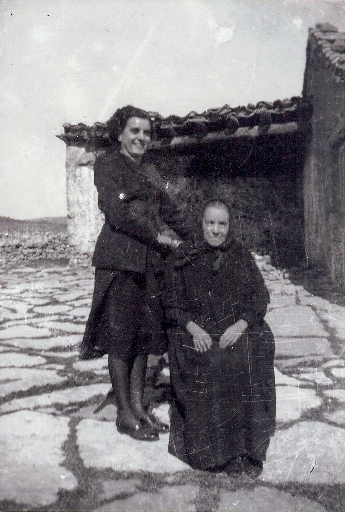

Quan s’havien de casar, l’any 1944 com era el costum al poble, calia anar de casa en casa on vivien els convidats a la boda, a donar un grapat de confits de casa el Fideue i confirmar la seua asistencia, fer una boda com Deu mana era casi un miracle, doncs i havia escasses de tot, el sucre per a fer les pastes al forn, el compraven d’estraperlo a preu d’or, els animalets per a fer l’estofat de carn, tots van vindre del mas de Julian. Un parent de la mare que es deia Antoniet del Fusté (ma mare va fer de passejadora seua) em va dir, que encara recordava la boda dels meus pares quan menja cigrons en salsa, els del convit de la boda van ser els millors que va menjar mai, (era temps de fam). Ma mare treballava a una fabrica de teixits i de faixes, i mon pare era el manyà de casa Granero i de tan en tan, anava al mas de Julian i ajudava als germans i al seu pare, l’avi Josep, al terme de Morella, dins de la dena dels Llivis

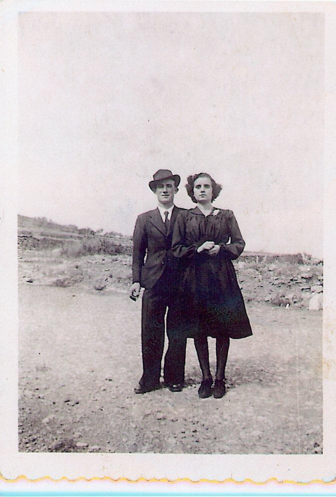

Jo vaig nàixer el 31 de gener de l’any 1945; en plena postguerra i era la xiqueta menuda de totes les cases.

Al carreró de la Placeta, vivia la tia Francisqueta, la germana major, com que ma mare era la menuda de la família, la tia feia el paper d’agüela meua. La cosina Mercedes, sempre em diu:-Quan tu vas nàixer, jo tenia 12 anys i vaig deixar d’anar a l’escola (que no m’agradava gens ni mica) perquè, tenia que cuidar-te, era la teua passejadora. Ens reuníem, totes les xiquetes que cuidaven algun xiquet o germanet al calvari, on hi havia molta herba, us deixàvem asseguts i ens ficàvem a jugar. No se sap la terra que vareu menjar els xiquets d’aquella època, ja estaven immunitzats de tot.

¡¡Passejadora als 12 anys!!

Al poble hi havia fàbriques de teixits i de faixes, i la majoria de dones joves treballaven en elles. Quan era l’hora d’amamantar als fills, acudien totes les passejadores y portaven els xiquets a les mares.

Com a cassi totes les casses del poble, la tia Francisqueta tenia un teler a un costat de l’entrada, i la filla li ajudava fen canons, quan jo em despertava Mercé deia:

–Mare, la xiqueta s’ha despertat i plora-.

Amb el soroll del teler la tia no ho escoltava i seguit deia:

-Ves a veureu –.

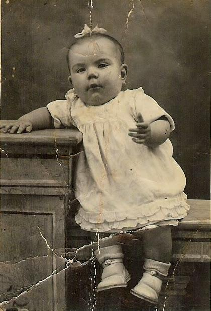

Moltes vegades no hi era veritat, Mercè pujava a la saleta i em pegava uns quants pessics, fins que em feia plorar, m’agafava i ens anàvem a passejar al calvari ho bé a les eres on la esperaven les altres passejadores.

El carreró de la Placeta era el millor carrer del poble per a jugar, hi han 8 cases tots eren com família dons no té eixida i al bon temps es fa la vida al carrer (aleshores també.)

Recordo que vaig estar molt malalta quan tenia el xarampió. La tia tot ho curava amb cataplasmes i infusions de camamilla, que tenia un sabor molt amarg, però a mi m’anava bé. Degut aquesta malaltia sempre vaig tindre problemes als oïts

I anava creixent, amb l’acompanyament de la música dels telers i dels cants de les dones teixidores que escoltaves per tots els carrers del poble. I dels jocs, que abans eren ben senzills, com anar a pescar culleretes a la font del Bassi, on encara estan els rentadors del poble, i buscar pels terrers \<orelletes de moro\> no sé el motiu d’aquest nom, aixó de moro, era molt misteriós (aleshores en diem fòssils) o fer ramells de flors silvestres que quan arribaren a casa, estaven músties.i tot el que a la nostra imaginació se li ocorria, jugava més agust amb els xics del carreró i de la Plaçeta i amb Paquita del bar. A l’estiu quan els pares i veïns estaven prenent la fresca al carrer, nosaltres amb una granera cadascú, anàvem a caçar Rates Penades, per la foscor, jo corria com tots, però no vaig veure cap mai.

A l’escola de pàrvuls hi érem xiquets i xiquetes, la mestra es deia Dª Carmen, i el seu marit Dº Joaquin era el mestre del xics grans, tenien una filla de la meua edat i sempre varem anar juntes a escola. Però a qui més recordo era a la mestra de la classe de les mitjanes, sols de xiques, es deia Dª Antònia, era una jove de Barcelona que vivia a Cinctorres amb els seus pares, tenia unes mans molt fines i blanques i sempre feia oloreta de colònia. Tots el curs s’estudiava amb un sol llibre, però coneixíem tot tipus d’animals, d’arbres i plantes.

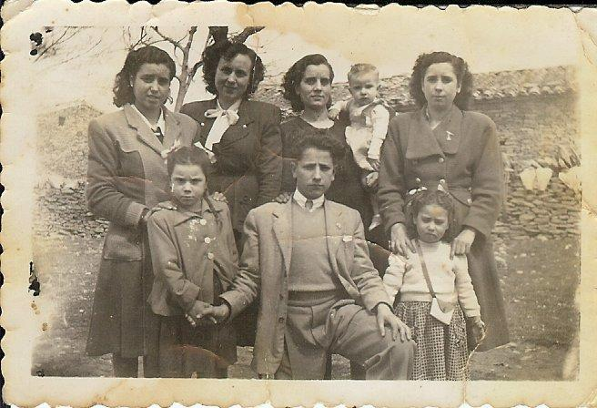

Sabia per veureu fer, de la verema, que del raïm sortia el vi, el millor, dels Collados. De la matança del gorrino, i totes les eines que portava, i dels sopar d’aquesta nit, desprès de fer les botifarres es menjava fesol de desdejuni i la prova del embotit, i clar desprès la festa i les bromes, del matxo del corral, dels animalets domèstics, de la massa del pa, del forn on anava tot el poble, de la batuda a les eres amb el trill, i de tantes coses que la meua curiositat no acaba d’aprendre mai. Crec que aquesta etapa va ser molt enriquidora per a mi, doncs vaig tindre la sort de ser, la meua, una família molt comboiant, que m’ho deixaven fer tot i contestava sempre a les meues preguntes.

Quan va nàixer el meu germà Tadeo el dia 19 d’octubre de 1950 vivíem a la casa del mas de Julian que era dels tios del mas, ells sols venien algun diumenge a fer festa, aquesta casa està davant del Palau dels Sanjoans.

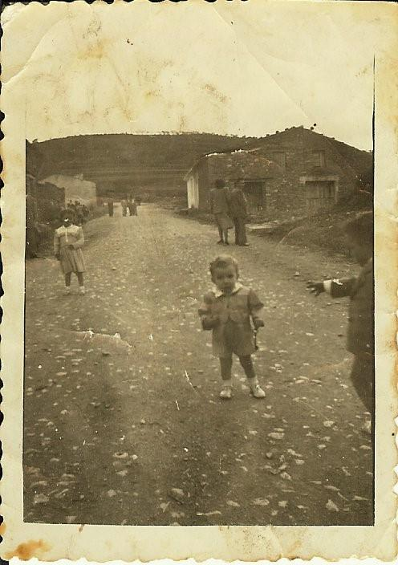

El xiquet era rubiet i amb el ulls blaus com el nostre pare, pareixia un ninot de bonic com era, però feia patir a tots doncs no volia menjar. I estava molt primet, jo vaig portar a les meues amigues Reinalda i Filomena (les tres varem nàixer el mateix dia) a que veren el xiquet, elles no tenien germans, Reina em va dir que ella tenia una nina tan gran con Tadeet i Filo va dir a ma mare si volia canviar-lo per una conilla molt gran que tenien al corral.

Al poc temps els pares varen comprar una casa més gran, prop de la ferreria i del quartell. Al costat vivien la família de Rafel, tenien una filla, Pilar, de la mateixa edat que jo però pareixia més major. Tenia més picardies, no sé d’on treia tebeos i contes que llegíem a les eres que estaven prop de les nostres cases.

Sempre estàvem juntes. Aquest any vaig prendre la primera Comunió, i tot varen ser preparatius. La roba del vestit la va portar el nuvi de Mercè que estava fent el servei militar a l’Africà, Xoxim, a les fotos que li enviava es veia molt gran doncs era als desfiles, gastador (els que van endavant),

El meu vestit, va ser dels més bonics, era da gassa i una greca de floretes amb el fil lluent. Quan el cosí la modista (amiga de ma

mare,) va ser la expectació de tota la família. Jo estava cansada de tanta prova, no era gens presumida, però aquest dia tenia que ser perfecte.

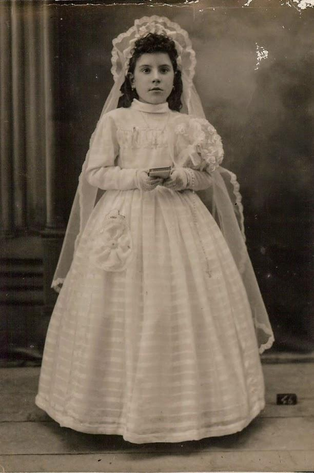

Vaig anar uns quans dies amb el cabell enrotllat en uns aparells per que el dia de la festa, lluirà uns magnífics tirabuixons.

El costum era: el primer que s’apuntava era qui més lluïa a l’església i a les processons, anava davant, i hi havia mare que estava fen torn tota la nit a la porta de l’església, jo estava per la meitat, la tia que era una dona molt practica deia: \<tot son tonteries, el mateix té un lloc que un altre\>,tenia raó, però no m’haguera agradat gens ser la radera.

Desprès de la missa, calia anar pel poble i visitar a totes les cases que ho varen dir a ma mare, acompanyada de totes les cosines i de la padrina, que era la filla de la germana de ma mare la tia Gavina, la cosina Lourdes. En aquestes cases on anàvem sortia la dona, admirava el vestit em deia que havia de ser bona xiqueta i et donava uns diners com regal que la acompanyant encarregada apuntava amb una llibreta, i d’esta manera en anys següents, si calia, en cas contrari fer també al menys el mateix regal.

El dinar va ser a casa, com no cabíem tots al menjador vàrem preparar la falsa blanquinada amb calç i portant fustes de casa el fuster que vivia al costat de la ferreria per a fer les taules. La tia Francisqueta ho sabia fer tot i, ben fet, el que deia normalment tenia raó, era la cuinera oficial de la família, la vespra de la festa va estar tot el dia cuinant.

Els postres a més de les coquetes i magdalenes fetes al forn, va ser collà, de la llet de les ovelles del Mas de Julian, tot un luxe en aquells temps. I el més importat, mon pare va obrir dos de les botells de vi que quedaven, de les cinc que guardava i que va embotellar quan jo vaig nàixer, i que poc a poc amb els anys es varen trencar, sempre va dir que les beuríem quan la xiqueta, fera la 1ºComunió

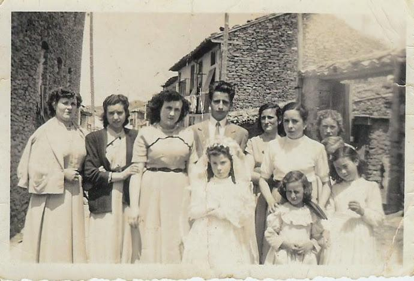

Ja era prou gran, i acompanyava al pare quan pujava al masos de Julian i tambè al mas de Cardona en aquest rader vivia el tio Ramonet i la tia Filomena amb les dos filles, al mas de Julian m’agradava molt estar amb els germans de mon pare la tia Juliana, el tio Fidel i els meus cosins, el tio va ser el padrí de boda dels meus pares, també el meu padrí de bateig, i quan anys desprès em vaig casar també padrí de la meua boda.

Quan anàvem al mas sempre entravem a la Maquina on vivia la tia Rosario germana del pare, la tia sempre estava alegra tenia problemes a munto, però no ha demostrava mai, les meues cosines quan arribàvem, es deixaven de fer la faena i ens contaven tot el que havia ocorri’t des de l’ultima vegada que havíem estat, de tot feien festa. Alguna vegada també entravem al mas de Marzà, aquest mas està abans d’arribar al nostre. a l’altre costat dels riu Calders, allí el pare ferrava als animals de càrrega, i jo mirava tot el que es feia. En un dels viatges, esperava que el pare acabare la seua faena, i em vaig adonar que del sostre de l'entrada entre dos cabirons i en la barra de fusta d’eon es pengen els porcells i el bou quan la matança, hi havia un cabàs a mitja altura de terra i de tant en tant la dona del mas li donava una empenta. fins que vaig veure que dins hi havia un nadó dormint, i la mare el gronxava així, ella podia fer faena i el xiquet estava guardat dels animals domèstics.

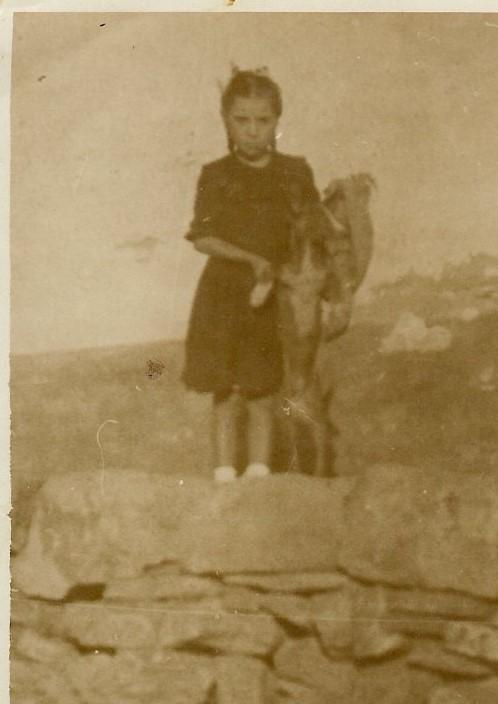

Al temps de la caça el pare anava a soles al mas i desprès quan tornava al poble, ho feia caçant, abans hi havia poca gent que tingué escopeta, i molta caça, La mare tenia uns gerros de fang, amb l'adob de la carn, en un hi havia conill, en l’altre perdius i un altre amb llebre, aquesta darrera, no ens agradava gens.

A la falsa, el pare tenia en una caixa de fusta una fura, que s’enduia a caçar. Com que no estava permès, quan anava al camp, la ficava dins d’un aparell de llanda que es va fer a la ferreria subjectat amb una corretja a la cintura i així no es veia A mi sempre m’han agradat els animals, i estava al meu càrrec donar-li menjar llet amb sopes de pa, jugava amb l’animalet, tenia el pèl molt suau, fins que un dia em va pegar un mos a la orella i el pare em va dir que ja hi havia prou, no em deixava tocar-la mai més.

Aquests anys els recordo com érem: una família feliç sense cap problema, gaudíem de les festes amb els amics, entre tots hi érem un munt de xiquets. Quan feia calor anàvem al pont vell del riu Calders, prop de Sant Antoni de la Vespa, on pesàvem el dia i preníem el bany a un toll, o bé a la nostra finca prop del mas d'En Costa baix dels pins.

Altres vegades anàvem al mas de Julian i a Cardona, on vivien el tio Remonet i la tia Filomena amb les meues cosines. Els tios eren els padrins de bateig del meu germanet Tadeo. I també, al tornar la visita obligada a la Maquina doncs passàvem per endavant del mas, on vivia la tia Rosario amb les meues quatre cosines

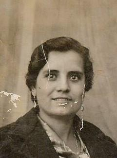

La mare era una dona de poble, espigada, morena molt ermosa amb una elegància natural com la tia Francisqueta i també el seu germà Antonio, els demés germans no eren així. Tenia uns immensos ulls negres, quan estava alegra li sortien com estrelletes d'ells, els cabells negres amb ondes quan el pentinava cap a darrere.

Ningun fill ni nets, hem heretat el seu estil, ni els seus ulls amb les estrelletes que jo sempre veia.

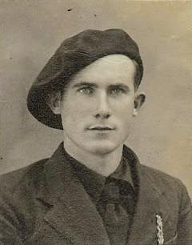

Li agradava llegir (en una època sense llibres).Va ser la menuda de set germans, i l’única que va anar a un col·legi de pago a les monges del poble, de la Consolació,(tinc una foto antiga de tot el grup d’alumnes i la mare era menuda i primeta, sols se li veuen ulls,) els seus pares sempre varen viure amb ella, fins que van faltar. A mi em va ficar Francisca amb memòria de son pare (l’agüelo Franxo).

Anys darrere, el pare que la volia molt, quan ja estava malalta em deia ensenyant-me un bitllet de cent pessetes, on es veia la pintura d'una dona morena(La Fuensanta)que va pintar Julio Romero de Torres (Aixína era ta mare quan era jove, la dona més guapa del poble)

El pare, era un masover presumit (segons m’ha dit Merce).Anava a Cinctorres a festejar a ma mare damunt d’un cavall, al trot i amb un mocador de seda blanc al coll.

Jo el recordo amb pocs cabells, amb la boina ficada coquetament de costadet. Tenia els ulls blaus com la meitat dels germans i el seu pare l’agüelo Josep, i molta habilitat per fer tot tipus de faenes, molt creatiu, jo veia que l’estimava la família i amics, era un home sociable amb tots.

La ferreria on treballava el pare estava prop de casa nostra, sols hi havia que creuar l’era i la carretera, es deia Casa Granero, allí es reunien a vegades, els veïns que tenien ganes de xerrar, quan es feia tard a la vesprada i poca faena com ara el metge l’ apotecari i fins i tot el senyor retor. A mi m’agradava veure com d’un tros de ferro desprès de ficar-lo al foc de la farga i a colps de martell en l’enclusa li donava la forma que calia, i em deia (no t’acostes que et cremarà alguna espurna).També m’agradava tot el procés de ferrar els animals i els domini que tenia sobre ells.

Una vegada que estava per allí, varen portar un cotxe per que l’arreglaren, no sé el què, (fa poc de temps he sabut que era un vehicle amb el motor Chevrolet i fet de diferents peces segons m’ha dit el que era el seu propietari Manuel Ibañez.) gendre del Tint, pare del veí del meu fill Juan a Cinctorres, Era un vehicle de ferro les potes de fusta molt fina i lluenta, amb seients, de forma quadrat, bare ser l’admiració de tots els que estaven allí, i vaig escoltar que es deia una Rubia. Aquest va ser el primer cotxe de veritat que vaig veure, a més del camió de Costeta, en el que a vegades anàrem o veníem de Morella, damunt de la caixa entre la mercaderia.

Al temps vaig notar que els meus pares a vegades parlaven molt seriosament, jo escoltava el que el pare deia, la mare ja no treballava a la fàbrica com quasi totes les dones del poble, tenia problemes respiratoris de tant de temps d’inhalar la borra dels filats.

-Si ens hem d’anar té que ser prompte, ja tinc 38 anys i cada vegada hi ha menys animals de carrega i poc a poc vindran els cotxes i aquesta faena s’acabarà.

Al poc temps mon pare se’n va anar a treballar com manyà a la conca minera d’Andorra al Baix Aragó i nosaltres ens varem quedar al poble fins que poguérem reunir-nos.

Quan feia 3 mesos que estàvem a casa soles, vàrem rebre una carta en la que el pare ens deia molt content que ja teníem vivenda i que aleshores venia a buscar-nos. Tot eren preparatius paquetant coses, roba i tot el de casa I amb un camió, clar, el que hi havia al poble, el mateix que valia per a tot, fins anar de festa i tos el menesters necessaris(el de Costeta) un home molt amic de casa, ple del nostres mobles i tota la família damunt ens varem anar al nostre nou destí. La família del poble estava trista i nosaltres també, dons sempre estaven tots juncs i sabíem que ens trobaríem a faltar. Pareixia que ens anaven a la fi del mon.

31 gener 2007

## 2ª part

Abans d’aplegar al nostre nou domicili vàrem seguir un bon tros per la vorera del riu Bergantes allí encaixada entre les roques a ma esquerra estava La Balma, i més avant ja estaven a L’Aragó el primer poble Aiguaviva, Mas de les Mates on el riu que a Cinctorres es Calders quan surt del Forcall es amb el nom de Bergantes, s’unís al Guadalopiño, afluent del Guadalope i més tard a l’ Ebre, (aço ens deia el pare molt content de estar tots junts) i desprès Alcorisa un poble molt més gran que Cinctorres, als pocs Km ja vàrem notar una olor diferent com un poc picant. Nosaltres estàvem habituats a un altre tipus d’olor, de camp i d’animals, que abans estaven als corrals de les cases.

La primera impressió va ser de veure un poble en una planícia, recolzat al vessant d’una muntanya i damunt d’aquesta una ermita, (San Macario patró del poble.)I al costat de aquest poble un grup d’edificis i carrers nous. Cap ell ens varen anar i quan el pare ens va ensenyar molt orgullós el nostre carrer, vàrem veure, que hi havia més gent com nosaltres instal·lant-se de nou.

Aquest lloc es deia el Poblado, i era on vivien tots els empleats de la Empresa Nacional Calvo Sotelo.on se explotava l’extracció de carbó en varies mines de lingnito, dins de la conca minera de Utrillas-Escatron. Aquest carbó l’enviaven per la via ferrea de Ojos Negros als Altos Hornos del Mediterraneo, Sagunt.

Tots els carrers del Poblado eren amples, llargs i tenien nom de pobles de la conca minera d’Utrillas, els nostre es deia carrer de Gargallo, amb una cera ampla al mig i arbres recent plantats, les cases als dos costats, per la part de darrere estaven els patis de l’altre carrer, les cases en grups de sis, (el mateix que aleshores els adossats moderns) Nosaltres teníem un cantoner, amb el nº39 i el pati era més gran, la vivenda era una planta baixa amb tres dormitoris, menjador- cuina, bany amb dutxa i tota l’aigua calenta que volgués, sols hi havia que obrir el grifo, això era un luxe, quan la mare estava acostumada a portar l’aigua amb cànters de la font, allunat del poble per a el consum familiar, i anar a llavar als llavadors. Prompte vam fan fer un galliner al pati i també una conillera, plantar una parra a cada costat de la porta, un jardí voltant tota la construcció i un passadís d’obra per no entrar terra a la vivenda, a més d’un arbre que ja estava plantat, que feia un fruït riquíssim que no vàrem saber mai com es deia((aleshores ho sé, nectarina) i un ermós hort d’hortalisses que regàrem quan feia falta, un luxe per nosaltres, doncs a Cinctorres a mes del clima dur hi havia poca aigua per a tot. També hi havia feta una carbonera, cada mes venia un camió pels carrers i portava uns quants sacs de carbó per el consum de totes les cases de manera gratuïta. Prompte em vaig fixar que quan marxaven els carboners ens agarraven la fruita de l’arbre i sempre estaven pel jardí vigilant que no fora així.

Com sempre, jo era l’encarregada de cuidar del animalets de casa conills i gallines, a la mare no li agradaven tant com ami. Teníem un gall roig al galliner molt ermós, que sol em deixava entrar a mi a donar-los menjar i traure els ous del ponedor. Una de les vegades que Tadeet va entrar al galliner no se per que, va sortir corre’ns per tota casa perseguit pel amo del galliner, el gall roig, quan el va alcançar d’un sal va pegar-li unes quantes picades amb el pic al cul, el xiquet es va ficar a plorar, i el gall, satisfet i esplai se’n va entornar al galliner, Ningú va voler entrar mai mes, sempre esperaven que fora jo.

Al nostre carrer arbrers i plantes prompte varen desaparèixer. Els xiquets jugaven per tot ells llocs, tot era un camp de joc, sols respectaren les plantes que hi havia al costat de les portes on cada veïna les cuidava a veure quines eren mes boniques, nosaltres sempre teníem clavells i unes margarites que es coneixien per (despidenovios.) Els pares sempre van ser coneguts com Srª Encarna i Srº Tadeo per tots

També teníem un gos de color canella de nom Listo, que vare vindre del poble amb nosaltres, sempre anava amb el pare al treball, era bon caçador, moltes vegades estava el gos pel pati i de moment desapareixia, fins que vaig veure que un veí que també era caçador s’arrimava al nostre pati i cridava al nostre gos Tadeo...i l’animal saltava la tapia i se’n anava amb ell, desprès quan tornava feia el mateix, tenia dos noms i amb els don feia cas. Quan li vaig dir al pare, ell amb un somriure em deia(*no t’apures que no mol furtarà, Listo sempre serà nostre)*. Un dia el pare va vindre de la mina sense el gos, de moment no es vàrem adonar, però al fi ens va dir que havia tingut un accident en la mina, no ens va voler dir com va ser.

Aquesta vida no tenia res que veure a la d’antes quan vivíem a Cinctorres. Es parlava amb castellà hi havia gent de tot arreu, la majoria andalusos i una família de La Todolella, els únics que parlaven en valencià com nosaltres, vàrem aprendre enseguida a parlar com tots, pel carrer amb castellà, però dintre de casa sempre la nostra llengua, amb valencià. Al carrer hi havia un munt de xiquets, doncs tots eren famílies jovents. La mare deia que no havia vist mai dones tan malfeineres doncs sempre estaven xafardejant, se li feia estrany no treballar com ho havia fet sempre, feia labors de calça, sempre portaven jerseis, molt bonics.

Al poble vivien una família de Cinctorres, Gregorio i Manuela, i un fill que varen adoptar que es deia Paco. Tenien un establiment de tintoreria, La Ràpida es deia, eren molt amics dels pares.

En el Poblado a més dels col·legi de les monges també hi havia de pares Salesians on anaven els xics, una església i un economat, i al poble antic Andorra, tendes com a tots els pobles.

Jo anava al col·legi de les monges de La Caritat que a més tenien cura de l’ hospital, i el meu germà Tadeet com que anava a pàrvuls també.

M’agradava el col·legi, Les monges portaven un tocat blanc com si foren ales emmidonades i l’hàbit negre, també era diferent l’ensenyament, a més de música, tot tipus de labors i comportament per a ser senyoretes. Tenien un quadre d’honor on ficaven les fotos de les alumnes més aplicades. Jo hi estava, també el meu germà Tadeo a la classe de pàrvuls. Una vegada en va dir la mongeta -*se merece estar en el cuadro de honor, es muy buen niño y tan bonito que parece el niño Jesus*- I era veritat, els ulls blaus, rosset, i els caragols li caient per el front.

Tadeo ja anava al col·leg, i al Salesians, els diumenges desprès de missa es quedava un ratet allí, a jugar amb més xiquets. L’agradava molt un jocs que es deia Mecano, compost per peses de ferro i tornillos, es podia fer moltes estructures, desde cotxes a torres grans(o se per que quan els meus germanets estàvem amb mi, un any els Reis d’Orient van portar aquest regal, i sempre feien molts joguets amb ell).

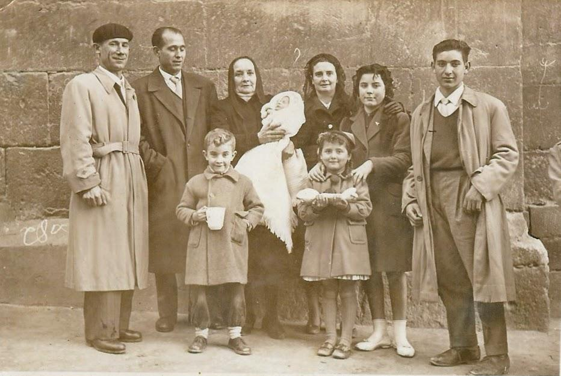

Quan El meu germà Tadeo bare complir 7 anys va nàixer el nostre germanet Jose Manuel, portava el nom de les dos agüeles, la del poble Josefa i la del mas Manuela, va nàixer el dia 10 de desembre de 1950. també era rosset i amb ulls blaus com jo volia, la mare el portava vestit amb bolquers i faldons, molt bonics, no em deixava mai que jo li ficarà. Jo tenia 14 any edat suficient pa ser la padrina del seu bategi i el padrí va ser Paco el fill de Manuela i Gregorio. La tia Francisqueta va estar uns dies cuidant a la mare i es va esperar al bastegi del xiquet,

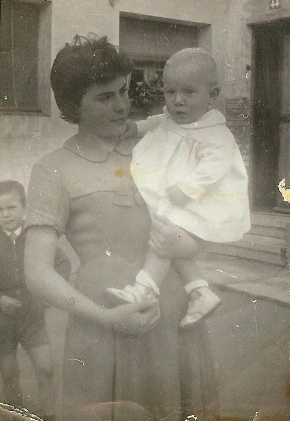

Recordo que un dia que el pare i jo ens varem quedar a soles em va dir: *(esta es la nostra, el despullarem i el vestiràs tu Paquita),*si el vàrem despullar, però no ens vam aclarir a ficar-li els bolquers o bé els aprestàvem massa o massa poc i li caient, quan va tornar la mare el va vestir ella, i ens va dir als dos,:(*pareix mentirà no teniu coneixement per culpa vostra el xiquet tota la vesprada despulla*t), i tenia raó el vàrem embolicar amb roba com vam poder. M’ha quedat amb les ganes de saber com es feia.

La mare va començar a tindre problemes de salut i de tan en tan atacs d’asma, es passava les nits recolzada amb un munt de coixins sense poder respirar. Jo sols demanava a Déu que no tingué mai aquesta infermetat. Quan el pare treballava el torn de nit, jo em feia càrrec del xiquet, tenia el bres al costat del meu llit, quan per la matinada li tocava menjar, m’alçava i preparava el biberó del xiquet en un fogó, elèctric que teníem per a aquest cas li donava el biberó i el que fera falta, doncs la mare no el va poder amamantar com a nosaltres, es va criar amb la llet condensada Nutricia i una papilla de llet amb Maicena, estava grosset i ermós.

El nostres estudis anaren bé un any vàrem fer un obra de teatre Maria Estuardo, em van donar aquest paper a la representació, i vaig estrenar un munt de tragues d’època de vellut amb color roig i blanc que cosíem a la classe de labors I varen vindre els meus pares a veure la representació

Jo a classe anava sempre, menys als viatges i excussions doncs la mare no podia cuinar pel trufo que feia el carbó de la cuina. M’agradava cuinar, i la compra també va passar a ser cossa meua. Teníem una bugadera que venia a cassa totes les setmanes, i les demés faenes de la cassa les feia jo.

Prompte vàrem comprar una màquina de cosir Alfa que li feia il·lusió a la mare, ens va costar 800 pts, en els anys 50-60 aquestos diners eren una xicoteta fortuna, i em va ensenyar a cosir amb ella, i també una bicicleta de xica marca Orbea. El pare va acoblar un seient plegable davant del manillar que el mateix podia portar coses que al meu germà menut, quan el xiquet veia que em preparava plorava doncs li agradava molt vindre amb mi, i moltes vegades no el volia agafar.

També ens feia falta una radio on escoltàvem a més de les noticies, els, discs dedicats de radio Saragossa, i els serials radiofònics, un dels que recordo: (*Simplemente Maria*) i un programa molt famós de consultes sentimentals i de tot tipus que es deia de Elena Francis. La radio tenia la marca Clarión I de tant en tant sintonitzàvem d’amagat la emissora radio Pirenaica, quan hi havia algun problema a les mines.

Amb els temps pareixia que sempre haguérem viscut allí.

A l’estiu la mare i els meues germans menuts anàvem a Cinctorres, allí es trobava millor i també acudia la germana de la mare que vivia en Amposta, la tia Josefina. Pujàvem a l\`autobús de Andorra fins Alcorisa seguit directe a Morella i desprès un altre transbordo fins a Cinctorres

 En aquells temps es van casar les meues cosines de Morella jo vaig anar a totes les bodes o bé en mon pare i també amb ma mare i el meu germà Tadeet. Tenim el testimoni de totes les fotos de les bodes amb els convidats davant de la porta dels Apòstols de Morella. Jo sempre em quedava a dormir a casa la Parra, al pis de dalt on vivia una cosina del pare que tenia una filla de la meua edat Juanita. (Quan ens vàrem veure als 60 anys no ens vàrem reconèixer.)

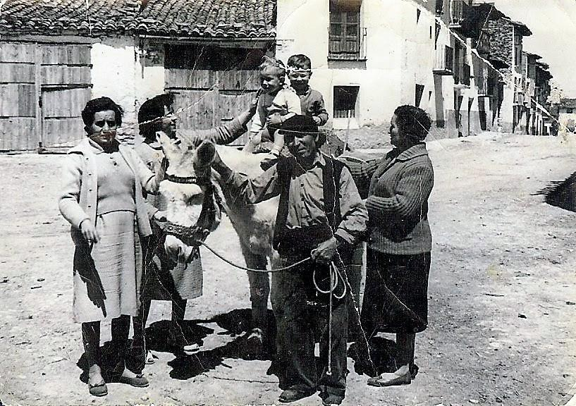

Un dia el pare va vindre molt content amb una moto de segon mà pareguda a la Lambreta italiana, es deia Iso i em va ensenyar a portar-la per una carretera que no tenia trànsit que anava a les mines

La mina on treballava es deia La Innominada, amb torns setmanals de mati, vesprada o nit, anaren amb camions que sortien del edificis de les oficines, a les diferents mines com La Fortuna, la Maria i El Pozo. Quan tornaven a casa els miners estaven tots mascarats quasi desconeguts però contents doncs era un treball molt perillós i moltes vegades hi havia accidents. El pare era mecànic estava al taller però quant hi havia alguna avaria on feia falta, fins i tot al llocs més perillosos.

*He buscat moltes vegades el llibre de consulta (Diccionario)que teníem a casa, i no l’encontrava, fins un dia, en que vaig veure que el tenia el meu germà a sa casa i em va alegrar, doncs sé que ell també l’estima.* Aquest llibre, és, un petit diccionari on fèiem totes les consultes quan no sabíem sobre algun tema determinat. Una vegada que jo mirava el dibuix d’un alambí i estava pensativa intentant imaginar-me el seu funcionament, el pare em va dir:- En farem un al pati. i veureu com funciona, buscarem pel camp espígol i tindrem essència feta per nosaltres -.I així va ser, durant uns dies segarem amb una faç tot l’espígol que trobarem i amb garbes damunt de la meua bicicleta el portarem a casa.

La mare ho mirava tot amb paciència, doncs ja estava acostumada als (invents) dels nostre pare, El meu germànet Tadeo participava amb tot, tenia tanta curiositat com jo. A un costat del jardí va començar a fer l’alambíc, no tenia res a veure amb el dibuix però nosaltres estàvem segurs que funcionaria. Un bidó gran de llanda tancat hermèticament es va convertir amb una caldera, d’on sortien un entramat de tubs de plom amb forma de serpentina que estaven dins d’una bassa plena d’aigua, quan la caldera estava plena d’espígol, enceníem el foc, el vapor que sortia es condensava pels tubs dins de la bassa, plena d’aigua freda i poc a poc, gota a gota, sortia la millor essència d’espígol que hagués sommiat mai. Vàrem omplir una botella buida de Licor 43. (encara en guardem un poc)Aquesta va ser la primera lliçó practica de química important que recordem. Desprès en vindrien més, com enquadernar els fascicles de novel·les que ma mare comprava per correu i que m’ha fet apreciar els llibres antics, doncs sé el que costa cosir full a full tot el llibre i cuidar- los, i ensenyar als meus, el valor que tenen els treballs manuals de tota mena. I mes cosses.

L'any que va prendre la 1ªComunió el meu germà Tadeet, el dia 26 d’abril de 1959 també varem fer la festa corresponent, el convit el van fer a casa, les pastes amb el forn de la cuina (econòmica com es deia)primer fer la confitura de carabassa amb sucre i mel per ha les coquetes, varen vindre els parents de Cinctorres i Morella com sempre. L’ empresa Calvo Sotelo regalava el vestit als xiquets dels seus treballadors.

La Missa era al poble on es feien totes les cerimònies oficials, recordo que no se per quin motiu els vestits no arribaven i la mare li va comprar un de mariner com era el costum, volia que el xiquet estigues ben mudat, a les poques dies varem rebre el regal de la empresa de treball del pare, també era un vestit de mariner.

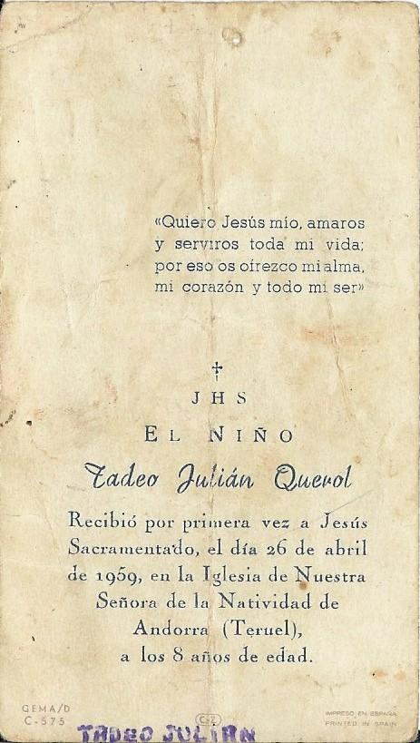

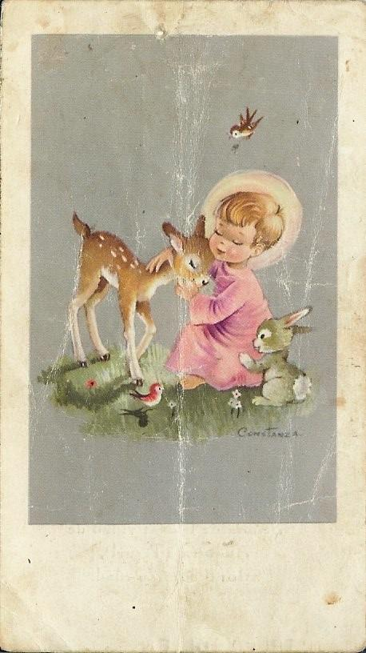

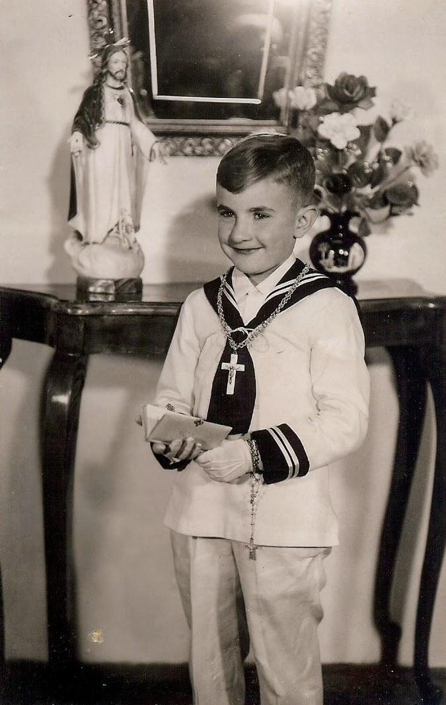

Aquest el varem guardar. Així que Tadeet va tindre dos vestit de comunió casi iguals.

Quan ara les meues amigues parlen de quan teníem 14 u 15 anys i diuen -que bé o pesàvem quan anàvem a passejar per la carretera de Portell i a ballar a casa Jaume, jo es recordo que m’agradava més anar-me’n al mas de Julian on vivien els tios Juliana i Fidel, a mes del meu cosí Eugenio on aprenia moltes coses, \< Brigida es va casar i vivia a Morella\>

Els meus pares pensaven viure al Poblado fins la jubilació. A Cinctorres teníem la casa llogada a Lourdes quan es va casar. El pare sempre deia.-Amb els trossets de terra que tenim més la finca del mas de Bernardo per entretenir-me, quan serem majors estarem bé. Però les coses no sempre surten com volem. La mare cada vegada estava pitjor de salut, sempre malalta i a més de patir molt no podia fer res.

I poc a poc les estrelletes dels seus ulls que jo sempre mirava

se anaven apagant.

Un estiu estava jo al mas de Julian, i varen vindre els tios i la meua cosina de Castelló Treme i ens vàrem anar amb ells Eugenio i jo a conèixer la ciutat. Vivien a una casa en la quadra La Salera, Treme ens ensenyava tot, el Port al Grau, les viles de Benicassim i va ser la primera vegada que vaig veure la mar.

El canvi en Andorra va ser total i em vaig adonar que no podíem seguir vivint allí fins i tot també em molestava l’olor de sofre que es respirava en l’ ambient, no podia ser bo per ningú, i vaig dir-li al pare.-Perquè no ens anem a viure a Castelló com els tios? He vist que hi ha un Sanatori de malalts dels bronquis això bol dir que el clima es bo, segur que la mare estaria millor.

Al temps, la mare els meus germans i jo ens varem anar a Castelló, a casa dels tios Josefina i Agusti, Hi havien canviat de casa, aleshores vivien dins de la ciutat en un grup de cases que es coneixien com Els Colorins amb un pis prou gran que donava tot al carrer, molt alegre. Per la part de davant passava la Panderola un trenet de via estreta que anava des del Grau fins Onda i els pobles del voltant. Era de lo més divertit, sempre xiulava i anava poc a poc. En aquest mateix trenet anàvem a la platja.

Quan estàvem quatre mesos la mare es trobava molt millor i ens va dir que no volia tornar al Poblado, on no podia respirar i sofria molt.i varem decidir que si el pare trobava faena ens traslladaríem allí El tio coneixia molta gent i va trobar de manyà, el seu ofici.

En vaig anar fins Andorra a soles, per ajudar-li amb el trasllat dels mobles i tot el que teníem.

Em vaig acomiadar de les amistats i amigues, tenia 16 anys doncs ja en rondaren els xics La mare sempre em deia *– no em portes a casa cap noví andalús, aquesta gent son molt renyidors-* i tenia tota la raó, doncs els veïns, sempre estaven renyin amb algú pels xiquets(que al moment ja tornàvem a jugar junts) o per la més xicoteta tonteria, jo sempre li deia, sols em casaré en un xic amb els ull blaus, i encara no en conec ningun que m’agrado.

A les meus amigues també els deia el mateix. Em rondava un xic del poble molt temprat amb bona posició econòmica que tenia un negoci de distribució d’embotits, li dèiem El Xoricero però com que no tenia els ulls blaus no m’agradava gens ni mica i no li feia gens de cas.

Amb el temps a Castelló em vaig casar amb un xoricero que si, aquest tenia els ulls blaus, i el meu primer fill era com ell, com sempre hi havia somiat.

8 maig 2008

## 3ª part

Som castelloners!! El dia 2 de gener de 1961 vàrem arribar a Castelló mon pare i jo de Andorra en un camió (esta vegada no era el de Costeta) portàvem els nostres senzill mobles i el que teníem, la mare i els meus germans estaven a a casa dels tios. Tot ho varem guardar al magatzem de la vivenda dels tios Agusti i Josefina al grup Els Colorins, el seu pis era el 4º i tots nosaltres vivíem junts amb ells, fins que trobàrem una vivenda. Abans havíem venut la casa de Cinctorres a la meua cosina Lourdes doncs en la nostra casa es va ficar a viure de lloguer quan es va casar en Juan Antonio de Verdures. En aquestos diners de la venda, pensàvem comprar la nostra vivenda a Castelló. Però el primer era buscar treball, el pare va trobar faena a un taller on es feia falta un ferrer de poble i enseguida comença a treballar.

Els tios ens deien que a Castelló no era com a Andorra, on les dones i jovents no feien res, ací tot hom treballava o estudiava. Vàrem decidir que seria millor que jo buscarà faena doncs a casa feia falta ajuda. Vaig anar a una tenda de maletes de nom Bolsos Fraga que estava davant del mercat central i em van fer una entrevista, també vaig anar a la fabrica de Dàvalos de filats, em van, dir que els següent dilluns entraria a treballar i que prepararà el documents necessaris. Aquella mateix nit em varen vindre a buscar a casa dels tios \<que era la direcció que vaig donar\> una dona de la tenda dient-me que em volien donar faena. Com que ja havia donat la paraula a la fabrica de filats, vaig dir que no podia anar, la dona que va parlar en nosaltres em va dir que els agradava el meu caràcter que aprendria molt prompte a vendre a la tenda i que estaria molt bé. El pare em va dir que jo era qui tenia que decidir Però vàrem pensar que no estava bé fallar als que primer em van dir que sí.

Mentrestant el pare anava busca’n vivenda, sempre per les afores de Castello, a ell li agradava una caseta amb pati com si estiguérem al poble, en va veure una al final del carrer de Segorb, eren dos fileres de casetes adossades, actualment encara estan allí i un altra al final de la carretera de Valencia també el mateix, dos fileres de casetes on vivia un amic del poble de nom Daniel i Rosario de Marco, les casetes formaven un carrer, la construcció era de poca qualitat, aleshores estan entre blocs de pisos, no fa molt de temps les vaig veure.

Em van demanar opinió i recordo que les dos vegades els vaig dir el mateix, (si tinc que treballar a torns, hem de viure dins de la ciutat doncs entrava a treballar a les 5 del mati y 45 minuts i per el torn de vesprada sortia a les deu de la nit, i tinc que anar a soles, vostès patiran) abans les dones no anàvem soles pel carrer. Quan va passar el temps vaig adonar-me que els meus pares sempre van tindre en compte les meues idees, cosa que abans no era usual.

No sé com podíem viure tanta gent junta a casa els tios, sense cap problema de res, crec que el compartir, ens fan més humans.

A vegades he pensat que tinc intuïció, m'ha donat compte moltes vegades, i crec, que tot el que amb el teu esforç i treballat, si ho vols, més tard o menys ho aconseguiràs, estic convençuda que es així.

Un diumenge que anaven al cine Oeste per la vesprada al passar per un carrer vaig veure una dona asseguda a una finestra, i vaig pensar, un pis com aquest ens aniria bé a nosaltres. Als pocs dies els pares em van dir: anem i veurem si t'agrada un pis que esta en venta, varem anar tots i la meua sorpresa va ser molt gran, compràvem la vivenda que a mi m'agradava, i que vaig mirar quan anàvem un diumenge al cine, al carrer Vazquell Mella nº 46.

Teníem com a veïns a una família de La Puebla de Arenoso. La Sª Dolores a la planta baixa i al primer pis el fill, Vicente el sabater,(arreglava sabates), i baix de nosaltres estava buit, al temps el van comprar la Sº Maria i el seu marit Manolo, més tard:(els agüelos dels meus fills)

La Sª Dolores era una dona singular, en aquella casa cabien tots els coneguts del pobles quan venien al metge o per faena, tenia 5 fills i un munt de nets, com que tots la cridaven agüela nosaltres fèiem el mateix, els meus fills i germans es van trobar l’agüela que no havien tingut mai, i com calia, a totes les nostres celebracions ella sempre estava convidada.

El meu germanet Tadeo el vàrem matricular primer al col·legi prop de casa dels tios que es deia La Normal, no recordo quan de temps va anar, i desprès quan Jose Manuel va tindre l’edat al col·legi del nostre carrer de nom Ejercito, té aquest nom per que tot aquest bloc de cases. estaven vivint els oficials del quartell de Sant Francisco que estava al costat. (*actualment és la nostra parròquia de nom Sant Francisco. En un dels meus treball de la UJI està tot detallat, vaig fer un treball de investigació sobre la historia del quartell i abans convent, ermita i més coses de 1400 fins ara.*

Estàvem agust a la nostra casa, els veïns eren com parents, les portes del pis sempre estaven obertes, ens coneixíem tots, a l’estiu sortíem a prendre la fresca i a xarrar com als pobles. Tot anava bé.

Tadeo mon pare quan estava content cantava sempre la mateixa cançó que deia: (*El dia que naci yo que planeta reinaria por donde quiera que voy que mala estrella me guia*) a mi no m’agradava gens aquesta cançó era trista era com una mala premonició.

Quan vàrem vindre a Castelló la mare i jo estaven tranqui-les desprès de estar tants anys sofrint, la faena a la mina era perillosa, i havíem vist molts accidents greus i famílies conegudes desfetes, però la vida és una lluita sempre, i no sabem mai quan s’acaba.

El dia 9 de febrer de 1963 a les escales de casa vaig trobar al pare que s’anava al taller amb la meua bicicleta, a vegades anava amb la moto, jo venia de la fabrica, eren prop de les tres de la vesprada, va ser l’ultima persona que va parlar amb ell.

Un hora més tard un guarda va vindre a casa a dir-nos que hi havia hagut un accident i que l’acompanyarem al hospital que està prop de casa. La mare i jo amb una mirada vam tindre prou, sabíem el que volia dir. De res va servir fugir del perill de la mina, ens quedàvem a soles, era el nostre destí.

La mare sempre va viure a l´ombra de mon pare, no els vaig veure ni escoltar discutir mai, al estar sempre malalta el necessitava molt una paraula seua la tranquil·litzava, era un voler que es palpava. Com que tots eren menors d’edat necessitàvem un tutor, la mare va decidir que el tio Agustí era la persona de més coneixement de la família i que ell faria el que fora menester per nosaltres (com així va ser). I sempre ens deia, que no li pagaríem mai, la preocupació, i tot els jornals de faena que va perdre per nosaltres.

Per moments la mare es diluïa es va fer transparent, no era ni l’ombra, els seus ulls negres, lluents que parlaven s’anaven apagant. Tenia derrames i el metge Velo va dir que s’havia d’operar urgent, sempre estava al llit, jo treballava a la fàbrica i arribava a casa amb por, no sabia que trobaria. Isabel la dona del sabater sempre estava fent-li companyia quan jo no estava, Jose Manuel que tenia 3 anys estava a Cinctorres amb Mercedes, que vivia en els pares, la Tia Francisqueta i el tio Marti, el seu marit Joaquin estava a Alemania treballant a temporades, i Tadeo al Hogar Sierra Espadán intern. De la nostra feliç família, no quedava res.

Als 13 mesos de ser vidua, en juliol van operar a la mare. No es va recuperar del postoperatori, i a les poques hores es va anar amb el pare, sols repetia una vegada i un altra *\<tinc tres fills, tinc tres fills\>* allí mateix al seu costat, vaig fer el propòsit que sempre cuidaria dels meus germans.

7 abril 2009

## 4ª part

I la vida seguis.

A casa els tios, era una filla més, no mai vaig sentir-me excloïa, al contrari, dormia amb una habitació de dos llits amb una cosina, seguia treballant a la fàbrica i els tios em van dir que em guardarà els diners que guanyava pa fer-me l’aixovar.

Entre les meues cosines i jo érem quatre xiques. Els tios quan no estaven al mercat venent, cosien els davantals i les gorres al quarto que estava al costat dels nostres dormitoris, la tia Josefina era com el seu germà Tadeo mon pare, molt hàbil per ha tot, el tio Agustí tallava els patrons, i ella en pocs minuts cosia el que fora rapit i bé, era una dona molt treballadora i tolerant.

Tadeo estava el el Hogar i estudiat a Maestria i ens veiem cassi tots els dies de faena, Va estudiar delineant.

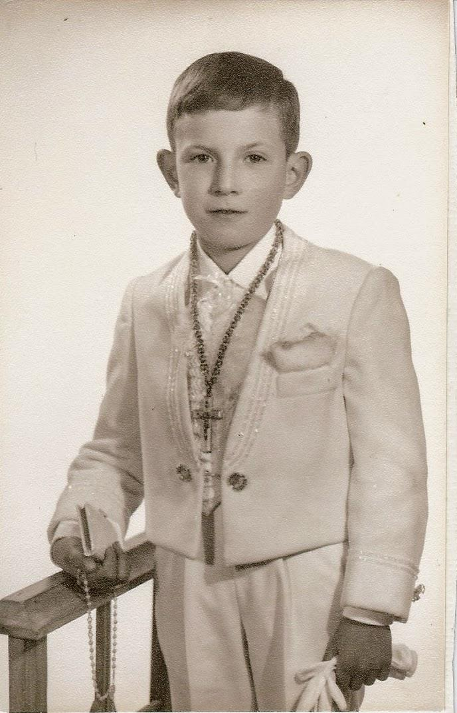

Jose Manuel vivia a Cinctorres, molt cuidat per la tia Francisqueta i Mescedes, anava a escola, però no era molt estudiós. Va créixer com tots el xiquets del poble, jugant pels carrers i fent maleses, ell diu que sempre va estar bé, anava a veure a la tia Gavina, germana de la mare que vivia al Sant Lluis, i conta, que si l‘agradava el que tenia de dinar es quedava a menjar allí, i que no va tindre mai cap carència d’afecte.

Com era el costum, Mercè va fer-li, un roquet nou amb una randa molt bonica i era cotero, ajudava al retor a la missa i a les profesons, a vegades ens conta les anècdotes pròpies del xiquets coteros, com fer de tant en tant quan el retor no els veïna fer algun traget del vi de missa,(en un llibre de Cinctorres publicat pel Ajuntament tomo II en la pagina 153 ja una fotografia d’una professo al placet de l’església on es veu portant el canelobre més gran que ell, al costat del xiquet que porta la creu, sols he reconegut amés del capella, a l’amo del moli i al frare Maina que sempre cantava gregorià.

L’any que va prendre la 1º Comunió, Mercè va vindre a comprar-li a Castelló el vestit (encara el tinc guardat).És un vestit amb la jaqueta de vellut blanc molt cerimoniós, m’adono que era mot xicotet. Mercè i Joaquin en la cerimònia religiosa, varen fer de pares, al seu costat com tots els altre xiquets. Per ha fer-li aprendre la doctrina com es deia *el catecismo* varen suar tots. Les oracions les va aprendre de memòria, però el demes, era molt difícil doncs sempre estava molt enjogassat.A la festa en Cinctorres, varen vindre els tios de Morella, el tio Francisco, Ramonet i Fidel també la tia Juliana i els tios de Castelló, en la foto familiar que varen fer davant de l’església i un altra davant de casa Mercé es veuen tots.

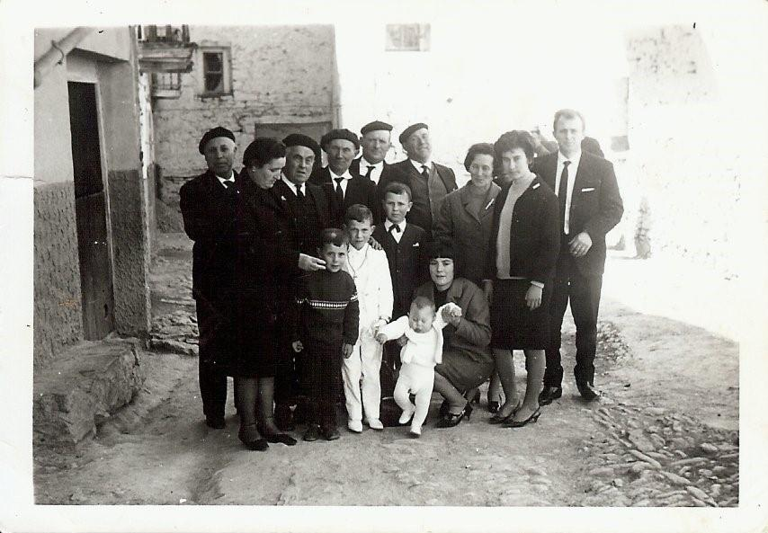

Desembre 2009

## 5ª part

Amb el temps Juan va tornar d’Alemanya i aconsellat pels pares va ficar en marxa la cansaladeria. com la que tenien ells abans Varen obrir una parada al Mercat de Sant Anton, i sa mare Maria estava despatxant, era una dona alta amb bona presencia amb el cabell blanc replegat amb estil, pareixia de cassa bona. L’agüelo Manolo tenia molt bona mà pals embotits, no debades ho havia fet de menut.

A la mare de l’agüelo Manolo li deien Águeda la Vaja, ella era la cansaladera, li venia de família. Àgueda es va casar amb un andalús de Rute (Córdoba,) aquest va vindre a Castelló, amb l’ofici de consumero, que li va donar la Reina Mª Cristina com a premi, desprès de vindre de la guerra de Cuba derrotats l’any 1898. Als poc soldats que van tornar en vida, l’estat els donava ocupació, per aquest motiu, Pedro Padilla Cañada estava treballant i vivint a Castelló.

*No sé com es va perdé la cartilla militar de Pedro Padilla Cañadas jo la vaig tindre a les mans amb altres papers, la vaig llegir, i es veritat el que deia l’abuelo Manolo quan contava que son pare va estar tres vegades a Cuba, una per ell, i dos vegades més en lloc d’altres soldats.*

Abans era possible quan la família d’un soldat podia pagar-ho comprava a un altre soldat, que anava en el seu lloc a canvi de diners. La besàvia del mas de Julian, Felipa Segura va comprar un soldat al fill majors Antoni per que era l’a millorat i també al meu agüelo Josep Julian, aquest va protestar dient que no volia anar a la guerra on va morir el seu germà Ramon.

L’agüela Maria de jove va vindre de Vilafames i treballava de cuinera a una fonda de la carretera de Morella quan va conèixer a Manolo Padilla, ell vivia amb sa mare i tenien una cansaladeria al carrer Saragossa. Quan es van casar, Águeda vivia amb ells fins que va morir. Desprès degut a problemes d’herència amb els altres germans deia que van perdre casi tot el negoci amb judicis i advocats se’n va anar tots els bens i diners no mai parlava de la seua família, per ella vam saber que a Vilafames on va nàixer la coneixien per Mª Gracia i que la vam criar uns tios que eren germans de sa mare quan esta va morir i son pare es va tornar a casar. Nosaltres vam visitar als tios a Villafames, ja eren molt majors i quan una cosina que quedava venien a Castelló sempre venia a vorem-nos al mercat.

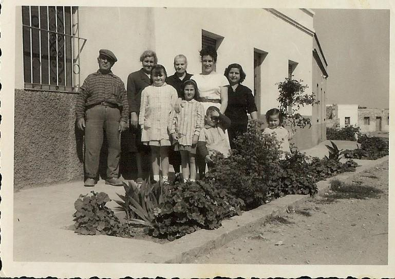

Una vegada que va vindre de Cinctorres Mercedes amb Jose Manuel al metge dels oïts, el va visitar a l’hospital el metge Agut i l’agüela Maria ens va dir que aquest metge era germà seu, per par de pare, i que no es tenien cap contacte com a germans, i no es va voler dir res més.

*Fins molts anys desprès no varem saber l’historia que l’agüela no mai ens va dir.*

La mare de Juan es va ficar malalta, i el metge va dir als fills que no es podia operar que el mal estava molt avançat, i com pareix que les coses quan van malament no mai venen soles, Manolo el fill major, que sempre havia estat delicat del renyós, en poc de temps es va morir al 32 anys, en aquella època encara no es feien trasplantaments d’òrgans ni diàlisis.

Al poc de temps de viure amb els tios, Juan em va demanar que si volia casar-me amb ell. Com que era menor d’edat havia de donar el permís el tio Agusti com a tutor, va tindre que anar al jutge i a la parròquia de Sant Francèsc a firmar els documents necessaris.

Ens ficaríem a viure al pis dels meus pares, ens vàrem comprar no mes els mobles del dormitori, i ens cansaríem el dia 12 d’agost l’ any 1965.

La mare de Juan sempre deia que es moriria el dia de la nostra boda, quan es va casar ella, son pare es va morir el mateix dia.(es va enganyar per hores) Com que sa mare estava malalta, vam pensar que no faríem festa i el viatge de nuvis seria més avant. Però el tio Agosti va dir que ell pagaria el dinar la meua família que vingueren acompanyar-me al casament.

Ell es va encarregar de buscar el lloc on dinar, va ser a un merendero que hi havia a la platja del Serrallo (al lloc que aleshores està la refineria), molt prop de l’alqueria del amic de Cinctorres Daniel.

La mare de Juan estava molt maleta, i dos dies abans de la nostra boda de sobte es va morir a les 11 de la nit, jo estava allí i vaig ser qui va ajudar a Juan a amortallar-la, la varem tindre a casa tota la nit com es feia, i la vespra de casar-nos li van fer el soterrar

La tia Josefina germana de la mare que vivia Amposta va vindre ajudar-me i a fer-me el comboi i es va trobar en el soterrar. Quan a les 10 del matí vaig anar a replegar-la al cotxe- correu, i li vaig dir el que passava no ho podia creure de cap manera.

No recordo quan van vindre els parents de Morella. El tio Fidel germà del pare que vivia al mas de Julian, va ser el padrí de bodes dels meus pares, el padrí del meu bateig, i també el vaig fer casament padrí del meu. Com que era al mes d’agost a l’església feia molta calor el tio Fidel no estava acostumat anar mudat però com padrí portava un vestit obscur de totes les bodes que deuria de tindre, jo recordo que estava suàn moltísim y em feia patir de veure’l La padrina de va ser Maruja la germana de Juan.

Quan el capella de la parròquia va veure el que passava ens va dir si volien atraçar el casament i li vam dir que no, que estava a la família, i dia dalt o baix no solucionava res. El que vam fer va ser casar mos a les 8 del mati, doncs a mig dia li van donar terra a l’agüela Maria al cementeri, allí vaig repartís el meu ram de novia entre els meus pares i ella..

La meua família de Cinctorres i de Morella que van vindre convidats al nostre casament, com és normal estava afectada pel que va passar, i desprès de acompanyar-nos al cementeri, com a ells no els tocava res, a l’hora de dinar se’n van anar al banquet de boda, sense nuvis. Molts anys desprès la tia Filomena un dia em va dir que al acabar de dinar, con que feia molta calor i no hi havia gent de fora de la festa, tots van prendre el bany, els tios i ties masovers per primera vegada en sa vida, elles en viso i els homes amb calçotets, i van xalar molt, però no volien comentar-ho, doncs creien que era una falta de respecte a Juan i família.

Passat un temps jo tenia molta curiositat de saber el lloc del banquet, i quan pensava dir-li a Juan que anàrem a veure el lloc, sempre callava doncs pensava que no calia recordar-li res, fins una vegada li ho vaig dir, en tan bona sort, que ja estava instal·lada la refineria i no quedava res de res. Així que no se on es va celebrar el banquet de la meua boda. A vegades cavil·lo que si no fora tan trist, pareixia una broma.

*Quan pels anys 1980 – 1990 als estius estàvem tota la família a l’apartament Juan parlava amb un veí major d’Almasora, i li va dir que el seu agüelo per part de mare, era del aquests poble, que es deia Agut i que quan va enviudar les dos filles que tenia s’en van anar a viure a Vilafames, amb els parents que allí tenien.*

*El Sº Enrique (aquest era el seu nom) li va que* ell era molt amic dels seu agüelo que el coneixia molt. Aquest tenia una fabrica de licors, i ens va contar la historia: Del primer matrimoni amb una xica de Vilafames va tindre dos xiquetes, va enviudar i amb el temps es va casar en la dona que abans tenien con a criada de casa. De aquesta dona van nàixer dos xics i com que les filles i la dona no es portaven bé les xiquetes sen va n anar a viure amb les abuelos del poble.

Al fer-se majors no van tindre mai contacte, doncs els fills van estudiar eren metges, elles no van tindre cap educació i l’agüela Maria no volia parlar d’aquest tema, la mostra es que els seus fills Manolo Juan I Maruja, mai van saber res de la família d’Almassora on ella va nàixer.

També ens va contar que en aquells temps eren gent acomodada econòmicament i que descendien del poble de Culla, on el metge Agut era un terratinent i la mostra era, que si anàvem a Culla encara veuríem una placa al carré major amb el nom CALLE MEDICO AGUT. Nosaltres quan els nostres fills eren menuts i anàvem a Cinctorres un dia vârem entrar a Culla, i allí estava a un cantó del carrer principal la placa del carrer amb el nom.

La meua sorpresa va ser lleguint un llibre que tinc a casa Historia del Maestrazgo de Jose Barcelo Matutano editant en 1982 en la pagina 86 parlant de Culla diu: *De muchacho, pasé algunas temporadas veraniegas en Culla, en casa del medico Agut, que alguien llamaria cacique, pero yo llamaria patriarca...etc.* També conte, que la finca on està la monumental Carrasca de Culla entre altres coses era de la seua propietat*..*

L’autor diu que es un llibre de rècords i percepcions.

9 maig 2011

*L’any 2014 quan en diferents pobles varen fer La Luz de las Imagenes, ja major amb 69 anys vaig anar entre altres llocs a Culla a visitar les exposicions, preguntar al guia qui era aquest metge Agut, em va dir que va ser l’ alcalde que va ampliar el poble fora de les muralles mirant el futur, les cases noves son diferents a les que hi ha dins del poble antic molt pintoresc però tot son escales, costeres i carrers estrets.*

## 6ª part

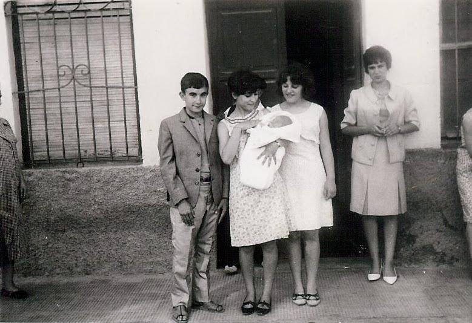

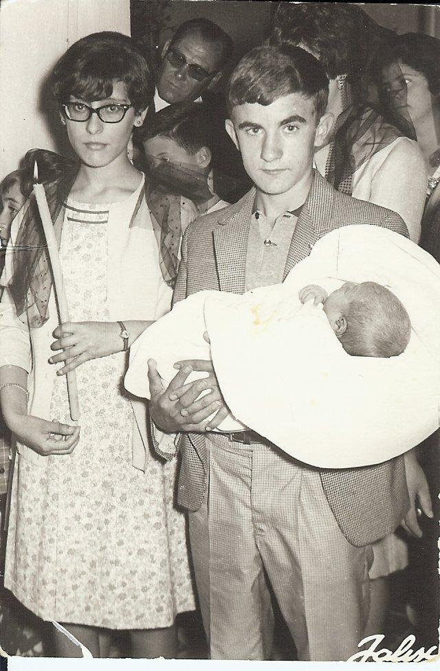

Tenia 21 anys quan va nàixer el meu primer fill, el dia 28 de juny de 1966. Sempre vaig saber que seria un xiquet i que el seu nom seria Juan com son pare i tindria els ulls blaus, però com que creia que ningú ficaria el nom de Tadeo (els meus germans eren menuts) aquest va ser el segon nom. El bateig va ser a l’Església de Sant Frances. En aquesta església van ser els funerals del nostres pares, allí en baix casar, bategar als meus fills i també, allí varen prendre la 1ª Comunio.

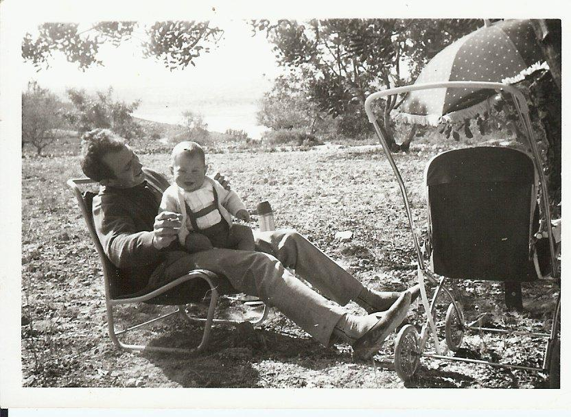

Teníem un Seguro Sanitari particular, i a mi em va atendre la comare a casa (tinc guardat al primer caixo de la mesita del dormitori al meu costat, el cordo umbilical dins d’un fracs esterilitzat que vaig comprar en la farmàcia per si el xiquet venia de moment, el guardo com un tresor fa els anys que té el meu fill major Juan) com que el xiquet era gran i jo mare primeriça van buscar una clínica, sols varem trobar habitació a una que era del metge otorrino Antolí Candela al carrer d’Enmig a l’entresol, abans havia sortit de comtes i tots els dies anava al mercat, doncs no volia quedar-me soles a casa. L’agüelo que vivia amb nosaltres, ajudava de mati a embotir i desprès fins l’hora de dinar no estava. Aquell dia era dilluns i estaven treballant al mercat del dilluns, la nostra parada estava al costat del transformador de la llum aleshores passarà el Tram. Juan en un descuit va tirar el misto d encendre el cigarret i es va prendre foc el paper que hi havia dins de una cistella, vaig tindre un bon esglai, i degut aixó per la vesprada em va moure el part. Juan va anar a buscar a la tia Josefina que va assistir al part amb la comare i el pare del xiquet, El xiquet va nàixer a les 6 del mati del dia següent i va pesar mes de 4 kg.

Juan va vindre a la clínica amb un ram de flors el més gran i bonic que havia vist mai, no feia més que mirar al fill, estava més de conten. Quan l’agüelo va preguntar-li quin nom li ficaríem, el fill li va dir Juan!!,l’agüelo volia que portarà el seu nom, Juan li va preguntar- vostè al seu primer fill, quin nom li va ficar? Ell va contestar, el meu!! I el pare nou va dir amb orgull - jo també, el meu!!, l’altre xiquet que tinguem, li direm Manolo com vostè*. Jo vaix cavil·lar, esta clar, tindre un altre fill i serà Manolo.*

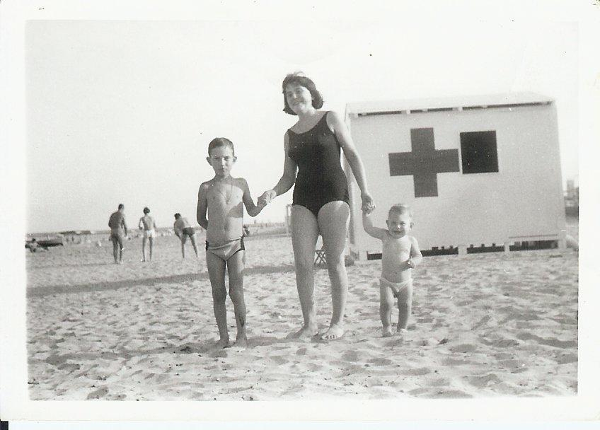

Al poc de temps de prendre la 1ª Comunio Jose Manuel, el tio Agusti que sempre va mirar per nosaltres, pensant el que fora millor, va dir-nos que el xiquet havia d’estar a Castelló, amb els germans. Va anar al Escolàpies a matricular-lo i li van dir que tenia les notes massa baixes i li costaria ficar-se al nivell dels demés, va ser una manera elegant de dir que no. Aleshores anava a una acadèmia reglada particular, que es dia Akademos al carrer Cavallers, jo estava al mercat i el xiquet venia per allí, a migdia i a dinar anava a casa el tios que vivien al mateix carrer i les cosines li controlaven les lliçons i deures, d’aquesta manera va estudiar.

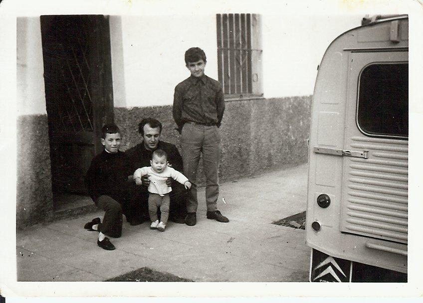

Quan Tadeo va tindre uns 17 anys i va acabar d’estudiar a Maestria va tornar a casa amb nosaltres, Ell no mai es va queixar d’estar Al Hogar del Auxilio Socia, l però desprès de majors quan hem parlat d’aquest tema, deia, que el pitjor va ser el desarrelament familiar, que no coneixes a ningú, el canvi es tan brusc que no sap que fer i es viu de manera molt diferent per be que estigues, doncs allí hi ha disciplina cassi militar, i cadascú mira per ell. Al comença l’estiu anaven dos setmanes a la platja i desprès a la finca que hi ha al Desert de les Palmes anomenada El Bartolo jo recordo haver anat allí a visitar-lo.

A Juan tot el que jo volia li pareixia bé, i quan vaig dir-li que necessitava als meus germans amb mi, va dir que sí sense cap problema, i va ser un descans estar els tres junts, jo creia que era el meu deure seguir sent una família. I de sobte érem cinc homes a casa i jo, doncs el agüelo sempre va estar amb nosaltres, no volia anar mai a casa de la seua filla Maruja ni de visita.

Alguna vegada penso que no sé com ens vam aclarir sense discussions, doncs érem 7 persones de 4 mares diferents, distinta edat i educació.

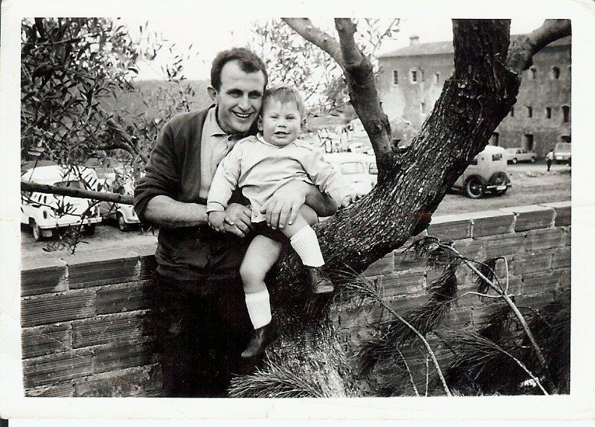

Juanito va fer els quatre anys a juny i a setembre començà anar a escola, al col·legi l’Ejercito, com els meus germans, el primer dia de classe vaig anar a parlar amb la directora que li deien Dª Marcelina a preguntar sobre el menjador escolar doncs aquell any era el primer que en farien. Com que n’eren pocs xiquets la mestra em va dir que es quedaria ja aquell dia. Jo no estava preparada per a deixar el xiquet allí el primer dia de classe, però vaig callar i me’n vaig anar al mercat plorant de pena. La cuinera era una dona que anys desprès vaig conèixer i em va di que era el xiquet mes menuts de tots i el cuidava molt, el dia que tenien natilles per a postres sempre li’n donava dos li agradaven molt. On guardaven el tovalló tenia el numero 1 l’últim any d’escola també va ser l’últim any de menjador.

A vegades cavil·lo que no se com podíem viure tots junts amb la casa tan menuda. En l’habitació del fondo teníem Juan i jo el nostre dormitori. En una que donava al carrer estava el llit de l’agüelo Manolo un seient i el seu armari de casar-se, l’altra del costat era saleta i dormitori dels meus germans i de Juanito. Varem comprar un sofà que es separava i eren dos llits, en un dormia Jose Manuel en l’altre Juanito, i Tadeo en un llit plegable que també era llibreria, quan estaven els llits fets no es podia tancar la porta. De mati, Tadeo guardava tota la roba a l’armari on també estava la roba de tots ells, si alguna vegada ho feia jo no cabia tot, i em deia (les mantes en quatre plecs i els coixins de costat,les sabates totes rectes, i dos peces de roba a cada penjador) vaig acabar per no tocar res, de tot axió i de la neteja del quarto sempre es va encarregar Tadeo doncs des de menut era molt endreçat.

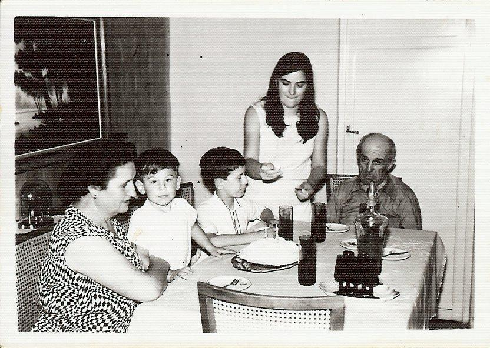

La televisió la vàrem ficar al racó del quarto del agüelo, ell sempre estava assegut en un seient molt bonic del seus moble de casat, i els demes la veiem des del menjador l’ únic que li pareixia be que estigues amb ell era Jose Manuel,

(era el seu enllaç del carrer, li comprava el que volia) el deixava que estigues assegut al seu llit, als demes no, ni al seu net Juan, a Tadeo tampoc.

En la nostra casa sempre hi havia soroll, l’aguelo Manolo, tenia un amic en Vila-real de nom Mezquita i totes les setmanes venia a veure’l, compraven un dècim de loteria junts, Tadeo portava als seus amics a escoltar música, es va comprar un tocadiscos teníem disc de Los Pequeniques, los Bravos i molts més.

Jose Manuel començava a festejar en Julieta, anava amb una moto que sols podia anar ell, recordo que sempre estàvem pagant denuncies de tràfic doncs sempre pujaven a la moto els dos, no escarmentava.

El nostre fill Juanito sempre va ser un xiquet tranquil, pareixia que tenia mes anys, ell i el meu germà menut, pareixien germans.

De vtan en tan anavem uns diez a Cinctorres a casa de Mercedes

De tan en tan pujabem a Cinctorres. Alli veiem a les ties Gavina i Josefina que vivía en Amposta.

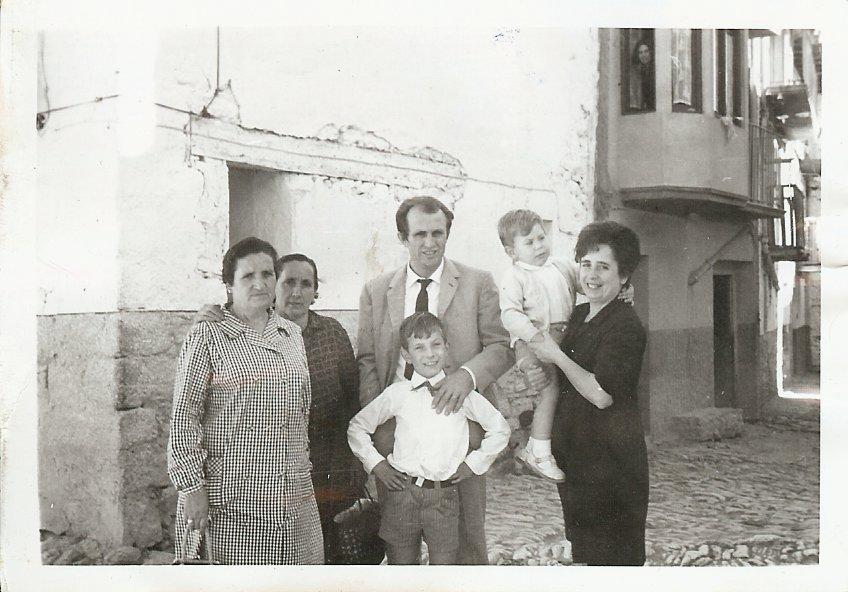

El mateix any que va nàixer el nostre fill Manolo, ens vàrem canviar de pis, al xamfrà del nostre carrer, i també de cotxe, un Seat 124 familiar i vàrem portar al desguase el nostre Citroen furgoneta que sempre va ser mol honrat, mai ens va donar cap problema. Com que els nostres amics no tenien cotxe a la Madalena i a la platja anàvem tots en ell, una vegada contarem entre grans i menuts 11 persones. Juan al mercat deia en broma aquest any ha sigut molt productiu: *casa nova, cotxe nou i xiquet*.

Sempre recordaré l’últim diumenge, d’octubre, de 1972, pel mati varen sortejar a Tadeo com ha soldat, Jose Manuel estava malalt amb Paperes, Juan de matí s’en va anar a caçar, a Ares, per la vesprada quan va tornar, pareixia que son pare l’esperarà. El va cridar... Juan!!, i quan el fill va acudir, es va morir als seus basos, ha segut la mort mes dolça de tota la família, per pocs mesos no va conèixer al net que portaria el seu nom.

El dia 16 de setembre de 1973 un diumenge a les 5 del matí va nàixer el nostres segon fill, aquest xiquet com sempre vaig saber, portaria el nom de l’agüelo Padilla.i del germà de Juan, Manolo

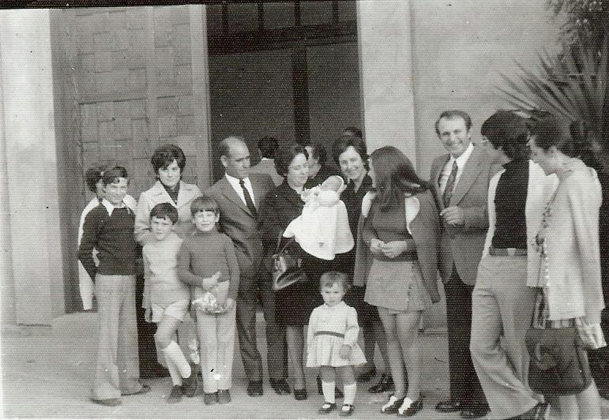

A les tres del mati van començar els dolors de part, quan va nàixer el fill major Juanito es va retrasar, al meu conte tenia casi 10 faltes, com creia que podia passar el mateix, no tenia pressa de preparar el bres i tot el necessari, tot van ser corregudes, si ens descuidem un poc, tenim el xiquet a casa. La tia Josefina va fer d’agüela va estar al part del dos fills meus.

Tadeo estava fent la mili, al quartell de Castelló. Abans de marxar a la clínica li van dir que ens anàvem. A les 8 del matí varen vindre els tres, Jose Manuel Juanito i Tadeo vestit de soldat, (anava al quartell), a veure al xiquet, que era mes menut que el germà quan va nàixer i molt bonic i molt enfadat, aquet tenia els ull grans i marrons, la mongeta de la clínica al vorels allí als tres rosos, i amb els ulls blaus igual que Juan va dir que ¿(*son todos hermanos? se perecen*), i en aquell moment ens vam adonar que tots teníem 7 anys de diferencia de mi a Tadeo, Jose Manuel, Juanito l xiquet que acabava de nàixer.

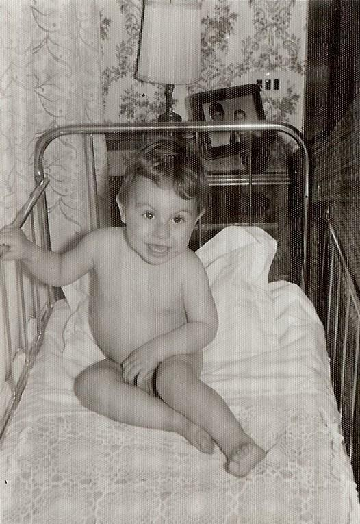

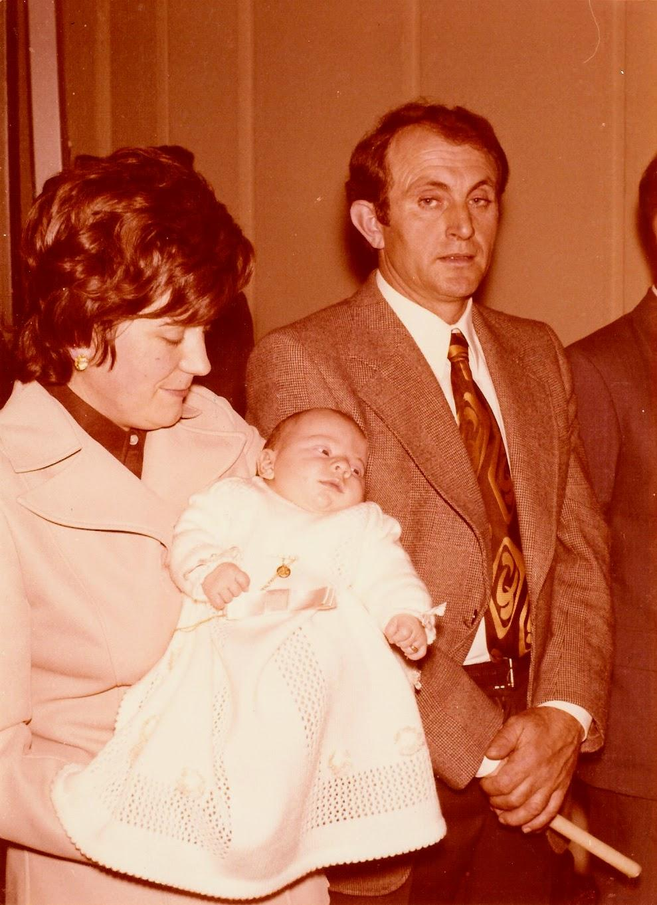

Als dos mesos de nàixer Manolo vaig estar 3 setmanes al hospital, em van traure una pedra del renyós i no vaig tindre llet per amamantar-lo com al germà. Al xiquet el cuidava la tia Josefina, la germana de mon pare. Tadeo m’ajudava molt a casa, a Manolo, igual li donava el bany com el biberó i a l’hora de dormir es tranquil·litzava si li tocàvem el cabet, recordo que a vegades quan venia Jose Manuel d’escola o del carrer li deia \<*ara te toca a tu, en compte no li fases mal \>*fins que es dormia. Varen ser els padrins de bateig Mercedes i Juan Antonio, els meus cosins de Cinctorres, per a ells sempre ha sigut el seu fillol preferit.

Ja en el pis nou Jose Manuel em va dir molt educat: Paquita, ara que tenim una terrada podia portar una tórtora que em guarda Jose Luis, el meu amic. Com que m’agraden els animalets la tórtora va vindre a casa amb una gàbia, el seu nom era Sara, es pesava el dia fen gru..gru al temps un dia ens va fugir de la gàbia, que vàrem guardar al traster del terrat.

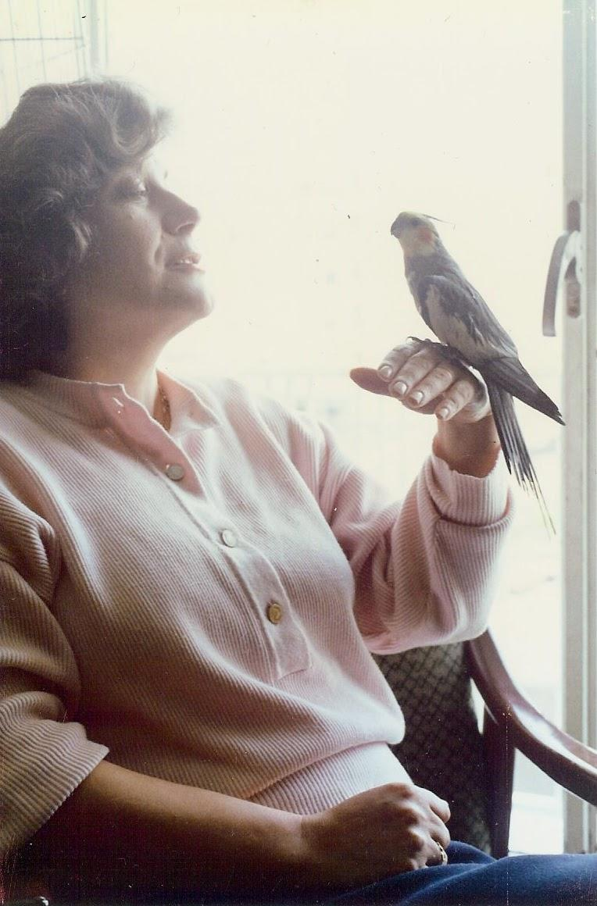

Passants els anys, el nostre fill gran Juan va fer la mili a Valencia, molts dissabtes venia a casa a passar el cap de setmana, un d’ells el vaig veure entrar per la porta del mercat de Sant Antoni amb un pardal damunt del muscle que no s’anava, tenia una cresta de color taronja i era molt bonic, el fill ens va dir que el va trobar al pati del quartell amb un ala trencada, el propietari d’una pajareria que va anar a preguntar-li, va dir que era una ninfa, un pardal tropical molt maniàtic i que es moriria. Quan arribarem a casa el vaig curar com creia que es feia, nugant-li les ales amb dos fustes fines, em va fa picar molt enfadat, el seu pic es corb i anava amb les mans plenes de sang la ninfa, estava sempre pel menjador caminant, no podia volar i un dia de moment es va ficar a cantar, un cant llarg i bonic, i vaig pensar que de morin-se res, estava gust a casa, la gàbia que li vàrem comprar, era quadrada i gran, la va recórrer tota, li va agradar, i clar també li vam ficar de nom Sara.

Tenia el costum de estar damunt del rellotge del menjador que tenim a la paret, quan es cansava tornava a la gàbia i amb el pic tancava la porta, de tant en ens feia un concert, li agradava la música però una cosa molt estranya ocorria quan sonava la de Wagner La Cabalgada de Las Valkirias, es tornava boix, sempre que ho provava feia el mateix, no te explicació però era així. Manolo va aprendre a caminar anant agarrant-la primer a gates i desprès caminant. A mi Sara, em volia molt, pujava al meu muscle i gojava amb la cadena que portava al coll, a vegades es ficava el cap amagat a la butxaca del meu davantal, a Juan pare li tenia mania, si podia li picava, era com si li tingues cels. Amb el temps es vam adonar que era un mascle, però com reconeixia el nom de Sara, així es va quedar.

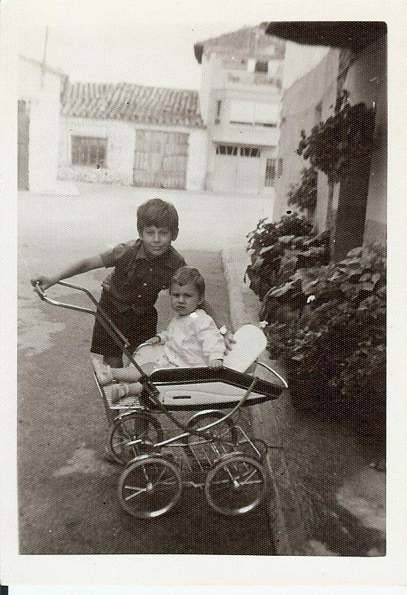

Els meus germans eren manyosos com el pare, Jose Manuel era un xiquet molt enjogassat, sempre estava fent invents pel terrat, jo moltes vegades pujava amb Juanito y jugava amb ells. Juan pare, una vegada ens va dir (no entreu a l’altra part dels terrat que ja un vesper, demà el llevaré doncs es perillós) El meu germà menut no se quina andròmina portava i va entrar, de sobte va sortir corren i plorant amb un grup de vespes darrere, que li van picar de bo, una de les seues orelles de sobte es feia gran i gran Tadeo i jo no podíem reaccionar mirant-lo, i ell plorant molt enfadat, al fi, ens varen anar al pis, no recordo que li baix ficar per ha calmar-lo. De tant en tanta quan surt la conversa nosaltres ens dona goix doncs encara esta enfadat, diu que no li fèiem cas.

Jo no tenia temps ni de pensar, amb tats homes a casa la faena no s’acabava mai, quan vàrem comprar la rentadora automàtica va ser un descans Tadeo era l’encarregat d’estendre la roba llavada, tenia una gràcia especial no s’arrugava gens, jo sempre anava apresa fent coses, però va ser una bona època estàvem tots junts, Juan feia, de pare, i tots els xics es volien com a germans, el mateix que ara.

Jose Manuel va fer la mili a Canaries en La Marina, tots el mesos l’enviava un paquet de menjar, del embotit sec que fèiem nosaltres i que veníem al mercat, Un dia parlant en va dir que tots els amics l’esperàvem quan arribava el paquet, entre tots, en un moment cel menjàvem. Jo creia que li feia un favor i ells feien una festa.

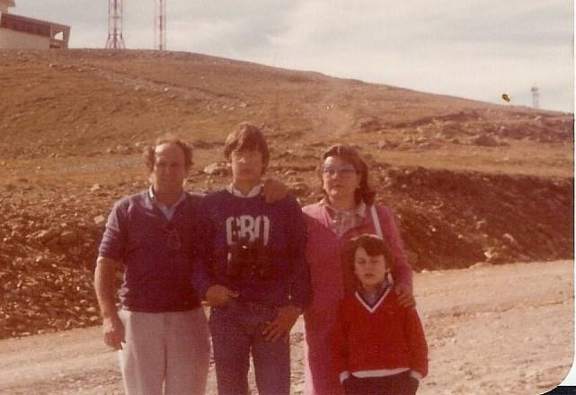

Al seu temps, els meus germans es van casar i formar la seua família. Per ha mi sempre han sigut fills. jo crec que ells a mi també m’estimen.

Al meu germà Tadeo, sempre va agradar-li la faena de cansalader com que teníem prou faena ens ajudava.desprès a sigut l’únic que ha seguit l’ofici de cansalader.

25 febrer 2013

## 7ª part

El nostre fill gran es casa. Vàrem fer una bona boda, volíem que la dels nostres fill si podíem, no seria com la nostra.

Jo vaig ser la padrina i el pare de Lari el padrí. Un dia, abans d’anar-me\`n a treballar al mercat, a la primera tenda que vaig entrar a fer una ullada als vestits, en vaig veure un que m’agradava, no era el clàssic vestit de padrina, però era el que volia i no ho vaig pensar gens, me’l vaig comprar sense provar-me’l la talla que tenien no era la meua i la van demanar. El dia de la prova, m’acompanyava Fina, i Juan ens va dir: jo també vull anar a veure’l, no mai havia vingut amb mi a comprar-me roba però aquesta vegada volia que fos bonic, li va agradar però deia que per a ser padrina tenia que ser més mudat, que desprès del nuvis ja era jo. Hi havia una pamela en un estant i va dir: axió és el que falta, no mai creia que aniria amb una pamela com les angleses però si, estava còmoda i a gust del pare del nuvi, (encara la tinc guardada com a record) La dependenta de la tenda em va dir que no mai havia venut un vestit de padrina tan ràpid i sense provar-lo, que totes les mares li donen molta faena.

El banquet va ser al hotel Mindoro el millor que hi havia a Castelló, nosaltres portàvem 160 convidats entre parents i amics. I sí, va ser una bona boda.

Tindre el 1º net és una experiència, única jo pensava i Juan també, que la nostra família era un fet, teníem un net! Que diferent a quan naix el teu fill, aleshores la responsabilitat és del pares, nosaltres son els agüelos havíem obert camí a la vida. Si mirar als teus fills quan naixen es bonic, mirar als nets es entranyable i es pensa \< alguna cosa meua per la genètica està ací, que siguem coses bones\>.

David era rubiet i amb els ulls blaus com Juan pare I Juan l’agüelo. Quan tenia uns mesos alguna vesprada anàvem a passejar amb el carret la meua amiga Fina amb la neta i jo amb el nostre xiquet, pel barri. La neta de Fina Laura, es morena com ella i David rubiet, feien un bon contrast, a nosaltres ens pareixien el millor i mes bonics del mon.

*Manolo el nostre fill menut, va acabar d’estudiar a Maestria com* tots el xics de la família, i desprès de fer l’any de practiques va trobar faena de electricista de manteniment. Nosaltres teníem l’esperança que ell seguiria el negoci quan nosaltres ens jubilaríem, de moment Juan es va jubilar però a mi encara em faltava 10 anys.

A la casa de Juan i Lari prompte vindria un altre xiquet al dos ens feia molta il·lusió.

Manolo, tenia novia Carmen, ella s’havia comprat un pis de segon mà i l’estaven arreglant. Juan em va dir no et fases la idea que es casarà com Juan, Manolo abans de casar-se viuran junts, ja ho veuràs.

Tot estava bé, pareixia que teníem bona ratxa.

Els meus problemes de salut seguíem com sempre, de tan en tan fortes migranyes. Del melanoma m’havien donat d’alta desprès de 10 anys, i estar sorda era part de la meua vida, ames d’altres problemes.

Per a mi, el pigós era estar sempre pendent de Juan, feia 5 anys que va estar molt malalt, ningú s’esperava que es podia recuperar desprès de la crisi de (*muerte súbita*) ni el metge ni ningú. Jo sempre vaig pensar que la Mare de Deu de Gracia ens va ajudar quan davant de la porta de l’ermita va caure com mort, jo li vaig demanar que em feia massa falta que era prompte per a deixar-me sola.

Recordo com un mal somni el viatge amb l’ambulància cap a Vinaros, el metge fen-li respiració assistida, Juan Antonio manejant-li els peus sense parar i jo amb la palma de la mà dins de la boca per a que no es mossegués la llengua, vaig tindre molt de temps els dits dolorits del mossos que en pegava amb les contraccions de dolor que tenia

Quan al temps vàrem anar a donar-li les gracies al metge de la Mata ens va dir *: Juan cuanto le quieren no han dejado que se muera, yo creia que no se recuperaria*.

Vaig fer la promesa de Pastar la Prima el dia de la festa i romeria de la Mare de Deu de Gracia, donant-li les gracies, i quan feia 5 anys ens va tocar a nosaltres celebrar-la. La pena que vaig tindre va ser que ningú dels nostre fills van donar-li la importància que era per a mi la seu assistència, acudeix tot el poble, la missa es solemne i beneeixen les primes i nosaltres em van donar una a cada assistent, a la festa no faltà cap parent ni amic. Però els dos fills nostres van trobar excusa per a no vindre. Juan en va dir: no els podem obligar ja son majors, llevant-li importància, doncs veia el meu disgust, però no ho ha pogut oblidar. Quan ho recordo encara tinc ganes de plorar.

Com tots els anys per a San Joan, data en que tancaven els col·legi anàvem a passar l’estiu a la platja a Benicassim. En veritat sols estàvem tot un dia sencer el diumenge. la resta de dies a les sis del mati ens anàvem cap a Castelló Juan es preparava el género i a les 7 se’n anava al mercat. Els fills i jo ens tornàvem a gitar així va ser sempre un munto d’anys i a les 4 de la vesprada tornàvem al apartament, No se com ens aclaríem sempre amunt i avall per a Juan, prendre el bany era el seu desig, estava a gust flotant a la piscina, jo sempre estava pendent dell cavil·lava, un dia es dormirà i se’n anirà cap al fondo.

Sempre tenia present la primera vegada que es va ficar malalt, com que es va recuperar jo creia que si estava al seu costat podria ajudar-lo com abans va passar, i estava pendent de tot el que feia, a vegades com per la meua deficiència auditiva no escoltava res, ficava la mà damunt seu procurant que no es donaria compte i l’escoltava respirar. Van ser uns anys durs, vivint sempre amb por i angoixa, que no van valer per a res, per que també se’n va anar als 5 anys de la primera vegada que es va ficar malat,

era el dia 9 de juliol del any 2000 es va morir com l’agradava desprès d’ estar tot el mati a la platja i desprès a la piscina prenent el sol. No se com va ser, però al mirar-lo des de el balco d’un 5º pis tombat com si s’hagués dormit, vaig saber que s’havia anat, m\`havia quedat a soles, jo tenia 55 i Juan feia un mes havia complit els 65 anys.

Vaig pensar en la mare, i vaig reviure la seua pena quan se’n va anar el pare y es va quedar a soles. No pots comprendre, com aquesta persona que vols tant no tornaràs mai més a veure-la, ni a escoltar la seua veu, és un desemparo total. No entens com el sol torna a sortir dia a dia, i la gent es riu, i té goig, i tu tens eixa negror dins del cor, com una pedra opriment que no et deixa respirar, i quan esgotada t’adorms al despertar és una desesperació continua. No es pot explicar la pèrdua d’un ser que estimes i que et fa tanta falta.

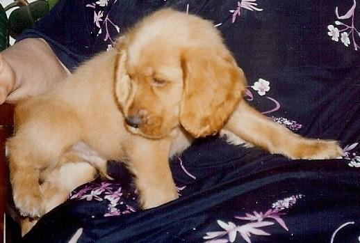

Manolo en va portar un gosset menut volia que sortira de casa i aquesta era una manera de fer-ho 3 vegades al dia, era una obligació, traure’l a passejar, també es diu Listo m’ajuda’t molt amb companyia i afecte, i també s’ha anat.

Amb el temps els records s’adormen, de tat en tant tornen i et fan plorar, no importa els anys que faça, una de les moltes coses que més he trobat a faltar, son la complicitat d’eixa mirada, el saber que t’escolta fins i tot no interessar-li el que dius, els silencis en companyia... les coses senzilles i quotidianes que sols sabem la falta que fan, quan no les tens, el compartir il·lusions i angoixes.el saber que t’estima i tu li correspons A vegades, sense cap motiu aparent l’angoixa torna, quan veus als teus fills Juan I Manolo amb la família que han format, parlant amb les nores i els nets i juguen amb ells,es el que vols, i t’ompli el cor veure’ls. Recordo a son pare que feia el mateix, i torno d’anys darrere i penso... per que?

Tinc 69 anys, en la meua vida tot m’ha ocorregut, massa prompte i a deshora, vaig tindre una infantesa feliç però no vaig ser mai adolescent, quan les meues amigues pensàvem amb festa i nuvis, jo tenia la responsabilitat del meus germans, quan em vaig casar als 20 anys, ja érem família nombrosa, viuda...massa jove, estudiant universitària amb mes de 60 anys, escriptora aficionada, i el millor de tot sempre m’he sentit volguda. La vida m’ha ensenyat que hi han moments per ha tot: angoixes, dolor, felicitat, alegria i també serenitat.

Soc, la més longeva de la família, 69 anys ni els meus pares ni agüelos ni el meu Juan, van arribar aquesta edat. Quan els meus germans i jo ens vàrem quedar a soles Jose Manuel tenia 3, Tadeo 10, i jo 17 anys, ells no recorden, o molt poc dels nostres pares i la vida familiar, ha sigut dur recordar i donar testimoni d’aquestos fets, a vegades, no podia seguir escrivint i ho deixava un temps, i tornava a cavil·lar... soc la memòria de la família, si no ho conto jo, qui ho farà?

*24 juny 2014. Paquita Julian Querol*
