# Agricultura y costumbres del campo y del mundo rural

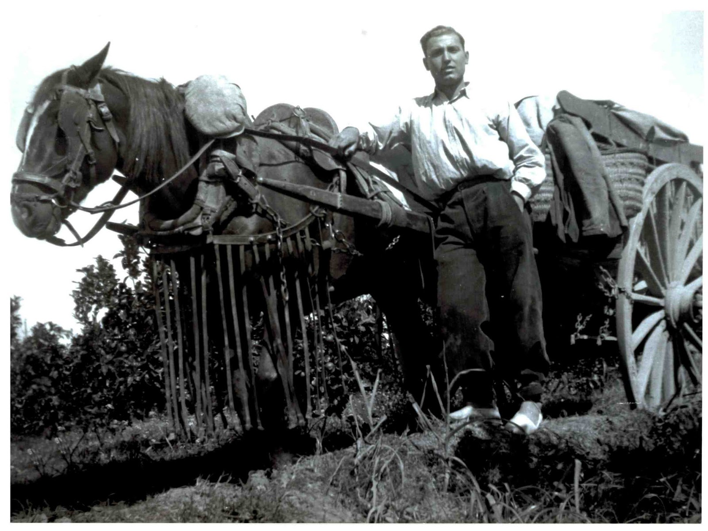

## 1. Agricultura

Las condiciones de trabajo del campo y mundo rural están condicionadas por la climatología, la geografía, y su entorno vital. No es lo mismo un trabajador del campo de Castellón que en cualquier comarca del interior.

En zonas llanas de la Plana se utilizaban como animales de tiro la yegua o «àca» y el carro, grande, majestuoso, que se guardaba en las entradas de las casas labradoras, de ahí la expresión “entrada de carro”; esto demuestra que los habitantes de este hogar son propietario de tierras generalmente hanegadas de naranjas, secano y marjal o trozo de tierra rodeada de acequias donde se cultiva todo tipo de verduras y frutas de temporada.

El ritmo de trabajo, siempre es continuo, en todo tipo de cultivos se necesitan varias fases de trabajo, antes de recoger una cosecha del producto que sea, necesita diferentes cuidados. El campesino o labrador nunca termina, cada cultivo, es de una época diferente del año y su cuidado también. Una *fanecada* valenciana equivale a 831’0964m2, doce *fanecadas* son una hectárea o 10.000m2, un *quartó* equivale a nueve hanegadas.

## 2. Las partidas de Castellón

Diferentes partidas componen todo el conjunto del término de Castellón, su suelo y subsuelo determinan su uso para la agricultura de diferentes clases, o bien para el consumo del hombre y animales. Son tierras de:

- Secano. Tierra en la que el hombre no interviene y los cultivos solo reciben el agua de la lluvia.

- Secano de riego. Tierra de secano, que por iniciativa del hombre a base de pozos o trasvasando el agua del pantano, riega la tierra.

- Huerta de riego. Tierra con derecho a regar del agua de la acequia Mayor y su entramado de acequias y filas. Que abastece la Comunidad de Regantes de Castellón

- Marjal de riego a sobras. Tierras bajas separadas por el camino Donación y Donacioneta que aprovechan las aguas sobrantes de los huertos con derecho de regar de la acequia Mayor.

- Marjal de Sazón. Franja de tierra donde el agua está estancada y separada de otras fincas por la acequia madre y filas.

- Coto arrocero. Tierra pantanosa por medio de *ullals* o alimentada artificialmente por agua de pozos o acequias.

### Nombres y usos

- Almalafa. Huerta de riego, marjal de riego sobras y marjal de sazón.

- Benadresa. Secano de riego. Empieza a ser zona construida.

- Borassa. Marjal de riego a sobras y marjal de riego

- Bovalar. Secano y Secano de riego.

- Bovar. Coto arrocero.

- Brunella. Marjal de riego a sobras y coto arrocero.

- Canet. Huerta de riego.

- Cap. Huerta de riego.

- Catalana. Marjal de sobras de riego y marjal de sazón.

- Censal. Huerta de riego.

- Coscollosa. Huerta de riego.

- Entrilles. Marjal de riego a sobras, marjal de sazón y coto arrocero

- Estepar. Secano de riego.

- Fadrell. Huerta de riego.

- Gumbau. Huerta de riego.

- La Fileta. Marjal de riego a sobras y coto arrocero.

- La Font de la Reina. Marjal de riego a sobras, y coto arrocero.

- La Magdalena. Secano y Secano de riego.

- La Molinera. Marjal de riego a sobras y marjal de sazón

- La Mota. Marjal de riego a sobras, marjal de sazón y coto arrocero.

- La Plana. Huerta de riego, marjal de riego a sobras y marjal de sazón.

- La Zafra. Huerta de riego. Actualmente es zona construida de baja intensidad entre Camí Molins, Circunvalación, Acequia Mayor y rotonda de las Cañas.

- Marrada. Secano de riego. Por parte de esta partida es zona construida lo que queda son campos de naranjos.

- Patos. Marjal de riego a sobras y marjal de sazón.

- Raco de Ramell. Huerta de riego.

- Rafalafena. Huerta de riego, marjal de riego a sobras y marjal de sazón.

- Ramell. Huerta de riego, a partir del camino Donacioneta, marjal de riego a sobras.

- Senillar. Marjal de riego a sobras y coto arrocero.

- Soterrani. Huerto de riego.

- Taxida. Huerta de riego.

- Travessera. Coto arrocero.

- Villamargo. Huerta de riego y marjal de riego a sobras.

- Viantxell. Marjal de riego a sobras y marjal de sazón.

En la partida de La Plana se encuentra la Basílica de la Vérge de LLedó, Durante las fiestas de La Magdalena y en las de la Virgen en el mes de Mayo, la persona que mueve la imagen y la pone en la peana es el labrador que ese año es *Perot de Granyana*. Honor que recae en un labrador que tenga tierras en la partida de La Plana o colindantes; Rafalafena, Taxida, Entrilles, Ramell y Fileta

## 3. Sistema de riego

Los árabes fueron los que con gran pericia, en la provincia de Castellón utilizaron el riego por medo de acequias. Cuando Jaime I reconquista esta tierra, divide el agua del rio Mijares por su parte mas baja entre Burriana, Villareal, Almazora y Castellón, creando esta partición muchos problemas y rivalidad entre los cuatro pueblos. Fue el infante Pedro, hijo de Jaime II y de su esposa Blanca d’Anjou, quien el 20 de marzo de 1347 ciento cuatro años despues de la concesión de nuestra Carta Puebla, promulga la célebre Sentencia Arbitral que aún perdura con pequeñas modificaciones, que divide el agua del rio en 60 partes o filas, de las cuales catorce partes y media pertenecen a Castellón.

Para traer el agua del Mijares a Castellón se recoge el agua del azud que hay cerca de Almazora por la llamada Acequia Mayor o acequia madre, que discurre con dirección sur-oeste como eje paralelo a la costa, y la distribuye a las partidas de riego por acequias y complicadas filas, las cuales suman 167 filas, repartidas por el termino empezando por la partida de Fadrell, los regantes de esta partida tienen reconocido el derecho desde siempre de regar durante el día, nunca de noche como las demás partidas si hace el caso. El agua de la Acequia Mayor al final de su recorrido por la Coscollosa termina en la partida de Cap por Sant Frances de la Font. La Comunidad de Regantes de Castellón tiene la competencia del manejo de las aguas y de su distribución.

Barasota. Este es el nombre con el que el gobernador Bermúdez de Castro inauguró la fuente en 1802 y en Las Ordenanzas de la Comunidad de labradores y su Sindicato y Jurado de Policía rural en 10/3/1906 Vicente Gimeno Michavila la nombra como Barlasota, la fuente y la acequia. Barrassota es su topónimo actual, y se debe a un trozo de terreno de dos hanegadas aproximadamente de uso público, que actualmente está ubicado dentro de las instalaciones de La Refinería de Castellón era un *ullal* o fuente de dos caños, cuyo caudal sobrante iba a la acequia de su nombre, se usaba para riego. Los árboles que allí había eran olmos de hojas blancas, eucaliptus y pinos de gran tamaño. Se encuentra dentro de la partida de Fadrell.

El encargado de vigilar su mantenimiento era un vecino de una de las alquerías colindantes llamada del Barraquero que daba aviso al ayuntamiento de alguna anormalidad.

También era un lugar de recreo. En las fiestas de Agosto, ponían toldos sujetos entre dos árboles para hacer sombra, muchos eran vecinos de las alquerías lindantes de Almazora.

## 4. Camino Caminás y Donació

El Caminàs o camino grande corre paralelo al mar, viene de tiempo inmemorial, como vía transitada antes de la dominación romana y de la construcción de la vía Augusta, recorría desde Villareal hacia Borriol y Tarragona de S a N como lo demuestra los diversos objetos encontrados en diversas excavaciones. Esta vía, está trazada en las cotas más altas y cruza las tierras más firmes.

Después de la Reconquista, el Caminàs es el eje por donde de derecha a izquierda reciben trozos de tierra los caballeros, nobles, clero y Ordenes Militares o monásticas que acompañaban y ayudaban al rey Jaime I.

Por la parte baja de esta tierra que actualmente divide el camino Donació todo eran tierras pantanosas y *aigüamolls* hasta el mar.

No se aprovechaba como tierra agrícola, pues la falta de higiene y la abundante lluvia exponía a la gente a muchas enfermedades, haciendo que huyeran de los humedales.

Con el tiempo, los siervos que aquí quedaban y no tenían tierra propia, viendo que los señores no tenían ningún interés por ellas, fueron adquiriendo por diferentes medios parte de aquellas tierras siempre enfangadas, y a fuerza de muchas penalidades crearon las conocidas marjales de sazón, por el sistema de remontar los niveles de la tierra a base de cavar simples acequias y tirando el barro que sacaban a la tierra, dando salida al agua hacia el mar. Era un sistema primitivo pero eficaz.

El camino *Donació* tiene un trazado irregular, también cruza todo el término, su topónimo significa donación. Según me cuentan propietarios de tierras de la zona, José Vidal 87 años y José Almela de 80 años, oyeron de sus padres, que la donación la hicieron algunos propietarios de las fincas, por eso no cruza ninguna, sino que las bordea. Así se podía utilizar carros y también dar paso al ganado.

A partir del camino Donació y Donacioneta a 2,50 km de la ciudad empieza la tierra de Marjal, y la zona pantanosa. Desde el Cuadro de Santiago Benicassim hasta el Grao, era el Coto Arrocero.

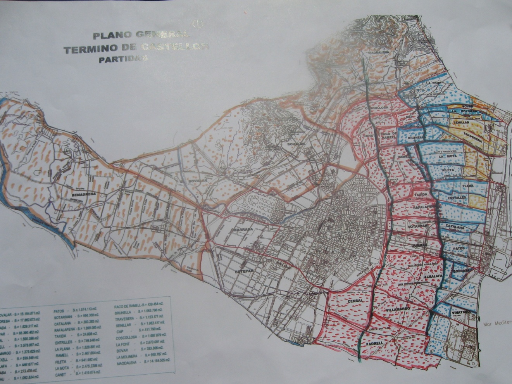

## 5. Ermitas en las partidas de Castellón

Las ermitas repartidas por las diferentes partidas de Castellón, cerradas al culto salvo en días de su fiesta, están construidas fuera del casco urbano en lugares simbólicos o estratégicos de reducidas dimensiones. En caso de que esta sea de mayores proporciones o de interés histórico se denomina ermitorio.

La Ermita de la Magdalena es la más popular y conocida se encuentra en la partida de la Magdalena. Sus días de fiesta se celebran en marzo y cabe destacar el tercer domingo de cuaresma por su ”Romeria de les Canyes” desde la Catedral de Santa María.

La Basílica de Lledó se encuentra en la partida de la Plana y como festivos tiene el tercer domingo de cuaresma con el retorno de la Romería de les Canyes; el primer domingo de mayo que es su fiesta principal y solemne de Santa María de Lledó; y el primer domingo de octubre que es la fiesta de la Real Cofradía de Lledó.

San Roc o de les Fontanelles es una ermita custodiada por la Colla el Pixaví que se encuentra en la partida de Canet. Esta es una estación de la romería de les Canyes hacia la ermita de la Magdalena, pero su fiesta principal es el último fin de semana de septiembre, donde el sábado por la tarde se celebra la misa y se rinde homenaje a algún personaje o colectivo ciudadano de especial significación festiva o cultural y el domingo se celebra la romería a les Fontanelles

San Josep de Censal.o de L’Olivera está en la partida de Censal, en la inserción del Caminàs con el camí Villamargo. Fue construida en 1689 y bendecida el 25 de junio del mismo año con la asistencia del Consell de la Vila y del Clero de Santa María, tal como consta en el Llibre Verd del Archivo Municipal. En 1988 fue cedida a la Asociación Provincial de Empresarios de la madera y el día 19 de marzo de 1991, después de restaurada, abría sus puestas y celebraba misa después de años de abandono, actualmente el día de su fiesta se celebra con un almuerzo en el terreno que le rodea.

San Isidre i San Pere del Censal en la partida de Censal, fue construida entre 1631 y 1652 en honor de San Isidro, santo venerado por los labradores del siglo XVII. y de Sant Pere, dada la proximidad del antiguo camino de la mar entre la ciudad y el Grao. Su fiesta se celebra con sencillez el domingo posterior al 15 de mayo. Festividad litúrgica de San Isidro Labrador, con misa y bendición de los campos.

Sant Joanet del riu sec en la partida del Bobalar se inauguró el 21 de junio de 1914 y celebra su fiesta el domingo posterior al 24 de junio.

La Encomienda de Fadrell situada en la partida de Fadrell, celebra su fiesta principal el domingo inmediato posterior al día 25 de Julio, festividad del apóstol Sant Jaume, la víspera se realiza el volteo de campanas y lanzamiento de carcasas, el domingo Rosario de la Aurora con antiguos cantos populares y canto de los Gozos. También se celebra una misa solemne y procesión por los alrededores. Cuando concluye la procesión se reza un responso por los castellonenses enterrados durante siglos en el cementerio de Fadrell, el más antiguo camposanto de la ciudad.

Sant Francés de la Font se encuentra en la partida de Cap. Su fiesta tiene lugar el mismo día del Santo o bien el domingo anterior al 12 de octubre. Se realiza un homenaje popular a Tombatossals. Una misa y una procesión hasta el paraje del Molí de la Font.

También tuvieron sus fiestas propias las Ermitas del Salvador construida en 1782 en la partida de Benadressa, junto a la Rambla de la Viuda y la Ermita de la Virgen del Carmen construida en 1948 en la partida de l’Estepar, junto al Camí dels Palos. En esta ermita se celebra su fiesta el día 16 de julio o domingo inmediato posterior.

## 6. El cáñamo

Texto escrito por Cornelia Milhaji

Él cáñamo ocupaba la primera línea entre los cultivos de Castellón y continuaba siendo importante en la vida agrícola de la principal ciudad de la Plana hasta el siglo XIX.

Desde 1791 Castellón cambia. Se construye la calle Gobernador y el Palacio del Obispo, donde viven 130 almas y los vecinos pasan de 3400.Todos o cultivan el campo o contribuye a ello por medio de dependientes.

Excepción hacen las familias ocupadas en manufacturar las materias primas que suministraba la agricultura: cáñamo que era la principal cosecha de la huerta.

En la vida humana es una planta muy útil por las virtudes y la composición que han sido descubiertas a lo largo del tiempo.

Se conoce su existencia desde hace miles de años a.c. por sus múltiples utilidades, como:

- *fabricar papel*

- *alimentación*

- *cosmética*

<!-- -->

- *farmacia y medicina*

- *pintura y barnices*

- *industria textil*

Para obtener una buena calidad de fibra se tenía que preparar bien el terreno a sembrar. Los suelos tenían que ser fértiles ricos en nutrientes orgánicos, húmedos y por esto se elegían los mejores de las huertas de Castellón.

La Sequiota Mayor recorre el término de S.al N. y es la que limita el Secano de la huerta y la que asegura el riego.

Después de la última cosecha del otoño cuando el terreno estaba seco se quemaba para que quedase limpio de cualquier resto de cultivo anterior o bichos y la ceniza quedaba como abono.

A principios del siglo XIX no existía abono inorgánico, se utilizaba estiércol y leguminosas verdes-

La siembra se hacía en primavera lo más temprano posible, pero siempre que ya hubieran pasado las heladas y sobre un terreno debidamente preparado y bien allanado así como con los caballones ya hechos para conformar las tablas para conducir repartidas las aguas de los futuros riegos bien esparcidas por el sistema de a manta o a bado.

La simiente se esparcía a mano o al voleo cuando la tierra, previo riego si no ha llovido estaba en perfecta sazón, procurando esparcir los cañamones lo más regularmente posible para rápidamente pasar la atabladera llana tirada por una caballería a fin de que quede la simiente ligeramente hundida y cubierta, evitando una rápida evaporación o secado del suelo fijándose a la vez en el terreno, pues de esta manera comienza a grillar rápidamente.

De semilla se empleaban de 6 a 8 kg. por hanegada y en cuanto el cáñamo ya brotado crecía hasta alcanzar una altura de unos cuatro dedos, se procedía a realizar una escarda manual para eliminar las malas brozas, así como los tallos nacidos excesivamente juntos unos de otros procurando dejarlos separados entre diez y quince cm, pues un cáñamo muy espeso, crece menos y las fibras luego son más débiles, mientras que las de las matas desarrolladas excesivamente claras, aunque la planta pueda crecer más, las fibras resultan duras y por ende de peor calidad y futura elaboración.

A los quince o veinte días de nacer el cáñamo, se practica el primer riego, repitiendo los sucesivos igualmente espaciados hasta compensar la floración y empezar el cuaje de la semilla. A partir de este momento se suprime el aporte del agua de riego para que las plantas se sequen más rápidamente.

A veces las hojas se amarillean y el desarrollo de la planta se detiene perjudicando la producción. A este accidente los labradores le llaman escaldado del cáñamo impidiendo el crecimiento de la fibra que se rompe luego de agramarla.

La siega se hacía a mano mediante grandes y afiladas hoces de ancha hoja, comenzando antes de la plena maduración de los tallos, es decir, cuando estaban más verdosos, para que la fibra tenga más elasticidad y resistencia.

El corte era más fácil y el filo de las hoces duraba más, aunque se afilaban tres o cuatro veces al día. Se dejaba el rastrojo lo más raso posible al fin de aprovechar al máximo los tallos.

Los segadores se protegían el brazo izquierdo con un manguito de lona para no sufrir y pelarse el antebrazo con el roce de las plantas dado lo áspero de su corteza.

Los haces o gavillas se ataban con cordeles y no eran más gordos que lo que se podían abarcar con ambas manos haciendo la atadura por debajo de la zona de floración de las plantas con tallos segados y manteniendo entre tres y cuatro manos al segarlos, atándolos una vez tumbados en el suelo para luego plantarlos formando barracas mediante varias gavillas, cada una apoyándose unas con otras y después a lomo de caballerías o en carro se trasladaban junto a las balsas de curado.

El rendimiento de los tallos secos y sin las hojas, pues éstas se procuraba dejarlas en los campos sacudiendo los haces antes de ser cargados, oscilaba entre los quinientos y setecientos kilos por hanegada, lo que equivalía entre cuarenta y cincuenta arrobas valencianas.

Según D. Eugenio Díaz Manteca, en 1940 todavía se podían ver las balsas de “enriar” cáñamo dentro del término municipal de Castellón de la Plana que estaban situadas en: Una grande al final de las Doberias, hoy calle Tenerías y otra entre el Caminas y el camino del Soterrani, propiedad de Molibou; otras dos junto a un camino que había entre el hoy convento de las monjas Carmelitas y el paseo de las Palmeretes. Otra junto a la alquería del Boueto en el Caminas. Una entre el Sequiol y la acequia Mayor junto al entonces llamado pont de la Canaleta en tierras que eran propiedad de la familia Sancho a quien perteneció la casa sobre la que se construyó luego el edificio del actual Casino Antiguo y que se trabajaba por la familia de los Panxeta. Otra en el hoy desconocido Capdavall y otra junto al camino de la Donació, cerca del cauce del río Seco.

Las balsas se excavaban en la tierra de forma rectangular y estaban situadas junto a la alquería en la zona de la huerta median aproximadamente 8-10 metros.

Enriado era el sumergir el cáñamo en el agua estancada de la balsa durante diez o quince días para macerar. Se tenía que cubrir con piedra para que el cáñamo no flotara mientras duraba la fermentación.

Una vez terminada la maceración se sacaba el cáñamo y se ponía encima de una fila de piedras preparadas anteriormente en el borde de la balsa, para secarse. Cuando estaba seco se transportaba a la era donde debía de ser agramado. Allí pertenecía hasta terminar de secarse y cuando estaba bien seco se dejaba arreglado formando con él la garbera hasta el tiempo de agramar.

El agramado era lento y muy costoso. Un hombre trabajaba de sol a sol y obtenía sólo cuarenta kilos de cáñamo agramado y limpio. Esta operación era de separar la parte leñosa de la fibra, machacando los tallos. El trabajo era rudimentario y se hacía con agramadora o banc de agramar. El trabajo se facilita a partir de junio de 1914 cuando aparece la agramadora eléctrica, pero después de unos años el cultivo de cáñamo empezó a disminuir.

Rastrillado era la próxima operación y consistía en separar y desliar bien la fibra obtenida. Por ello disponían de rastrilladores de diferentes pintes para peinar el cáñamo y separar la fibra más gorda de la más fina.

Terminado el rastrillado el cáñamo estaba en condiciones de ser hilado. Para ello se usaba la rueda de hilar junto a cuál se colocaba el menoret para hacerla rodar acompasadamente y él filaor iba empalmando fibras.

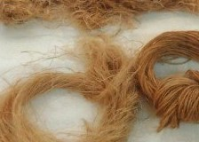

*La borra era la fibra de menor calidad y se usaba hacer suelas de alpargatas. El cultivo del cáñamo tuvo durante muchos años una gran importancia en las tierras de Castellón y también un peso, importante en la actividad artesanal de la ciudad. Aunque sobre la evolución de la industria del cáñamo en Castellón, las primeras noticias son del siglo XV, la época de mayor desarrollo fue en siglo XVIII- XIX, cuando la manipulación de fibra y su transformación en hilos y cuerda daba mucho trabajo a muchas personas, lo que ha traído la fama en este sector.*

También se desarrollaron aplicaciones industriales del cáñamo y fueron abastecedores oficiales de lonas, cabos ​y de cabuyería para la Real Marina Española. En los comienzos hasta siglo XVIII suministraron fibra de cáñamo a las reales fábricas de Cartagena y el Ferrol. En el Siglo XVIII efectivamente el Gremio de Sogueros de Castellón era uno de los más importantes proveedores de cordaje para la Marina Española por la calidad del producto. Es la mercancía que se exporta, va fuera del término y trae dinero que da riqueza. En aquellos años la ciudad era como un inmenso taller. A la vez proporcionaban la materia prima para el trabajo de espardenyers, Esparterers y sabaters.

La mayor parte de la fibra se almacenaba en un local que pertenecía al Gobierno en un edificio de la calle Mayor nº.1, junto a las murallas y al antiguo portal de l’Om, para enviar a las Reales Fábricas y también se vendían en la lonja de la plaza de la Hierba (del cáñamo) en el edificio hoy existente todavía esquina de la calle Caballeros con la hoy calle Colón, donde se legalizaban las transacciones del producto. Este huerto se demolió en 1956 para construir junto a la plaza del Rey, la del Huerto de Sogueros.

Desde tiempo inmemorial los hombres han tenido que agruparse y organizarse para defender sus intereses, tal como los gremios de Castellón. El Gremio de Sogueros se crea en el siglo XV. Destaca a partir del seiscientos el número de alpargateros, tejedores y especialmente sogueros. La transformación da origen a la creación y mantenimiento de dos Gremios con mayor mano de obra. En el siglo XVIII habían sastres, tintoreros, sogueros, hiladores, alpargateros, canteros, mamposteros, blanqueros, asahonadoras, tejedores, carpinteros y guanteros trabajaban en esta importante industria. En un complicado proceso los sogueros se dedicaban al trenzado de cuerdas y a la fabricación de alpargatas.

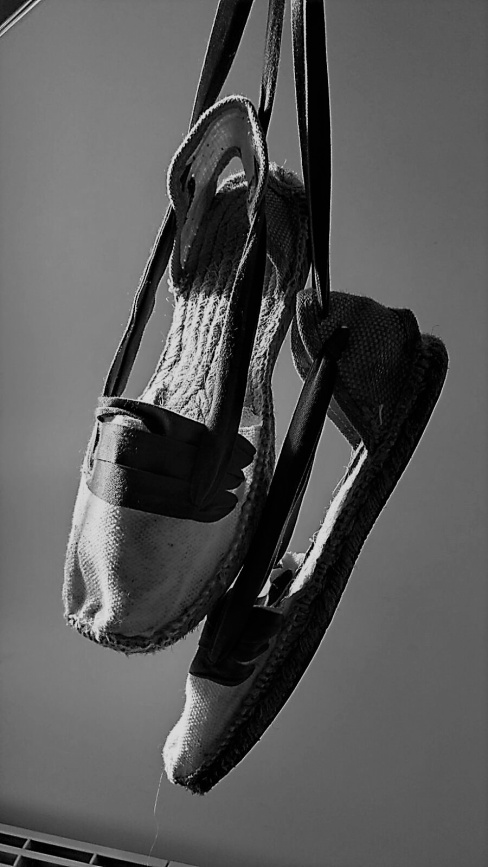

*Para resaltar la importancia de la industria alpargatera en Castellón en 1791 indicar que eran más de doscientas las familias cuyos miembros se dedicaban a fabricar este calzado. Los géneros de alpargateros se conocían en todo el mundo. Los diferentes tipos de alpargatas eran según su forma:*

- *llesta o de careto para ambos sexos.*

- *de pinxo, los llevaban más los muchachos en días de fiesta.*

- *los catalanes o de llaurador.*

Los soleros, puntilladores, y rodaores hacían todas las labores en sus casas, en la calle, en las aceras, en la puerta de sus casas o dentro según el tiempo. Muchas veces formaban corros y cantaban, hablaban mientras trabajaban sin molestar a nadie.

Se dice que en el Gremio de los sogueros, había afiliados 148 maestros, 18 oficiales y 83 operarios tejedores. El Gremio de Sogueros celebraba sus festividades patronales el día 29 de agosto (fecha de la degollación de san Juan Bautista) en la ermita San Juan, situada en la calle con el mismo nombre (hoy Colón). El Gremio de Sogueros empezó a trabajar en la calle y como necesitaban un gran espacio pensaron en la construcción de un gran obrador o huerto común donde poder ejercitar libremente su industria. En 1744 el Clavario, Mayorales y maestros de oficio de sogueros manifiestan al Ayuntamiento deseos de hacer y fabricar un huerto cercado de pared para fabricar los obrajes de cuerdas e hilos pertenecientes al oficio. El Ayuntamiento acordó acceder a la petición debido al oficio, tomar y comprar el pedazo de secano de la heredad de Tomas Castel, hasta salir al camino de Alcora y deja carrerasas a la espalda de las casas de arrabal del Calvario y el Huerto que se va a fabricar. El Huerto de Sogueros -L’Hort dels Corders- se ha construido junto a la Plaza del Rey, en el lugar que actualmente ocupa la plaza con el mismo nombre y las calles Santos Vivancos y Trullos, según el proyecto denominado La Plana, del arquitecto Vicente Traver Tomás. Este Huerto todavía existe, tiene una extensión de 13 613 metros cuadrados, está situado entre la Avenida Rey Don Jaime y la calle Arquitecto Traver, Distrito 1, Sección 2.

El Gremio era dueño de ocho casas situadas en la Plaza del Rey, continuas al Huerto, tres más situadas en la calle llamada de la Bolos, hoy de la Morería y una en la calle del Gobernador. En el siglo XIX a consecuencia de la ley de desamortización que prohibía 10 propiedades corporativas, el Gremio de Sogueros se vio despojado de las once casas que tenía en la ciudad, e incluso del propio huerto donde desarrollaban su labor. Estas casas eran ocupadas por un módico alquiler especialmente familias humildes.

La propuesta del gremio de exceptuar estas propiedades de la venta pública y permitir que fueran adquiridas a un precio convenido por un agremiado de toda confianza no tenía fácil solución. La situación fue presentada al rey Amadeo I, durante la visita que hizo a Castellón, que se hospedo en la fonda de San Juan el rey, con un gesto de generosidad donó el importe de la compra. En agradecimiento al rey, se le dedicó una calle a Amadeo I junto al Huerto de Sogueros. El huerto y dos casas fueron adquiridas por personas interpuestas, de acuerdo con los agremiados y a ser reconocido por las leyes vigentes. Reorganizándose el Gremio, estableciéndose sus nuevos Estatutos presentados en el Gobierno Civil, adquirió nuevamente la propiedad del Huerto del oficio y las dos casas número 67 y 68 de la Plaza del Rey, únicos bienes que hoy posee por escritura autorizada en 1914 por el notario. Posteriormente en los años 40 por necesidades urbanísticas el Ayuntamiento llegó a un acuerdo con el Gremio de Sogueros y estableció el Hort en unos terrenos propiedad municipal, junto al Matadero viejo, entre la calle Gobernador y el Polígono Rafalafena. Allí estuvo el Huerto Sogueros hasta que desapareció con la edificación de la zona en la década de los 70.

El cultivo de cáñamo a finales del siglo pasado entró en decadencia por no tener tanta salida. Poco antes de que esto ocurriera, en la industria del cáñamo trabajaban más de 600 personas, por un lado y por otro en Castellón había más de 300 talleres.

Actualmente dado la decadencia del oficio, en el que trabajan escasos números de obreros, el Huerto, por estar en una de las zona más céntrica de la ciudad, desapareció, procediendo a su urbanización, y adquiriendo terrenos para la construcción de un nuevo Huerto, en las afueras de la población, que sirva de taller, y en el que puedan continuar sus labores, los pocos que se dedican hoy en día a lo mismo.

Enajenado dicho Huerto, desaparecerá el oficio de sogueros casi por completo en Castellón, cuyo Gremio tantísima importancia alcanzó en tiempos pretéritos. Recientemente antes de la última reforma urbana, en este recinto se levantó un monumento que recordaba al menadoret, el niño que ayudaba al filaor. En 1999 se reformó la plaza, se construyó un aparcamiento en el subsuelo y se instaló una escultura que recuerda el trabajo del cáñamo, que tantos años ocupó este espacio.

## 7. El naranjo

Texto escrito por Tomas Sanmillan

La naranja, ó taronga como decimos aquí, ha sido durante más de dos siglos el primer recurso económico de la Comunidad Valenciana.

Gracias al desarrollo del comercio exterior, el cultivo tradicional se expandió aprovechando los recursos de suelo y agua del que dispone nuestra comunidad, lo que conllevo a un cambio para los agricultores así como paisajístico, al dedicarse grandes extensiones de tierra a su cultivo.

Es una fruta con historia de más de 20 millones de años de antigüedad de los primeros cítricos desde sus orígenes en el Sudeste Asiático, pasando por la mitología griega y su propagación de oriente a occidente. Las primeras variedades de cítricos poco tenían en común con la naranja dulce que conocemos hoy en día.

Siglo XI se introduce en el norte de África, Sicilia, Cerdeña y España.

Los árabes traen el limonero, siguiendo el mismo camino que el naranjo amargo; no es hasta finales del siglo XVIII, cuando se inicia el desarrollo del cultivo del naranjo en el reino de Valencia. Se dice que fue el cura de Carcaixent don Vicente Monzó i Vidal el que decidió ensayar el cultivo del naranjo dulce, de ahí el dicho “De Carcaixent dolçes les dones i les Taronges”.

Por lo que se refiere a la provincia de Castellón la primera referencia sobre el naranjo dulce la da el farmacéutico don José Jiménez quien a su tratado de plantas inédito que concluyó en 1789 describe una variedad de naranjo amargo, tres de dulce, dos de limonero y una de cidro; da a conocer las propiedades medicinales de la fruta y otros usos pero nada sobre la importancia comercial de estos cultivos.

1825-1830 Empieza a cultivarse el naranjo en la provincia de Castellón, se plantan huertos de naranjos en Villarreal y poco después en Burriana y Almazora al producirse naranjas en cantidad en este primer núcleo de la provincia de Castellón no tardaron en presentarse en las playas de dichos pueblos pequeñas embarcaciones de Cataluña y Baleares para cargar fruta a granel y transportando por cuenta de los patronos a los puertos de Tarragona, Barcelona y el sur de Francia.

1856 José Polo de Bernabé introduce el cultivo del mandarino en Villarreal.

como tierras hasta entonces se dedicaban al cultivo del trigo y cáñamo.

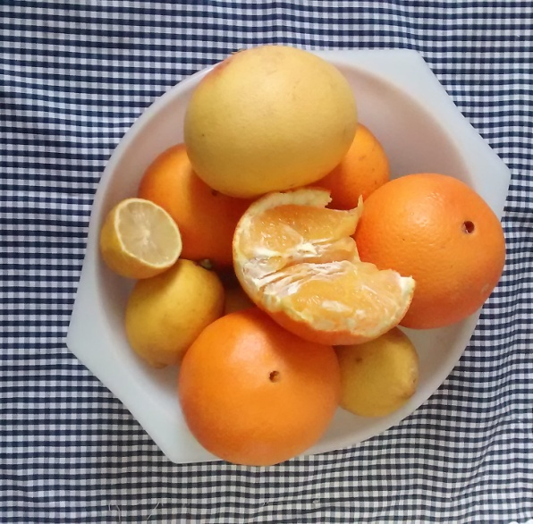

*1860-1870 En este decenio se produce la extensión del cultivo de los cítricos en Castellón transformándose en huertos muchas marjales así en enero de 1946 se presentó un revuelto régimen atmosférico, con chubascos, fuertes vientos bajas temperaturas y nieve. El frío produjo grandes heladas y retrasó de la desaparición de la nieve de las calles y de los campos. El termómetro llegó a seis y siete grados bajo cero, lo que heló la naranja y los árboles. Se tuvieron que replantar todos los huertos afectados.*

Tareas de cultivo

Regar.- El naranjo necesita agua para vivir. Hay dos formas de regadío:

1º El riego normal consiste en llevar el agua hasta el árbol por medio de acequias. Los huertos están cruzados por caballones para que esté más controlada la regada. Cada 20 ó 30 días dependiendo de la época es necesario regar.

2º Riego por goteo. Mediante un sistema de tubos el agua transportada hasta el árbol, se llama goteo porque alrededor del naranjo pasan tubos que a una cierta distancia están agujereados y dejan caer el agua gota a gota.

Abonar.- Hace unos años solo se utilizaban abonos de excrementos de animales; más tarde se comenzó a importar de Sudamérica materia orgánica en nitrógeno procedente de las aves marinas llamado “ guano” ó Nitrato de Chile.

Poco después el labrador se preparaba compuestos mezclando potasa y hierro.

Si el abono es orgánico se ha de cubrir con tierra y si es químico se tira cuando se riega.

Podar.- Podar los naranjos consiste en quitar algunas ramas del árbol para:

- Favorecer la recepción de la luz y aire a todas las hojas

- Aumentar la producción

- Renovar la madera

- Aumentar el tamaño y calidad de la naranja

- Facilitar los trabajos

- Favorecer los tratamientos fitosanitarios

- Vaciar por dentro la copa para favorecer la fructificación externa.

Cada variedad tiene una fecha y forma de poda pero esta se hace normalmente a finales de primavera, las herramientas más usadas son:

- Sierra de mano

- Tijeras

- Motosierra

- Maza de madera y Formón

Plantar.- Antiguamente los labradores hacían sus semilleros con semillas de naranja borde, pero la aparición de enfermedades como la tristeza obligó a plantar árboles de pie tolerantes, es decir que no se contagien de estas enfermedades adquiridos en viveros y den garantías que los plantones se encuentren libres de virus.

Los plantones deben de cumplir estos requisitos:

- *Resistentes a enfermedades*

- *Productivos*

- *Que hagan buena calidad de fruto*

- *que empiecen pronto a producir*

- *Que se adapten a las características del suelo*

- *Que soporten las condiciones del medio.*

Los patrones que más se utilizan son los Troyer y el carrizo. Algunos labradores plantan el pie borde para después injertar. Otros los compran ya injertados en vivero de la variedad deseada.

Los patrones deben de ser resistentes a la tristeza.

Para plantar un nuevo árbol se hace un agujero en la tierra de 20 cms, se desinfecta la tierra, se riega el agujero, se separan las raíces, se pone tierra y con un plástico para que se conserve la humedad.

Los dos primeros meses se riega semanalmente y después de cada 15 días.

Para abonar los plantones se emplea estiércol, abonos con nitrógeno y foliares.

Patrones de los cítricos.- La aparición de enfermedades graves en este cultivo ha sido el motivo que ha llevado a la búsqueda de patrones que hicieron posible su contaminación. Fue en primer lugar la podredumbre del pie o gomosís de la que es causante varias especies de Phylophtora, primero en la Isla de S. Miguel (Azores) en 1842, en 1845 en Portugal y ya después en todo el Mediterráneo.

Todo ello hizo que se suspendiese el cultivo de estos a partir de semillas y obligó al injerto de variedades sobre patrones tolerantes a esta enfermedad. El naranjo amargo (C. aurantium) ha sido hasta hace poco tiempo el patrón más empleado haciendo gala de las mejores cualidades, hasta que hace aparición de la Tristeza (Quick Decline), el cual es afectado de manera mortal cuando es injertado de naranjo dulce, mandarino, pomelo y limero (no de limonero). Es por eso que se ha empezado a sustituir por otros.

Como patrones se emplean por orden de importancia: Naranjo amargo, Citronge, C. Carrizo, Citrus Wolkameriana y Citromelo 4475. Patrones y proceso de registro del Instituto Valenciano de Investigaciones Agrarias (IVIA).

En diferentes centros de la Comunidad Valenciana se realizan experimentos para mejorar las variedades de los cítricos comerciales. Entre ellos el IVIA, de la Universidad Politécnica o la ULos cítricos en la Comunidad Valenciana.

Variedades.-- La naranja es el fruto del naranjo, árbol que pertenece al género Citrus de la familia de las Rutáceas. Esta familia comprende más de 1600 especies. El género botánico Citrus es el que más importante de la familia y consta de unas 20 especies con fruto comestible de sabor rico y agradable, fuerte y sano, además de portadores de vitamina C.

Satsuma

- *Satsuma*

- *Owari*

- *Clausellina*

Clementina

- *Fina*

- *Oroval*

- *Clementina de Nules*

- *Tomatera*

- *Esbal*

Mandarino

- *Hernandina*

- *Clementard*

- *Marisol*

- *Arrufatina*

- *Clementina*

- *Oronules*

Híbridos

Fortune

- *Ellendale*

- *Kara*

- *Nova*

- *Ortanique*

- *Wilking*

Mandarino común

- *Washington navel*

- *Thompson*

Grupo navel

- *Navelina*

- *Newhall*

- *Navel late*

- *Recalaste*

- *Navel lanate*

**Naranjo dulce**

Comuna

- *Cadenera*

- *Salustiana*

Grupo blancas

- *Castellana*

- *Berna*

- *Valencia late*

- *Viciedo*

- *Macetera*

- *Doble fina*

- *Entrefina*

Grupo sangre

- *Sanguinelli *

- *Murtera*

- *Washington sanguina*

La Industrialización y recolección

Para la comercialización de la naranja y llevarla de los campos a los mercados existen una serie de procesos.

Recolección

*El proceso de recolección se realiza a mano, con unas tijeras específicas que

cortan el pedúnculo del fruto o bien a mano (de tirón), aunque ésta es una técnica, que es más rápida, pero que reduce la presencia del fruto.*

**Los cítricos en la Comunidad Valenciana**

El momento de la recolección es un aspecto importante porque hay que determinar el momento más óptimo, siendo aquél en el que el fruto tiene una índice de azúcar adecuado, independiente del color de la piel. Además, es importante no recolectar el fruto si éste está húmedo, bien sea por el rocío, niebla o lluvia.

- *Transporte al almacén.*

- *Tratamiento fungicida (drencher)*

- *Desverdización con etileno*

- *Tratamiento fungicida en baño o cortina de espuma SOPP*

- *Enjuague con agua*

- *Cera al agua + fungicida*

- *Secado*

- *Clasificación por calidad*

- *Calibrado*

- *Envasado*

- *Almacenamiento frigorífico*

- *Paletización*

- *Carga*

- *Transporte*

Los frutos recogidos se depositan en capazos de plástico flexibles (18kg) que cada operario transporta hasta el lugar de pesaje donde se transfiere a cajones (20 kg)que son transportados a los almacenes de confección.

*Una vez el fruto llega al almacén de confección siguen los pasos del esquema del proceso de manipulado de frutos cítricos. Como curiosidad vemos fotos antiguas de la recolección de la naranja y la modernización del proceso en comparación con hoy en día.

**Desverdizado**

Es una operación que se efectúa en los frutos recolectados al comenzar la variación de color y que son aptos para el consumo. La acción de las bajas temperaturas es sustituida por la mezcla de aire-gas de etileno que provoca el cambio de coloración del fruto.

Acondicionamiento y empaquetado

El acondicionamiento consiste en una serie de operaciones a las que se somete el fruto en las líneas de confección con el fin de facilitar el empaquetado y mejorar su presentación.

Recepción y secado

*Preselección y limpieza

Tratamiento antifúngico y abrillantado*

Selección

*Calibrado y empaquetado

Control de calidad

Los controles de calidad establecidos durante el manejo post-cosecha, empaquetado y distribución de los frutos cítricos están clasificados en 3 grupos:

1. *Atributos de la calidad interna, los que puede medidos por el gusto, olfato y tacto,*

2. *Atributos de calidad externa, perceptibles por la vista y el tacto, como la coloración, alteraciones y defectos, etc., medibles en ocasiones.*

3. *Atributos de tipo tecnológicos o comercial, relacionados con la vida*

> *comercial del fruto, como la condición fisiológica, presencia de hongos.*

Actualmente se tiene establecidos además atributo toxicológicos y nutricionales.

Contratación de personas para la recolección y selección de la naranja

Generalmente, las personas terminaban su jornada en los campos, regresaban a sus domicilios, se arreglaban después de su aseo personal, se iban a la plaza del pueblo, al casino a la caixa rural y los contratan por cuadrillas por el “cap de cuadrilla” o encargado para su recolección quedando a primera hora de la mañana en el lugar de encuentro o en la finca de recogida, una vez en la finca se disponían a la tarea de recoger el fruto denominada collir; que podría ser de a “estall” destajo cobrar por kilo recolectado y la normal siendo ésta más lenta, igual recogen hombres que mujeres también jóvenes más ágiles que les llaman colmeneros porque por su agilidad y poco peso recogían los frutos más altos del árbol.

Se cobra por jornada que el “cap de cuadrilla” se encarga de pagarles.

También era la costumbre que el dueño del huerto les llevaba una garrafa de vino para el almuerzo y la comida.

En cuanto al personal del almacén se contratan a hombres para el peonaje de carga y descarga el fruto, a los fusters personas que confeccionaban las cajas de naranjas de madera, les dones triadores que seleccionan el producto, les empapeladores que algunas naranjas iban envueltas con papel cebolla con la marca y las niñas más jovencitas las tiradoras que suministraban género a las triadores.

Cuando había mucha demanda de producto en campañas de fuerte demanda las mujeres del almacén iban hacer nits lo que quería decir que después de cenar iban y hacían unas pocas horas.

Compra del producto

La compra de la naranja a los propietarios de los huertos por parte de los comerciantes de los almacenes se realizaban, por medio de la figura del “corredor” persona que conocía generalmente a todos los dueños de los huertos de las partidas existentes en el pueblo y por supuesto sus domicilios; generalmente se presentaban en el domicilio del propietario a media-tarde noche para entablar conversaciones sobre la compra de la naranja y hacer el trato palabra que se denominaba “aferrar el preu” que consistía el cerrar el trato que podía ser “ a ull “ trato que tenía su truco dando un tira y afloja entre el corredor y el propietario porque cada uno tiraba para su arrimo, uno decía que tenía tantas arrobas y el otro que tenía menos hasta que llegaban al final del trato conviniendo las arrobas; lo bueno para el dueño del huerto era que se cobraba al contado. La otra era convenir el precio se vendían generalmente a tantos duros la arroba (la arroba valenciana son 12,78 kg

## 8. El arroz

El arroz es un cereal que se siembra con agua, crece con aguas, se recolecta con agua y se cocina con agua.

Los datos históricos dicen que se adapta al agua en el norte de la India, llega al sur de China, Indonesia y Japón. En el siglo I de nuestra era se cultivaba en las riberas del Éufrates y Tigris. Más tarde pasa a Persia para seguir extendiéndose en las riberas del Mediterráneo. Ni los griegos ni romanos le prestan demasiada atención siendo los árabes los que lo introducen por Andalucía y más tarde por Levante sobre el año 1200, antes que en el Delta del Ebro.

Cuando el Rey Jaime I conquista la Plana, se encuentra con tierras planas pantanosas, boscosas y llenas de zarzas, boj, cañas, juncos, laurel, etc… así como *lluens* que procedían de la lluvia del desbordamiento del rio Seco, del barranco de Fraga y otros como el de la Magdalena, el de le Raya, y el del Sigualero, agua que bajaba de las montañas del desierto de Las Palmas y de todas las pendientes, también del temporal de la mar y de las aguas dulces de las fuente de la Reina, (nombre que recibe porque allí bebió Doña Violant de Hungría) y por el sur del agua de la fuente de la Barrassota en el actual término de Castellón.

La época exacta en que empezó a cultivarse el arroz es dudosa, posiblemente los moriscos ya lo hacían. La tierra baja y las aguas que allí iban a parar era la adecuada para el cultivo del arroz. Diferentes monarcas unas veces lo autorizaban y otras veces lo prohibían, según quien influía cada momento por diferentes razones.

La poderosa Orden Militar de Santiago en la partida de Fadrell forzaba este cultivo, ya que su desarrollo aumentaba sus rentas, aunque muchas veces recibían fuertes quejas, pues los vecinos creían que el paludismo, o malaria y todos los males eran por su causa.

Arcadi Llistar Escrig en su libro Historia de Castellón (1887) habla de los trágicos tiempos en que debido al excesivo cultivo del arroz en la primavera de 1698 se desarrollaron entre sus moradores unas fiebres malignas llamadas fiebres terciarias (paludismo) que diezmó la población, en todas las casas había enfermos graves hasta el día de Sant Cristófol en que milagrosamente cesaron aquellas calenturas y empezaron a recuperarse.

Los vecinos, libres de la enfermedad, pidieron al Justicia y al Ayuntamiento celebrar una Junta General de vecinos en la que proponen y se accede a hacer una festividad perpetua en honor de Sant Cristófol adoptándolo como patrón de la Villa en prueba de su agradecimiento.

### Siembra plantación y siega

Durante el invierno los campos dedicados a este cultivo permanecían inundados de agua dulce, pues al ser tierras bajas respecto al nivel del mar y cerca de esta, al estar inundadas de agua dulce evitaba la salubridad. De esta forma la fauna subterránea existente como gusanos, hormigas, y plantas perjudiciales se ahogaban, aunque después vuelvan a salir. Las raíces y restos de la cosecha anterior se convertían en abono, de esta forma año tras año la tierra no empobrece.

Por Enero o Febrero a los campos se les quitaba el agua, se secaban y se enfangaban. Por San José se preparaba la siembra, se abonaba la tierra había que ararla cinco o seis veces para que se secara la tierra con el sol. Después se llenaba el campo de agua, a al cabo de dos días se igualaba con una tabla *abaixadora*, para después esparcir a voleo la semilla. La dosis media de semilla para la siembra es alrededor de 140-180 kg de semillas por hectárea, en parcelas bien nivelados y no muy grandes. Si es posible que la parcela esté rodeada de moreras que aminora la fuerza del viento y así impiden que arranque las frágiles plantas el viento.

A finales de Abril cuando los plantones tenían una alzada de palmo, o palmo y media y hojas alargadas con espiga de granos múltiples y separados unos de otros, se arrancaba a mano con cuidado de no quitar las raíces, se juntan haciendo una *garbeta,* ataba con bridas de esparto remojado para reblandecerlo y así facilitar su sujeción.

Mientras la tierra que esperaba los plantones se acondicionaba removiendo el fango con *tauladores* con cuchillas de nombre *drages,* arrastradas por un caballo con un hombre encima para hacer más peso así se producía un fango fino, de este modo las raíces de los plantones se ponían a más profundidad.

El trabajo de arrancar y plantar lo hacían los mismos hombres, que primero acudían al bancal donde estaban los plantones casi de madrugada, así la planta ofrece menos resistencia y arrancaban lo necesario para esa jornada. La costumbre era que a continuación tomaban la “*mañanita”* que consistía en comer *madalenetes* o *rollets* y bebían una copa *d’aiguardent*, para después trasladarse al campo donde tenían que hacer la *plantá* almorzar allí y empezar la tarea de poner a una distancia de 20 centímetros cinco o seis plantas de arroz durante todo el día. Al hacer el mismo trabajo en todas las tierras de arroz se necesitan bastantes braceros o jornaleros al mismo tiempo, que se contratan en distintos lugares fijos o plazas de Castellón.

Si el arroz era sembrado directamente a voleo en el bancal la siega era prácticamente igual aunque un poco más tarde.

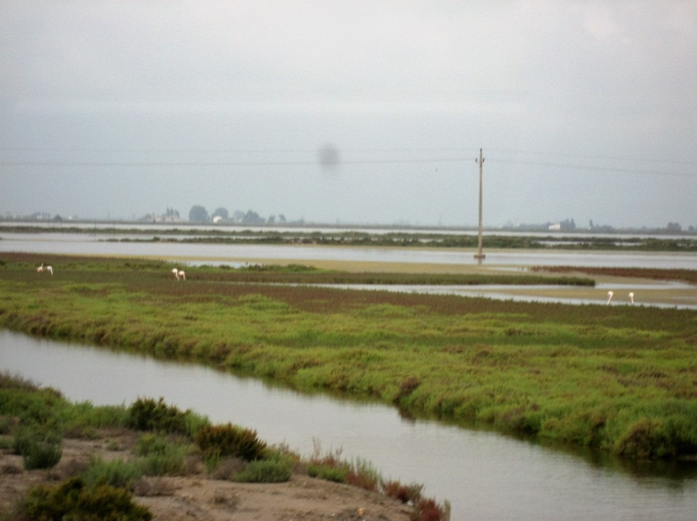

A las dos semanas se quitaba el agua del campo y se procedía a abonarlos con una mezcla de 25-35 kgs de sulfato amónico, 20-25 kgs de superfosfato con 10kgs de potasa por hanegada de tierra, repitiendo esta operación en las tierras más pobres las veces que hacía falta estos abonos los facilitaba la Cooperativa a los socios. También manualmente se habían de arrancar las malas hierbas hacerlas en manojos y enterrarlas, manteniendo así la tierra limpia. A las dos semanas se quitaba el agua del campo y se procedía a abonarlos con una mezcla de 25-35 kg de sulfato amónico, 20-25 kg de superfosfato con 10kgs de potasa por hanegada de tierra, repitiendo esta operación en las tierras más pobres las veces que hacía falta estos abonos los facilitaba la Cooperativa a los socios. También manualmente se habían de arrancar las malas hierbas hacerlas en manojos y enterrarlas, manteniendo así la tierra limpia.

A últimos de Agosto o Primero de Septiembre empezaba la siega de las variedades más tempraneras, cuando el grano cuajado tenía un color entre amarillo- dorado, aunque la paja estuviera color verde, esto es señal de cosecha sana. Previo a la siega se desaguaba, y después a los tres o cuatro días los hombres segaban a mano el arroz con una *corbella* dejando un rastrojo de 10 centímetros, la planta segada se quedaba en el campo y cuando tenían una *garba* se volvía atar por debajo de las espigas. A continuación, un hombre llamado *surracador* con una *falç* más grande y dentada, serraba la garba dejando el manojo de espigas segadas sobre el montón de paja en el bancal.

Una vez las espigas en la era se trillaban con una caballería como se trilla todos los cereales. A continuación se secaba previamente extendido al sol. La paja servía como embalaje o se quemaba en el campo para abono. De esta forma ha sido como siempre se ha obtenido el arroz, hasta los últimos años de su producción.

### Formación del coto arrocero

Debido a una heredad que recibe el Ayuntamiento de Castellón con el nombre de Pinar de la Mar, Prado o Cuadro con una superficie total de 383 hectáreas con 8 áreas en 1911 solicita a quien corresponde, que algunas de estas parcelas se dediquen a Coto Arrocero. Algunos de los particulares de los marjales colindantes, aprovechan para sumarse. El Ayuntamiento de Castellón vende en subasta pública las parcelas y se hará uso por Ley el 11de Mayo de 1920.

En fecha 29 de Diciembre de 1924 se constituye “la Primitiva Arrocera”. También se prevé que la administración del servicio de riego, desagüe y caminos correrá a cargo de un Sindicato con representación del Ayuntamiento.

A partir de 1940 con las restricciones, los labradores podían quedarse con 200 kg de arroz para consumo familiar, el resto de la cosecha obtenida era forzoso la entrega a la Cooperativa para que una vez blanqueado, puesto a disposición de la Comisaría general de Abastecimientos y Transportes para su distribución por toda España (Lo mismo que ocurría con otros tipos de cereales, trigo, centeno o cebada en las tierras del interior de la provincia).

En la década de los años 50 el cultivo del arroz estaba en auge, aunque las exportaciones se pagaban a bajo precio generalmente a Extremo Oriente.

Para hacer el arroz más productivo La Cooperativa San Isidro compra una parcela junto al Camino Serradal de algo más de 6 hanegadas y construye parcelas, suficiente para el secado de cada una de ellas de 100 Kg de arroz al servicio de los socios.

Se adquirieron dos trilladoras una fija en el secadero y otra que circulaba entre los secaderos particulares de los socios en un itinerario rotativo. Y también se adquirieron tractores para el *fangeo*

El Coto Arrocero de Castellón, actualmente conserva su toponimia en todos los planos del término, aunque su uso como campos de arroz, después de tiempo inmemorial terminó en el año 1969 cuando el Ayuntamiento de Castellón decido desecar las tierras, por su insalubridad y poco rendimiento.

El paludismo, siempre se ha relacionado con el cultivo del arroz, pero, no es el único foco de infección. El trasmisor de esta enfermedad es la hembra del mosquito *anophele* que se reproduce poniendo sus huevos en aguas muertas y podridas como en los marjales de sazón y *lluens,* donde el agua está estancada y produce la descomposición de la materia orgánica que contiene activada por el calor y la luz solar. El mosquito propaga la infección al picar a individuos sanos por los marjales y tierra de arroz y a la población que trabaja y vive cerca, que también se contagian entre ellos, con intervalos de tres días de ahí el nombre de *terciarias.*

En pleno auge del cultivo del arroz en los años 1940 comenzó a observarse que algunas personas que cultivaban arroz enfermaban, tiritaban y sufrían fiebres altas, al propio tiempo se les ponía el cuerpo amarillo, la dolencia era grave y a veces mortal, parecida a la sífilis.

El doctor don Vicente Altava medico de medicina interna del Hospital Provincial (que ya mayor, conocí como paciente suya) llegó a la conclusión que aquella enfermedad era transmitida por un virus por contacto con la corriente sanguínea. Contacto con dos médicos, uno italiano i otro polaco que supo investigaban el mismo tema. El agente contaminante se transmitía a través de la orina de las ratas del campo de la variedad «*norvegius»* al pisar los trabajadores del campo del arroz que iban descalzos, la tierra o barro contaminado, se impregnaban a través de alguna herida o ulcera. Durante dos años el D, Vicente Altava y en los laboratorios del D. Villalonga en la Plaza la Paz junto al D. Barreda, y otro doctor, se estudió y experimentó con ratas, que culminó con una vacuna para la enfermedad conocida como *«Brucelosis»* que empezó a administrarse a todos los arroceros, en el año 1948 resultando efectiva.

Ahora todo esto un recuerdo, pero con mucha historia que no se debe olvidar.

Durante la Guerra de Cuba finales del s. XIX los oficiales se dieron cuenta que los soldados de cuota que procedían de la zona de arrozales valencianas eran más inmunes a las enfermedades relacionadas con las zonas pantanosas como la fiebre amarilla, el paludismo y la disentería.

## 9. El algarrobo

El origen del algarrobo es dudoso. Ciertos autores lo sitúan en el Norte de África, otros que proceden de Asia Menor. El aprovechamiento de los frutos se remonta a tiempos antiguos. Herodoto lo menciona como cultivado en Siria Jana y Rodas. Sin duda es un árbol de origen mediterráneo, en la Edad Media se extiende por este mar, difundiendo su nombre. “Kharub”.

Las primeras noticias registradas, sobre plantaciones de algarrobos y su aprovechamiento en el libro de Peyta según datos de Sanchez Adell, en 1398 dentro del término municipal de Castellón se cuentan 602 hanegadas. Es indudable que este cultivo empieza a tener importancia, pues en 1468 son 6.828 hanegadas las que se cultivan. La expansión máxima de este producto se produce durante los siglos XVI y XVIII y sobre todo en el siglo XIX.

A principios de siglo XX años 1920 el cultivo de la algarroba está consolidado y 1940 en la posguerra dobla el precio de venta y según datos de la Cámara Sindical Agraria en 1974 en Castellón aun se cultivan 1.760 hanegadas con una cosecha declarada de 21.120 arrobas equivalente a 253. 440 kilos.

Como comerciantes de algarrobas con industria propia de trituración para aprovechas la harina y el garrotín. En 1925 estaban en Castellón José Fibla Fresquet que tenía el almacén en el paseo de Morella y también Adan y Rueda.

Su zona de cultivo es de secano, coincide con el olivo, la vid, y el almendro. Es un árbol poco exigente, se adapta a diversos terrenos, aunque los mejores son los calcáreos por lo tanto permeables, lugares rústicos y pedregosos donde no es posible el cultivo de otras especies.

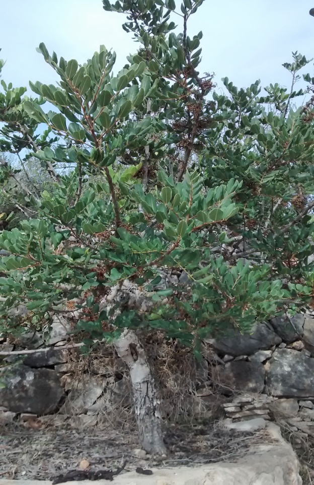

Este árbol vegeta cerca del mar a una altitud menor de 500m. y mayor de 40m. El algarrobo es un árbol siempre verde. Sus hojas duran de uno a dos años siempre se renuevan constantemente. En primavera aparecen las hojas nuevas y en verano caen las viejas. Pertenece a la familia de las leguminosas. También se le conoce como, garrofero y garrofera es un árbol de grandes dimensiones, las ramificaciones al envejecer se inclinan de forma horizontal hacia el suelo, dando al árbol el aspecto de una mata grande, su raíz es gruesa y tortuosa, y el tronco de color gris ceniciento de joven, luego arrugado alcanzando gran diámetro, resiste a las adversidades más extrema y su crecimiento es muy lento. A los seis años de edad no alcanza más altura que uno o dos metros. El periodo de crecimiento y desarrollo dura de cuarenta a cincuenta años, después se mantiene estacionado y puede llegar a vivir más de un siglo.

La reproducción del algarrobo es bastante compleja pues existen arboles con flores hermafroditas y otros con flores unisexuales, masculinas o femeninas, forman un racimo, y cada racimo posee de 10 a 12 flores. La garrofa o fruto es una legumbre alargada, comprimida y coriácea, de 10 a 12 cm de largo y 2 a 3 cm de grueso. La vaina permanece verde e inactiva durante el invierno, crece rápidamente de febrero a mayo o principio de junio, su color verde cambia a chocolate oscuro en julio señal de madurez hasta septiembre.

Las variedades más conocidas son:

**Tendral**. Árbol grade y frondoso, hojas de color verde claro, sensible a las bajas temperaturas. Es productivo y se desarrolla rápido. Su fruto es fino y apreciado.

**Negra o negreta**. Árbol grande i vigoroso. Es productivo, su fruto color muy oscuro. Variedad muy apreciada.

**Catxes**. Árbol de tamaño regulas y ramificación clara. Fruto de color rojo oscuro, largos, escasamente pulposo, de poco peso, pero muy dulce.

**Matalafera**. Árbol no muy grande y poco frondoso, de hojas grandes y ramas derechas y lisas. Da frutos de color rojo oscuro casi negro, largo ancho y grueso, excelente aspecto, pero poco peso y no muy dulces. De producción constante.

**Rojal**. Árbol de gran desarrollo, rama rugosa, abundante e irregular. Frutos pequeños de color rojo y marrón claro, su pulpa es blanca y dulce. Producción regular y constante. Es una variedad muy apreciada.

**Cassuda**. Árbol de gran tamaño, frondoso y de follaje espeso. Fruto de color rojo castaño, muy pulposo y de color blanquecino, sabor agradable, por lo que es de muy buena calidad, pero la producción no es grande.

### Recolección y usos

El fruto empieza a madurar y escurecerse por un extremo y avanza hasta llegar al péndulo. Cuando esta todo oscuro y seco la madurez de la garrofa esta completa.

La recolección empieza a finales de verano y principio de otoño. Entonces las cuadrillas de hombres y mujeres iban cada día mientras duraba la recolección a los algarrobales en grupo. Ponían encima del carro las herramientas y todo lo que necesitaban para pasar la jornada en las tierras cercanas, y si la finca era más lejana, y tenían que pernoctar por estar alejadas de la ciudad les proporcionaban comida y alberge en alguna masía o edificación de la finca. Los hombres después de almorzar tiraban al suelo los frutos ya secos utilizando cañas largas y gruesas y a la punta con un gancho formado por una raíz para sujetar las ramas y poder sacudirlas mejor. Las mujeres recogían el fruto seco del suelo con capazos que vaciaban en sacos de arpillera y los hombres encargados de este menester los llevaban al carro si se podía acceder con él a la finca, si no era así, y los campos estaban en zonas escarpadas cargaban los sacos llenos a las albardas de mulos asnos o caballos hasta el lugar donde estaban los carros y de allí al final de la jornada los llevaban diaria y directamente a los almacenes de los comerciantes que se encargaban de distribuirlos para su venta a granel o a los mayoristas del ramo.

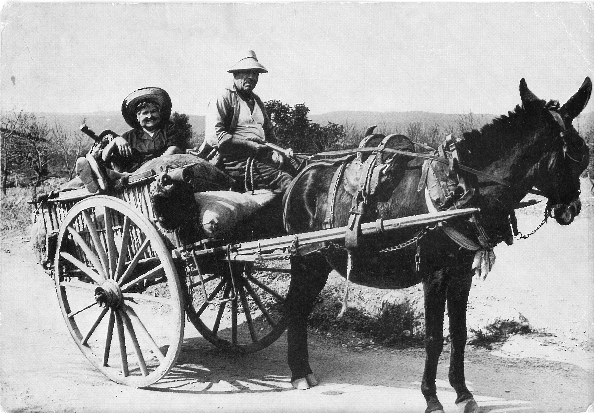

Los usos más importantes de la garrofa son varios: enteros se utilizaban para la alimentación de ganado, mas tarde empezó a trocearse, los animales lo comían mejor, La pulpa reducida a harina, en tiempos de escasez se consumía como sucedáneo del cacao y en la fabricación de chocolate, su formato era una barra redonda de unos 20-25 cm envuelto en papel, creo que era blanco, que al comerlo se pegaba al paladar, áspero con un sabor característico que aun recuerdo. El uso de la pulpa es muy rica en *mananas* y en *galáctanas* con gran poder astringente por lo que también se usa en medicina. De las vainas también se obtiene alcohol, azúcar, y en la fabricación de cosméticos. La semilla o *garrofín* que se encuentra al trocear la garrofa no se puede digerir por su dureza, tiene tres partes la *caticula,* se extrae carbón activo, celulosa y sustancias colorantes y gelatinizantes que se aplican en la alimentación, química y farmacia. Del *endospormo* se obtiene goma de múltiples usos, fabricación de papel, alimentos (helados, flanes, bizcochos, pasteles, salsas y condimentos. Del *germen* se aprovecha su complejo proteínico como aditivo para conservas, fabricación de pastas, pan, y extractos para caldos. El garrofín también tiene una propiedad para muchos desconocida.

El fruto de este árbol en todos los ejemplares que miden más de un palmo de longitud y en plena madurez, las simientes que contiene el garrofín son de idéntica medida y peso, de una gran dureza y difícil descomposición ni alteraciones por humedad, por lo que desde un principio los joyeros hindús y persas tomaron estas simientes como unidades de peso para todas las piedras preciosas motivo de transacción con el nombre de al-quilart, que más tarde se convirtió en kilate, esta unidad de peso equivale a un ciento cuarentavo de onza, o sea 205 miligramos. Una onza son 28,35g.

Los riegos que transformaron las partidas de secano en regadío, se debe al interés por aprovechar las aguas del la rambla de la Viuda. Se constituyo legalmente La Comunidad de Regantes del pantano de María Cristina el 9 de febrero de 1926 con ayuda estatal. También se perforaron diversos pozos para asegurar el suministro de agua para riego de las tierras de secano convertidas en regadío cada vez más numerosas.

Actualmente el algarrobo no es tan necesario como pienso, pero es muy demandado por sus diversas propiedades y aplicaciones. Por la franja del litoral de la provincia aun se ven campos cultivados.

A partir de 1930 gracias al agua para riego procedente de la Rambla de la Viuda, de los pozos y del pantano de María Cristina, muchas tierras de secano se convierten en naranjos y solo queda el algarrobo en las fincas montañosas del norte del término municipal que poco a poco se abandonan, pues su cultivo resulta duro y antieconómico. Su valor no ofrecía gran interés, aunque ahora no produzcan, tampoco dan trabajo, si vas por el campo aun se ven frutos de algarrobos en el suelo, y resisten con sus troncos arrugados y envejecidos evitando la erosión de las laderas y de los pocos bancales olvidados que quedan, por la zona de la Magdalena, Bobalar y alrededores.

### Curiosidades

Cuando el fruto está en su punto más alto de maduración, coincide con la flor del futuro fruto.

Según la leyenda, San Juan bautista se alimento solamente con Algarrobas durante una larga estancia de meditación en el desierto.

Antiguamente ya se obtenía la goma del garrofín, se utilizaba para aprestar los tejidos de las vendas que cubrían los cuerpos de las momias, sus propiedades han hecho posible que tales tejidos hayan podido resistir la acción del tiempo.

En los años cincuenta España fue la primera nación del mundo en la fabricación de goma garrofín.

La algarroba se convirtió en alimento fundamental durante la Guerra Civil Española y la postguerra, cuando la sociedad no tenía alternativa para alimentarse.

La mayor parte de las variedades del algarrobo cultivadas en el mundo provienen de la cuenca Mediterránea y España es el país que tiene mayor biodiversidad de variedades cultivadas, superior al centenar.

El refranero popular dice: mal año de maíz, buen año de algarrobas.

Y «guanyar-se les garrofes», quiere decir; ganarse la vida.

## 10. Las cañas

Por todo el término de Castellón abunda la caña vulgar, en los cañaverales bordeando caminos, acequias, barrancos, y marcando lindes de muchas fincas o huertas, no se hicieron plantaciones regulares pero siempre fueron aprovechadas por los labradores. Tiene muchas aplicaciones relacionadas con diferentes cultivos y usos domésticos.

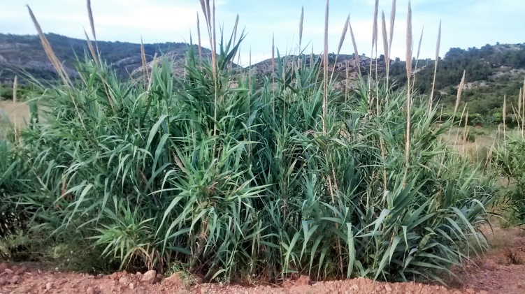

Las cañas brotan en primavera, su color verde y largos tallos cimbreantes, se rematan con elegantes plumeros que comienzan a amarillear en otoño época en que los tallos se endurecen. Se recolectan durante la luna vieja de febrero, se cortan por el pie a golpe de *falço,* y se dejan orear unas dos semanas, se clasifican por grosor y se hacen fajos de 25 unidades las más gruesas o de primera, 50 unidades las de segunda y un número indeterminado las de tercera o más finas.

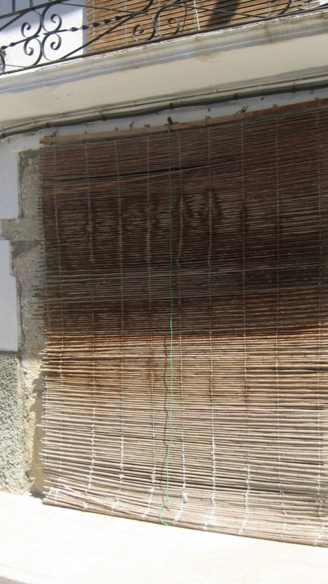

Después de limpias o peladas tienen múltiples usos, las más gruesas entre otras cosas se construían cañas de pescar y mediante su transformación en prácticos *salabre*, se hacían *fitores* para pescar anguilas en las acequias, los populares *papafigos* con los que el fruto de la higuera estaba al alcance de quien lo supiera utilizar. Dejando un trozo de raíz cuando se cortaban, al secarse servían para varear las algarrobas, almendras y aceitunas maduras, así al tirarlas al suelo se recogían con más facilidad.

Empleando cañas de segunda, atadas a otras más gordas o de primera, espaciadas para que fuera más fuertes y flexibles se fabricaban ligeros *cañizos* que en tierra de secano lo mismo sirven para secar los higos, pasas, tiras de melocotones o albericoques, pimientos, tomates etc. y colgador del techo horizontalmente servían como soporte donde guardar los quesos, y dulces de miel en las masías. También los cañizos se utilizaron durante un tiempo para practicar sobre ellos la cría de los gusanos de seda.

Su utilidad era muy variada, se construían cortinas tipo persiana para las puertas, en los techos llamados cielo raso tras enlucirlos, igual se hacían los tabiques o *barandats,* para construi*r cachirulos* y correr por la playa

Con un trozo de caña se construye el mango de una zambomba. También perforando 6 agujeros además de formar la lengüeta tenemos una flauta de pastor o Flabiol. De un trozo de caña partida por la mitad dejando un trozo entera, se construye la caña o instrumento de percusión. Con una mano se sujeta y se dan rítmicos golpes en la palma de la otra. Es un sonido parecido a las castañuelas. Se utiliza en la música popular de La Plana y un sinfín de cosas más,

Actualmente lo más importante es el simbolismo que representa nuestro popular *rollo i canya* conocido por músicos y cantado por todos en nuestras fiestas. La caña es uno de nuestros símbolo, que repetimos una y otra vez en la Romeria apoyándonos en ella y en la processó de les canyes. Su nombre científico es *Arundo Donax*.

## 11. Los herberos

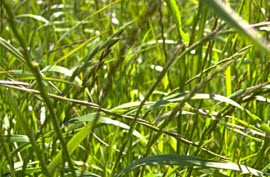

El cultivo que se practicó en Castellón, para después su venta en el mercado local fue la alfalfa, que se vendía mayoritariamente en verde para alimentar los animales de labor, casi siempre eran los labradores los que lo colectan y almacenan. Los *herberos* muy de mañana segaban la alfalfa con una hoz o *corbella,* hacían manojos o garbas, y con sus propios carros lo repartían a domicilio. La que sobraba lo apilaban en la plaza conocida como de la Herba junto al mercado Central y se vendía a su clientela habitual. A partir de principios de 1930 se trasladó su venta a la Plaza de Clavé, o Descarregador.

## 12. La seda

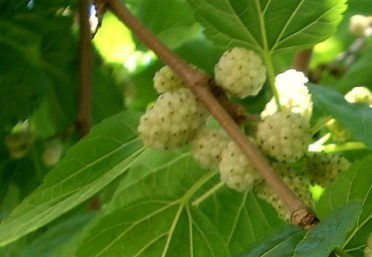

También se intentó durante un tiempo el cultivo de moreras, pues con sus hojas alimentaban a los gusanos de seda, lo que dio lugar a una industria de hilaturas de seda, toda aquella producción se vendía a los tejedores valencianos. La época de mayor auge fue entre los siglos XVII Y XVIII.

## 13. Caña de azúcar

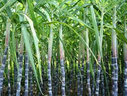

Más tarde se introdujo el cultivo de la caña de azúcar o ”*canyamel*” como producto industrializable para obtener azúcar, pero por cuestiones climáticas y a pesar de tener un Ingenio al estilo americano, junto donde está ubicada la estación transformadora de electricidad de Hidrola en la carretera del Grao, la empresa fracasó y se cerró la industria.

## 14. El algodón

En la partida de Entrilles en la parte alta junto a Taxida, Manuel Peris Escolar en los años 194… hasta principios de 1960 tenía cultivadas tres hanegadas de algodón (*Gossypium herbaceum*).

El clima era el adecuado, una temperatura no inferior a 14 ºC -20ºC para madurar y para abrir la cápsula con la flor de 27ºC a 30ºC. Era un cultivo que necesitaba mucho cuidado, la tierra tiene que estar bien abonada y sin ninguna mala hierba, necesita suelos profundos y bien aireados y mucha agua, si la tierra es arcillosa mejor así retiene la humedad. Se siembra en abril, y la recolección es en octubre. La planta es como un arbusto pequeño y las flores de color amarillo. Cuando las flores están maduras se abre la cápsula, que está dividida entre tres o cinco valvas que sostiene la semilla y la fibra sale al exterior, se recolecta arrancando una a una cada flor que es grande y solitaria. Las mujeres mayoritariamente hacían este trabajo, llevaban delantales con grandes bolsillos que una vez llenos depositaban en sacos. Este cultivo siempre fue minoritario, se veían fincas sueltas con algodón plantado por diversas partidas.

También tengo noticias que entre el camino la Molinera y camino Donación la familia Arrufat tenían 5 hanegadas de algodón, en el mismo lugar que anteriormente había naranjos que arrancaron probablemente debido a las heladas de 1946 cuyas temperatura bajo hasta los seis y siete grados bajo cero helando cosechas y los naranjos. Una de sus hijas me ha comentada que ella y sus hermanos en el año 1951 también ayudabas a ratos cogiendo las flores de algodón que ponían en sacos. Poco a poco dejo de cultivarse por su poca rentabilidad.

## 15. El herrero

Un Herrero o Manya necesita sus manos, su fuerza y su habilidad para solucionar problemas relacionados con el hierro, y sus utensilios son; la Fragua, con el fuelle, el yunque, el martillo, las tenazas y alguna herramienta más. A fuerza de golpear en el yunque con el típico martillo en forma de bola o de cuña a un trozo de hierro que sujeta con unas tenazas, lo moldeaba a su antojo, pero para eso debe estar al rojo vivo por los brasas, que con el fuelle aviva en la fragua quemando carbón. Lo mismo arreglaba una herramienta agrícola rota, que hacia una reja u otros utensilios

Era como ahora nuestros talleres mecánicos, pues la fuerza de tracción para las faenas agrícolas eran los animales de tiro.

Siempre con un delantal de cuero y tiznado como de carbón, su trabajo también consiste en ajustar las herraduras a las característica de cada animal mulo, asno, caballo o haca, todos reciben la misma atención. Con esta operación se puede corregir ciertos defectos de los animales. De unos ganchos de la pared había colgadas herraduras de distinto tamaño, normalmente son planas, pero si el animal tiene que trabajar dentro del agua o con fango deben tener unas pestañas traseras con el motivo de que así están más sujetas.

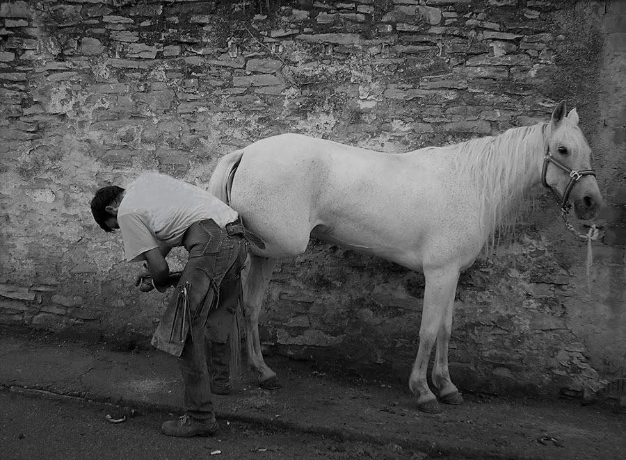

La forma de las herraduras depende del casco del animal que se tiene que herrar, las utilizadas para los mulos y asnos estas son mas ovaladas por tener las partas más estrechas. Los caballos o haca tienen los cascos más hachos y por lo tanto necesitan las herraduras más redondas. Las patas traseras necesitan una herradura distinta a las delanteras. De espaldas al animal y entre sus rodillas sujeta una pata, después de quitarle las herraduras gastadas o rotas con unas tenazas, una especia de cuchillo le corta y quita las partes duras de la pezuña y limpia el hueco que queda, la herradura tiene que calzar bien ajustada y los clavos con la cabeza triangular y de punta tienen que clavarse hacia afuera, después se liman si sobresalen. Así las cuatro patas.

De vez en cuando le daba pequeñas palmadas, como caricias al animal para tranquilizarlo. En la fachada de la herrería las argollas sirven para atarlos de la brida así si se asusta no se escapa.

Castellón como ciudad agrícola tenía en todos los barrios y lugares estratégicos herreros que se dedicaban a herrar los animales de carga o haca. También els carreters eran numerosos. Los carros con los que se transportaban la cosecha y aparejos también necesitaban un lugar donde se fabricaban y se reparaba, lo mismo recomponían una rueda del carro que las piezas que lo componen. Y els correjers, artesanos del cuero con lo que hacían las bridas y las diferentes piezas de los aparejos como albardas, cabezón, pital, tafarra, todo hecho con cuero casi siempre negro.

### Herrerías carreters y correjers

Los maestros herreros más conocidos en 192…:

Agustín Pardo San Felix,2

Isidro Vilar Pestagua, 43

Manuel Guia Plaza Clave.

Constructores de carros y carruajes de la misma época:

Manuel Traver Cazador Plaza Clave.

Isidro Gimeno Ramos Ronda del Mijares

Félix Sorribas Fortanet San Felix

Tomas Igual Ronda de la Magdalena

José Selma Cami Lledo

Pedro Ubeda Carretera Valencia

Emilio Prades Carrer Alcora de baix

Francisco Trave Plaza Tetuan

Correjers

Pere Casañ San Vicente. 74

Crescencio Milagro Salmeron.58

Antonio Blanchadell Plaza del Rey. 38

Teodoro Forcada San Felix. 9

Colau Pascual San Roque. 21

Herreros de los años 194…

Herrería Safont. Calle Méndez Núñez. Nº17-19

Herrería Ramón ayudante Arcadio. Calle plaza Maestrat enfrente del actual mercat de Sant Antoni, al lado del almacén del “garrofero”.

Herrería Emilio. Calle Papa Luna.

Herrería Salvado.r Ronda Vinatea nº 9

Herrero Angel, calle Historiador Escolano nº20. Herraba a los animales a domicilio…

Herrería en la Plaza Escuelas Pías. Con la esquina calle del Canónigo Segarra.

Herrería en la Farola, más o menos por donde está la casa modernista de las Cigüeñas.

Herrería, en la Plaza Clave o descarregador en el actual nº 20-21

Empresarios de carros y útiles de labranza

Germán Rives. Plaza Clave nº 15

En la Ronda Madalena nº25-27 también se fabricaban carros y aparejos a principios años 193… José Colom ”el Borriolero “después se trasformo en Carrocerías Colom

Rafael Luis. Calle Santo Tomas nº 11

Manolo” El Cullero” Ronda magdalena enfrente del antiguo Molino del arroz.

Traver. Plaza del Rey, al lado norte del Cine Goya

Hernández. Calle Barrachina. Después Carrocería Hernández.

Guía general de Castellón 1947

José Almela Arrufat Alonso, 38

Manuel Estrada República Argentina, 11

Pascual Gil Pelayo, 35

J. Porcar Orf. Santalínea, 11

Pascual Sales Gobernador 104

Alquiler de carros de mano

Maria Garcia Zaragoza 9

Vicente Martí Esc. Viciano 6

Manuela Rosell " " 22

Hoy, para ver trabajar un herrero tiene que ser en los lugares donde hay equinos o bien en las ferias artesanales como algo extraordinario, cuando en nuestra niñez era de lo más corriente, pues en los años 194… en casi todos los barrios de Castellón habitaban labradores con su correspondiente haca y carro, con el que los días de fiesta para ir al Pinar o alquerías se llenaban de niños y mayores de manera que ahora sería inimaginable. Y no pasaba nada.

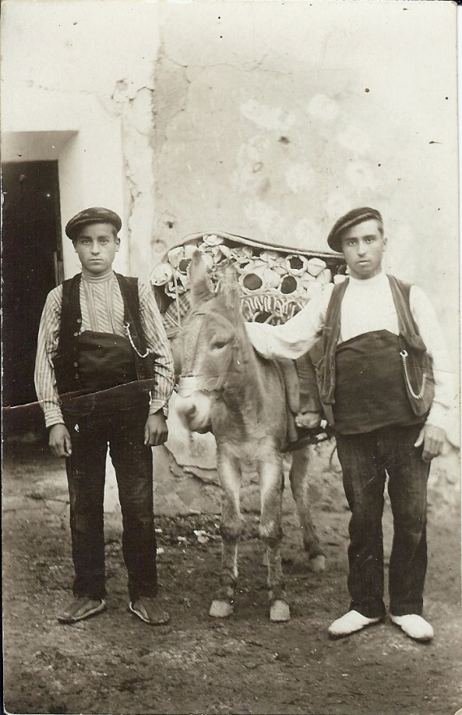

## 16. El faixero

La comarca dels Ports es una tierra abrupta, con clima frio. En documentos fechados en 1817 ya se citan varias familias de tejedores. Desde principio del s.XX se incorporan las fabricas textiles de fajas y alforjas, que exportan por toda España sus productos, y una manera de hacerlo era por medio de hombres llamados” *Faixeros*“. Estos hombres recorrían toda España, cada uno tenía su itinerario que los demás respetaban, salían del pueblo primero con mulos andando, después en bicicleta, el género lo mandaban por ferrocarril a diferentes lugares de su recorrido, y cuando les hacia falta genero repostaban Su época de trabajo era desde finales de Agosto cuando los cereales ya se han recolectado hasta Navidad, en que todos regresaban a su casa para empezar otra vez el trabajo agrícola, esta era una manera de compaginar las tareas del campo. Las mujeres más jóvenes iban a trabajar a las fábricas y en casi todas las casas del pueblo había un obrador donde se tejía de forma manual todo el proceso.

Hasta los años setenta aun se podían ver por los pueblos de toda España “*Faixeros”* pues la faja era una necesidad para los hombres que realizaban esfuerzos y, además también servía de abrigo.

Actualmente en el uniforme de los Regulares del Ejército Español se siguen llevando la faja: los de Ceuta color azul y los de Melilla color rojo.

Aun quedan algunas fábricas muy mecanizadas y las fajas son una prenda ornamental en ciertas fiestas populares.

### Las fajas de hombre en la historia de Castellón

También entre los trabajadores del campo de Castellón la faja de hombre era una prenda habitual en su vestimenta. En los siglos XVI y XVII el 80% de sus habitantes eran labradores vestían los celebres zaragüells blancos o negros de origen árabe que sujetaban en la cintura con una amplia faja para ir a trabajar al campo, necesaria para sujetar la zona lumbar, medias hasta la rodilla y calzados con alpargatas de cáñamo o esparto. La cabeza la cubrían con pañuelos atados de diversas maneras y también sombreros de paja para protegerse del sol. En invierno las prendas eran más gruesas y de abrigo. En los días de fiesta las prendas eran de color negro o de color de mayor calidad.

Las mujeres vestían de diario toscas camisolas de hilo y varias faldas, largas hasta los pies, y en el cuerpo justillos y tocas. Los días de fiesta su vestimenta era más vistosa y mejor luciendo manteletas de diversas maneras, en invierno se cubrían con chales gruesos de lana.

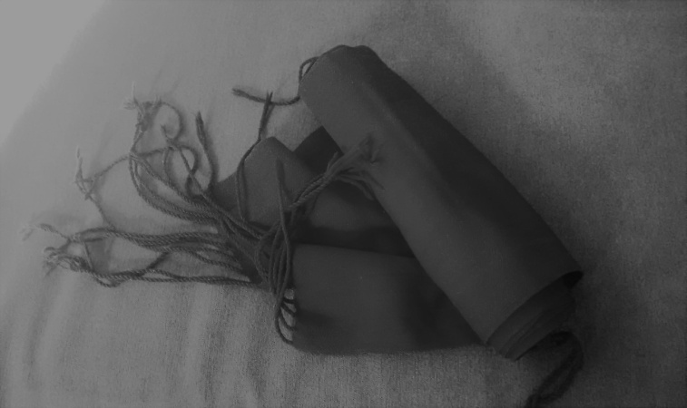

Más tarde en el ya en el siglo XIX –XX se adoptaron cambios, pantalón hasta los tobillos de lana o de pana en invierno y la camisa sujeta a la cintura con una faja generalmente negra que servía para todo. Entre sus pliegues se guardan las bolsas con el dinero y papeles, la petaca de cuero con la picadura de tabaco y el papel de fumar, el xisclero o encendedor de mecha amarilla o la navaja que servía de tenedor en las comidas. En invierno el chaleco para abrigarse más, y encima la célebre blusa negra de labrador anudada, o suelta que muchos de nosotros aun hemos visto llevar a hombres mayores.

De alguna forma las fajas han sido una prenda necesaria y su comercio también.

En la calle Pintor Castell nº 1 el comercio con nombre El Faixero era conocida por todo el vecindario de la Placeta dels Dolors y alrededores Su dueño Joaquín Tena Tena, oriundo de Villafranca fundo su comercio a principios de los años 1940, tenía a la venta todos los productos que se fabricaban en la comarca dels Ports, como medias, mantones, calcetines, refajos, tocas de lana, ropa interior de franela y fajas de hombre de estambre o lana merina. Este establecimiento ha estada abierto durante tres generaciones hasta pasado el año 2000.

También en la Plaza de la Pescadería nº 7 había hasta hace poco un establecimiento de nombre confecciones Pitarch, sus dueños vinieron de Morella, abrieron el establecimiento en 1958 con tejidos, vestimenta y accesorios de la comarca para el folclore local y de la provincia, Ahora sus descendientes tienes dos comercios en distintos lugares de la ciudad.

El último Faixero ambulante que he conocido, era de Cinctorres, vivía en Castellón a partir de 1952, vendía su mercancía en todos los mercados semanales de los pueblos de alrededor, y también en el mercado del lunes hasta su jubilación, se llamaba Agustín Martí Troncho.

## 17. Alimentación

Una de los trabajos más elementales para la subsistencia es la alimentación que se obtiene mezclando lo que nos da la tierra y el mar.

Como todo, la forma de alimentarnos ha tenido su evolución. Nuestros antepasados comían los alimentos que producía su entorno, adaptándose a diferentes épocas del año, como la caza y animales de corral. Se comía fruta y verduras de temporada. Por eso, las conservas y salazones eran importantes, el mejor conservante siempre ha sido la sal.

De los membrillos se hacía el *codonyat.* Los higos se secaban extendidos sobre un cañizo, y si había almendras junto con la miel que se recolectaba en muchas fincas no hay postre mejor, *panfigo*. En tiempo no muy lejano, yo recuerdo que se utilizaba el trueque en los pueblos y masías del interior, a cambio de huevos, cereales incluso algún animal de corral se recibían, aceite, arroz, cítricos, y frutas variadas.

La base de la alimentación en clima cálido eras las verduras frutas y arroces. No era lo mismo la paella que se hacía en los marjales el domingo con la familia, que la comida que llevaba el labrador hecha de casa para todo el día, en la fiambrera de aluminio; la comida de caliente se hacía en casa por la noche.

En las acequias había ranas, anguilas y a veces algún pequeño pez. La paella con ancas de rana y verdura y las anguilas picantes y caracoles eran, como ahora, un manjar y más si se reunían familia y amigos.

En el secano ocurría lo mismo pero todo era a base de pan con tocino, embutido, queso y sardinas de bota, alimento consistente debido al clima más riguroso. También la comida de caliente era por la noche.

Las recetas de cocina más elaboradas solo se consumían en días señalados Fiestas Mayores o acontecimientos familiares, en todos los lugares ocurría lo mismo.

El turrón de *guirlatxe* y *Pilotes de Nadal* para estas fechas, en cuaresma el bacalao era el rey, la tortilla con habas para almorzar en la Magdalena, cacahuetes, altramuces, la longaniza de Pascua etc… En las Fiestas de Agosto no podía faltar la paella con pato, y sin olvidar la *rua o bocadillo* con la que crecimos muchos de nosotros, que se comía en casa y en la calle con los amigos mientras se descansaba del juego.

## 18. Bibliografia

Francés Camus, Josep Miquel. Les ermites del Caminàs. Ayuntamiento de Castellón. Castellón 1989.

Juan Tous Martí. Cultivo del algarrobo. Hojas divulgadoras del Ministerio de Agricultura, pesca y Alimentación.

Literatura oral - José Vidal y José Almela. Labradores de “soca”.

Llistar Escrig, Arcadi - Historia de Castellón.

Nebot Sos, Juán – Las partidas del Término de Castellón – Trabajo de investigación, UJI. - (Mayo 2010).

Ribes Pla R. -L’arros a Castelló. Publicacions l’Excellentísim Ajuntament de Castello de la Plana. -1993.

Ribes Pla R. la garrofa a Castelló. Publicacions l’Excelentísim Ajuntament de Castelló de la Plana 1998.

Agradecimiento especial a mis compañeros Cornelia y Tomas por su aportación de El cáñamo y El naranjo.
