# La trufa negra

## 1. SITUACIÓN GEOGRAFICA

Comarca dels Ports -Maestrat

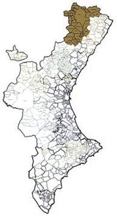

## 2. INTRODUCCIÓN

En la provincia de Castellón, las comarcas dels Ports y Maestrat son una de las principales productoras de España de trufa negra, (Tuber melanosporum)

Las condiciones medioambientales del interior de esta provincia son las ideales para la producción del apreciado hongo que se utiliza de forma preeminente en la cocina de los municipios del interior castellonense, y se exporta principalmente a Francia.

Hasta la década de los años 60 no se conocía la trufa en esta comarca. La atención la despertaron varios cazadores catalanes que todos los años venia por la comarca dels Ports principalmente en Morella con sus perros, estaban todo el día en el monte (nunca traían caza) y sí un fuerte olor que se notaba incluso fuera de las habitaciones de la fonda, actuaban con mucho secretismo, por lo que encendió la luz de alarma. Un vecino les siguió cuando se fueron hasta una conservera del norte de Cataluña y así fue como se dieron cuenta de la existencia de la trufa, de su valor económico y lo mismo que los franceses fueron a Cataluña a llevarse los preciados hongos subterráneos, ellos hicieron lo mismo bajando por el norte e interior de la provincia de Castellón.

## 3. HISTORIA

El origen de la palabra trufa deriva del latín tuber y pasa su raíz a las lenguas modernas europeas, trufa en España, trufe en Francia, tartufo en Italia, tüffel en Alemania, púbera en portugués y tófona en valenciano.

Desde las épocas más remotas las trufas han estado asociadas a todo tipo de creencias misteriosas como alimentos y también como afrodisiaco según cada época.

Los primeros en hablar de las trufas fueron los sumerios cuando enumeran en sus tablillas de barro las costumbres alimenticias de sus enemigos, los amonitas, en tiempo de la tercera dinastía de Ur más de dos mil años de nuestra era.

Los babilonios las buscaban y comían de los arenales del desierto

El faraón Keops que mando construir la pirámide de Guiza S. 2580 a C. ofrecía a los embajadores de otros reinos comidas trufadas y l mismo era un gran consumidor.

Sus beneficios los cita Pitágoras de Samos en el S. VI a C.

Teofrasto S.III a C. discípulo y sucesor de Aristóteles, consideraba que las trufas se desarrollan en áreas donde se producen tormentas abundantes, que suelen ir de la mano de los truenos y relámpagos.

Plutarco la creía generada por los rayos en la acción combinada del agua y la tierra o sea que son el resultado de la fusión de los tres elementos.

Plinio el Viejo S.I a C. escritor y naturalista vi que crecía sin raíces, decía: es una callosidad de la tierra, surgida espontáneamente y no se siembra, como un milagro de la Naturaleza.

Griegos y romanos le atribuyen propiedades divinas

Los romanos sólo las cortaban con cuchillos de plata. Las primeras recetas con trufa se encuentran en “De coquinaria” de Apicius, el cocinero de Trajano, que en sus escritos dijo que Nerón decidió nombrarla “alimento de los dioses”.

En el talmud judío se menciona el consumo de trufas del desierto.

3.1 Afrodisiacas

Galeno de Pérgamo (S. II a.C) fue el precursor de esta teoría que todavía sigue teniendo su mitad de leyenda y su mitad de realidad, y que recomendaba su consumo para “producir excitación y voluptuosidad”.

Aristóteles se refería a la trufa como “un fruto consagrado a Afrodita” Se dice que Napoleón y el Marqués de Sade las usaban como estimulante sexual.

El Tratado de Ibn Abdun S. XIII sobre la vida material de la ciudad de Sevilla prevenía contra ellas diciendo “que no se vendan trufas en torno a la mezquita mayor, por ser un fruto buscado por los libertinos”

En la Edad media el consumo de trufas era considerado como diabólico, entre otras cosa se creía que contenía venenos mortales y era comida de brujas, debido a su color casi negro, estar enteradas en la tierra y su olor a veces picante, intenso y cabruno.

Los Antonianos, “Los guerreros del fuego” es una orden que nació en Etiopia en el año 370 militar, religiosa y hospitalaria para proteger a los cristianos de esta zona de África, es una de las órdenes religiosas mas enigmáticas y desconocidas de la cristiandad, esta misteriosa congregación debe su nombre a san Antonio Abad, famoso por sus visiones y tentaciones diabólicas. Empezaron a utilizar la trufa como remedio para enfermedades venéreas, lepra, sarna… pero sobre todo la utilizaron contra el ergotismo o fuego de San Antonio una extraña epidemia que asolaba la Europa Medieval provocada por la toma de micotoxinas muy frecuentemente asociadas al centeno.

Como remedio a esta enfermedad, daban una mejor alimentación a los enfermos del cornezuelo, (enfermedad que venía de la mano del consumo del centeno), aportando a su dieta la ingesta de carne de cerdo, cerdos que criaban ellos mismos en el monte. El uso de cerdos en el monte trajo consigo el descubrimiento de trufa, y su posterior aplicación a muchos ámbitos de su día a día; no hay que olvidar que el cerdo es un animal con un instinto muy desarrollado para encontrar nuestro preciado hongo, la trufa.

La trufa cayó en el olvido y no apareció en los libros de cocina de la época como ingrediente de ninguna receta.

El misterio de su naturaleza ha sido durante siglos objeto de disputas e hipótesis, también el austero pensador Savonarola nacido en 1452 alertó a los consumidores de trufas que fueran temerosos de Dios. Entre los que se encontraba uno de sus principales enemigo el Papa de origen español Alejandro VI nacido en Játiva 1431.

Alfonso Ciccarelli médico nacido en Bevagna (Perugia) 21 de febrero 1532, escribió una monografía sobre las trufas de Umbria: *"Opusculum de Tuberibus* En el trabajo se ocupó de la etimología, la nomenclatura y los usos populares y le indicó a una división en clases.

En el Renacimiento volvió a resurgir y a principios del S.XIII empezaron a ser valoradas y buscadas con la ayuda de cerdos y perros. Las trufas pasaron a ser un producto selecto y elegido por los grandes cocineros de la época. Hasta esta época no se acepto totalmente la idea de que las trufas eran organismos autónomos, o sea hongos.

Ravel un experto francés afirmo en 1857 que las trufas eran producidas por la picadura de una determinada mosca en las raíces de la encina. La relación de la trufa y la encina ya quedaba establecida.

Brillat-Savarin jurista francés, autor del primer tratado de gastronomía (*Fisiología del Gusto*, 1825). se refería a la trufa como un diamante de la cocina y que en ocasiones determinadas “hace a las mujeres más tiernas y a los hombres más amables.”

Entre las propiedades de la trufa está la abundancia de vitaminas y minerales. Es un alimento muy ligero, su contenido de hidratos de carbono y grasas es moderado, y generosa en agua como todos los hongos.

Tiene minerales como fosforo, selenio y potasio, también posee azufre, calcio, magnesio, hierro y manganeso en menor proporción.

## 4. ORGANISMOS VEGETALES INFERIORES

Las plantas carentes de flores o cuyos órganos sexuales no se descubren a simple vista, eran llamadas tradicionalmente criptógamas y en tiempo del naturalista Corolus Linneus S. XVIII ese término incluía a las algas, los hongos, los musgos y los helechos.

Los botánicos sistemáticos posteriores han ido ampliando y diferenciando grupos y estableciendo sistemas mejor cohesionados.

Entre los hongos está la división MICÓFITOS con unas 60.000 especies y cuya cifra va en aumento.

Dentro de los MICÓFITOS está la clase ASCOMICITES. Esta clase comprende unas 200.000 especies de hongos, en su mayoría de vida terrestre. Poseen células reproductivas sin flagelos; en la reproducción sexual se forman generalmente ocho esporas, dentro de ascos.

Uno de los muchos órdenes de la clase ASCOMICETES es el orden TUBERALES que está constituido, en general, por hongos fructíferos, que proliferan de manera subterránea como tubérculos, presentan galerías con las paredes recubiertas por el himenio y aberturas al exterior.

Dos trufas se disputan la supremacía: la trufa blanca de Alba (Tuber magnatum) y la trufa negra de invierno (Tuber melanosporum). Las demás trufas tienen menos aroma, como: Tuber bruumale, Tuber aestivum, tuber uncinatum, Tuber mesentericum, Tuber macroporum, Tuber borchii, y Tuber indicum.

## 5. BIOLOGIA DE LA TRUFA NEGRA

(Tuber melanosporum)

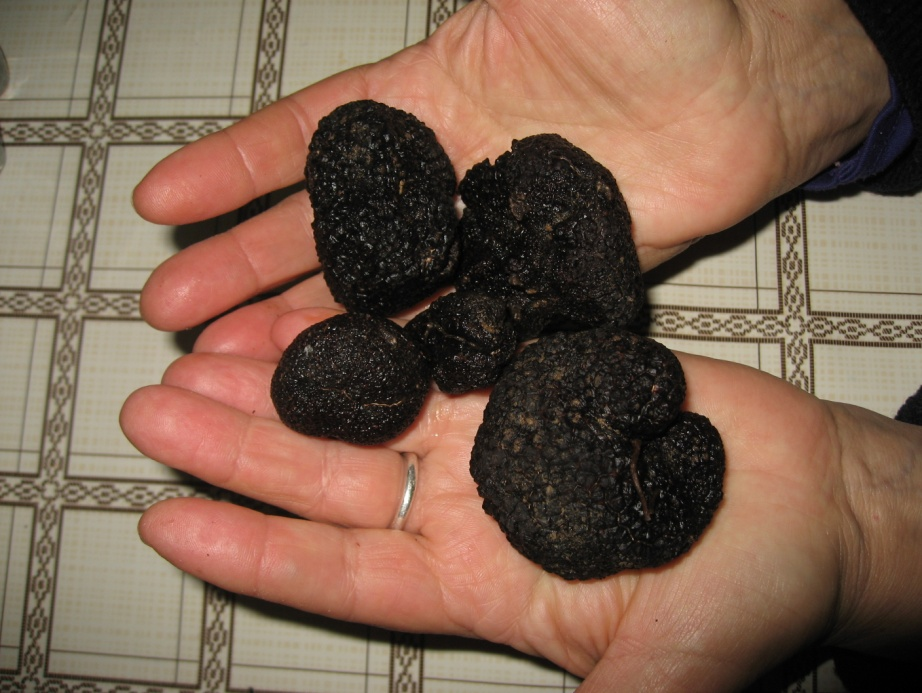

**Reino**: Fungi.

**Tipo**: Ascomicota.

**Clase**: Ascomycetes.

**Orden**: Pezizales.

**Familia**: Tuberaceae.

**Género**: Tuber

**Especie**: Tuber melanosporum).

Las trufas son hongos que se desarrollan enteramente bajo tierra. Viven asociadas a raíces o dependientes de ellas; su micelio está formado por filamentos tabicados y ramificados, y los aparatos esporíferos tienen aspecto de tentáculo redondeado, sin rizoide ni micelio aparente. Consta de dos partes la cortical o peridio que es carnosa o coriácea, verrugosa o más raramente lisa, y la interna o gleba, en las que están las ascas, y que constituyen propiamente la trufa, que vive en simbiosis con algunos tipos de árboles. Tal relación de conveniencia, beneficia a ambas plantas, ya que el micelio, como todas las setas está privado de clorofila que obtiene de la planta superior y ésta recibe un aporte extra de nutrientes a través del aparato radical conectado a su raíz.

Aunque todas las especies son más o menos comestibles no son igualmente apreciadas-

La superficie de la trufera suele estar desprovista de vegetación.

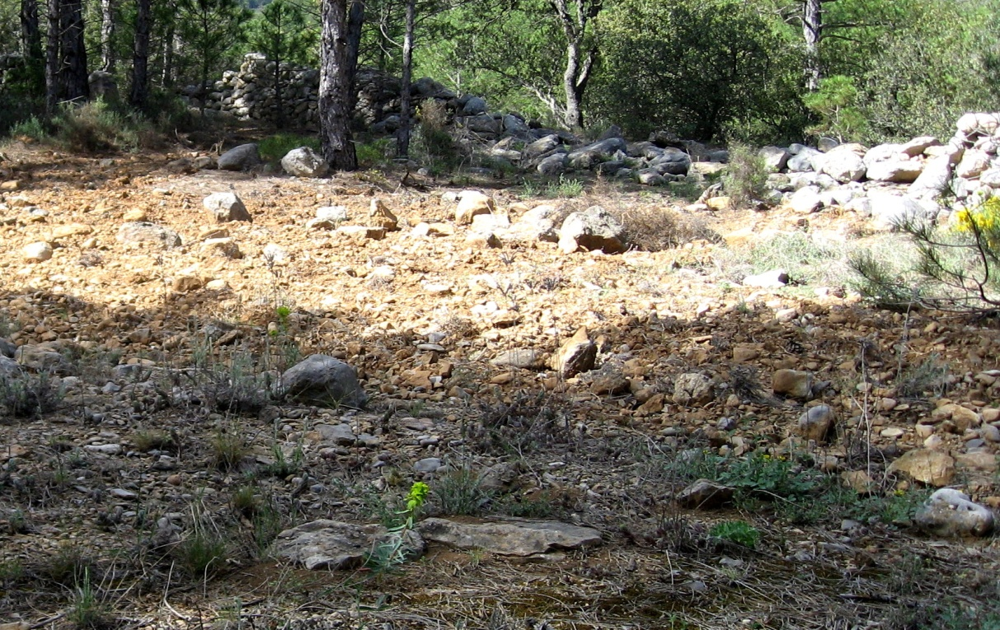

En el entorno inmediato del árbol productor de trufas, la mayoría de las veces observamos quemados o calveros no muy extensos.

### Quemados

Los quemados se producen por un fenómeno antibiótico de la trufa. Este efecto lo produce la constante absorción de la humedad del terreno por el micelio de la trufa, que lo convierte en inhabitable para la mayoría de los vegetales.

Los cuerpos fructíferos de la trufa negra se forman en verano, a una profundidad variable desde el nivel del suelo a unos 50 cm, de profundidad. Cuando una trufa no es recogida y permanece bajo tierra hasta que se marchita, se deshace liberando gran cantidad de esporas. Estas esporas ya en el terreno están listas para viajar por el subsuelo y para germinar formando un nuevo micelio. Para su recolección utilizan perros amaestrados.

También se conoce otro método llamado (método de la mosca).

Hay una mosca de la especie Helomyza tuberivora llamada mosca de la trufa que pone los huevos en estos hongos para que las larvas al salir de estos se alimenten de ellas. No es un método aconsejable pues no siempre donde hoy moscas hay trufas y al cavar muchos hoyos resultar agresivo para la trufera.

Durante el otoño, mientras la trufa negra madura lentamente, su micorriza muere o se aletarga. Algunas micorrizas se secan y separan, otras permanecen como órganos en reposo que renovaran la difusión del hongo en primavera.

Su recolección está regulada por normativas estatales y autonómicas. Su calendario de recolección, según la normativa estatal, es del 1 de diciembre al 15 de marzo.

## 6. SELVICULTURA TRUFERA

El cultivo de la trufa se denomina Selvicultura trufera, cada vez hay más campos con truferas de cultivo.

El futuro del comercio de la trufa está en las explotaciones con plantas truferas micorrizadas. En Castellón hay un vivero en Viver (Alto Palancia) y Zucaina aunque la mayoría se compran en la zona de Teruel, Sarrión, Barracas y El Toro, por ser los más antiguos y conocidos. Allí la DGA concede subvenciones para los viveros e incluso para el vallado de las fincas. Es un comercio en plena expansión.

La trufa es capaz de formar micorrizas, de forma natural o con la ayuda del hombre, con numerosas plantas.

La trufa negra crecerá mejor en terrenos calcáreos formados en la Era Secundaria, en particular del Periodo Jurasico y Cretácico, que tengan buena permeabilidad. De este modo el terreno ideal para plantación de trufa debe ser:

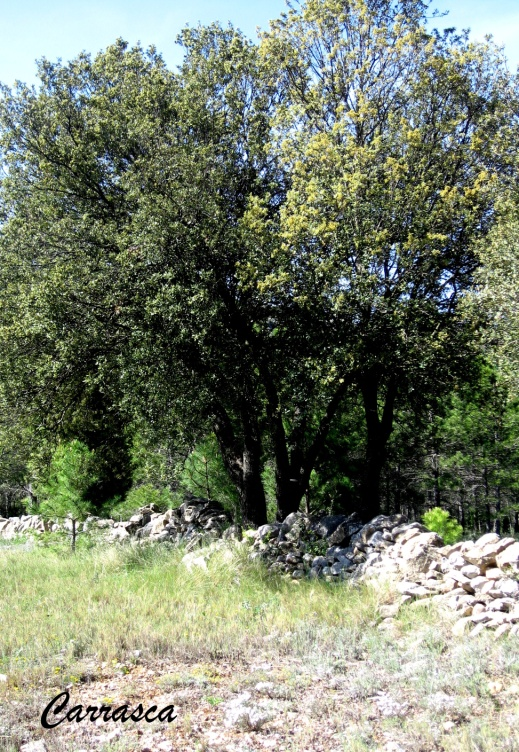

Terreno proveniente de rocas calcáreas, poroso, permeable, de alto contenido de arcilla pero con presencia de silíceo peróxido de hierro carbonatos y materia orgánica.

El terreno debe tener 50% de arcilla como máximo para el buen drenaje del agua. Soleado i aireado, pero no debe tener exceso de viento pues así retiene más la humedad necesaria para la trufa. Las especies micorrizadas más frecuentes para mantener una producción trufera en la zona de els Ports y alt Maestrat son: la encina (Quercus ilex), el quejigo (Quercus faginea), el roble pubescente (Quercus humilis), el roble cerrioide (Quercus cerrioides), la coscoja (Quercus coccifera) y el avellano (Corylus avellana)

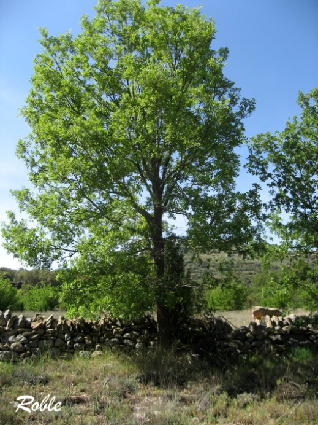

Las plantaciones se realizan en las zonas propicias para su desarrollo, en donde hay trufas silvestres en sus montes y donde se presentan condiciones de suelos y clima favorables.

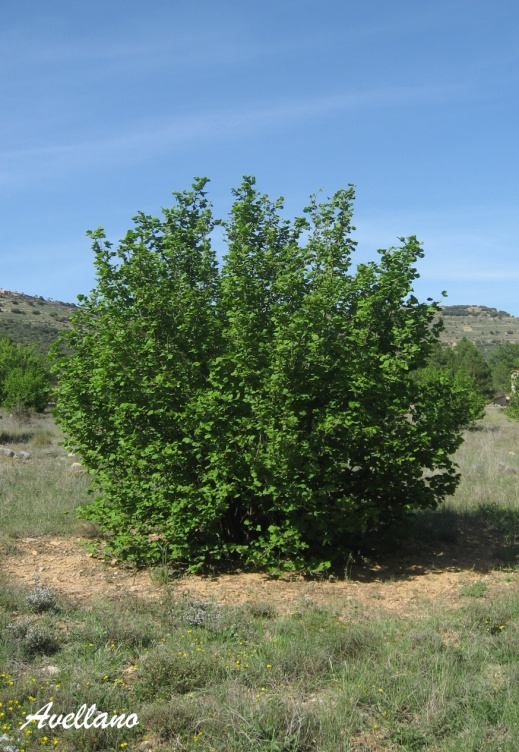

La trufa se adapta a cierta carencia de agua en verano, pero se aprecia que hay más truferas donde hay más abundancia de tormentas en verano, lo mismo ocurre con todos los hongos.

La altitud óptima de los cultivos es de 350m y 1.200m y prefieren las solanas.

El perfil del suelo adecuado es como ya hemos dicho, suelos calizos y mejor si son duros. La pedregosidad superficial que recubre el suelo en las truferas es apreciada, tiene un efecto de acolchado que retiene la humedad y reduce la erosión.

La truficultura necesita tres pilares:

1. Suelo y clima adecuado.

2. Planta adaptada al medio y que este bien micorrizada por la trufa.

3. Apoyos adecuados al cultivo.

Para poder realizar la plantación, lo primero es preparar el terreno como en todo tipo de cultivos, comprar la planta y también es importante la fecha adecuada, del mes de noviembre hasta finales de marzo o abril si hay peligro de heladas. Calcular la densidad de la plantación. Si la tierra escogida no va a regarse y la zona es seca, se necesita más espacio para cada planta y el marco tiene que ser mayor que si se trata de una zona húmeda.

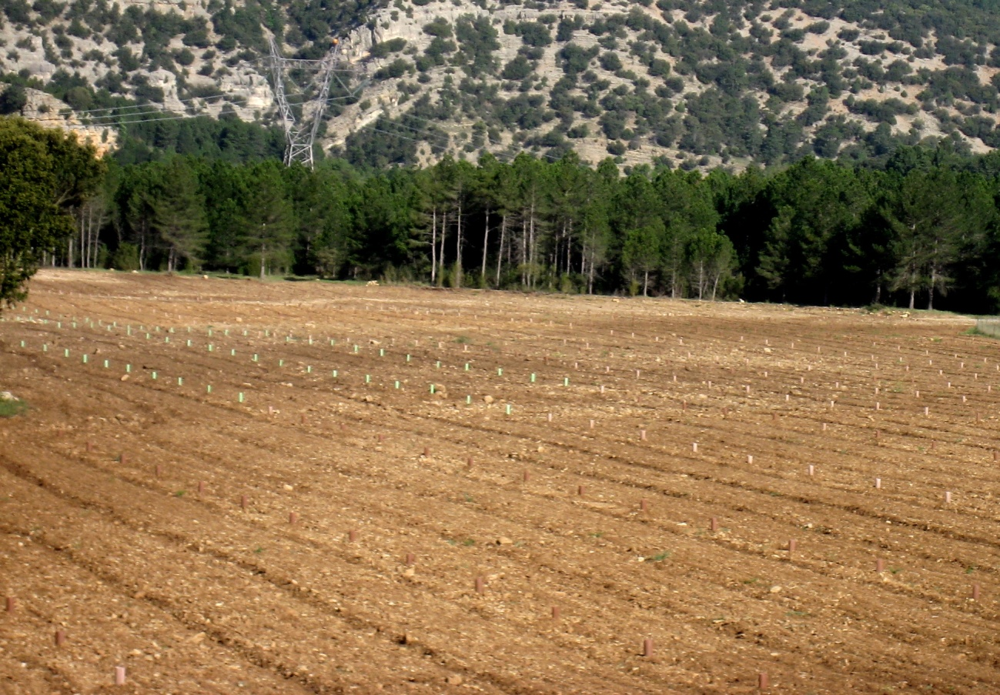

La truficultura tiene efectos beneficiosos ambientales. Con la reforestación de las especies autóctonas disminuye el peligro de incendios forestales. Por ser suelos pobres en otras micorrizas y

**Plantación trufera 1º fase** de buena calidad para la trufa. El clima, aunque algo seco, es bueno por su mediterraneidad. Las plantas producidas por los viveristas en general son de buena calidad y genera economía y trabajo.

Incrementan algunas especies cinegéticas como la perdiz, que construye sus nidos en el suelo.

Al no utilizar pesticidas es un fruto ecológico que no perjudica a los acuíferos cercanos.

La carrasca o encina es el árbol que mejor se adapta a las plantaciones truferas. Se asienta sobre suelos calizos, silíceos y yesosos, y nunca en los encharcados y arcillosos demasiado compactos. Es resistente al frio y no sufre daños hasta temperaturas medias en invierno entre -3 y 11ºC y temperaturas medias en agosto entre 14 y 28 ºC.

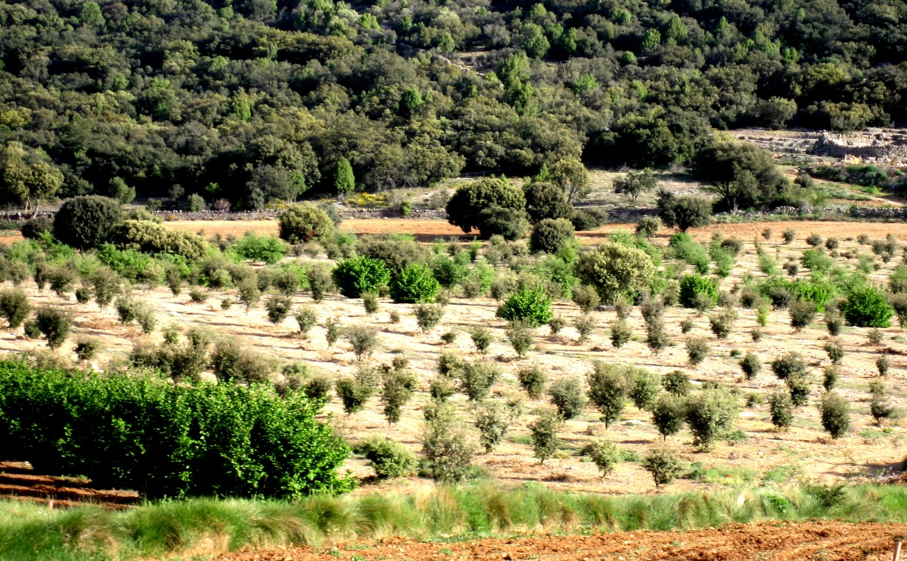

*Plantación trufera en fase de desarrollo*

En el año 1968 se hizo la primera plantación de España en la provincia de Castellón, hoy en plena producción. Se labra cada

2 ó 3 años y su riego es con una cuba acoplada al tractor. La actividad llega a tener un desarrollo rural sostenible.

Hay diversa opiniones sobre el aroma de las trufas cultivadas o silvestres. Las trufas silvestres crecen en condiciones adversas adaptándose a climas con escasa lluvia y se desarrollan a mas profundidad para protegerse de la sequia. Cuando más profundas se encuentran tiene que tener más aroma para ser detectadas. Las cultivadas tienen más cuidados, se labran y se riegan, crecen a menos profundidad y la tierra está más suelta perdiendo algo de su aroma. El resultado es una trufa redonda y bonita que se hace más atractiva para el comercio.

## 7. LEGISLACIÓN

De acuerdo con el Código Civil español, la trufa es propiedad del dueño del suelo. Así el Art. 350 del Código Civil dice: El propietario de un terreno es dueño de su superficie y de lo que está debajo de ella y puede hacer en las obras plantaciones y excavaciones.

Por lo tanto la trufa no es un bien público sino privado y su exportación y aprovechamiento corresponde al dueño del suelo donde se encuentra.

## 8. JORNADAS GASTRÓNOMICAS DE LA TRUFA

En la gastronomía dels Ports, un descubrimiento importante durante los últimos años ha sido la incorporación de la trufa negra o tófona como condimento. Es importante poner en valor este producto en las jornadas gastronómicas y mostrarlo.

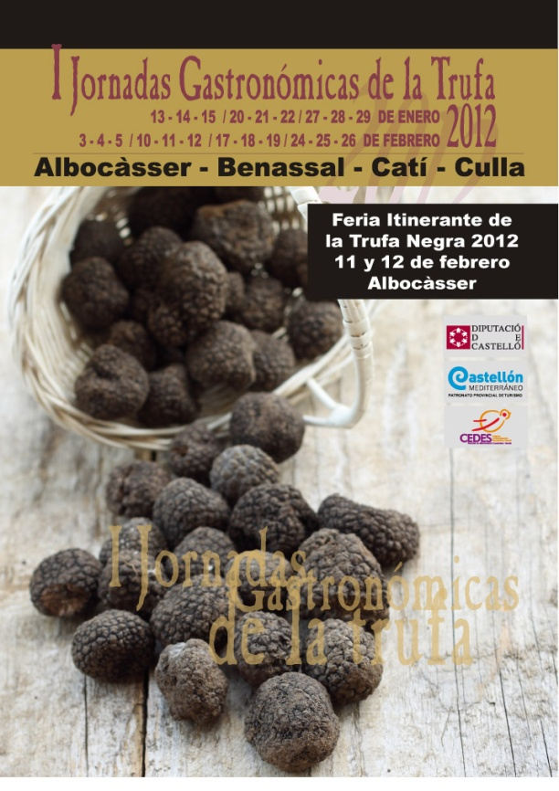

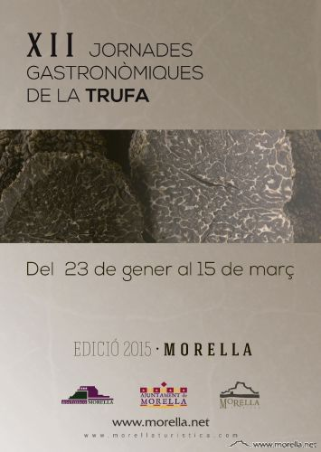

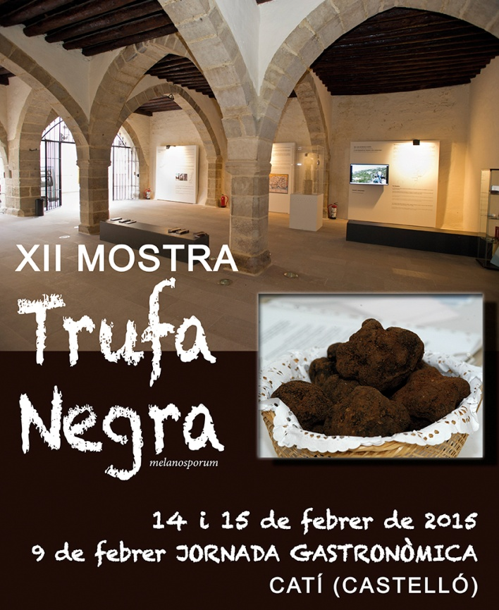

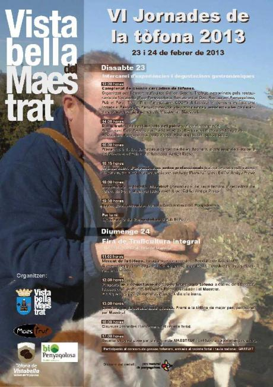

*Carteles anunciadores de las jornadas gastronómicas*

## 9. LA TRUFA NEGRA COMO CONDIMENTO

La trufa es tradición, modernidad y originalidad en la cocina. Poca cantidad de trufa es suficiente para dar sabor y no se deben mezclar (o con moderación) con otros productos que alteren su aroma o sabor natural, como sofritos de ajo, tomate frito o especias de aroma y sabor potentes que enmascaran sus propiedades y perfume, se utilizan tanto crudas como cocidas como aceite de trufa, brandi de trufa o bien virutas de trufa, en rodajas o dados, dependiendo si se prepara como rellenos, en salsa, condimento aditivo, o si se utiliza en repostería.

La incorporación de láminas y jugos sometidos a cocción debe hacerse durante los 3 últimos minutos y así no se pierde ni volatiza la mayor parte de su esencia y aroma.

### PATATAS RELLENAS CON JAMON Y TURFAS

4 patatas grandes, 4 huevos, 1 trufa negra, 250 gr. hongos, 250 gr. jamón aceite, sal, cebollino.

Cuando las patatas estén cocidas y tiernas, pelar con cuidado, quitar las puntas de forma que quede un círculo y vaciar el interior.

Picar muy pequeñitas las setas, doramos en una sartén con un poco de aceite y añadir el jamón en taquitos también muy pequeños. Poner cebollino picado y los restos de patata que hemos quitado de las puntas, previamente machacadas. Rallar la trufa.

Ahora rellenamos la patata con la mezcla.

Encima ponemos queso y metemos en el horno a unos 180ºC hasta que las patatas estén doradas.

### CREMA DE PATATAS CON HUEVO Y TRUFAS

4 patatas, 1 cebolla, 250 ml. leche, 2 huevos, 2 trufas, aceite, agua y sal.

Pelamos las patatas, las troceamos y las ponemos a hervir en abundante agua con sal hasta que estén tiernas.

Pochamos la cebolla picada con un poco de aceite. Añadimos las trufas picadas, las patatas y la leche. Mezclamos también los huevos batidos y removemos bien. Por último pasamos por la batidora para que quede una crema fina.

### CARRILLADAS CON TRUFAS

1 kg. de carrillada, 1 cebolla, vino blanco, trufas, 2 dientes de ajo, aceite de oliva, sal.

Pelamos y picamos la cebolla y la colocamos en una olla con un poco de aceite de oliva. Sofreímos. Cuando pochen bien, vertemos un buen chorreón de vino blanco y mantenemos a fuego lento para que se consuma el alcohol. Incorporamos entonces las carrilleras y las trufas muy picadas. Mantenemos a fuego lento hasta que estén blandas, se añade el ajo machacado a la olla con las carrilleras. Dejamos unos minutos y rectificamos de sal.

### TERNERA CON SALSA DE TRUFAS

½ kg. de filetes de ternera, 1 trufa negra, 2 cebollas, 1 zanahoria, ½ diente de ajo, tomillo, 200 ml. de vino blanco, aceite de oliva, sal y pimienta.

Preparamos las verduras lavando, pelando y cortando las zanahorias, la cebolla y el ajo.

Cortamos también la trufa en finas láminas. En otra olla aparte, sofreímos las cebollas y el ajo. Añadimos un poco de tomillo. Agregamos también la zanahoria. Cuando comiencen a pochar las verduras, el vino y salpimentamos al gusto. Dejamos que hierva y removemos unos minutos. Vertemos entonces la salsa sobre la carne. Cubrimos todo de agua y dejamos cocer a fuego lento un cuarto de hora o hasta que la carne esté hecha.

Retiramos la salsa y pasamos por la batidora. Sofreímos la trufa con un poco de aceite de oliva y las mezclamos con la salsa. Servimos la carne bañada con la salsa.

### QUIXA O ESPATLETA DE CORDER AMB TÓFONA

La tófona dels Ports o del Toro (Alt Palancia) dóna un aire luxós i, alhora, boscà a una clàsica cuina de corder o cabrit.

Ingredientes (per a quatre persones): quatre cuixe, vuit grans d’all, julivert, oli d’oliva, sal, una culleradeta de sagí, dues copes de brandi en el qual s’ameren les tófones i dues tófones negres.

Encenem el forn a alta temperatura. En una cassola, untada de sagí, disposem les cuixes, amb uns talls, i les reguem amb un bon raig d’oli. Estabilitzem la temperatura del forn a 180º. Introduïm la cassola i comença una cocció lenta. Girem la carn perquè es faça de l’altre costat i vigilem que no es quede seca, regant-la amb el seu suc, que arreplegarem amb una cullera, o abocant-li un poc d’aigua o vi. Mentrestant, haurem preparat una picada amb els alls, el julivert i la tófona. Remenarem bé i l’abocarem sobre les cuixes perquè es coga tot junt mitja hora més abans de traure la carn del forn.

GALLINA O POLLASTRE TRUFAT

Ingrediets (per a quatre persones) 1/2 Kg. de carn de corder, picada, 1/2 Kg. de carn de porc picada, 50 grs. de pernil, dos ous durs, i dos ous, alls, julivert, nou moscada, 1 fulla de llorer, 1 ceba mitjana.

Desossar la gallina obrirnt-la darrere netejar i salar.

Ajuntar tota la carn picada, salar i ficar l’all, els dos ous crus, nou moscada, pastar be i que els ingrediens es mesclen.

Posar la gallina plana i repartir per damunt la mescla anterior, el pernil a tires ous dur i la trufa tallada a rodanxes.

Cosir la gallina i posan-la a coure amb els alls que han quedat, la ceba i els ossos de la gallina.

Quan estiga freda, tallar a rodanxes,

Es pot menjar freda o calenta.

Aquesta recepta, tambe es pot fer am conill o llebre de caça canviant la car de corder i porc per pit de pollastre, ficant els mateixos ingredients i coent amb aigua i brandi de trufa.

## 10. CONCLUSIÓN

Actualmente sólo queda un mercado de la trufa semanal en Benasal los jueves, hasta hace un tiempo los había en Vistabella, Catí, Villafranca y Morella por esta zona. El agotamiento de la producción trufera silvestre es debido, según los expertos, la sobreexplotación (el aprovechamiento intensivo impide la dispersión de esporas) y también las malas prácticas de la recolección. Se incrementa la despoblación del medio rural, menos pastoreo, y al haber menos cultivos crece espontáneamente la vegetación forestal que dificulta la aireación e insolación del suelo, hay menos tormentas estivales por el cambio climático, época en que la trufa se está formando y el aumento de las poblaciones de tejos y jabalíes que se comen el hongo y con sus pezuñas destrozan las truferas, por ese motivo, tardan unos tres años en recuperarse

Según Francisco de Diego Calonge jefe de la Universidad de investigación Micológica en el real Jardin Botanico de Madrid afirma que*: “La trufa se vale de su olor para llamar la atención de los jabalíes y otros animales, éstos se la comen. Debido a que sus esporas no son digestivas, las defecan y vuelven a germinar*”.

La producción es mucho menor que hace una o dos décadas. Ahora, los buscadores de trufas, al desaparecer los mercados comarcales venden su producto a los intermediarios que los exportan a Francia a sus conserveras en el norte de Cataluña y también en Monroyo pueblo turolense cercano a la comarca dels Ports.

Las trufas más vistosas y del tamaño adecuado son las que venden frescas a restaurantes y comercios gourmet, las demás son las que se envasan y se venden en pequeños frascos.

**11**. DESCRIPCCION MORFOLOGUICA

Vocabulario:

Carpoforo: Cuerpo de fructificación de ciertos hongos (en este caso la trufa).

Peridio: Cubierta rugosa de la trufa.

Espora: Germen o propaculo de los hongos, son el equivalente a las semillas de las plantas superiores.

Asca: Receptáculo donde están encerrados varias esporas.

Gleba: Carne o tejido interior de la trufa

Venas: Líneas blancas o de color claro que atraviesan la gleba de la trufa.

## 12. BIBLIOGRAFIA

Agustí i Vicent, Joan: Cocina tradicional de Castelló. Editorial, Diputacio de Castelló 2003.

Carceller, Alicia: Menjar i viure a Morella, Editorial Empúries, Barcelona 1991.

Enciclopedia Temática Planeta. Tomo Botánica, Zoología, Ecología.

Enciclopedia Larouse. Tomo 10.

Julian Querol, Francisca: Masos de Morella. Vida i costums en la dena dels Llivis. Editorial, Morella. Universitat Jaume I. 2006.

Paciani, Giovanni: El cultivo moderno y rentable de la trufa. Editorial DE Vecchi, S.A. 1992.

Santiago Reyna, S. García Barreda. Truficultura practica

Editorial paraninfo. 2012.

*Fotografías: Francisca Julián Querol.*
