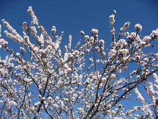

# Els cinc sentits

*Hui al matí quan m’he despertat, volia tornar-me a dormir i somiar un altra vegada.*

## I veure

L’espectacle del sol naixent.  
El cel del meu poble, blau, com el mantell de la Verge de Murillo  
El blanc cotó- en pèl dels núvols  
Els colors difusos del arc de San Martí després de la pluja  
El verd dels pins que fan ombra  
Els diferents ocres dels roures a la tardor, avisant-me que s’acosta l’hivern.  
L’estampa única dels ametlles florit  
El lluminós groc de la flor d’argelaga, com un premi a la mata que quan després punxa, t’apartes d’ella  
El roig de les roselles, que pareixen gotes de sang i vida  
La majestuositat de les muntanyes.  

## I escoltar

El feble moviment dels arbres.  
El run-run de les abelles treballant.  
El cric-circ impertinent dels grills.  
El crua de les granotes  
La melodia dels diferents pardals.  
El soroll dels oms  
Les onades dels camps de cereals.  
El rugit dels trons a la tempesta.  
El sorprenent so de l’eco quan et contesta  
El bufit del vent.  

## I olorar

L’espígol, que em recorda els armaris perfumats de ma mare  
La saborija que es fica a les olives trencades.  
L’olor dels codonys.  
El romer beneït de les rogatives.  
El timó que cobris els camps.  
L’aroma de la mançanilla.  
La sàlvia, poleo i té de roca  
L’herba sana dels ribassos  
El perfum de les violetes  
L’olor de la terra banyada.  

## I assaborir

La dolçor de la mel.  
Les mores dels esbarzers.  
El paladar aspre i dols de les bellotes.  
El gust empallegós, del fruit de la figuera.  
El diferent sabor del raïm blac o negre.  
Les ametlles tendres amb sal com aperitiu.  
El quasi oblidat gust de les serves.  
Les cireres recent collides.  
Els aranyons madurs.  
L’extraordinari sabor de la tafona com condiment.  

## I acariciar

El rugós tronc de les carrasques.  
L’estrany tacte dels líquens.  
Les fràgils fulles de les flors.  
La diferent textura de la terra.  
La càlida palla.  
La suavitat dels cantos de riu.  
La netedat de l’aigua de la font.  
La puresa de la neu.  
La fredor de la rosada matinera.I més coses més…més…

*Paquita*
