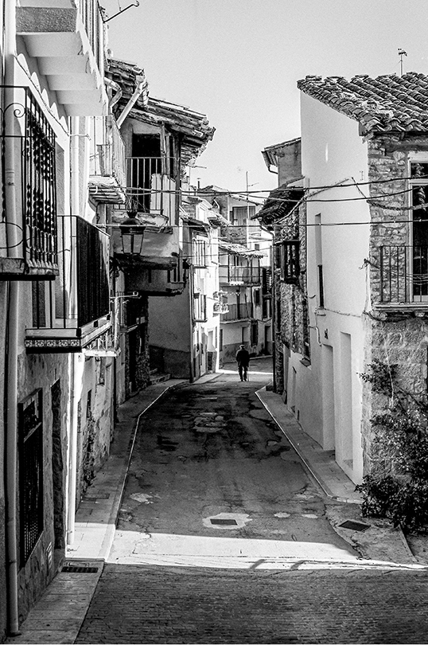
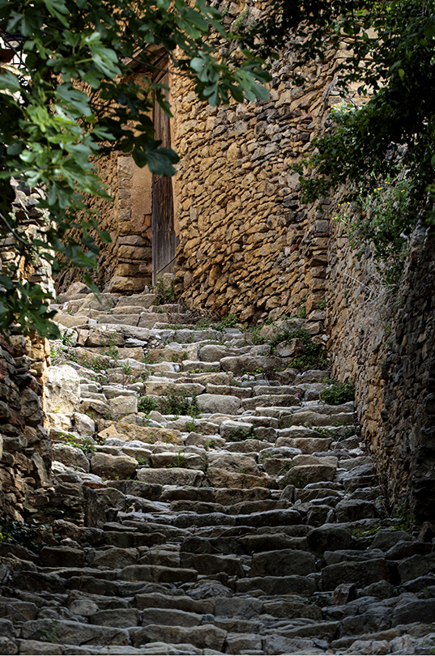
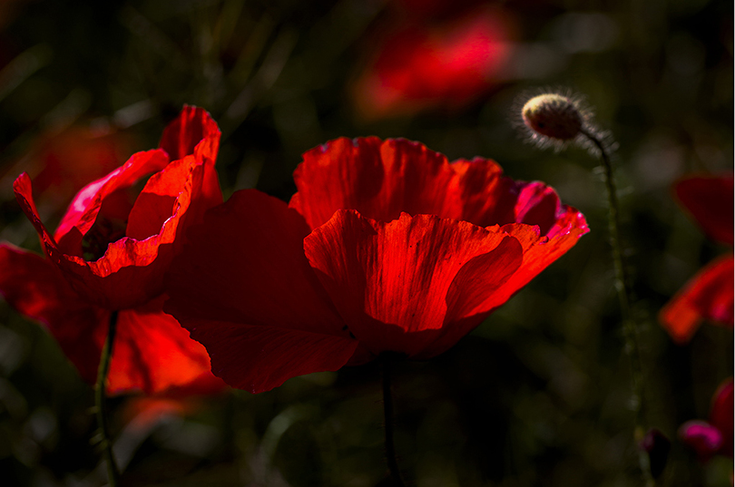
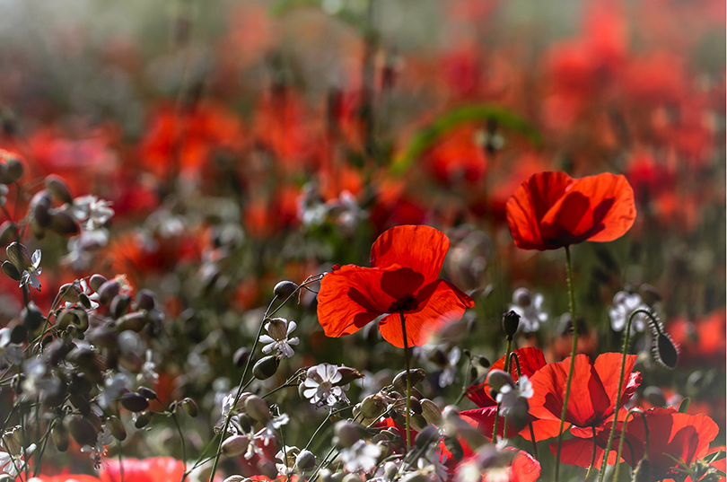
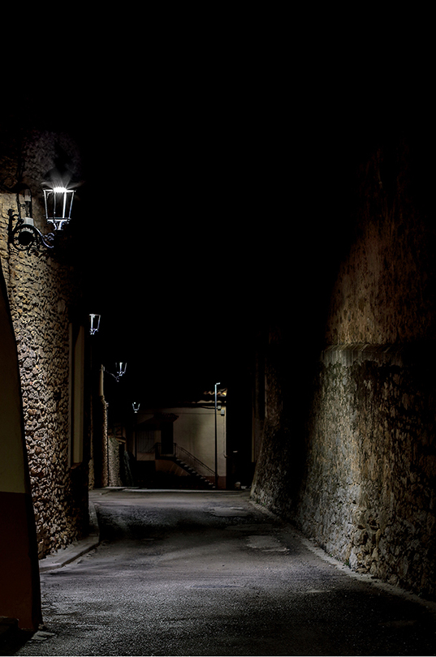
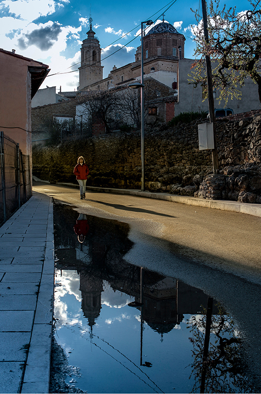
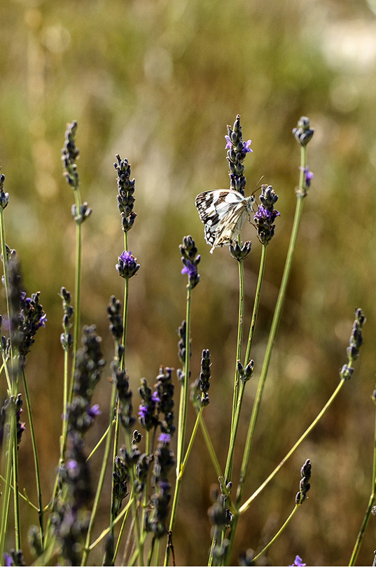

# Reflexions

## 1ª

De Cinctorres es diu que el silenci parla. Es veritat, si escoltes, es sent:

El feble moviment dels arbres.  
El run-run de les abelles treballant.  
El cric-cric impertinent dels grills.  
El crua de les granotes.  
La melodia dels diferents pardals.  
El soroll dels oms.  
Les onades dels camps de cereals.  
El rugit dels trons a la tempesta.  
El sorprenent so de l’eco quan et contesta.  
El bufit del vent.

## 2ª

Carrer Sol de Vila.  
Bressol del poble naixent.  
Camí de transhumància.  
Barri dels hebreus.  
Carrer de la meua infància.

## 3ª

Ay!!!carrer de Gemec o costereta de la Font de la Vila. On les dones pujaven amb els cànters plens d’aigua recolzats en la capçana al costat del seu cos.

Si el empedrat del esglaons parlaren…

## 4ª

El roig de les roselles, pareixen, entre les espigues del cereals i les herbes dels ribassos, gotes de sang i vida.

## 5ª

Has mirat be les flors?

Amb la seua bellesa totes tenen diferent forma, textura, color, olor o perfum, hi ha que son d’aparença humil, que casi se camuflen en el seu entorn, altres vistoses, altives, inclòs amb espines com a defensa, però totes, son necessàries. Ens els arbres, arbust, hi ha flor, en tot el que creix i té fruit.

## 6ª

Pedra…sempre pedra. Quantes pedres hi haurà pel poble? Des de les senzilles cases, on el que prima és l’habitatge, pallisses, parets que encara en queden com a mostra i model d’arquitectura practica minimalista integrada amb el ambient, fins les façanes de pedra treballada, acord amb l’importància del propietari, edificis eclesiàstic i civils. Pedra… sempre pedra.

## 7ª

Pot ser el meu desig. Però jo veig que el color del cel del meu poble es blau, del mateix color blau que el mantó de la Verge de Murillo.

## 8ª

La Natura és tan sàbia, que no es pot mesurar la bellesa d’una papallona Melanargia Galatea amb l’harmonia d’una senzilla rama de espígol, que li oferís el seu perfum i aliment.

*Paquita Julian Querol novembre 2018*
