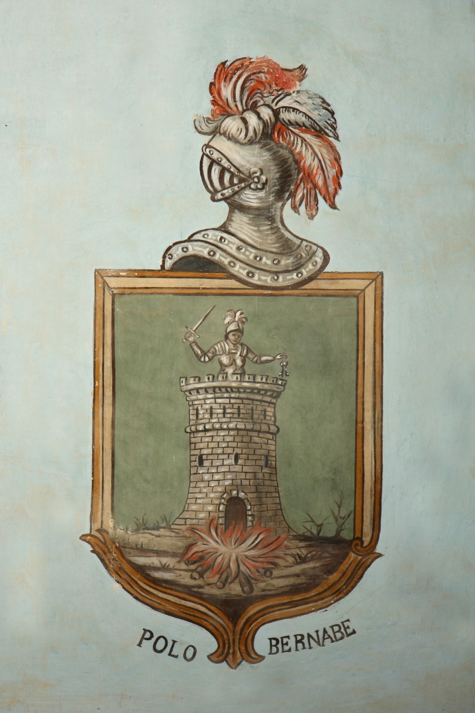

# Orígenes de la familia Polo de Bernabé

El linaje Polo en España se instaura con Raimon Polo, nieto de Richard Plantagenet Longsword y sobrino nieto de Ricardo Corazón de León, aunque la dinastía tiene su origen en Francia, en el condado de Anjou. En 1127 Godofredo de Anjou se caso con Matilde, hija única de rey Enrique I de Inglaterra.

Raimon Polo, vino del ducado de Aquitania en 1193 sirviendo a Pedro II de Aragón, padre de Jaime I, por lo tanto el Reino de Valencia aun no existía. La casa solariega de los Polo se conoce desde 1232 en Anento, comunidad de Daroca, sus descendientes sirvieron a los reyes de la Corona de Aragón tomando parte en la conquista de Valencia con Jaime I, (En las trovas de mosén Jaume Febrer que narra la conquista de las tierras de Valencia, nombra a Martin Polo, era mesnadero,«miembro de nobleza antigua,» y recibió tierras en la conquistada Valencia.) Sus descendiente, siguieron en su casa solariega de Anento, como Pedro Polo de Entenza, y Martin Polo.

El Bernabé, es oriundo de Báguera, aldea también de la comunidad de Daroca. En tiempo de Pedro IV el Ceremonioso o el del Punyalet, Miguel, alcalde del Castillo de Báguera en 1363, negó su rendición a Pedro I de Castilla, el Cruel, lo defendió fiel a la Corona de Aragón y prefirió morir quemado antes que rendirse. Entre las ruinas del castillo, su cuerpo calcinado tenía en un brazo incorrupto las llaves de la fortaleza. Los últimos en defenderlo fueron los hijos de Bernabé que salvaran sus vidas. El rey aragonés en agradecimiento, nombra a todos los hijos e hijas de Miguel Bernabé infanzones.

La unión de estas dos familias aragonesas, tuvo lugar en 1477, cuando un miembro de la familia Polo, caso con una Bernabé, uniendo así los dos apellidos, y creando el escudo familiar con esta gesta.

Entre sus descendientes destacan, Domingo, diputado del reino en 1477; su hijo Pedro, casado con Constanza Maza de Lizana en 1487; el hijo de éstos, Domingo, acompañante de Carlos I de España a Italia en 1529. Este linaje, posteriormente dividido en dos ramas, la aragonesa menos numerosa, y la afincada en tierras valencianas.

El escudo familiar, se encuentra, junto con el de todos los nobles que han vivido en la casa Santjoans, en Cinctorres.

## Árbol genealógico

**Pedro Polo de Bernabé** casado con **Constanza Maza de Lizana** en 1487 hijo:

1505 **Domingo Polo de Bernabé** casado con **Jerónima Sandoval** en Anento hijo:

### Casa pairal en Cinctorres

1º **Jaime Domingo Polo de Bernabé** casado con **Jeronima Montargull** de Cinctorres hijos: **Jaime Polo de Bernabé i Montargull y Jerónima Polo** de **Bernabe i Montargull.**

2º **Jaime Polo de Bernabé i Montargull** casado con **Catalina Bovil** de Cinctorres hijo:

3º **Joseph Polo de Bernabé i Bovil** casado con **Isabel Barrachina** de Cinctorres hijo:

4º **Joseph Polo de Bernabé i Barrachina** casado con **Isabel Monserrat** de Castellfort hijo:

### Casa pairal en Vistabella

5º **Joseph polo i bernabe monserrat** de Cinctorres casado con **Maria Arahute** de Mosqueruela, mujer de linaje aragones. Con su matrimonio, traslada su casa pairal a Vistabella. En Cinctorres pueblo natal de **Josephe Polo de Bernabe i Monserrant** quedan hermanas, y hermanos que seguirán emparentando con las familias importantes del pueblo, y familiares clérigos.

6º **Joseph Joaquin Polo de Bernabe i Arahute** ¿- 1772 casado con Josefa **María Fabra** y **LLuis** de Benicarló hijos:

**Doctor Jose Joaquín Polo de Bernabé i Fabra, Manuel Ignacio, y Manuela.**

De su primera esposa **Maria Luisa Nebot i Lafont** de Vistabella tuvo una hija **Josepha Polo i Nebot** que caso en Onda.

7º **Jose Joaquin Polo de Bernabe i Fabra** casado con **Francisca de Paula Mundina i Marco** de Villareal hijos: Manuel Maria Polo de Bernabe, Mariana, Francisco, Luis y Josefa.

8º **Manuel Maria Polo de Bernabe i Mundina** (Vistavella 1780-1832?) *‘*casado en Valencia con **Peregrina Borras Berenguer d’Entença i Borrás Garcés de Marcilla** de Sagunto, hijos: José Polo de Bernabé i Borras, Francisco, Peregrina y Manuela

9º **Jose Polo de Bernabé i Borras** nació el 11 de diciembre de 1812 en Quartell, Valencia, y falleció el 4 de marzo de 1835 en Vila-Real (Castellón) Senador vitalicio, Caballero Maestrante de la Real Caballería de Valencia, Gran Cruz de Carlos III, Gentilhombre de Cámara de Su Majestad y Vicepresidente del Congreso de los Diputados, economista y agricultor. Caso con **María Piedad Almunia y Rovira** de Alcoy (Alicante) De este matrimonio fueron hijos:

**Roberto Polo de Bernabé y Almunia,** que casó con Amalia Ruiz de la Prada y Caballero, y fueron padres de:

María del Pilar Polo de Bernabé, que casó con el coronel de artillería Ramón de Bustamante y Casaña.

**María Araceli Polo de Bernabé y Almunia,** que casó con José de Santiago y Gómez, del que tuvo por hijos a:

Raúl de Santiago Polo de Bernabé.

Héctor de Santiago Polo de Bernabé.

**Laura Polo de Bernabé y Almunia,** que contrajo matrimonio con Luis Lequerica, y fueron padres de:

José Luis Lequerica Bernabé.

Julio Lequerica Bernabé.

María Lequerica Bernabé.

Antonio Lequerica Bernabé.

Blanca Lequerica Bernabé.

Joaquín Lequerica Bernabé.

María Luisa Lequerica Bernabé.

**Araceli Polo de Bernabé y Almunia** fue la heredera todos sus cuantiosos bienes. Conocida en valencia como **La Pola**, Murio arruinada en 1934 en Burgassot.

Hasta aquí, todo lo que he encontrado sobre el linaje Polo de Bernabé, que en la tercera generación empezó su andadura en Cinctorres.(*seguiré investigando en su archivo municipal*) El apellido Polo aún perdura en familias cinctorrana, en otras se ha perdido como ha ocurrido por parte de mi familia materna. El motivo de esta investigación ha sido debido al trabajo que he hecho sobre la historia de la Casa Santjoans, que termino, con la publicación de mi libro Paviment Ceràmic de la casa Santjoans, publicado por La Diputación Provincial de Castellón en 2012.

*Francisca Julián Querol. Otoño 2018*

*Información obtenida por medio del Archivo municipal de Cinctorrres. Archivo municipal de Vistabella. Archivo municipal de Vila- Real. Linajes de Aragon. Estudios sobre la casa de Anjou Francia i Plantagenet.*
