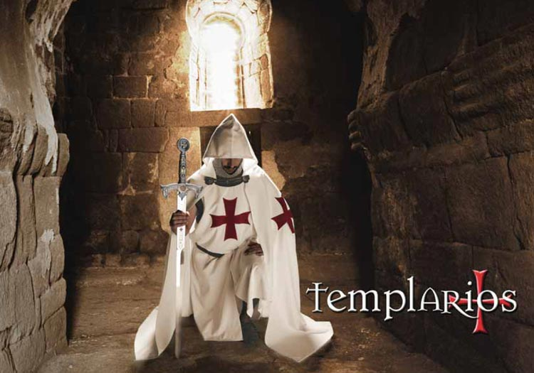

# Las órdenes militares

Las órdenes militares más famosas de las cruzadas fueron:

Los Templarios. Los Hospitalarios. Los Teutones.

- **Los Templarios**.

Los Templarios fueron creados para proteger a los peregrinos que viajaban a Tierra Santa. Varios años antes del reafirme de Jerusalén en 1099, un grupo de caballeros había actuado como guías y protectores de los cristianos que peregrinaban a través de Tierra Santa.

Los Templarios, en un principio, vivían durante la Primera Cruzada, en una hostería de Jerusalén, cerca del templo de Salomón

Los caballeros Hughes de Payns y Godofredo de Saint Omer se encargaron de juntar a otros caballeros y fundar una orden en 1119, bajo el nombre de Orden de los Pobres Caballeros de Cristo, pero eran más conocidos como, Los Caballeros del Templo de Salomón(por donde vivían) y, por deformación, Los Caballeros Templarios (del templo)

Desde su nacimiento tuvo un fin militar, por lo que la Orden se diferenciaba a este respecto de las otras dos grandes órdenes religiosas del siglo XII los Caballeros de San Juan de Jerusalén y los Caballeros Teutónicos, fundadas como instituciones de caridad.

En 1127, Hugo de Payens contaba con el apoyo del abate Bernardo de Claraval, futuro San Bernardo, el cual logró que el Papa Honorio II organizase el Concilio de Troyes, con el único propósito de autorizar la fundación de la Orden del Temple. (Caballeros Templarios). En la historia de la celebración de los concilios no hay precedente que se convoque uno, con el único propósito de autorizar a una orden de Caballeros

Asistieron al Concilio dos arzobispos, diez obispos, siete abades, dos escolásticos e infinidad de otros personajes eclesiásticos. Lo presidio el cardenal legado Mateo de Albano; sin embargo, la voz que allí se escucho fue la del abate Bernardo, pues casi todos los asistentes se hallaban vinculados, de una u otra manera, a este hábil y sabio religioso.

El abate Bernardo aprovechó, su gran facilidad de palabra y capacidad de raciocinio al exponer los principios de la orden y responder, con gran poder de convicción, a las preguntas de los teólogos y señorías de la iglesia que asistían al Concilio, que hizo posible se aprobara la creación de la Orden de Caballeros del Templarios (del Temple).

Una vez reconocida la Orden por la Iglesia (1128) el abate Bernardo, el clérigo con más influencia de la época, fue el encargado de redactar las normas o capítulos por los que debían regirse, siendo el primer Gran Amo de la Orden, Hughes de Payns, llamado también Gran Maestre al que se equiparaba al rango de príncipe. Existían otros rangos en la orden como los caballeros, capellanes y sargentos.

Los primeros eran los miembros preponderantes y los únicos a los que se les permitía llevar la característica vestimenta de la Orden, formada por un manto blanco con una gran cruz latina de color rojo en su hábito, capa t escudo.

La austeridad que propugnaba la norma de los Templarios era de un fuerte contraste con el lujo, vanidad, codicia y violencia de los caballeros seculares que iban a las Cruzadas en Palestina (TierraSanta).

Un grupo de Templarios recorrió Francia y Inglaterra para reclutar a los miembros, pero no esa esta la única misión ya que iba unida a recaudar fondos económicos y de propiedades para sufragar sus actividad en Tierra Santa.

Su servicio defendiendo el reino Cristiano de Jerusalén era distinguido, invirtiendo grandes sumas de dinero en la construcción de una cadena de castillos masivamente fortificados, algunos de los cuales nunca fueron capturados por el enemigo, pero se abandonaron cuando los Caballeros se retiraron de Palestina en 1291.

En la Batalla de Hattin en 1187, Saladín tomó como prisioneros aproximadamente a 200 Templarios y Hospitalarios, incluyendo a ambos Grandes Amos, y dio orden de ejecutar a todos. Con Jerusalén en manos de los musulmanes, el cuartel general de los Templarios se localizó sucesivamente, en Antioquía, Acre, Cesárea y por útimo en Chipre.

Un aspecto de la evolución de los Caballeros Templarios es que al enviar suministros y dinero desde Europa a Palestina, funcionó un flujo económico, desarrollándose un eficiente sistema bancario con el que gobernantes y nobles Europeos confiaron plenamente.

Gradualmente se fueron convirtiendo en los banqueros de gran parte de Europa y lograron, debido a esto y a la exención del pago de impuestos y diezmos (no estaban sujeto a la ley secular, y sólo respondían al Papa), amasar una considerable fortuna.

En 1307, sin embargo, el Rey Felipe IV se quiso adueñar de esa inmensa riqueza. El y su canciller, Guillermo de Nogaret, confabularon para acusar a los Templarios de herejía y abolir la Orden. Los Templarios Franceses, incluido su gran maestre, el francés Jaques de Molay, fueron arrestados (sólo trece escaparon) y se les “interrogó” bajo tortura o la amenaza de tortura.

Los interrogatorios tuvieron éxito y todos los caballeros confesaron múltiples e increíbles crímenes que iban desde escupir u orinar en el crucifijo a sodomía. Aunque muchos caballeros se retractaron posteriormente de sus confesiones ya era demasiado tarde, el daño a su reputación era irreversible e irreparable.

En 1312 el Papa Clemente V promulgó una bula papal que suprimía la Orden y sus miembros fueron quemados en la hoguera.

El Papa pidió que las propiedades de los Templarios fueran dadas a los Hospitalarios, pero esto solamente se acató en Alemania, ya que, en Francia y Inglaterra la mayoría de los bienes y propiedades pasaron a sus respectivas coronas

Finalmente parece ser que en España y Portugal la Orden de la Templarios se refundó en otras con distinto nombre.

Concilio de Troyes

*Caballeros Templarios Guerreros*
