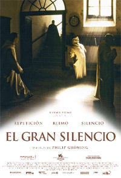

# El gran silencio

Silenci, per a que parli, la veu del silenci.

Vaig veure començat aquest film, una nit per la 2 de TVE, em va impressionar, desprès amb el temps no recordava el títol. Aleshores, degut a les classes Anàlisi de textos cinematogràfics, Tendències i perspectives, o ha recordat.

## Ficha técnica

Dirección y guión: Philip Groning, también es suya la Fotografía y el Montaje.

País: Alemania

Música: Philip Groning y Michael Busch.

Género: Documental.

Producción: Philiip Groning, Michael Weber, Andreas Pfaffli y Elda Guidinetti.

Duración: 164 min.

Estreno: Alemania 10 Nov. 2005. España 24 Nov. 2006.

El director de este Documental, espero dieciséis años a que le permitieran rodar la vida cotidiana del monasterio cartujo del Grande Chartreuse, en los Alpes franceses. Le dieron al fin permiso, con la condición de no emplear luz artificial ni luz adicional, tampoco debía interferir en la vida diaria de los monjes, rodó, más de ciento veinte horas con una sola cámara digital.

El titulo es muy apropiado, pues todo el documental es un gran silencio, disfrutar de esta película si eres católico, es reafirmar un acto de Fe.

La cámara, recoge las imágenes, y narra la vida del monasterio con abundantes planos fijos y primeros planos muy lentos que no perturba la paz del lugar, ni la vida normal de los monjes, forma parte, de la placidez con que transcurre el trabajo y las normas que rigen en la orden de monjes cartujos, eremitas, sin prisas en silencio, que solo rompe el repicar de la campana que llaman a maitines, laudes, prima, tercia etc. oficios que dan el ritmo fundamental a la jornada, con rezos de versículos del Evangelio y Salmos que sintetizan su vida de renuncia o su intimidad en Dios, y del Canto Gregoriano adecuado a cada oficio.

No hay que esperar argumento, ni actores, ni interpretación, ni efectos especiales, ni línea de avance narrativo. Los personajes que aparecen no representan a nadie, sino que muestran su vida con humildad, la rutina la convierten en Gloria El resultado es una experiencia única, emotiva, fascinante, pues le espiritualidad del lugar se trasmite, es otra manera de entender la existencia,

La escena en que el monje preparar la costura para confeccionar los hábitos, es real sin artificios en ella, se aprecian los pliegues que se hacen con el tiempo en las piezas de tela dobladas, y cuando el monje con las manos alisa el tejido y prepara el patrón, casi notas el tacto y se escucha el sonido rítmico del corte de las tijeras sin prisas pero sin pausa

Nos muestra las diferentes actividades de los monjes, y sonidos extraídos del quehacer habitual que hacen, en el trabajo diario, en la cocina, en su celda cuando comen, rezan, estudian, las pisadas lentas al subir las escaleras y cuando acuden a los oficios por los claustros, sonidos humanos, corrientes que demuestran que lo que hacen en ese acto y en ese momento es lo más importante para ellos por sencillo que sea.

La ausencia de diálogos, permite prestar atención en ver y sentir todo lo que el director muestra en sus fotogramas, a veces, parece ser pinturas de Zurbarán con los clásicos claro oscuros. Al principio en las primeros planos, predominan el color blanco de los hábitos, el de las paredes encaladas, y desportilladlas por el tiempo y la humedad, el paisaje nevado y con niebla, por eso, el color negro que lleva algún monje rompen la monotonía, lo mismo ocurre, con el gato negro que camina también de manera pausada por el solitario pasillo cuando menos lo esperas. Aunque hay planos repetidos, cada vez se aprecian detalles distintos y siendo la misma imagen es distinta.

La calidad de la madera del refectorio sillerías y puertas dan calidez al austero edificio. Las notas de color aparecen en los cirios encendidos, resalta el rojo del fuego, cuando caminan en procesión por los pasillos de camino a la iglesia, da sensación de frio, y surge la sorpresa con un plano fijo del frutero de una celda, con naranja, peras y una manzana partida por lo mitad, imagen digna de un bodegón. Así, como la primera letra del párrafo de color rojo del canto gregoriano. Lo mismo ocurre con la escena del jardín nevado, el monje busca entre los sobres de sus semillas el color anaranjado de las zanahorias

La escena de la iniciación de los aspirantes a monjes es placida, solemne y a la vez humilde, lo mismo trasmite los rostros de los monjes de diferentes edades mirando la cámara casi sin pestañear, esta recoge la imagen con gran nitidez. Te hace mirar casi con asombro.

Con el mismo primer plano del paisaje impresionante de los Alpes, se aprecia el cambio de estación. Del blanco absoluto de la nieve, y niebla, del gris de las piedras y tejas de pizarra, con que está construido el monasterio, surge con el deshielo en la primavera, el verde esplendoroso del bosque y los prados, con las primeras flores, también de color anaranjado.

La escena de un avión en el cielo azul sin una nube, es placentera.

La lluvia también tiene un lugar destacado en el documental. Me ha parecido sobrecogedora la imagen del bosque casi cubierto de nubes. También nos muestra, una cortina de agua a través de una ventana, en un ángulo donde se aprecia parte del monasterio, otra cubre todo el plano, hay momentos que a la imagen, la desplaza el sonido del agua distinto según el lugar, al caer de los tejados, deslizándose por los muros, o en tierra formando caprichosas figuras en los charcos.

Creo, que quien no concilie con la fe cristiana también se sentirá fascinado por la paz, sosiego y la sencillez y pureza de espíritu de los monjes, en todos sus actos.

El último plano es magistral. El intenso y luminoso cielo azul se difumina, lo absorbe la oscuridad, y al fondo una pequeña bugía encendida, evoca la luz que siempre acompaña al Sagrario.

No sé escribir sobre cine Es la primera vez que lo hago. No me atrevo a calificarlo, a mi me ha impresionado y gustado mucho. Las fotografías son preciosas, el director y su equipo han logrado transmitir de manera singular, sin palabras, el sentido y la religiosidad del film.

*He vist el films dues vegades, m’ha agradat molt. És llarga, cassi tres hores, però crec que han segut ben aprofitades. Transmet pau i serenitat.*

## Premios recibidos

Sección Oficial en el Festival Internacional de Cine de Venecia. 2005.

German Film Critics Award 2005 al Mejor Documental.

Gran Premio del Jurado del Festival de Sundance. 2006.

Bavaria Film Award 2006 al Mejor Documental.

Gran Premio del Jurado al Mejor Documental en el Festival de Sao Paulo 2006.

Premio Arte de la Academia de Cine Europeo al Mejor Documental 2006.
