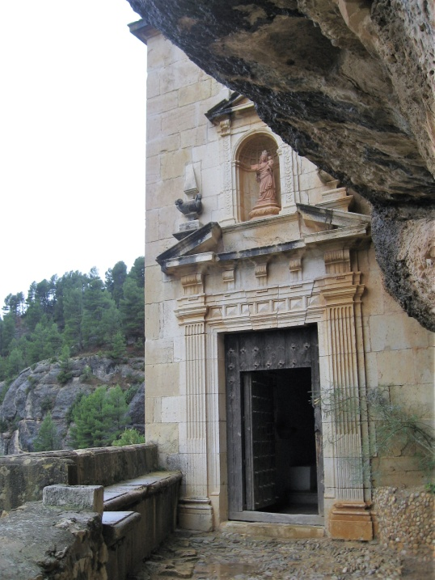
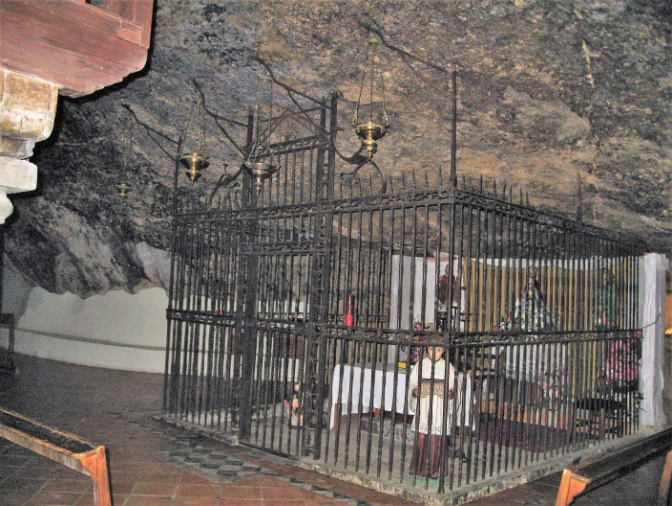
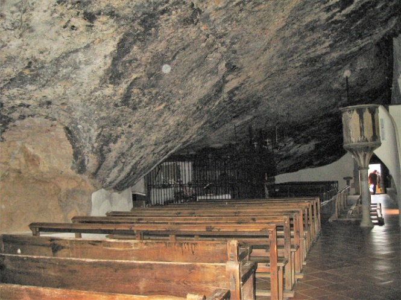
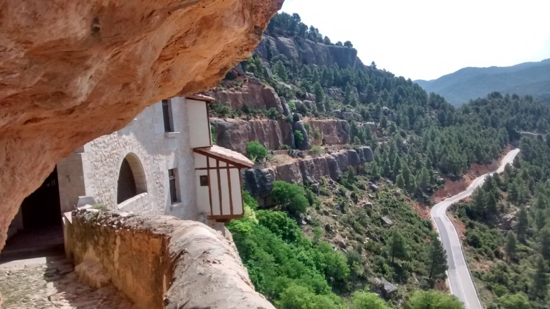

# Mare de Déu de la Balma

Siguiendo al rio Bergantes de Morella, que al llegar a Forcall recibe el agua del Calders de Cinctorres y el Cantavella que viene desde Aragón, juntos con su nombre Bergantes corre hacia su destino; primero el rio Guadalope y el Ebro antes de llegar al Mediterráneo.

A tres Km de Zorita, casi en el límite de la provincia de Teruel, empotrada en una mole pétrea que parece haya de desplomarse sobre el rio, en una cueva, balma, o abrigo rocoso, se encuentra el Santuario mitad edificio, mitad gruta, compuesto de iglesia y hospedería, es un lugar enigmático, insólito y con un pasado inquietante.

El origen de veneración de este lugar se remonta a la alta Edad Media, donde en sus cuevas se hallaban ermitaños, en una de ellas se veneraba a Santa María Magdalena y según la tradición también en una de estas cuevas se apareció la Virgen a un pastor de Zorita, convirtiéndose con el tiempo en una original iglesia medio suspendida en el vacío.

El altar del ábside está dedicado a Santa María Magdalena, a San Blas, y junto la gruta de la aparición, el altar de la Virgen rodeado por una verja de forja construida en 1594.

En agosto 1380, en un documento notarial, el morellano Arnà de Pinos deja cierta cantidad para iluminaria.

La afluencia de peregrinos hizo necesario realizar obras en 1539, lo mismo en la iglesia y en la hospedería, que tuvieron que ampliar entre 1577- 1580, también en 1650 - 1666 se volvió a hacer más grande y se construyo el campanario y la puerta, encajada entre las rocas de estilo renacentista.

La primitiva imagen de la Virgen desapareció en 1936, era de madera tallada y tenía una altura de 70 cm, ya estaba restaurada por el incendio que hubo en la ermita el 28 de marzo de 1617. La que se venera actualmente fue tallada por el Juan Bautista Porcar que la incrusto en los restos de la antigua imagen y que se bendijo en 1940. Para sufragar los gasto de la ampliación además de los donativos reales se constituyo una cofradía de santeros, iban vestidos con capa negra y sombrero de ala ancha, sobre una burra llevaban una capillita de madera con la imagen de la Virgen, recorrían desde Caspe en Aragón por el norte y por el este hasta el Ebro en Cataluña y todos los pueblos y masías de alrededor. En la capilla del Santuario existe un mapa en el que están marcados los recorridos.

La Balma empieza ser considerada sanadora de endemoniados, locos y de mal de ojos, seres que se creían poseídos por el demonio. La fama de este Santuario se extendió por los pueblos colindantes y también por el bajo Aragón siendo Castellote el primero que la visito en romería para honrar a la Virgen. Cada año en los primeros días de septiembre se congregaban miles de peregrinos, de las masías y pueblos, llegaban en procesión, andando o en mulos por caminos de herradura pernoctando dos o más días los más distantes. También lo hacían en caravanas de carros con toldo.

Los familiares que creían tener algún endemoniado en la familia los llevaban a la fuerza a veces atados como fardos. Cuando llagaban a la Balma, al endemoniado hombre o mujer, le recibían las sanadoras o caspolinas, llamadas así por que venían de Caspe (Zaragoza) eran de tres a cinco mujeres con fama de brujas, iban vestidas de negro, enjutas, se hacían cargo de la persona en el estrecho pasadizo que va de la hospedería a la iglesia asomado al precipicio.

Dentro de la iglesia el altar está rodeado de una reja, llena de gente cirios encendidos y empezaba el exorcismo. El poseso estaba centro de un circulo y a su alrededor las caspolinas le manipulaban, los excitaban con ritos, recitando y cantando gozos antiguos hasta llegar al paroxismo, le hacían beber un brebaje compuesto entre otras cosas de agua bendecida y tierra que arañaban de la cueva, les ataban los dedos de pies y manos con cintas azules por donde se suponía que al curarse saldría el demonio. El poseso hombre o mujer perdía el control de sus actos. Era un espectáculo grotesco soez y feroz, se oían blasfemias y se veían todo tipo de aberraciones.

Estos ritos se celebraron entre los años 1873-1932.Poco a poco se fueron mezclando supersticiones y prácticas deshonestas, llegaban gente de lugares remotos, sin control, hasta que las autoridades civiles y religiosas pusieron fin a estos ritos y recuperaron la iglesia de la Balma como la conocemos ahora.

En el fondo de la iglesia, en un espacio cerrado, en sus muros se podían ver gran cantidad de exvotos, muy antiguos, con pequeñas figuras de cera, brazos y piernas, mechones de cabello, antiguas fotografías, y cartas con mensajes casi borrados, que producían sentimientos contradictorios e inquietantes.

Actualmente, la fiesta en honor de la Virgen de la Balma se celebra el primer sábado de septiembre. El viernes los quintos de ese año recogen a la Virgen en el Ermitorio y la llevan a Zorita, le dan la bienvenida el *tabaleter i* *dolçainer* seguidos de las Danzas que la acompañan hasta la iglesia del pueblo donde la mañana del sábado en la puerta de la iglesia un pastor lee una loa formándose la procesión encabezándola *el dolçainer, el tabaleter* seguidos de las danzas *Els Negrets, Les llauradores, y Les Gitanetes,* autoridades y fieles.

Al llegar a la magnífica *Creu Cuberta* con pinturas del pintor morellano *Cruella*, las Danzas bailan en honor a la Virgen. *El Demonio de La Balma* les impide seguir. El dialogo del Ángel y el Demonio tiene un texto antiquísimo, la lucha termina cuando el Ángel vence al Demonio poniendo el pie sobre su cabeza, que representa la victoria el Bien sobre el Mal.

Ahora La Balma es devoción y fe en un mundo de montañas, de ambiente enigmático y sereno, inmóvil en el tiempo.

*Paquita Julián. Julio 2014*
