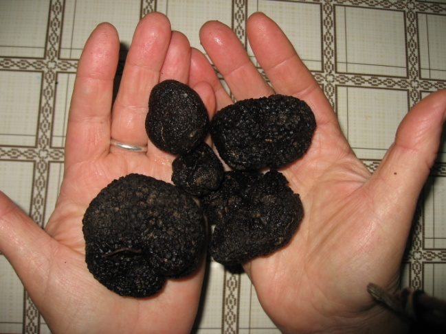
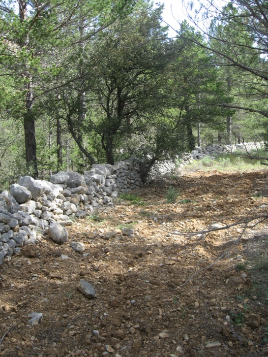
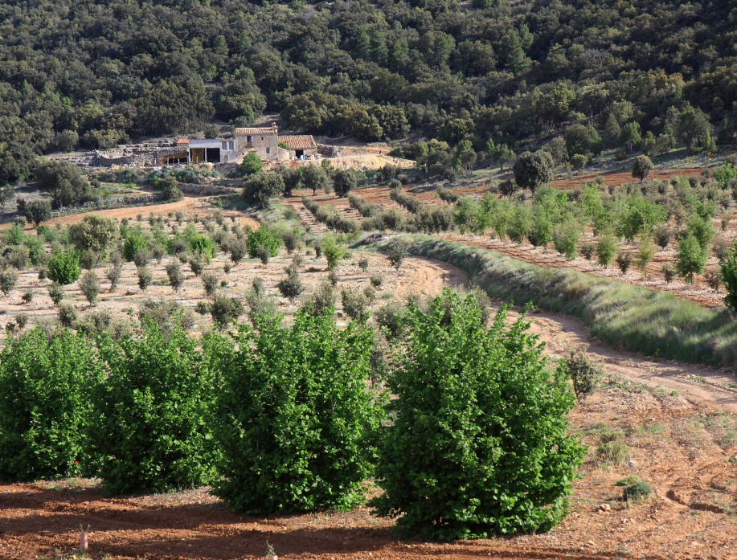
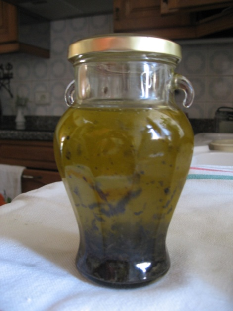

# Presentació de la trufa negra

## Comarca dels Ports i Masetrat

*Mopa dels Ports i Maestrat dins de la Comunitat Valenciana*

Les condicions mediambientals d’ aquesta comarca, son les adequades per ha la producció. DE LA ATRUFA NEGRA

Aquesta creix en terrenys calcaries formats en l’Era Secundaria,període Juràssic i Cretaci, a 350 y 1200 m. d’altitud, i prefereixen la solana.

Sud, major quantitat de sol

## Historia

Els primers en parlar de la trufa varen ser els Sumeris a les seues tabletes. Les menjaven el seus enemics els amonitas

Els babilonis les buscaven a les arenes dels deserts de Líbia.

El faraó Keops les oferia als ambaixadors con a manjar.

Grecs i Romans els donàvem propietats divines i afrodisíaques

Es menciona també al talmud jueu.

En el tractat de Ibn Admun de Sevilla ...........

A la Edat Mitjana, deien que eren diabòliques degut al tuf cabrú que a vegades emeten....

Ressorgiren en el Renegament......................

També al segle dinou.................

Tenen vitamines,els seu contingut d’hidrats de carbó i grasses es moderat. També minerals com fosforo, seleni, sofre, calci, magnesi, ferro i manganesos...............

## Biologia de la trufa

La trufa és el nom vulgar dels fongs del gènere Tuber que viuen vaig terra, associats a les arrels, com berrugues, en diferents tipus d’arbres De forma mes o menys esfèrica i color negre El seu micelio esta format per filaments tapiats i ramificats i les seues espores tenen aspecte de tentacles arrodonits.

## Truferes silvestres

La trufa viu amb simbiosis en alguns tipus d’arbres. La seua relació es de convivència doncsbeneficia als dos. El miceli de la trufa no te la clorofil·la que li dona la planta, i aquesta rep per les seues arrels un extra de nutrients.

La superfície de la trufera no te vegetació degut al fenomen antibiòtic de la trufa

## Selvicultora trufera

El futur de la trufa negra està en les explotacions amb plantes micorrizades.

La carrasca,el quejido, el roure,la coscolla, i el avellaner, son les plantes adequades per ha les plantacions de truferes. En l’any 1968 es va fer la primera plantació trufera de España. en la província de Castelló,amb exit.També el ministeri d’Agricultura va donar subvencions de l’Unio Europea aquells anys per arrancar vinyes de garnatxha y molts agricultors van aprofitar els terrenys per ha plantar carrasques micorrizades hui en plena producció.

## La trufa com condiment

trufa es tradicio modernitat i originalitat en la cuina. Poca quantitat es suficient per el seu aroma i sabor

Rep el nom de diamant de la cuina en totes les èpoques

## Segons la legislació

D’acortamb el Codig Civil español en l’article 350 diu:

El propietario es dueño del terreno, de su superficie y de lo que está debajo de ella, y puede hacer plantaciones y excavaciones.

Per tant:

La trufa es un ve privad i correspon al propietari del terreny

## Jornades gastronomiques de la trufa

Es important ficar en valor aquest producte.Es també un motor en la economia de la zona

Tots els any, es celebra en diferents llocs dels Ports i Maestrat jornades gastronòmiques per ha donar.lo a conèixer.

En l’ ultima pagina podeu vore una plantació de truferes en plena producció, la part negativa pot ser la perduda de biodiversitat el ser un monocultiu, però son plantacions no molt grans que sols poden fer-se en terreny plans.

Com que la Comarca dels Ports i Maestrat es majoritàriament muntanyosa creem que hi ha per ha tot. MOLTES GRACIES
