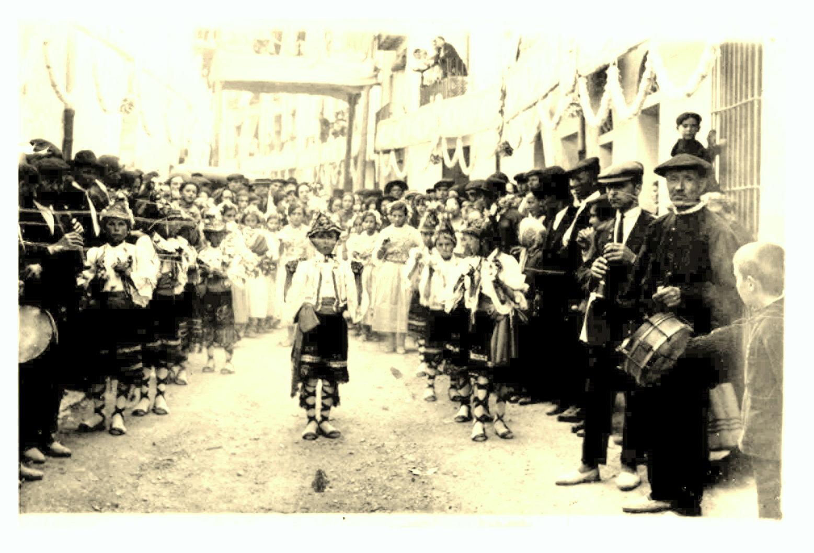

# Sexenni

El origen de las fiestas Sexenales en Morella es en la segunda mitad del siglo XVII, cuando la peste, con gran virulencia diezmaba a los habitantes de esta tierra. Varios cofrades del Rosario en 30 de diciembre de 1672 fueron en penitencia hasta el Santuario de Vallivana y trasladaron a la Virgen hasta la ciudad, a su paso los enfermos mejoraron.

Los Justicias, Jurados y Prohombres, hicieron la ofrenda perpetua de cumplir el voto de traer cada seis años a la imagen de Vallivana en procesión hasta Morella

Dicen que Morella se mide por su Sexenni, el primero fue en 1678. La celebración del sexenio se verifica a partir del cuarto domingo de agosto desde el tercer sexenio año 1690 -los dos primeros fueron en el mes de mayo- finalizando nueve días después. El cuarto domingo de octubre se devuelve la imagen al santuario de Vallivana hasta dentro de seis años.

El año anterior al Sexenio el último domingo de agosto se celebra l’Anunci como preludio de las fiestas del próximo año, con un desfile de carrozas hechas con distintos motivos y con papel rizado y colorista, llenando las calles del desfile con confeti que se lanzan unos a otros, por un rato todos se sienten niños hasta el próximo año, la fiesta de este domingo solo es l’Anunci.

El año del Sexenio empieza con el recibimiento que se hace a los morellanos ausentes el jueves de la tercera semana de agosto. Según la información de Angel Querol Sole, presidente de la Colonia de Morellanos ausentes de Castellón durante muchos años. El recibimiento en la puerta de San Miguel es el preludio del Sexenio. La banda de música de Morella, las autoridades y la carroza oficial del Ayuntamiento acompañados por la reina de la fiestas y de numeroso público reciben a las colonias en la puerta de San Miguel. Un integrante de la Colonia Catalana muestra su agradecimiento y da las gracias por la bienvenida, después las reinas de Morella, Cataluña, Valencia, y de Castellón encima de la carroza desfilan hasta la Plaza de La Iglesia arciprestal de Santa Maria la Mayor allí el representante de Valencia y de toda España o Castellón y provincia, hace lo mismo, dan las gracias y muestran su alegría por acudir otro año a la cita, y todos juntos el viernes por la mañana poder ir en "Rogativa'' los 24 km que separan Morella del Santuario de Vallivana para buscar a la "Mare de Déu'' y trasladarla a la población el sábado al atardecer. Su entrada es triunfal por la "Plaça dels Estudis.' El domingo es el día de su reinado y veneración por toda la gente en la misa solemne de pontifical y procesión general.

El carácter festivo y cívico-religioso lo componen el Novenario que cada día está protagonizado, organizado y financiado por un gremio distinto; cada gremio aporta al conjunto de las procesiones y al propio “retaule” la procesión cívico-religiosa y sus danzas representativas.

El adorno de las calles, es objeto de un laborioso trabajo realizado por los vecinos de cada calle por donde pasa el retaule de forma callada y continua durante noches de trabajo en la que participan todos los miembros de la calle ,el trabajo está compuesto por papel rizado de distintas maneras, "fulleta'' "caracolillo'' " pelusa'' que cubrirán los moldes y armazones del tema escogido como un tapiz, y que solo los vecinos que lo hacen conocen, lo trabajan durante todo el año desde l’Anunci hasta el Sexenni.

A partir del primer día de fiestas, cada día de la semana lleva consigo misa solemne, y el Retaule del gremio correspondiente, todos los gremios recorre el mismo itinerario por las calles de la ciudad adornadas de distinta manera.

fotografia del sxeni 192… autentificada enero 2026

El primer danzante de la izquierda en la pantalla o derecha en la foto es Tadeo Julian Querol del mas de Julián padre de Tadeo Julian, Jose Manuel Julián y mio Francisca Julián Querol

Día 1.º, domingo: A cargo del Reverendo Clero y Muy Ilustre

Ayuntamiento.

Día 2.º, lunes; La Nobleza.

Día 3.º, martes: Por el gremio de Labradores.

Día 4.º, miércoles: Por la Colonia Morellano- Catalana.

Día 5.º, jueves: Por la Colonia de Morellanos Ausentes.

Día 6.º, viernes: Por el gremio de Profesiones, Industria y Transportes.

Día 7.º, sábado: Por el gremio del Comercio.

Día 8.º, domingo: Por el gremio de Artes y Oficios.

Día 9.º, lunes: Por la Juventud moreliana.

Dia 10.º, martes: Dedicado a los Difuntos de la ciudad.

## CONTENIDO FOLKLÓRICO

Las danzas son ancestral expresión de popular y publica alegría. Cada danza debe tener en cuenta: su historia, motivo, objeto, y variaciones, Indumentaria, arreos, músicos, instrumentos musicales, partitura, ritmo y recital poético.

Els torneros es la más antigua de las danzas. Es de tipo señorial, evocadora de las ancestrales justas, lanzas y torneos de reminiscencia medieval hacia el siglo XVI. La tutela el Ilustre Ayuntamiento de la ciudad. Sus nueve danzantes se eligen entre los mozos del reemplazo militar alistado en el año sexenal. Colocados en fila india y precedidas por el primero denominado el Ángel que lleva la espada en alto, su misión es marcar el paso a los restantes danzantes, colocados a cinco metros uno de otro, por calles empinadas evolucionan con la vara, saltan, disparan sus varas y las recogen al compás de 2 por 4 de la gaita y tamboril.

El gremio de labradores es el más numeroso pues lo componen todos los masoveros. Son dos grupos de danzantes nueve niños y nueve niñas. Els llauradorest van vestidos con corto y ancho pantalón festoneado, camisa y chaleco blancos y tocados con gorro de dos picos profundamente ornamentados. Evolucionan al son del gaitero y tañen castañuelas, dirigidos por el caporal de la colla.

Les llauradoretes también lo componen nueve niñas, evolucionan lo mismo que els llauradorets. Visten sayas lisas de colores claros, mantón de manila cruzado y llevan perifollos en el peinado. Sus arreos son: castañuelas en una mano y cesta de flores y frutos en la otra, apoyando la mano en la cadera.

El Gremio de la Nobleza, y el Gremio del Comercio, representa el cuadro Bíblico, compuesto por personajes del Antiguo y Nuevo Testamento. El gremio del Comercio “El Carro Triunfal “

Dels oficis. Danza constituida por ocho niños con atuendo peculiar; evolucionando al son de la gaita y tamboril y utilizando el aro y utensilios representativos de cada oficio.

Els Teixidors. Esta danza está representada por el gremio de Tejedores, formada por ocho niños al estilo usado por los tejedores y un barrero, que mantiene enhiesta una pértiga en el centro, mientras los danzantes, tocando las castañuelas, con la otra mano sujetan la cita que tejen y destejen en la pértiga la manera de cordón de canutillo y al son del gaitero.

Els esquiladors. Pertenece esta danza al gremio de Pelaires. Formada por ocho niños de corto, chaquetilla y en la espalda una pequeña piel de cordero, evolucionan repiqueteando las tijeras imitando la esquilada y el cardado de la lana.

Gremio de artesanos, se divide en cuatro secciones, que forman cuatro grupos con sus correspondientes danzas cada uno.

Primer Grupo: Herreros, molineros, horneros y trajineros.

Segundo Grupo: Carpinteros, a albañiles, alpargateros, sogueros y silleros.

Tercer Grupo: Tejedores y pelaires.

Grupo Cuarto: Zapateros y sastres.

El Gremio de la Juventud con su danza de Les Gitanetes.

## EL SEXENNI Y CASTELLÓN

Con el traslado a Castellón en 195… de las fábricas de tejidos de Morella, fábrica de Querol, de Corcuera, de Amela, también vinieron muchos de sus empleados con sus familias algunos de sus hijos nacieron en Castellón formando una gran colonia.

El punto de reunión y una forma de sentirse cerca de su patrona la Virgen de Vallivana y de Morella fue creando la Colonia Morellana. Entre sus prioridades fue conseguir tener un altar en la Iglesia de San Agustín en la calle Mayor, en la parte lateral derecha dedicada a su patrona donde los morellanos acuden con sus plegarias. No debió ser fácil conseguirlo, aparte de esto, todos los segundos domingos de mes la misa de las 11 se celebra por la intención de algún difunto de la Colonia que la familia solicita o bien para todos los difuntos de la Colonia Morellana de Castelló, después enfrente de la capilla con todas las luces encendidas y engalanada rezan sus plegaria y cantan el himno de la Virgen de Vallivana.

La importancia que tienen el Sexenni de Morella en Castellón es innegable, pues los morellanos y sus descendientes aparte de tener el día de bienvenida y su día grande en el Novenario el presidente de cada Colonia y comisión nombran a la reina que les representara ese año, también tiene la obligación de ser miembro de la Comisión de Fiestas y debe acudir a los preparativos del Sexenni cada vez que se le solicita.

También en el del Pregón de las Fiestas de la Magdalena de Castellón, el año siguiente al Sexenni, la danza del Torners como representantes del Ayuntamiento de la ciudad de Morella desfila con su ancestral danza por todo el recorrido del pregón, y también acude los danzantes de algún gremio, normalmente es el de Los Oficios.

*Francisca Julián Querol. 2017 y enero 2026*
